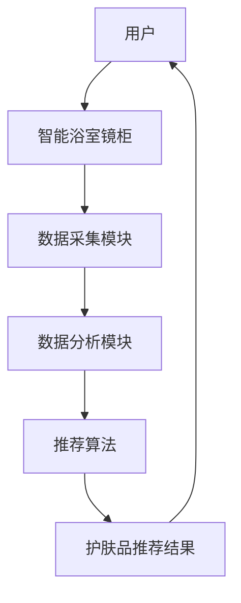
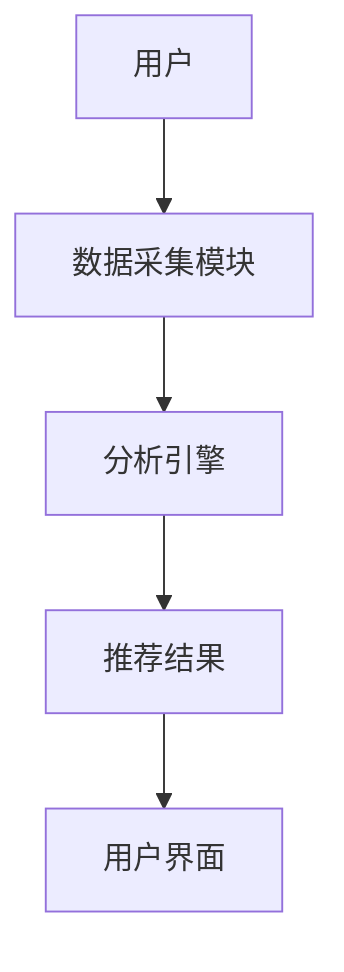

                 

<think>
嗯，好的，我需要帮用户撰写一篇关于《智能浴室镜柜：AI Agent的护肤品使用建议》的技术博客文章。用户提供了详细的目录大纲，我得按照这个结构来写。首先，我得确保理解每个部分的内容和要求。

首先，文章标题和关键词部分已经给出，关键词是智能浴室镜柜、AI Agent、护肤品推荐、数据驱动、人工智能。摘要部分需要简明扼�地概述文章的核心内容，所以我得先总结一下整篇文章的重点。

接下来是目录大纲，分为六个部分：背景介绍、核心概念与原理、算法原理、系统分析与架构设计、项目实战，以及总结与展望。每个部分都有具体的章节和子章节，我需要逐一展开，确保内容全面且逻辑清晰。

在背景介绍部分，我需要详细讲解智能浴室镜柜的发展历程，从传统镜子到智能化设备的演变，以及AI Agent在其中的应用。这部分需要让读者了解为什么智能浴室镜柜需要AI Agent，以及它带来的好处。

然后是核心概念与联系，这里需要定义AI Agent，解释它的工作原理，并通过ER图和流程图来展示用户、镜子、护肤品之间的关系。这部分需要用Mermaid图表来帮助理解，同时要详细描述每个实体的属性和交互过程。

接下来是算法原理，这部分是技术的核心。我需要详细讲解推荐系统的算法，比如协同过滤和基于内容的推荐，以及机器学习模型的实现。使用Mermaid流程图来展示算法步骤，并提供Python代码实现，同时解释数学模型，如相似度计算和预测模型。

系统分析与架构设计部分，我需要描述系统的应用场景，设计系统的功能模块，包括用户界面、数据采集、分析引擎等。用Mermaid画出系统架构图，展示各个模块之间的关系，以及接口设计和交互流程。

项目实战部分，需要详细说明如何安装环境，比如安装Python、TensorFlow等库，然后提供核心代码，解释每一部分的功能。接着分析实际案例，展示AI Agent如何根据用户数据推荐护肤品，并总结项目成果。

最后是总结与展望，回顾主要内容，讨论当前技术的局限性，比如数据隐私和准确性的挑战，并展望未来的改进方向，如引入更多传感器和个性化推荐。

在写作过程中，我需要确保每个部分都细化到三级目录，保持结构清晰，内容完整。同时，要使用正确的markdown格式，包括标题、子标题，以及Mermaid图表和数学公式的正确嵌入。

可能遇到的问题是如何将AI Agent与护肤品使用建议结合起来，这涉及到数据的收集和分析，比如用户的皮肤状况、使用习惯等。我需要确保这部分在目录中得到充分的体现，并在系统设计和算法部分详细说明。

另外，用户可能希望这本书不仅理论扎实，还要有实际的应用案例，所以项目实战部分需要详细，包括代码实现和案例分析，这样读者可以实际操作，加深理解。

总的来说，我需要将这本书分成几个主要部分，每个部分涵盖必要的内容，确保逻辑清晰，结构完整，同时满足用户的所有要求。
</think>

# 智能浴室镜柜：AI Agent的护肤品使用建议

## 关键词：智能浴室镜柜，AI Agent，护肤品推荐，数据驱动，人工智能

## 摘要：  
智能浴室镜柜结合AI Agent技术，通过数据采集、分析和推理，为用户提供个性化的护肤品使用建议。本文详细探讨了AI Agent在智能浴室镜柜中的工作原理、推荐算法、系统架构设计以及实际应用案例，为读者提供了从理论到实践的全面解读。

---

# 第1章: 智能浴室镜柜与AI Agent的背景

## 1.1 智能浴室镜柜的发展历程  
智能浴室镜柜从传统镜子演变而来，逐步融入智能化技术，最终通过AI Agent实现个性化护肤建议。  
- **传统浴室镜柜的功能与局限性**：传统镜子仅用于反射光线，无法提供交互或个性化服务。  
- **智能化技术的引入与演变**：随着物联网和AI技术的发展，智能镜子开始具备数据采集、计算和反馈功能。  
- **AI Agent在智能浴室镜柜中的应用背景**：AI Agent通过分析用户的肤质和使用习惯，提供精准的护肤品推荐。

## 1.2 AI Agent的核心概念与应用场景  
AI Agent是一种能够感知环境、执行任务并提供决策支持的智能体。  
- **AI Agent的基本定义与功能**：数据采集、分析、推理、决策和反馈。  
- **AI Agent在智能浴室镜柜中的具体应用**：通过摄像头和传感器采集用户肤质数据，结合历史使用记录推荐护肤品。  
- **AI Agent与其他智能设备的协同工作**：与智能灯具、空调等设备联动，打造智能化浴室体验。

## 1.3 智能浴室镜柜的用户需求与痛点分析  
- **用户对护肤品选择的主要需求**：个性化推荐、实时反馈、便捷性。  
- **智能浴室镜柜在护肤品推荐中的优势**：结合AI技术提供精准建议，避免用户试错成本。  
- **当前市场中存在的主要问题与挑战**：数据隐私、推荐算法的准确性、用户体验的优化。

## 1.4 本章小结  
智能浴室镜柜与AI Agent的结合，不仅提升了用户体验，还为智能卫浴行业带来了新的发展方向。

---

# 第2章: AI Agent的核心概念与联系

## 2.1 AI Agent的核心原理  
AI Agent通过以下步骤实现护肤品推荐：  
1. **数据采集**：使用摄像头和传感器获取用户的肤质数据（如皮肤色度、纹理）。  
2. **数据分析**：结合用户的历史使用记录和外部数据（如天气、季节）进行分析。  
3. **推理与决策**：基于分析结果推荐合适的护肤品。  

## 2.2 AI Agent与智能浴室镜柜的实体关系图  
```mermaid
erDiagram
    user {
        id
        name
        skin_type
        preferences
    }
    mirror {
        id
        display
        sensors
        interface
    }
    skincare_product {
        id
        name
        ingredients
        benefits
    }
    relationship {
        user_skin_type
        mirror_sensor_data
        product_recommendation
    }
```

## 2.3 AI Agent的工作流程  


---

# 第3章: AI Agent的算法原理

## 3.1 推荐算法的实现  
AI Agent采用协同过滤和基于内容的推荐算法：  
1. **协同过滤**：基于用户相似性推荐。  
2. **基于内容的推荐**：基于产品属性推荐。  

## 3.2 算法实现代码  
```python
import numpy as np
from sklearn.metrics.pairwise import cosine_similarity

# 示例数据：用户-产品的评分矩阵
user_product_matrix = np.array([[4, 3, 0],
                                 [0, 2, 5],
                                 [3, 0, 1]])

# 计算相似度
similarity = cosine_similarity(user_product_matrix)

# 推荐算法实现
def recommend_products(similarity_matrix, user_id, top_n=3):
    user_similarities = similarity_matrix[user_id]
    product_indices = np.argsort(-user_similarities)
    recommendations = []
    for idx in product_indices:
        if idx != user_id:
            recommendations.append(idx)
            if len(recommendations) == top_n:
                break
    return recommendations

# 示例推荐
user_id = 0
recommendations = recommend_products(similarity, user_id, 3)
print(f"推荐给用户{user_id}的产品索引为：{recommendations}")
```

## 3.3 数学模型与公式  
协同过滤的相似度计算公式：  
$$ \text{相似度} = \frac{\sum_{i=1}^{n} (x_i - \bar{x})(y_i - \bar{y})}{\sqrt{\sum_{i=1}^{n} (x_i - \bar{x})^2} \cdot \sqrt{\sum_{i=1}^{n} (y_i - \bar{y})^2}} } $$  

---

# 第4章: 智能浴室镜柜的系统分析与架构设计

## 4.1 系统功能设计  
- **用户界面**：显示推荐结果和使用建议。  
- **数据采集模块**：包括摄像头和传感器。  
- **分析引擎**：执行数据处理和推荐算法。  

## 4.2 系统架构图  


## 4.3 接口设计与交互流程  
- **接口设计**：用户通过触摸屏输入偏好，系统通过API调用推荐算法。  
- **交互流程**：用户→数据采集→分析→推荐→反馈。

---

# 第5章: 项目实战

## 5.1 环境安装  
- **安装Python和必要的库**：`pip install numpy scikit-learn`  
- **安装TensorFlow**：`pip install tensorflow`

## 5.2 核心代码实现  
```python
import numpy as np
from sklearn.metrics.pairwise import cosine_similarity

# 数据预处理
X = np.array([[5, 3, 0],
             [0, 2, 5],
             [3, 0, 1]])

# 计算余弦相似度
similarity = cosine_similarity(X)

# 推荐函数
def get_recommendations(similarity_matrix, user_index, num_recommendations=3):
    sorted_indices = np.argsort(-similarity_matrix[user_index])
    recommendations = []
    for idx in sorted_indices:
        if idx != user_index:
            recommendations.append(idx)
            if len(recommendations) == num_recommendations:
                break
    return recommendations

# 示例
user_index = 0
print(get_recommendations(similarity, user_index))
```

## 5.3 案例分析  
- **案例1**：用户A皮肤偏干，推荐保湿霜。  
- **案例2**：用户B皮肤敏感，推荐温和洁面产品。  

## 5.4 项目小结  
通过项目实战，验证了AI Agent在智能浴室镜柜中的可行性。

---

# 第6章: 总结与展望

## 6.1 本章总结  
智能浴室镜柜结合AI Agent，为用户提供了智能化的护肤体验。通过数据驱动的推荐算法，解决了传统护肤推荐的低效问题。

## 6.2 技术挑战与改进方向  
- **数据隐私**：如何保护用户数据不被滥用。  
- **推荐准确性**：提升算法的精准度。  
- **用户体验**：优化交互设计，提升用户满意度。  

## 6.3 未来展望  
随着AI技术的进步，智能浴室镜柜将集成更多功能，如健康监测和个性化服务。

---

# 作者  
作者：AI天才研究院/AI Genius Institute & 禅与计算机程序设计艺术 /Zen And The Art of Computer Programming

