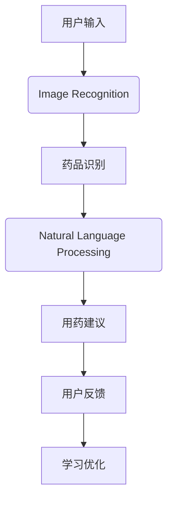
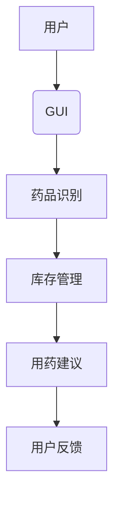

                 


# 智能浴室镜柜：AI Agent的药品管理

> 关键词：智能浴室镜柜，AI Agent，药品管理，物联网，人工智能，医疗健康

> 摘要：本文探讨了智能浴室镜柜结合AI Agent在药品管理中的应用，从技术背景、系统设计到项目实现，全面分析了如何利用人工智能优化家庭药品管理，提升用户体验。

---

# 第1章 智能浴室镜柜与AI Agent的概念与背景

## 1.1 智能浴室镜柜的发展历程

### 1.1.1 传统浴室镜柜的功能与局限性

传统浴室镜柜主要用于存储药品、化妆品等物品，功能单一，无法与用户互动，药品管理依赖人工记录，容易遗忘或过期。

### 1.1.2 智能化趋势对浴室镜柜的影响

随着智能家居的普及，浴室镜柜逐渐智能化，集成传感器、显示屏和物联网功能，能够连接互联网，提供更多信息和服务。

### 1.1.3 AI Agent在智能硬件中的应用前景

AI Agent（智能代理）是一种能够自主执行任务的计算机程序，结合传感器和互联网，能够实时感知环境并提供智能化服务。

---

## 1.2 AI Agent的核心概念与技术特点

### 1.2.1 AI Agent的基本定义与分类

AI Agent是具备感知环境、自主决策和执行任务的智能实体，分为简单反射型、基于模型的反应型、目标驱动型和效用驱动型。

### 1.2.2 AI Agent的核心技术特点

- **自主性**：无需人工干预，自动执行任务。
- **反应性**：实时感知环境并做出反应。
- **学习性**：通过数据学习优化决策。

### 1.2.3 AI Agent与传统软件的区别

传统软件依赖用户输入，AI Agent具备自主决策和学习能力，能够主动解决问题。

---

## 1.3 智能浴室镜柜中的AI Agent应用场景

### 1.3.1 药品管理的核心问题与需求分析

- **问题**：药品过期、用量记录困难、管理混乱。
- **需求**：智能识别、库存提醒、用量建议。

### 1.3.2 AI Agent在药品管理中的潜在价值

通过AI Agent，智能浴室镜柜可以实时监控药品库存，提醒用户及时补充或更换，避免浪费和安全隐患。

### 1.3.3 智能浴室镜柜的用户场景与体验优化

用户可以通过语音或触控操作查询药品信息，AI Agent提供个性化建议，提升使用体验。

---

## 1.4 本章小结

智能浴室镜柜结合AI Agent，能够实现药品管理的智能化，解决传统管理的痛点，提升用户便利性和安全性。

---

# 第2章 智能浴室镜柜中的药品管理问题分析

## 2.1 药品管理的核心问题与挑战

### 2.1.1 家庭药品管理的常见问题

- **药品过期**：用户忘记检查药品有效期。
- **用量混乱**：难以记录药品使用情况。
- **存储不当**：药品存放在潮湿或高温环境中。

### 2.1.2 智能化药品管理的必要性

通过智能化手段，实时监控药品状态，提醒用户合理使用。

### 2.1.3 智能浴室镜柜在药品管理中的独特优势

浴室镜柜作为日常使用频率高的设备，具备位置固定、使用便捷的特点，适合集成药品管理功能。

---

## 2.2 AI Agent在药品管理中的功能需求

### 2.2.1 药品信息的智能化识别与分类

AI Agent通过图像识别和自然语言处理，自动识别药品信息并分类存储。

### 2.2.2 药品库存的智能监控与提醒

实时监控药品库存，当药品过期或存量不足时，AI Agent主动提醒用户补充。

### 2.2.3 药品使用的智能推荐与指导

根据用户的健康数据和习惯，AI Agent推荐药品使用方案，提供用药指导。

---

## 2.3 智能浴室镜柜的药品管理边界与外延

### 2.3.1 系统功能的边界划分

- **核心功能**：药品识别、库存管理、用量提醒。
- **外延功能**：健康数据分析、医疗信息查询。

### 2.3.2 外延功能的扩展可能性

未来可以扩展到健康监测、医疗建议等领域，打造全方位的健康管理中心。

### 2.3.3 系统与用户交互的界面设计

设计友好的用户界面和交互方式，如语音指令、手势操作，提升用户体验。

---

## 2.4 本章小结

通过分析药品管理的核心问题，AI Agent在智能浴室镜柜中的应用能够有效解决传统管理的痛点，提升药品管理的智能化水平。

---

# 第3章 AI Agent的药品管理核心概念与联系

## 3.1 AI Agent的核心概念原理

### 3.1.1 AI Agent的基本原理

AI Agent通过感知环境、分析数据、制定决策并执行任务，实现智能化管理。

### 3.1.2 AI Agent在药品管理中的具体实现

结合图像识别、自然语言处理和机器学习技术，AI Agent能够识别药品、监控库存并提供用药建议。

### 3.1.3 AI Agent与智能硬件的协同工作

AI Agent与智能浴室镜柜协同，通过传感器和物联网技术，实时采集数据并反馈用户。

---

## 3.2 核心概念属性特征对比表格

| 概念 | 属性 | 特征 |
|------|------|------|
| AI Agent | 智能性 | 自主决策、学习能力 |
| 药品管理 | 交互性 | 用户友好的界面、实时反馈 |

---

## 3.3 ER实体关系图

```mermaid
er
  actor: 用户
  mirror: 智能浴室镜柜
  agent: AI Agent
  medicine: 药品
  relation: 用户与智能浴室镜柜的交互
  relation: AI Agent与药品数据的关联
```

---

## 3.4 本章小结

通过对比和图解，清晰展示了AI Agent与药品管理之间的关系，为后续的技术实现奠定基础。

---

# 第4章 AI Agent药品管理的算法原理与实现

## 4.1 算法原理概述

### 4.1.1 AI Agent的核心算法

- **图像识别**：使用卷积神经网络（CNN）识别药品包装和标签。
- **自然语言处理**：通过NLP技术解析药品说明书和用户查询。
- **机器学习**：利用回归分析预测药品用量和使用周期。

---

## 4.2 算法流程图



---

## 4.3 数学模型与公式

### 4.3.1 图像识别模型

$$ P(x|y) = \frac{P(y|x)P(x)}{P(y)} $$

### 4.3.2 回归分析模型

$$ y = \beta_0 + \beta_1x + \epsilon $$

---

## 4.4 本章小结

通过算法原理和流程图，详细展示了AI Agent在药品管理中的技术实现过程。

---

# 第5章 智能浴室镜柜药品管理系统的架构与实现

## 5.1 系统架构设计

### 5.1.1 系统功能模块

- **药品识别模块**：图像识别和分类。
- **库存管理模块**：实时监控和提醒。
- **用户交互模块**：语音和触控操作。

### 5.1.2 系统架构图



---

## 5.2 项目实现与代码解读

### 5.2.1 环境安装

- **Python 3.8+**
- **深度学习框架（如TensorFlow）**
- **图像处理库（如OpenCV）**

### 5.2.2 核心代码实现

```python
import tensorflow as tf
from tensorflow.keras import layers

# 图像识别模型
model = tf.keras.Sequential([
    layers.Conv2D(32, (3,3), activation='relu', input_shape=(224, 224, 3)),
    layers.MaxPooling2D((2,2)),
    layers.Conv2D(64, (3,3), activation='relu'),
    layers.MaxPooling2D((2,2)),
    layers.Flatten(),
    layers.Dense(128, activation='relu'),
    layers.Dense(10, activation='softmax')
])

model.compile(optimizer='adam', loss='sparse_categorical_crossentropy', metrics=['accuracy'])
model.fit(train_images, train_labels, epochs=10)
```

---

## 5.3 本章小结

通过系统架构设计和代码实现，详细展示了智能浴室镜柜AI Agent药品管理系统的开发过程。

---

# 第6章 总结与展望

## 6.1 本章小结

智能浴室镜柜结合AI Agent，通过智能化手段优化药品管理，提升用户体验，解决了传统管理中的痛点。

## 6.2 未来展望

未来，可以进一步扩展功能，如健康监测、医疗建议，打造全方位的健康管理中心。

## 6.3 最佳实践Tips

- **隐私保护**：确保用户数据的安全性。
- **用户体验**：优化交互设计，提升用户便利性。
- **系统维护**：定期更新算法模型，提升识别准确率。

---

# 作者

作者：AI天才研究院/AI Genius Institute & 禅与计算机程序设计艺术/Zen And The Art of Computer Programming

