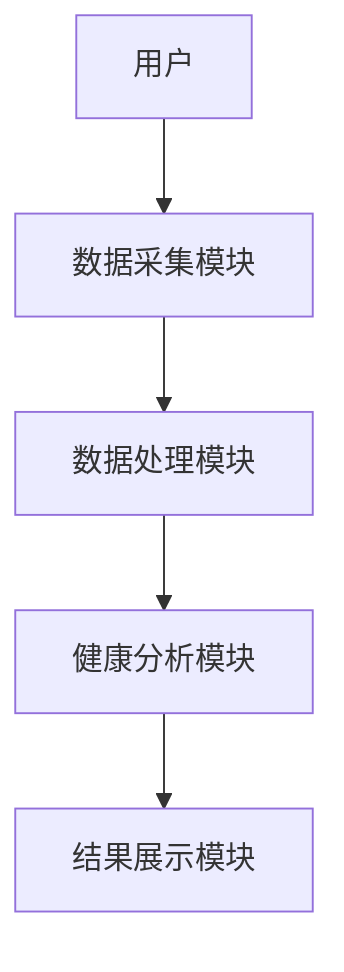

                 

# 智能浴室镜：AI Agent的健康状态分析

> 关键词：智能浴室镜，AI Agent，健康数据分析，机器学习，系统架构设计

> 摘要：本文深入探讨了智能浴室镜结合AI Agent进行健康状态分析的技术细节，涵盖系统架构、算法原理、项目实现及优化建议。

---

## 目录

### 第一部分：智能浴室镜与AI Agent的背景介绍

#### 第1章：智能浴室镜的发展与AI Agent的引入

##### 1.1 背景与现状
- 智能家居的发展趋势
- 智能浴室镜的定义与特点
- 健康监测的重要性

##### 1.2 AI Agent在智能浴室镜中的应用
- AI Agent的基本概念
- 在健康数据分析中的作用
- 用户需求与市场潜力

### 第二部分：核心概念与原理

#### 第2章：AI Agent的核心概念与健康数据分析

##### 2.1 AI Agent的基本原理
- 定义与分类
- 在智能浴室镜中的具体应用

##### 2.2 健康数据的采集与分析
- 数据采集方式
- 数据预处理与特征提取
- 算法选择与对比

#### 第3章：健康数据分析的算法实现

##### 3.1 算法选择与原理
- 机器学习与深度学习算法
- 算法性能对比

##### 3.2 实现流程
- 数据预处理
- 模型训练与推理
- 算法优化

### 第三部分：系统架构与设计

#### 第4章：智能浴室镜的系统架构

##### 4.1 系统模块划分
- 数据采集模块
- 数据处理模块
- 健康分析模块
- 结果展示模块

##### 4.2 系统架构图（Mermaid）

### 第四部分：项目实战与实现

#### 第5章：项目实战

##### 5.1 环境搭建
- 开发工具安装
- 数据集准备

##### 5.2 核心代码实现
- 数据采集与处理
- 模型训练
- 接口设计

##### 5.3 案例分析
- 典型案例解读
- 实验结果分析

### 第五部分：优化与扩展

#### 第6章：系统优化与功能扩展

##### 6.1 算法优化
- 模型调优
- 性能提升

##### 6.2 功能扩展
- 多功能集成
- 交互优化

### 第六部分：总结与展望

#### 第7章：总结与未来展望

##### 7.1 项目总结
- 核心技术总结
- 实践经验分享

##### 7.2 未来展望
- 技术趋势分析
- 应用前景预测

---

## 作者：AI天才研究院 & 禅与计算机程序设计艺术

这本书详细探讨了智能浴室镜结合AI Agent进行健康状态分析的技术细节，从背景到实现，再到优化，全面解析其工作原理和应用潜力。通过理论与实践结合，为读者提供深入的技术指导。

