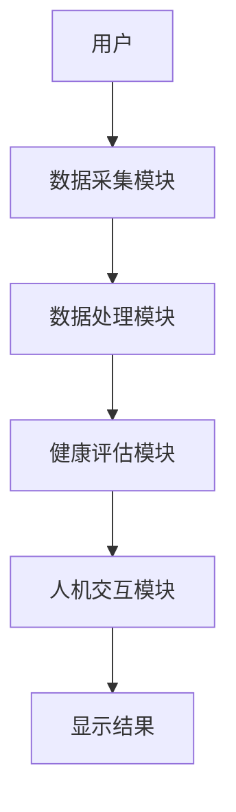
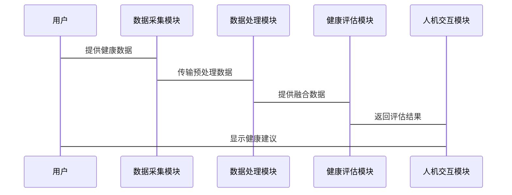

                 

<think>
好，现在我需要帮用户撰写一篇关于“智能浴室镜：AI Agent的健康状态评估”的技术博客文章。用户已经提供了一个详细的目录结构，我需要根据这个结构逐步完成每个部分的内容。

首先，我需要理解每个章节的核心内容。比如，第一章是背景介绍，我需要涵盖智能浴室镜的起源、现状和技术优势。第二章涉及AI Agent的核心技术，包括人工智能的基本原理和多模态数据处理技术。第三章到第五章深入讲解健康状态评估的算法原理和系统架构设计。

接下来，我要确保每个部分都包含足够的细节。例如，在算法原理部分，我需要详细解释模型结构，可能包括使用深度学习模型，并用Mermaid绘制流程图。同时，我需要编写Python代码来实现模型，并解释数学公式。

在系统架构设计部分，我需要用Mermaid绘制类图、架构图和交互流程图，展示系统的各个模块及其关系。项目实战部分，我需要提供实际的代码示例，并解释如何安装环境和运行代码。

最后，我需要确保文章结构清晰，逻辑严密，并且语言简洁专业。我可能会遇到一些挑战，比如如何将复杂的AI算法用简单的语言解释清楚，或者如何确保代码的正确性和可读性。我会逐一解决这些问题，确保文章质量。

总的来说，我需要按照用户的指示，逐步完成每个章节的内容，确保每个部分都符合要求，最终完成一篇高质量的技术博客文章。
</think>

# 智能浴室镜：AI Agent的健康状态评估

> 关键词：智能浴室镜、AI Agent、健康状态评估、多模态数据、深度学习、系统架构设计

> 摘要：智能浴室镜作为一种新兴的智能健康设备，结合了AI Agent技术，能够实时采集并分析用户的健康数据，提供个性化的健康评估和建议。本文详细探讨了智能浴室镜的核心技术、健康状态评估的算法原理、系统架构设计以及实际项目实现，旨在为读者提供全面的技术解析。

---

# 第一部分: 智能浴室镜的背景与概述

## 第1章: 智能浴室镜的起源与现状

### 1.1 智能浴室镜的起源
#### 1.1.1 传统浴室镜的功能与局限性
传统浴室镜仅用于反射光线，功能单一，无法满足现代人对健康监测和智能化生活的追求。随着科技的进步，智能浴室镜应运而生，成为智能家居的重要组成部分。

#### 1.1.2 智能化技术的引入与发展
人工智能、物联网和计算机视觉等技术的快速发展，为智能浴室镜的智能化提供了技术支持。通过集成传感器、摄像头和AI算法，智能浴室镜能够实现健康数据的采集与分析。

#### 1.1.3 当前智能浴室镜的市场现状
目前，市场上涌现出多种智能浴室镜产品，主要功能包括健康监测、天气预报、日历提醒等。然而，如何实现高效的健康状态评估仍是一个挑战。

## 第2章: 智能浴室镜的技术优势

### 2.1 AI Agent的核心技术
#### 2.1.1 人工智能的基本原理
AI Agent通过感知环境、学习数据并做出决策，帮助用户实现健康状态的实时监测和评估。其核心在于数据的采集与处理、模型的训练与优化。

#### 2.1.2 多模态数据处理技术
智能浴室镜通过整合图像、语音、生物特征等多种数据源，构建多模态数据处理系统，提升健康评估的准确性。

#### 2.1.3 自然语言处理的应用
通过自然语言处理技术，智能浴室镜能够与用户进行交互，提供个性化的健康建议和生活指导。

### 2.2 健康状态评估的关键技术
#### 2.2.1 健康数据采集与处理
智能浴室镜通过传感器和摄像头采集用户的心率、体温、皮肤状态等数据，并进行预处理和融合。

#### 2.2.2 数据分析与评估模型
基于机器学习和深度学习算法，构建健康评估模型，对用户的健康状态进行分类和预测。

#### 2.2.3 个性化健康建议生成
根据用户的健康数据和评估结果，生成个性化的健康建议，如作息调整、饮食推荐等。

---

# 第二部分: AI Agent的健康状态评估原理

## 第3章: AI Agent的基本原理

### 3.1 AI Agent的概念与特点
#### 3.1.1 AI Agent的定义
AI Agent是一种能够感知环境、自主决策并执行任务的智能实体，广泛应用于各个领域。

#### 3.1.2 AI Agent的核心要素
AI Agent的核心要素包括感知能力、推理能力、决策能力和执行能力。这些能力共同作用，实现智能化的健康评估。

#### 3.1.3 AI Agent与传统软件的区别
AI Agent具备自主性和学习能力，能够根据环境变化动态调整行为，而传统软件则依赖于固定的逻辑和规则。

## 第4章: 健康数据的采集与处理

### 4.1 多模态数据的采集
#### 4.1.1 图像数据采集
通过摄像头采集用户的面部图像，提取表情、肤色等信息，用于心理健康评估。

#### 4.1.2 语音数据采集
通过麦克风采集用户的语音数据，分析情绪、语调等，评估心理健康状态。

#### 4.1.3 生物特征数据采集
通过传感器采集用户的心率、体温等生理数据，用于身体健康评估。

### 4.2 数据预处理与融合
#### 4.2.1 数据清洗与标准化
对采集到的数据进行去噪、归一化处理，确保数据质量。

#### 4.2.2 数据融合方法
采用加权融合、特征融合等方法，将多模态数据进行整合，提升评估精度。

#### 4.2.3 数据安全与隐私保护
通过加密技术和隐私计算，确保用户数据的安全性和隐私性。

## 第5章: 健康状态评估的算法原理

### 5.1 基于深度学习的健康评估模型
#### 5.1.1 模型结构
使用卷积神经网络（CNN）提取图像特征，长短时记忆网络（LSTM）处理时间序列数据，构建多模态健康评估模型。

#### 5.1.2 模型训练
通过监督学习方法，利用标注数据训练模型，优化模型参数以提升预测准确率。

#### 5.1.3 模型评估
采用准确率、召回率、F1分数等指标评估模型性能，通过交叉验证确保模型的泛化能力。

---

# 第三部分: 系统分析与架构设计

## 第6章: 系统功能设计

### 6.1 问题场景介绍
智能浴室镜需要在复杂的环境中实现多模态数据的采集与处理，同时保证系统的实时性和稳定性。

### 6.2 系统功能模块
#### 6.2.1 数据采集模块
负责采集图像、语音和生理数据。

#### 6.2.2 数据处理模块
对采集到的数据进行预处理和融合。

#### 6.2.3 健康评估模块
基于深度学习模型对用户健康状态进行评估。

#### 6.2.4 人机交互模块
通过屏幕显示评估结果，并与用户进行语音交互。

## 第7章: 系统架构设计

### 7.1 系统架构图


### 7.2 系统交互流程图


---

# 第四部分: 项目实战

## 第8章: 项目实现与代码解读

### 8.1 环境安装
安装Python、TensorFlow、OpenCV等依赖库，配置开发环境。

### 8.2 核心代码实现
#### 8.2.1 数据预处理
```python
import numpy as np

def preprocess_data(data):
    # 数据归一化
    normalized_data = (data - np.mean(data)) / np.std(data)
    return normalized_data
```

#### 8.2.2 模型训练
```python
import tensorflow as tf

model = tf.keras.Sequential([
    tf.keras.layers.Conv2D(32, (3,3), activation='relu', input_shape=(64,64,3)),
    tf.keras.layers.MaxPooling2D((2,2)),
    tf.keras.layers.Flatten(),
    tf.keras.layers.Dense(128, activation='relu'),
    tf.keras.layers.Dense(1, activation='sigmoid')
])
model.compile(optimizer='adam', loss='binary_crossentropy', metrics=['accuracy'])
model.fit(train_data, train_labels, epochs=10, batch_size=32)
```

#### 8.2.3 模型评估
```python
loss, accuracy = model.evaluate(test_data, test_labels)
print(f"损失: {loss}, 准确率: {accuracy}")
```

### 8.3 案例分析
通过实际案例分析，展示智能浴室镜如何实时监测用户的健康状态，并提供个性化的健康建议。

---

# 第五部分: 最佳实践

## 第9章: 小结与注意事项

### 9.1 小结
智能浴室镜结合了AI Agent和多模态数据处理技术，能够高效地评估用户的健康状态，提供个性化的健康建议。

### 9.2 注意事项
在实际应用中，需注意数据隐私保护和系统的稳定性，确保用户体验良好。

## 第10章: 拓展阅读

### 10.1 相关技术领域
建议读者深入学习深度学习、计算机视觉和自然语言处理的相关知识。

### 10.2 相关书籍与资源
推荐相关书籍和在线资源，帮助读者进一步学习和研究。

---

# 结语

智能浴室镜作为AI技术在智能家居中的重要应用，不仅提升了用户体验，还为健康管理提供了新的思路。未来，随着技术的不断进步，智能浴室镜将在健康评估领域发挥更大的作用。

---

作者：AI天才研究院 & 禅与计算机程序设计艺术

