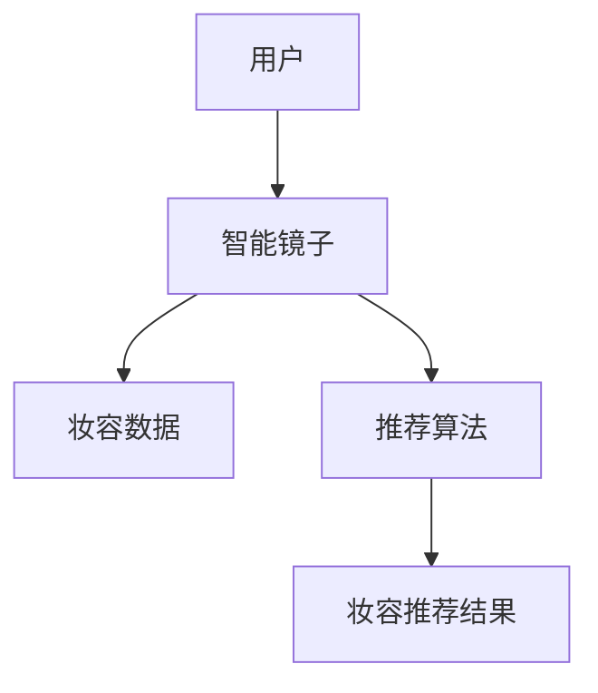
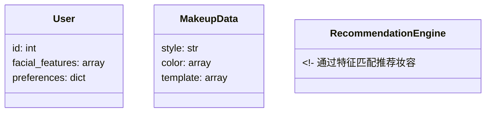
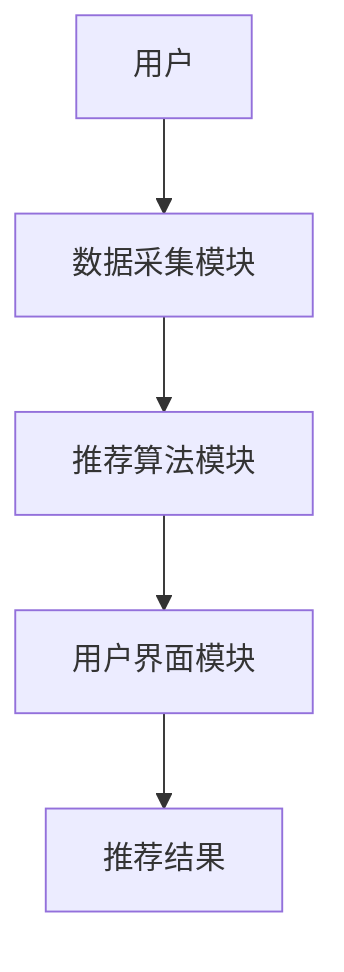

                 


# 智能浴室镜：AI Agent的妆容教程推荐

## 关键词：智能浴室镜，AI Agent，妆容推荐，协同过滤，深度学习

## 摘要：  
智能浴室镜通过AI Agent技术，能够实时分析用户的面部特征和妆容需求，提供个性化的妆容推荐。本文将详细介绍智能浴室镜的背景、AI Agent的核心原理、推荐算法的设计与实现，以及系统的架构与实战案例。

---

# 第一部分: 智能浴室镜的背景与概念

## 第1章: 智能浴室镜的背景介绍

### 1.1 问题背景与用户需求  
#### 1.1.1 传统浴室镜的功能局限性  
传统浴室镜仅具备基本的反射功能，无法满足现代用户对个性化美妆推荐的需求。  
#### 1.1.2 用户对智能镜子的期待  
现代用户希望镜子能够提供实时的妆容建议、个性化推荐和便捷的交互体验。  
#### 1.1.3 妆容推荐的市场痛点  
美妆市场庞大，用户选择繁多，但缺乏智能化的推荐工具。  

### 1.2 AI Agent的基本概念  
#### 1.2.1 什么是AI Agent  
AI Agent（人工智能代理）是一种能够感知环境、执行任务并提供智能服务的程序。  
#### 1.2.2 AI Agent的核心功能  
- 数据采集与分析  
- 知识库构建与推理  
- 实时反馈与个性化推荐  
#### 1.2.3 AI Agent与传统软件的区别  
AI Agent具备自主学习和适应能力，能够根据用户行为优化推荐策略。  

---

## 第2章: AI Agent在智能浴室镜中的应用  

### 2.1 AI Agent的核心任务  
#### 2.1.1 妆容推荐的逻辑  
AI Agent通过分析用户的面部特征（如肤色、五官特征）和妆容需求（如场合、风格），推荐适合的妆容方案。  
#### 2.1.2 用户数据的采集与分析  
- 采集数据： facial features, skin tone, makeup preferences  
- 数据分析：基于机器学习的特征提取与分类。  
#### 2.1.3 AI Agent的实时反馈机制  
通过摄像头和传感器实时捕捉用户面部数据，快速生成推荐结果。  

### 2.2 智能浴室镜的功能架构  
#### 2.2.1 硬件功能模块  
- 高分辨率摄像头  
- 红外传感器（用于面部特征识别）  
- 触控屏幕（用户交互界面）  
#### 2.2.2 软件功能模块  
- 数据采集与处理模块  
- 推荐算法模块  
- 用户界面设计模块  
#### 2.2.3 人机交互界面设计  
- 图形化界面展示推荐结果  
- 语音交互功能（可选）  

---

# 第二部分: AI Agent的核心概念与原理  

## 第3章: AI Agent的核心概念与联系  

### 3.1 AI Agent的核心原理  
#### 3.1.1 数据采集与处理  
- 使用摄像头采集用户的面部图像  
- 通过图像处理技术提取关键特征（如眼距、鼻梁高度等）。  
#### 3.1.2 知识库构建  
- 建立妆容数据库，包含不同场合、风格的妆容模板。  
- 知识库包含妆容的特征向量（如颜色、形状等）。  
#### 3.1.3 推理与决策  
- 基于用户的特征向量，匹配知识库中的相似妆容。  
- 根据用户的偏好进行权重调整，生成最终推荐结果。  

### 3.2 AI Agent与智能镜子的实体关系  
#### 3.2.1 用户与智能镜子的关系  
用户通过智能镜子获取妆容推荐服务。  
#### 3.2.2 妆容数据与AI Agent的关系  
AI Agent利用妆容数据进行推荐推理。  
#### 3.2.3 系统功能模块之间的关系  
- 数据采集模块向推荐算法模块提供输入数据。  
- 推荐算法模块与用户界面模块交互，展示推荐结果。  



---

## 第4章: AI Agent的算法原理  

### 4.1 推荐算法概述  
#### 4.1.1 协同过滤算法  
协同过滤是一种基于用户相似性推荐算法，分为基于用户的协同过滤和基于物品的协同过滤。  
#### 4.1.2 基于内容的推荐算法  
基于内容的推荐算法通过分析物品的特征向量进行推荐。  
#### 4.1.3 深度学习模型  
深度学习模型（如神经网络）能够学习复杂的特征表示，提升推荐的准确性。  

### 4.2 基于协同过滤的推荐算法  
#### 4.2.1 算法流程  
1. 数据预处理：提取用户的特征向量。  
2. 计算用户相似度：使用余弦相似度或欧氏距离。  
3. 生成推荐结果：基于相似用户的偏好进行推荐。  
#### 4.2.2 算法实现  
```python
import numpy as np
from sklearn.metrics.pairwise import cosine_similarity

# 示例数据：用户特征向量
user_features = np.array([[0.8, 0.2, 0.5],
                           [0.6, 0.7, 0.3]])

# 计算余弦相似度
similarity = cosine_similarity(user_features)
```

#### 4.2.3 算法优缺点  
- 优点：简单易实现，计算效率高。  
- 缺点：对稀疏数据的处理能力有限。  

---

## 第5章: 系统分析与架构设计方案  

### 5.1 问题场景介绍  
智能浴室镜需要实时处理用户的面部数据，并快速生成推荐结果。  

### 5.2 系统功能设计  

#### 5.2.1 领域模型  


#### 5.2.2 系统架构设计  


### 5.3 系统接口设计  

#### 5.3.1 接口描述  
- 数据采集模块：提供面部图像和特征提取接口。  
- 推荐算法模块：提供推荐结果生成接口。  

### 5.4 系统交互设计  

#### 5.4.1 交互流程  
1. 用户通过智能镜子输入面部数据。  
2. 系统调用推荐算法生成推荐结果。  
3. 推荐结果通过用户界面展示。  

---

## 第6章: 项目实战  

### 6.1 环境安装  
- 安装Python和相关库（如TensorFlow、Scikit-learn）。  

### 6.2 系统核心实现  

#### 6.2.1 核心代码  
```python
def recommend_makeup(user_features, makeup_database):
    # 计算相似度
    similarity = cosine_similarity(user_features, makeup_database)
    # 获取相似度最高的结果
    top_matches = np.argsort(similarity, axis=1)[:, ::-1]
    return [makeup_database[i] for i in top_matches[0]]
```

#### 6.2.2 代码解读  
- 输入：用户面部特征向量和妆容数据库。  
- 输出：推荐的妆容列表。  

### 6.3 实际案例分析  
- 用户A：肤色偏黄，适合推荐暖色调的底妆和腮红。  
- 算法通过匹配妆容数据库中的相似案例，生成推荐结果。  

---

## 第7章: 最佳实践  

### 7.1 小结  
智能浴室镜通过AI Agent技术，能够为用户提供个性化的妆容推荐服务，提升用户体验。  

### 7.2 注意事项  
- 数据隐私保护：确保用户数据的安全性。  
- 算法优化：定期更新妆容数据库，提升推荐的准确性。  

### 7.3 拓展阅读  
- 探索更多AI技术在美妆领域的应用，如虚拟试妆、个性化护肤建议等。  

---

## 作者：AI天才研究院 & 禅与计算机程序设计艺术

