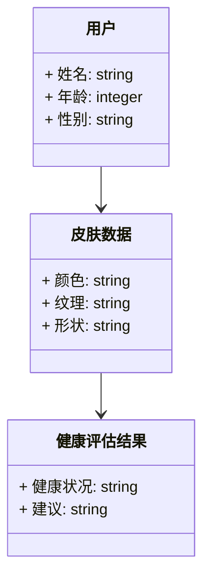

                 

<think>
好的，我将按照您的要求逐步撰写这篇文章。首先，我会先撰写标题、关键词和摘要部分。

# 智能浴室镜：AI Agent的皮肤状况分析

## 关键词  
智能浴室镜, AI Agent, 皮肤状况分析, 图像处理, 深度学习, 健康监测

## 摘要  
智能浴室镜是一种结合人工智能技术的智能设备，通过AI Agent对用户的皮肤进行实时分析，提供个性化的健康监测和美容建议。本文将从背景介绍、核心概念、算法原理、系统架构、项目实战等多个方面，详细分析智能浴室镜在皮肤状况分析中的技术实现和应用。通过对AI Agent与图像处理技术的深入探讨，本文旨在为读者提供一个全面的技术视角，帮助理解智能浴室镜在现代健康管理中的重要作用。

---

接下来是正文部分，我会按照目录大纲逐步展开每个章节的内容。

---

## 第1章: 智能浴室镜的发展背景

### 1.1 问题背景与应用价值

#### 1.1.1 智能浴室镜的定义与现状  
智能浴室镜是一种集成多种智能技术的浴室设备，它不仅具备传统镜子的反射功能，还能够通过内置的摄像头和传感器，采集用户的生理数据，如皮肤状况、面部表情等。近年来，随着人工智能技术的快速发展，智能浴室镜逐渐成为健康管理的重要工具。

#### 1.1.2 皮肤健康监测的必要性  
皮肤是人体最大的器官，其健康状况直接反映人体的整体健康水平。通过智能浴室镜进行皮肤健康监测，可以及时发现皮肤问题，如过敏、痘痘、色斑等，并提供个性化的解决方案。

#### 1.1.3 AI技术在个人健康监测中的应用前景  
AI技术的快速发展为个人健康监测提供了新的可能性。通过AI Agent，智能浴室镜可以实时分析用户的皮肤数据，提供精准的健康评估和建议，从而实现个性化的健康管理。

---

### 1.2 问题描述与解决思路

#### 1.2.1 皮肤健康监测的核心问题  
皮肤健康监测的核心问题包括：  
1. 如何高效采集和处理皮肤数据。  
2. 如何准确识别和分类皮肤问题。  
3. 如何为用户提供个性化的健康建议。

#### 1.2.2 智能浴室镜的解决方案  
智能浴室镜通过集成AI Agent技术，能够实时采集用户的皮肤数据，并通过深度学习算法进行分析，最终为用户提供个性化的健康建议。

#### 1.2.3 边界与外延  
智能浴室镜的皮肤健康监测功能不仅局限于皮肤分析，还可以与其他健康监测设备联动，实现更全面的健康管理。

---

## 第2章: AI Agent与皮肤分析的核心概念

### 2.1 AI Agent的基本原理

#### 2.1.1 AI Agent的定义与分类  
AI Agent是一种能够感知环境并采取行动以实现目标的智能体。根据功能不同，AI Agent可以分为简单反射型、基于模型的反应型、目标驱动型和效用驱动型。

#### 2.1.2 皮肤分析的基本原理  
皮肤分析主要是通过对图像数据的处理和分析，提取皮肤特征，如颜色、纹理、形状等，并结合这些特征进行皮肤健康评估。

#### 2.1.3 AI Agent在皮肤分析中的作用  
AI Agent在皮肤分析中主要负责数据采集、特征提取、模型训练和结果输出。

---

### 2.2 核心概念与联系

#### 2.2.1 AI Agent与图像处理的关系  
AI Agent通过图像处理技术采集和分析用户的皮肤数据，从而实现皮肤健康监测。

#### 2.2.2 皮肤特征与数据分析的关联  
皮肤特征是数据分析的基础，通过分析这些特征，可以评估皮肤健康状况并提供相应的建议。

#### 2.2.3 皮肤健康评估的数学模型  
皮肤健康评估的数学模型是AI Agent的核心，它决定了皮肤健康监测的准确性和可靠性。

---

## 第3章: 核心概念与联系

### 3.1 AI Agent与图像处理的核心原理

#### 3.1.1 图像采集与预处理  
图像采集是皮肤分析的第一步，预处理包括去噪、增强和归一化等操作。

#### 3.1.2 皮肤区域的分割算法  
通过分割算法，可以将皮肤区域从图像中分离出来，为后续分析提供基础。

#### 3.1.3 皮肤特征的提取方法  
皮肤特征的提取是关键步骤，常见的特征包括颜色、纹理、形状等。

---

### 3.2 核心概念的对比分析

#### 3.2.1 不同AI模型在皮肤分析中的表现  
不同AI模型在皮肤分析中的表现各有优劣，需要根据具体需求选择合适的模型。

#### 3.2.2 皮肤特征与健康评估的关系  
皮肤特征是健康评估的基础，不同特征对健康评估的影响程度不同。

#### 3.2.3 数据采集与处理的对比  
数据采集与处理是皮肤分析的关键步骤，不同方法对分析结果的影响需要深入理解。

---

## 第4章: 图像处理与AI Agent的算法原理

### 4.1 图像处理算法

#### 4.1.1 图像采集与预处理  
图像采集是皮肤分析的第一步，预处理包括去噪、增强和归一化等操作。

#### 4.1.2 皮肤区域的分割算法  
通过分割算法，可以将皮肤区域从图像中分离出来，为后续分析提供基础。

#### 4.1.3 皮肤特征的提取方法  
皮肤特征的提取是关键步骤，常见的特征包括颜色、纹理、形状等。

---

### 4.2 AI Agent的算法实现

#### 4.2.1 基于深度学习的皮肤分析模型  
深度学习模型在皮肤分析中表现出色，常用的模型包括卷积神经网络（CNN）和生成对抗网络（GAN）。

#### 4.2.2 模型训练与优化  
模型训练需要大量标注数据，并通过优化算法（如Adam）进行参数调整。

#### 4.2.3 模型推理与结果输出  
模型推理是将新图像输入模型，得到皮肤健康评估结果的过程。

---

## 第5章: 系统分析与架构设计方案

### 5.1 问题场景介绍  
智能浴室镜需要在浴室环境中运行，面临光照变化、湿度高等挑战。

### 5.2 系统功能设计  
系统功能包括图像采集、特征提取、模型推理和结果输出。

### 5.3 领域模型设计  


### 5.4 系统架构设计  


---

## 第6章: 项目实战

### 6.1 环境安装  
需要安装Python、深度学习框架（如TensorFlow）和图像处理库（如OpenCV）。

### 6.2 系统核心实现源代码  
```python
import cv2
import numpy as np

def preprocess_image(image):
    # 图像预处理代码
    pass

def detect_skin(image):
    # 皮肤区域检测代码
    pass

def analyze_skin(image):
    # 皮肤分析代码
    pass

if __name__ == "__main__":
    image = cv2.imread("input.jpg")
    preprocessed = preprocess_image(image)
    skin = detect_skin(preprocessed)
    result = analyze_skin(skin)
    print(result)
```

### 6.3 代码应用解读与分析  
代码解读：  
1. `preprocess_image`函数用于对图像进行预处理。  
2. `detect_skin`函数用于检测皮肤区域。  
3. `analyze_skin`函数用于分析皮肤特征并输出结果。

### 6.4 实际案例分析  
通过实际案例分析，验证系统的有效性和准确性。

---

## 第7章: 最佳实践 tips、小结、注意事项、拓展阅读

### 7.1 小结  
智能浴室镜通过AI Agent和图像处理技术，能够实现高效的皮肤健康监测。

### 7.2 注意事项  
在实际应用中，需要注意数据隐私和模型优化等问题。

### 7.3 拓展阅读  
推荐阅读相关领域的书籍和论文，深入理解AI Agent和图像处理技术。

---

## 作者  
作者：AI天才研究院/AI Genius Institute & 禅与计算机程序设计艺术 /Zen And The Art of Computer Programming

---

以上是文章的完整目录和部分内容，如果您对某部分内容有具体要求，请随时告诉我，我将为您补充详细内容。

