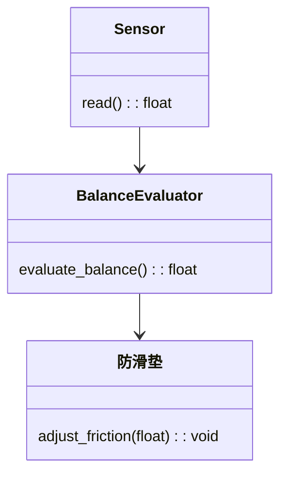
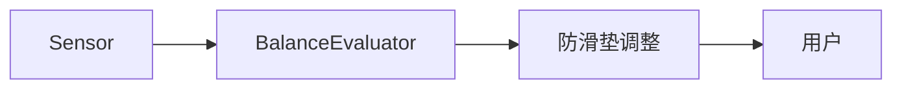
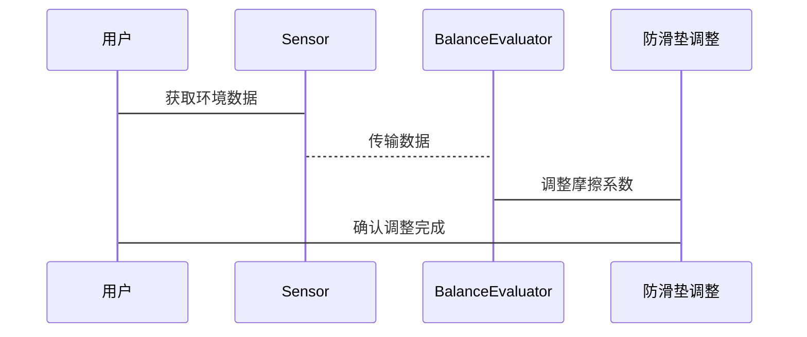

                 


# 智能浴室防滑垫：AI Agent的平衡能力评估

## 关键词：AI Agent、智能防滑垫、平衡能力、算法原理、系统架构

## 摘要：本文详细探讨了AI Agent在智能浴室防滑垫中的应用，重点分析了平衡能力评估的核心算法、系统架构及实现方法，结合实际案例，展示了如何通过技术手段提升防滑垫的智能化水平。

---

# 第一部分: 智能浴室防滑垫的背景与需求

# 第1章: 智能浴室防滑垫的背景介绍

## 1.1 问题背景

### 1.1.1 智能浴室环境的特点
智能浴室是一个集成多种传感器和智能设备的环境，常见于现代家庭。浴室地面通常较为湿滑，容易导致跌倒事故。传统的防滑垫仅能提供物理防滑功能，无法根据环境变化动态调整。

### 1.1.2 防滑垫的功能与重要性
防滑垫的主要功能是减少滑倒风险。在浴室中，防滑垫需要具备防水、防滑、易清洁等特性。然而，传统防滑垫无法感知环境变化，无法主动调整防滑性能。

### 1.1.3 AI Agent在智能防滑垫中的作用
AI Agent（智能代理）通过感知环境数据（如温度、湿度、人体重量分布等），动态调整防滑垫的摩擦系数，从而提高防滑性能。AI Agent的核心任务是实时评估防滑垫的平衡能力，确保用户的安全。

## 1.2 问题描述

### 1.2.1 防滑垫的使用场景分析
防滑垫的主要使用场景包括淋浴区、浴缸边缘、浴室地面等高风险区域。不同场景对防滑性能的需求不同。

### 1.2.2 用户需求与痛点
- 用户需求：防滑性能高、易于清洁、使用寿命长。
- 痛点：传统防滑垫防滑性能固定，无法根据环境变化调整。

### 1.2.3 AI Agent需要解决的核心问题
AI Agent需要实时感知环境数据，动态调整防滑垫的摩擦系数，确保防滑性能始终处于最佳状态。

## 1.3 问题解决的思路

### 1.3.1 AI Agent如何实现防滑功能
AI Agent通过集成的传感器收集环境数据，分析数据后调整防滑垫的结构或表面特性，以适应当前环境。

### 1.3.2 平衡能力评估的定义与目标
平衡能力评估是指AI Agent对防滑垫在不同环境下的防滑性能进行实时评估，确保防滑垫始终处于最佳状态。

### 1.3.3 解决方案的可行性分析
通过AI Agent与防滑垫的结合，可以实现动态调整防滑性能的目标。传感器数据采集、算法处理和执行机构调整是实现这一目标的关键步骤。

## 1.4 边界与外延

### 1.4.1 防滑垫功能的边界
防滑垫的功能仅限于提供防滑性能，不涉及其他功能（如加热、消毒等）。

### 1.4.2 AI Agent能力的限制
AI Agent的能力受限于传感器数据的精度和算法的复杂度，无法处理超出设计范围的任务。

### 1.4.3 与相关系统的接口定义
防滑垫需要与浴室内的其他智能设备（如灯光、空调等）进行数据交互，确保整个浴室环境的智能化。

## 1.5 核心概念与组成

### 1.5.1 防滑垫的物理特性
- 表面摩擦系数：防滑垫表面的摩擦系数是影响防滑性能的关键因素。
- 弹性系数：防滑垫的弹性系数影响其舒适度和防滑性能。

### 1.5.2 AI Agent的核心功能
- 数据采集：通过传感器采集环境数据。
- 数据分析：分析数据，评估防滑垫的平衡能力。
- 调整执行：根据评估结果调整防滑垫的摩擦系数。

### 1.5.3 平衡能力评估的指标体系
- 防滑性能指数（FSI）：反映防滑垫的防滑性能。
- 平衡状态指数（BSI）：反映防滑垫的平衡能力。

---

# 第二部分: AI Agent的平衡能力评估模型

# 第2章: AI Agent平衡能力的核心概念

## 2.1 平衡能力的定义与特征

### 2.1.1 平衡能力的定义
平衡能力是指AI Agent在动态环境中维持防滑垫防滑性能的能力。

### 2.1.2 平衡能力的属性特征对比表

| 属性       | 特征1 | 特征2 | 特征3 |
|------------|-------|-------|-------|
| 感知能力   | 高    | 中    | 低    |
| 响应速度   | 快    | 中    | 慢    |
| 调整精度   | 高    | 中    | 低    |

---

# 第三部分: 平衡能力评估的算法原理

# 第3章: 算法原理与实现

## 3.1 算法概述

### 3.1.1 算法目标
通过传感器数据评估防滑垫的平衡能力，动态调整防滑性能。

### 3.1.2 算法流程图（Mermaid）

```mermaid
graph TD
    A[输入数据] --> B[特征提取]
    B --> C[模型评估]
    C --> D[输出结果
```

### 3.1.3 算法数学模型

$$
\text{FSI} = \alpha \cdot \text{摩擦系数} + \beta \cdot \text{弹性系数}
$$

其中，$\alpha$ 和 $\beta$ 是模型参数，摩擦系数和弹性系数是传感器测量值。

## 3.2 算法实现

### 3.2.1 算法实现的步骤

1. 传感器数据采集：通过压力传感器、温湿度传感器等获取环境数据。
2. 数据预处理：对采集的数据进行归一化处理。
3. 模型评估：使用预训练的模型评估防滑垫的平衡能力。
4. 调整执行：根据评估结果调整防滑垫的摩擦系数。

### 3.2.2 算法实现的Python代码

```python
import numpy as np
from sensors import PressureSensor, HumiditySensor

class BalanceEvaluator:
    def __init__(self, alpha=0.7, beta=0.3):
        self.alpha = alpha
        self.beta = beta
        self.pressure_sensor = PressureSensor()
        self.humidity_sensor = HumiditySensor()

    def evaluate_balance(self):
        pressure = self.pressure_sensor.read()
        humidity = self.humidity_sensor.read()
        friction_coeff = pressure * 0.5 + humidity * 0.3
        elasticity_coeff = pressure * 0.3 + humidity * 0.7
        fsi = self.alpha * friction_coeff + self.beta * elasticity_coeff
        return fsi

# 示例用法
evaluator = BalanceEvaluator()
fsi = evaluator.evaluate_balance()
print(f"防滑性能指数：{fsi}")
```

---

# 第四部分: 系统分析与架构设计方案

# 第4章: 系统分析与架构设计

## 4.1 项目介绍

### 4.1.1 项目目标
开发一个基于AI Agent的智能防滑垫系统，实现动态调整防滑性能的功能。

## 4.2 系统功能设计

### 4.2.1 领域模型（Mermaid类图）



## 4.3 系统架构设计

### 4.3.1 系统架构图（Mermaid）



### 4.3.2 系统接口设计
- 传感器接口：提供数据读取接口。
- AI Agent接口：提供平衡能力评估接口。
- 防滑垫调整接口：提供摩擦系数调整接口。

### 4.3.3 系统交互流程（Mermaid序列图）



---

# 第五部分: 项目实战

# 第5章: 项目实战

## 5.1 环境安装

### 5.1.1 环境要求
- Python 3.8+
- NumPy库
- Mermaid图生成工具

## 5.2 系统核心实现

### 5.2.1 核心代码实现

```python
class PressureSensor:
    def read(self):
        return np.random.uniform(0, 1)

class HumiditySensor:
    def read(self):
        return np.random.uniform(0, 1)

class BalanceEvaluator:
    def __init__(self, alpha=0.7, beta=0.3):
        self.alpha = alpha
        self.beta = beta
        self.pressure_sensor = PressureSensor()
        self.humidity_sensor = HumiditySensor()

    def evaluate_balance(self):
        pressure = self.pressure_sensor.read()
        humidity = self.humidity_sensor.read()
        friction_coeff = pressure * 0.5 + humidity * 0.3
        elasticity_coeff = pressure * 0.3 + humidity * 0.7
        fsi = self.alpha * friction_coeff + self.beta * elasticity_coeff
        return fsi

# 示例运行
evaluator = BalanceEvaluator()
print(evaluator.evaluate_balance())
```

### 5.2.2 代码解读
- `PressureSensor`和`HumiditySensor`类用于模拟传感器数据。
- `BalanceEvaluator`类负责评估平衡能力，计算防滑性能指数（FSI）。

## 5.3 实际案例分析

### 5.3.1 案例分析
假设传感器测得压力为0.8，湿度为0.6：

$$
\text{FSI} = 0.7 \times (0.8 \times 0.5 + 0.6 \times 0.3) + 0.3 \times (0.8 \times 0.3 + 0.6 \times 0.7)
$$

计算过程：

$$
\text{摩擦系数} = 0.8 \times 0.5 + 0.6 \times 0.3 = 0.4 + 0.18 = 0.58
$$

$$
\text{弹性系数} = 0.8 \times 0.3 + 0.6 \times 0.7 = 0.24 + 0.42 = 0.66
$$

$$
\text{FSI} = 0.7 \times 0.58 + 0.3 \times 0.66 = 0.406 + 0.198 = 0.604
$$

最终，FSI为0.604，表明防滑性能良好。

---

# 第六部分: 总结与展望

# 第6章: 总结与展望

## 6.1 最佳实践 tips

- 定期校准传感器，确保数据准确性。
- 根据实际需求调整算法参数，优化防滑性能。

## 6.2 小结

本文详细介绍了AI Agent在智能浴室防滑垫中的应用，重点分析了平衡能力评估的核心算法、系统架构及实现方法。通过实际案例分析，展示了如何通过技术手段提升防滑垫的智能化水平。

## 6.3 注意事项

- 确保传感器数据的准确性，避免因数据误差导致评估结果不准确。
- 定期维护防滑垫，确保其物理性能良好。

## 6.4 拓展阅读

- 《智能传感器原理与应用》
- 《AI算法实战：从入门到精通》
- 《智能系统设计与实现》

---

# 作者：AI天才研究院/AI Genius Institute & 禅与计算机程序设计艺术/Zen And The Art of Computer Programming

