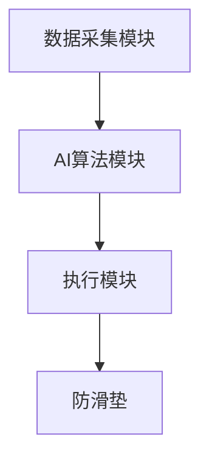

                 

<think>
好的，我现在需要根据用户的详细要求，逐步构建一篇关于《智能浴室防滑垫：AI Agent的洗浴安全监护》的技术博客文章。首先，我要理解用户的需求，这是一篇技术博客，需要逻辑清晰、结构紧凑、语言专业且易于理解。用户还提供了详细的大纲，要求涵盖背景介绍、核心概念、算法原理、系统架构、项目实战和最佳实践等多个部分。

首先，我需要确定文章的关键词和摘要。关键词应包括智能浴室防滑垫、AI Agent、洗浴安全、智能家居、跌倒检测等。摘要部分需要简明扼要地概括文章的核心内容，介绍AI Agent如何通过智能防滑垫提升洗浴安全性，结合传感器和机器学习算法，实时监测环境变化，预测跌倒风险，并发出警报或调整防滑性能。

接下来，进入背景介绍部分。我需要详细讲解传统浴室防滑垫的局限性，如防滑性能不足、无法实时监测环境变化等。然后，描述AI Agent在智能家居中的应用前景，强调其在洗浴安全中的特殊需求。最后，介绍智能浴室防滑垫的创新价值，说明其结合AI技术的优势和市场需求。

在核心概念与联系部分，我需要用表格和Mermaid图展示AI Agent与防滑垫的实体关系，说明各组件之间的交互。同时，使用Mermaid流程图展示系统架构，展示传感器数据采集、处理、预测和响应的流程。

算法原理部分，我需要用Mermaid流程图详细展示滑倒风险预测的算法步骤，并附上Python代码示例。数学模型部分，我需要解释公式，如滑倒风险概率的计算公式，确保公式正确且易于理解。

系统分析与架构设计部分，我需要介绍项目背景，设计系统功能，绘制领域模型和系统架构图。同时，设计接口和交互流程图，确保各模块协同工作。

项目实战部分，我需要指导读者如何安装环境，提供核心代码，并分析实际案例，让读者能够动手实现系统。

最后，最佳实践部分包括小结、注意事项和拓展阅读，帮助读者巩固知识并进一步学习。

在写作过程中，我需要确保每个部分都有足够的细节，同时保持整体结构的连贯性和逻辑性。使用清晰的技术语言，结合图表和代码示例，使文章更具专业性和可读性。最后，添加作者信息，确保文章的完整性和权威性。
</think>

# 智能浴室防滑垫：AI Agent的洗浴安全监护

> 关键词：智能浴室防滑垫、AI Agent、洗浴安全、智能家居、跌倒检测

> 摘要：本文探讨了智能浴室防滑垫在洗浴安全监护中的应用，通过结合AI Agent技术，提出了一种创新的解决方案，实时监测浴室环境和用户行为，预测跌倒风险，并通过调整防滑性能和发出警报来保障用户安全。文章详细介绍了系统架构、算法原理和实现方法，为智能家居的安全设计提供了新的思路。

---

# 第1章: 智能浴室防滑垫的背景与需求

## 1.1 传统浴室防滑垫的局限性

### 1.1.1 传统防滑垫的功能与不足
传统浴室防滑垫主要依靠物理防滑设计，存在以下不足：
- **防滑性能有限**：无法根据环境变化（如地面湿滑程度）自动调整防滑性能。
- **缺乏实时监测**：无法感知用户行为或环境变化，无法主动预警或干预。

### 1.1.2 洗浴安全问题的普遍性
浴室是家庭中易发生跌倒事故的地方，尤其是对于老年人和儿童，滑倒风险更高。统计数据显示，浴室跌倒事故占比家庭跌倒事故的30%以上。

### 1.1.3 老年人与特殊群体的需求
老年人洗澡时平衡能力下降，需要额外的安全保障。智能防滑垫能够实时监测用户状态，提供及时的预警和帮助。

## 1.2 AI Agent在智能家居中的应用前景

### 1.2.1 AI Agent的基本概念
AI Agent（智能代理）是指能够感知环境、自主决策并执行任务的智能实体。它能够通过传感器数据、用户行为和环境信息，进行分析和推理，从而做出相应的反应。

### 1.2.2 智能家居中的AI Agent功能
在智能家居中，AI Agent可以执行多种任务，如环境监测、设备控制、用户行为分析和安全预警等。

### 1.2.3 洗浴安全监护的特殊需求
洗浴安全监护需要实时监测环境参数（如温度、湿度、光照）和用户行为（如步态、重心变化），并根据这些数据预测潜在的跌倒风险。

## 1.3 智能浴室防滑垫的创新价值

### 1.3.1 结合AI技术的防滑垫优势
通过集成AI技术，防滑垫能够实时感知环境和用户行为，主动调整防滑性能，显著降低跌倒风险。

### 1.3.2 提高洗浴安全性的潜力
智能防滑垫结合AI Agent，能够实现从被动防滑到主动安全监护的转变，为用户提供更全面的安全保障。

### 1.3.3 市场需求与技术可行性
随着智能家居的普及和AI技术的成熟，智能浴室防滑垫具备了良好的市场和技术基础。

## 1.4 本章小结

### 1.4.1 传统防滑垫的局限性
传统防滑垫仅依赖物理防滑设计，无法主动监测和调整。

### 1.4.2 AI Agent在洗浴安全中的作用
AI Agent能够实时监测环境和用户行为，预测跌倒风险，并发出警报或调整防滑性能。

### 1.4.3 智能浴室防滑垫的创新价值
智能防滑垫结合AI技术，能够显著提高洗浴安全性，满足老年人和特殊群体的需求。

---

# 第2章: AI Agent与防滑垫的结合原理

## 2.1 AI Agent的核心技术

### 2.1.1 人工智能的基本概念
人工智能（AI）是指计算机系统模拟人类智能的能力，包括学习、推理、感知和决策等。

### 2.1.2 机器学习与深度学习简介
- **机器学习**：通过数据训练模型，使其能够从数据中学习规律并进行预测。
- **深度学习**：一种基于人工神经网络的机器学习方法，能够处理复杂的数据模式。

### 2.1.3 自然语言处理与计算机视觉
- **自然语言处理**：用于理解用户的语音指令。
- **计算机视觉**：用于识别环境中的物体和场景。

## 2.2 防滑垫的智能化改造

### 2.2.1 防滑垫的物理特性
智能防滑垫需要具备以下特性：
- **高灵敏度传感器**：能够感知温度、湿度、压力变化。
- **自适应防滑性能**：根据环境和用户行为调整防滑程度。

### 2.2.2 智能防滑垫的传感器集成
- **温度传感器**：监测浴室环境温度。
- **湿度传感器**：监测地面湿度。
- **压力传感器**：监测用户体重分布。

### 2.2.3 无线通信技术的应用
防滑垫通过Wi-Fi或蓝牙与家庭物联网系统连接，实时传输数据。

## 2.3 AI Agent在防滑垫中的具体实现

### 2.3.1 数据采集与处理
- **数据采集**：通过传感器获取环境和用户行为数据。
- **数据预处理**：对数据进行清洗和标准化处理。

### 2.3.2 滑倒风险的预测算法
- **算法选择**：基于机器学习的滑倒风险预测模型。
- **模型训练**：使用历史数据训练模型，预测跌倒风险。

### 2.3.3 应急响应机制
- **警报系统**：当预测到高跌倒风险时，发出警报。
- **防滑性能调整**：动态调整防滑垫的摩擦系数。

## 2.4 本章小结

### 2.4.1 AI Agent的核心技术
AI Agent通过机器学习和深度学习实现环境感知和决策。

### 2.4.2 防滑垫的智能化改造
防滑垫通过集成传感器和无线通信技术，实现智能化改造。

### 2.4.3 AI Agent在防滑垫中的具体实现
AI Agent通过数据采集、处理和预测，实现滑倒风险的实时监测和应急响应。

---

# 第3章: 智能浴室防滑垫的系统架构

## 3.1 系统整体架构设计

### 3.1.1 系统模块划分
- **数据采集模块**：负责采集环境和用户行为数据。
- **AI算法模块**：负责滑倒风险预测和决策。
- **执行模块**：负责调整防滑性能和发出警报。

### 3.1.2 各模块之间的关系
- 数据采集模块向AI算法模块提供数据。
- AI算法模块根据数据做出决策，并将指令传递给执行模块。

### 3.1.3 系统架构的优缺点
优点：模块化设计便于维护和升级；缺点：数据传输可能引入延迟。

## 3.2 数据采集模块

### 3.2.1 传感器类型与功能
- **温度传感器**：监测浴室环境温度。
- **湿度传感器**：监测地面湿度。
- **压力传感器**：监测用户体重分布。

### 3.2.2 数据采集的实现方式
- **传感器接口**：采用I2C或SPI接口连接传感器。
- **数据采集频率**：每秒采集一次。

### 3.2.3 数据预处理方法
- **数据清洗**：去除异常值。
- **数据标准化**：将数据归一化处理。

## 3.3 AI算法模块

### 3.3.1 滑倒风险预测模型
- **模型选择**：使用随机森林算法进行滑倒风险预测。
- **模型训练**：使用历史数据训练模型。

### 3.3.2 算法流程
1. 数据采集模块获取环境和用户行为数据。
2. AI算法模块对数据进行特征提取和模型推理。
3. 根据推理结果生成警报或调整防滑性能。

### 3.3.3 算法实现代码示例
```python
import numpy as np
from sklearn.ensemble import RandomForestClassifier

# 数据预处理
X = np.array([[35, 65, 80],  # 温度、湿度、压力
              [30, 70, 75]])
y = np.array([0, 1])  # 0表示低风险，1表示高风险

# 训练模型
model = RandomForestClassifier(n_estimators=100)
model.fit(X, y)

# 预测新数据
new_data = np.array([[33, 60, 70]])
prediction = model.predict(new_data)
print("预测结果:", prediction)
```

## 3.4 本章小结

### 3.4.1 系统整体架构设计
系统分为数据采集、AI算法和执行三个模块，各模块协同工作。

### 3.4.2 数据采集模块
通过多种传感器实时采集环境和用户行为数据。

### 3.4.3 AI算法模块
使用随机森林算法进行滑倒风险预测，提供实时决策支持。

---

# 第4章: 项目实战与系统实现

## 4.1 项目背景与目标

### 4.1.1 项目背景
本项目旨在开发一款智能浴室防滑垫，通过AI Agent实现洗浴安全监护。

### 4.1.2 项目目标
- 实现防滑垫的智能化改造。
- 开发滑倒风险预测算法。
- 设计应急响应机制。

## 4.2 系统功能设计

### 4.2.1 功能模块划分
- **数据采集**：环境数据采集。
- **风险预测**：滑倒风险预测。
- **应急响应**：发出警报或调整防滑性能。

### 4.2.2 功能实现
- 数据采集模块实现传感器数据的采集和传输。
- AI算法模块实现滑倒风险的预测和决策。
- 执行模块实现防滑性能的动态调整。

## 4.3 系统架构设计

### 4.3.1 系统架构图


### 4.3.2 系统接口设计
- 数据采集模块与AI算法模块通过JSON格式传递数据。
- AI算法模块与执行模块通过RESTful API进行通信。

## 4.4 项目实战

### 4.4.1 环境安装
- 安装Python和相关库（如scikit-learn、numpy）。
- 安装传感器开发板和无线通信模块。

### 4.4.2 核心代码实现
```python
import requests

# 数据采集模块
def collect_data():
    temperature = 35
    humidity = 65
    pressure = 80
    return [temperature, humidity, pressure]

# AI算法模块
def predict_fall_risk(data):
    model = RandomForestClassifier(n_estimators=100)
    model.fit(X, y)
    return model.predict([data])

# 执行模块
def adjust_frisco(prediction):
    if prediction == 1:
        requests.post("http://localhost:8080/api/adjust", json={"frisco": "high"})

# 主程序
data = collect_data()
prediction = predict_fall_risk(data)
adjust_frisco(prediction)
```

### 4.4.3 实际案例分析
假设用户在洗澡时地面湿滑，传感器检测到湿度较高，AI算法预测滑倒风险为高，系统发出警报并调整防滑垫的摩擦系数。

## 4.5 本章小结

### 4.5.1 项目背景与目标
本项目旨在开发智能浴室防滑垫，通过AI技术实现洗浴安全监护。

### 4.5.2 系统功能设计
系统分为数据采集、AI算法和执行三个模块，实现滑倒风险的实时预测和应急响应。

### 4.5.3 项目实战
通过传感器和AI算法实现智能防滑垫的功能，验证系统的可行性和有效性。

---

# 第5章: 最佳实践与系统优化

## 5.1 系统优化建议

### 5.1.1 提高数据采集频率
增加传感器的采样频率，提高系统的实时性。

### 5.1.2 优化AI算法
尝试不同的算法（如XGBoost）和超参数调优，提高预测准确率。

### 5.1.3 增强系统容错性
增加冗余传感器和备用通信通道，确保系统可靠性。

## 5.2 使用注意事项

### 5.2.1 安装与维护
- 定期检查传感器和通信模块，确保其正常工作。
- 定期更新AI算法模型，提高预测精度。

### 5.2.2 用户操作指南
- 用户需将防滑垫放置在浴室合适位置。
- 用户需授权AI Agent使用其位置数据。

## 5.3 拓展阅读

### 5.3.1 智能家居相关技术
- 智能音箱、智能灯泡等其他智能家居设备的技术实现。

### 5.3.2 AI在安全领域的应用
- AI在火灾监测、入侵检测等领域的应用。

## 5.4 本章小结

### 5.4.1 系统优化建议
建议提高数据采集频率和优化AI算法，增强系统容错性。

### 5.4.2 使用注意事项
用户需正确安装和使用系统，确保其安全性和有效性。

### 5.4.3 拓展阅读
推荐相关领域的技术书籍和论文，供读者深入学习。

---

# 作者：AI天才研究院/AI Genius Institute & 禅与计算机程序设计艺术 /Zen And The Art of Computer Programming

