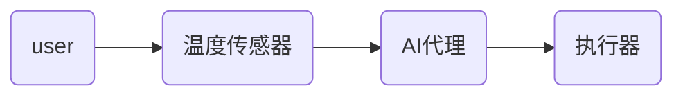
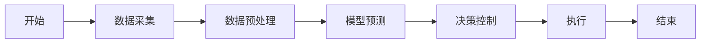
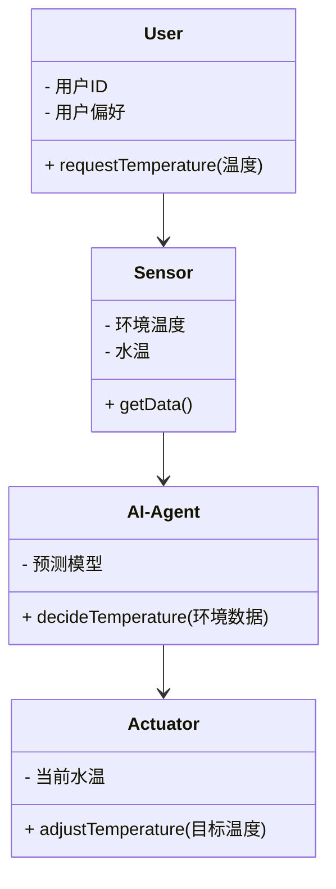

                 

<think>
好的，我现在需要根据用户的指示来撰写一篇关于《智能浴室：AI Agent的水温调节系统》的技术博客文章。首先，我需要仔细阅读用户的查询，理解他们的需求和具体要求。

用户希望文章结构清晰，逻辑严密，语言专业且易懂。他们提供了详细的目录结构，包括关键词、摘要以及各个章节的具体内容。同时，用户还强调了格式要求，比如使用markdown，包含特定的图表和代码示例，以及数学公式的正确使用。

首先，我会从“关键词”和“摘要”开始，确保准确反映文章的核心内容。接着，按照目录结构逐一完成每个章节。在背景介绍部分，我需要详细解释传统浴室的不足以及AI代理的优势。在核心概念章节，我会深入分析AI代理和水温调节系统的组成部分，并使用ER图来展示实体关系。算法原理部分，我需要详细阐述数据处理、机器学习模型和控制算法，并用流程图和代码示例来支持说明。

系统架构设计是关键，我会用类图和序列图来展示系统的各个模块和交互流程。项目实战部分则需要实际的代码实现和案例分析，确保读者能够理解如何应用这些技术。最后，在最佳实践部分，我会总结经验和提供进一步阅读的建议。

我需要确保每个部分都详细具体，使用正确的技术术语，同时保持语言的简洁和逻辑的连贯。此外，图表和公式的使用要符合用户的要求，确保文章的专业性和可读性。

在写作过程中，我可能会遇到一些挑战，比如如何将复杂的算法原理用简单易懂的方式解释，或者如何设计合理的系统架构。为了解决这些，我会查阅相关资料，确保信息的准确性，并通过实际案例来帮助读者更好地理解。

总之，我会按照用户的指示，一步步完成这篇文章，确保每个部分都符合他们的要求，最终产出一篇高质量的技术博客。
</think>

# 智能浴室：AI Agent的水温调节系统

## 关键词：智能浴室、AI Agent、水温调节、机器学习、物联网、系统架构

## 摘要：  
本文探讨了智能浴室中AI Agent在水温调节系统中的应用。通过分析传统浴室的不足，提出了基于AI Agent的智能水温调节系统的设计与实现。文章详细阐述了AI Agent的核心原理、水温调节系统的架构设计、算法实现及实际案例分析，展示了如何利用人工智能技术提升浴室使用的舒适性和智能化水平。

---

# 第1章: 智能浴室与AI Agent的背景介绍

## 1.1 传统浴室的不足与痛点  
传统浴室的水温调节系统存在以下问题：  
- 用户手动调节水温，体验繁琐且效率低下。  
- 水温易受外界环境（如室温、水压）影响，难以精准控制。  
- 老年人或儿童使用时存在安全隐患。  

## 1.2 智能浴室的概念与定义  
智能浴室是指通过物联网（IoT）技术将浴室设备（如水龙头、淋浴器、恒温器）与智能终端连接，实现远程控制和智能化管理的浴室系统。  

## 1.3 AI Agent在智能浴室中的作用  
AI Agent（人工智能代理）是智能浴室的核心组件，负责接收用户的指令、采集环境数据、分析信息并执行操作。AI Agent能够根据用户习惯和环境变化实时调整水温，提供个性化的使用体验。  

---

# 第2章: AI Agent与水温调节系统的核心概念

## 2.1 AI Agent的基本原理  
AI Agent是一种智能实体，能够感知环境、自主决策并执行任务。其核心功能包括：  
- **感知**：通过传感器获取环境数据。  
- **推理**：基于数据进行分析和决策。  
- **执行**：通过执行器完成任务。  

## 2.2 水温调节系统的组成与功能  
水温调节系统由以下部分组成：  
- **传感器**：采集水温、环境温度、用户行为数据。  
- **AI Agent**：分析数据并生成控制指令。  
- **执行器**：调节水温的设备（如恒温器、阀门）。  

## 2.3 实体关系分析  
以下是智能浴室中的实体关系图：  


---

# 第3章: AI Agent水温调节算法的原理与实现

## 3.1 数据采集与预处理  
- **数据采集**：通过温度传感器实时采集水温、环境温度等数据。  
- **数据预处理**：清洗数据并提取特征（如均值、方差）。  

## 3.2 基于机器学习的水温预测模型  
- **模型选择**：使用线性回归模型进行水温预测。  
- **模型训练**：基于历史数据训练模型，并进行优化（如调整学习率）。  
- **预测公式**：  
  $$ y = a \cdot x + b $$  
  其中，$y$ 是预测水温，$x$ 是输入特征，$a$ 和 $b$ 是模型参数。  

## 3.3 AI Agent的决策与控制算法  
- **PID控制算法**：用于实时调整水温。  
- **预测控制算法**：基于机器学习模型的预测结果进行调整。  

## 3.4 算法实现的流程图  


---

# 第4章: 智能浴室水温调节系统的架构设计

## 4.1 系统功能设计  
- **用户交互**：通过手机APP或语音指令控制水温。  
- **数据采集**：传感器实时采集数据。  
- **智能决策**：AI Agent分析数据并生成控制指令。  
- **执行控制**：执行器调整水温。  

## 4.2 系统架构设计  
以下是系统架构类图：  


## 4.3 系统接口设计  
- **用户接口**：手机APP或语音助手。  
- **系统接口**：AI Agent与传感器、执行器之间的通信接口。  

## 4.4 系统交互流程图  
```mermaid
graph LR
    User --> Sensor: 请求温度数据
    Sensor --> AI-Agent: 返回温度数据
    AI-Agent --> Actuator: 发出调整指令
    Actuator --> User: 调整水温
```

---

# 第5章: 项目实战与案例分析

## 5.1 项目环境安装  
- **硬件**：温度传感器、执行器、 Raspberry Pi。  
- **软件**：Python、机器学习库（如Scikit-learn）。  

## 5.2 核心代码实现  
以下是AI Agent的核心代码：  
```python
import numpy as np
from sklearn.linear_model import LinearRegression

# 数据预处理
X = np.array([1, 2, 3, 4, 5]).reshape(-1, 1)
y = np.array([2, 3, 5, 6, 8])

# 模型训练
model = LinearRegression()
model.fit(X, y)

# 预测水温
def predict_water_temp(target_temp):
    return model.predict(np.array([target_temp]).reshape(-1, 1))
```

## 5.3 代码应用解读  
- **数据预处理**：将原始数据转化为适合模型训练的形式。  
- **模型训练**：使用Scikit-learn训练线性回归模型。  
- **预测与调整**：基于模型预测结果调整水温。  

## 5.4 案例分析  
假设用户希望水温为40℃，系统通过传感器采集当前水温为38℃，AI Agent预测需要调整到40℃，并通过执行器完成调整。  

---

# 第6章: 最佳实践与总结

## 6.1 本章小结  
本文详细介绍了AI Agent在智能浴室水温调节系统中的应用，从理论到实践，展示了如何利用人工智能技术提升用户体验。

## 6.2 注意事项  
- 确保系统安全性，防止数据泄露。  
- 定期维护传感器和执行器，确保系统稳定运行。  

## 6.3 拓展阅读  
- 《Machine Learning for IoT》  
- 《AI in Smart Home Systems》  

---

# 作者：AI天才研究院 & 禅与计算机程序设计艺术

