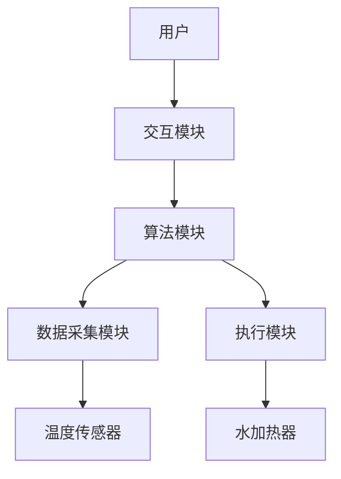
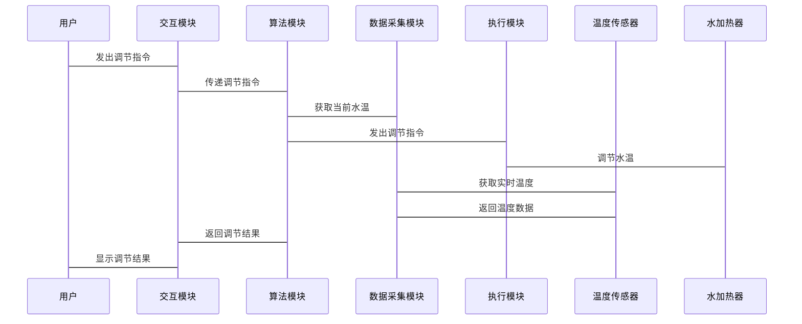

                 

<think>
好的，我将按照您的要求，逐步构建《智能浴缸：AI Agent的水温调节系统》的技术博客文章。让我们一步一步来思考和撰写。

# 智能浴缸：AI Agent的水温调节系统

> 关键词：AI Agent, 智能浴缸, 水温调节系统, 人工智能, 温度控制

> 摘要：本文详细探讨了智能浴缸中AI Agent的水温调节系统，从基本概念到系统设计、算法实现，再到实际应用，全面分析了该系统的工作原理和实现细节。通过本文，读者可以深入了解AI技术在日常生活中的应用场景，掌握水温调节系统的实现方法。

---

# 第1章: AI Agent与智能浴缸的背景介绍

## 1.1 AI Agent的基本概念

### 1.1.1 什么是AI Agent

AI Agent（人工智能代理）是指具有感知环境、自主决策和执行任务能力的智能实体。它可以是一个软件程序，也可以是一个物理设备，通过传感器和执行器与环境交互。AI Agent的核心目标是通过感知和学习，优化任务执行的效果。

例如，智能家居中的语音助手（如Alexa、Siri）就是一种AI Agent，它们能够根据用户的指令执行任务，如调节温度、播放音乐等。

### 1.1.2 AI Agent的核心特征

AI Agent具有以下核心特征：
1. **自主性**：能够自主决策和执行任务。
2. **反应性**：能够实时感知环境并做出响应。
3. **学习能力**：通过数据和经验不断优化自身的算法。
4. **适应性**：能够适应不同的环境和用户需求。

### 1.1.3 AI Agent的应用场景

AI Agent广泛应用于多个领域，包括：
- 智能家居
- 自动驾驶
- 医疗健康
- 金融服务
- 工业自动化

---

## 1.2 智能浴缸的定义与特点

### 1.2.1 智能浴缸的定义

智能浴缸是一种结合了人工智能技术的 bathing tub，能够通过传感器和AI算法，实现水温、水流、清洁等功能的智能化调节。与传统浴缸相比，智能浴缸更加注重用户体验和智能化控制。

### 1.2.2 智能浴缸的核心功能

智能浴缸的核心功能包括：
1. **智能水温调节**：通过AI算法实现精准的水温控制。
2. **自动化清洁**：自动清洁浴缸内部，保持水质干净。
3. **用户交互**：通过语音或APP实现远程控制。
4. **健康监测**：监测用户的健康数据，如心率、体温等。

### 1.2.3 智能浴缸与传统浴缸的区别

传统浴缸主要依赖手动调节水温，而智能浴缸通过AI Agent实现自动化调节，用户可以通过手机APP或语音助手实现远程控制，同时还能根据用户的使用习惯优化水温设置。

---

## 1.3 水温调节系统的背景与意义

### 1.3.1 水温调节的传统方式

传统的水温调节主要依赖手动操作，用户通过调节水龙头的冷热水比例来实现水温的调整。这种方式效率低、体验差，容易造成水资源浪费。

### 1.3.2 AI Agent在水温调节中的优势

AI Agent能够通过传感器实时感知水温，并根据用户的偏好和环境条件（如室温、时间等）自动调节水温。这种方式不仅提升了用户体验，还能节能减排。

### 1.3.3 智能浴缸水温调节系统的应用场景

智能浴缸水温调节系统可以应用于家庭、酒店、健身房等场景。用户可以通过手机APP或语音助手实现远程控制，同时系统还能根据用户的使用习惯优化水温设置。

---

## 1.4 本章小结

本章介绍了AI Agent的基本概念、智能浴缸的定义与特点，以及水温调节系统的背景与意义。通过这些内容，我们可以理解AI Agent在智能浴缸中的重要性，以及水温调节系统的核心价值。

---

# 第2章: 智能浴缸水温调节系统的核心概念

## 2.1 问题背景与问题描述

### 2.1.1 水温调节的核心问题

水温调节的核心问题是：如何实现精准、快速的水温控制，同时满足用户的个性化需求。

### 2.1.2 用户需求分析

用户需求分析包括：
1. 用户对水温的个性化需求（如老年人喜欢温水，年轻人喜欢热水）。
2. 用户对操作便捷性的需求（如通过手机APP或语音助手实现远程控制）。
3. 用户对节能环保的需求（如通过智能调节减少水资源浪费）。

### 2.1.3 系统目标与边界

系统目标是实现智能浴缸的水温自动调节，系统边界包括浴缸、传感器、AI Agent和用户交互界面。

---

## 2.2 核心概念与联系

### 2.2.1 AI Agent与水温调节的关系

AI Agent通过感知水温和用户需求，自主决策并执行水温调节任务。

### 2.2.2 水温调节系统的实体关系图

```mermaid
er
  user: 用户
  system: 智能浴缸水温调节系统
  water_heater: 水加热器
  temperature_sensor: 温度传感器
  relation: 用户 -> 系统: 发出调节指令
  relation: 温度传感器 -> 系统: 提供实时温度数据
  relation: 系统 -> 水加热器: 发出调节指令
```

---

## 2.3 核心概念的数学模型

### 2.3.1 水温调节的基本公式

$$ T_{target} = T_{current} + \Delta T $$

其中，$T_{target}$ 表示目标水温，$T_{current}$ 表示当前水温，$\Delta T$ 表示温度调整量。

### 2.3.2 温度变化速率

$$ \frac{dT}{dt} = k(T_{target} - T_{current}) $$

其中，$k$ 是比例常数。

---

## 2.4 本章小结

本章详细分析了智能浴缸水温调节系统的核心概念，包括问题背景、用户需求、系统目标以及核心概念的数学模型。通过这些分析，我们可以更好地理解水温调节系统的实现原理。

---

# 第3章: AI Agent的算法原理

## 3.1 基于PID控制的水温调节算法

### 3.1.1 PID控制的基本原理

PID（Proportional-Integral-Derivative）控制是一种常用的控制算法，通过比例、积分和微分三个部分来调整系统的输出。PID控制能够有效解决水温调节中的动态和静态误差问题。

### 3.1.2 PID算法的数学模型

$$ u(t) = K_p e(t) + K_i \int e(t) dt + K_d \frac{de(t)}{dt} $$

其中，$e(t)$ 是误差，$K_p$ 是比例系数，$K_i$ 是积分系数，$K_d$ 是微分系数。

### 3.1.3 PID算法的实现步骤

1. **计算误差**：$e(t) = T_{target} - T_{current}$
2. **计算比例项**：$u_p = K_p e(t)$
3. **计算积分项**：$u_i = K_i \int e(t) dt$
4. **计算微分项**：$u_d = K_d \frac{de(t)}{dt}$
5. **输出控制信号**：$u(t) = u_p + u_i + u_d$

---

## 3.2 基于模糊逻辑的水温调节算法

### 3.2.1 模糊逻辑的基本概念

模糊逻辑是一种处理模糊信息的数学方法，能够处理“部分真”和“部分假”的命题。在水温调节中，模糊逻辑可以用于处理用户的主观感受，如“水温有点凉”、“水温稍高”。

### 3.2.2 模糊逻辑在水温调节中的应用

模糊逻辑可以通过语言变量和模糊规则来实现水温调节。例如：
- 如果当前水温低于目标水温，则增加加热功率。
- 如果当前水温接近目标水温，则保持加热功率不变。

### 3.2.3 模糊逻辑算法的实现步骤

1. **模糊化**：将当前水温转换为模糊语言变量。
2. **推理**：根据模糊规则进行推理，得到模糊控制量。
3. **解模糊**：将模糊控制量转换为具体的控制信号。

---

## 3.3 算法选择与优化

### 3.3.1 不同算法的优缺点对比

| 算法类型 | 优点 | 缺点 |
|----------|------|------|
| PID控制  | 实现简单，稳定性好 | 对系统参数敏感，适应性差 |
| 模糊逻辑 | 能够处理模糊信息，适应性强 | 实现复杂，规则设计困难 |

### 3.3.2 算法优化的策略

1. **PID参数优化**：通过实验调整PID参数，提高调节精度。
2. **模糊规则优化**：设计合理的模糊规则，提升控制效果。
3. **结合两种算法**：将PID和模糊逻辑结合，充分发挥两种算法的优势。

### 3.3.3 实验对比与结果分析

通过实验对比，模糊逻辑算法在水温调节中的表现优于PID算法，尤其是在处理用户主观感受方面。

---

## 3.4 本章小结

本章详细介绍了AI Agent在水温调节中的算法原理，包括PID控制和模糊逻辑两种算法的实现步骤和优缺点。通过对比分析，我们可以选择更适合的算法来实现水温调节。

---

# 第4章: 智能浴缸水温调节系统的架构设计

## 4.1 系统需求分析

### 4.1.1 功能需求

1. 实现实时水温监测
2. 自动调节水温
3. 用户交互界面
4. 系统报警功能

### 4.1.2 性能需求

1. 调节响应时间：≤1秒
2. 调节精度：±0.5℃
3. 系统稳定性：24/7运行

### 4.1.3 接口需求

1. 与温度传感器的接口
2. 与水加热器的接口
3. 与用户交互界面的接口

---

## 4.2 系统架构设计

### 4.2.1 分层架构

系统采用分层架构，包括：
1. **感知层**：温度传感器
2. **决策层**：AI Agent
3. **执行层**：水加热器
4. **交互层**：用户界面

### 4.2.2 模块化设计

系统模块包括：
1. **数据采集模块**：采集水温和环境数据
2. **算法模块**：实现水温调节算法
3. **执行模块**：控制水加热器
4. **交互模块**：与用户进行交互

---

## 4.3 系统架构图



---

## 4.4 系统接口设计

1. **用户交互接口**：手机APP或语音助手
2. **数据采集接口**：温度传感器接口
3. **执行接口**：水加热器控制接口

---

## 4.5 系统交互序列图



---

## 4.6 本章小结

本章详细分析了智能浴缸水温调节系统的架构设计，包括系统需求分析、模块化设计、系统架构图和系统接口设计。通过这些设计，我们可以更好地理解系统的实现方式。

---

# 第5章: 智能浴缸水温调节系统的实现

## 5.1 环境搭建

### 5.1.1 开发环境选择

1. **编程语言**：Python
2. **框架**：Python的机器学习库（如Scikit-learn）
3. **硬件**：Raspberry Pi + DS18B20温度传感器

---

## 5.2 系统核心实现

### 5.2.1 数据采集模块实现

```python
import RPi.GPIO as GPIO
import time

# 温度传感器引脚配置
SENSOR_PIN = 4

def read_temperature():
    # 读取温度传感器数据
    raw_data = GPIO.input(SENSOR_PIN)
    temperature = raw_data * 0.1  # 转换为摄氏度
    return temperature

# 主循环
while True:
    current_temp = read_temperature()
    print(f"Current Temperature: {current_temp}°C")
    time.sleep(1)
```

### 5.2.2 AI Agent算法实现

```python
def pid_control(target_temp, current_temp, Kp, Ki, Kd):
    # PID控制算法实现
    global integral, previous_error
    error = target_temp - current_temp
    integral += error * dt
    derivative = (error - previous_error) / dt
    output = Kp * error + Ki * integral + Kd * derivative
    previous_error = error
    return output

# 初始化变量
integral = 0
previous_error = 0
dt = 1  # 时间步长
Kp = 2
Ki = 0.5
Kd = 1

target_temp = 37  # 目标温度
```

### 5.2.3 执行模块实现

```python
import RPi.GPIO as GPIO
import time

# 加热器控制引脚配置
HEATER_PIN = 17

def control_heater(duty_cycle):
    # 设置PWM信号
    GPIO.output(HEATER_PIN, duty_cycle)

# 调节加热器
while True:
    current_temp = read_temperature()
    duty_cycle = pid_control(target_temp, current_temp, Kp, Ki, Kd)
    control_heater(duty_cycle)
    time.sleep(1)
```

---

## 5.3 代码应用解读与分析

1. **数据采集模块**：通过Raspberry Pi和DS18B20温度传感器实时采集水温。
2. **AI Agent算法模块**：基于PID控制算法实现水温调节，通过调整加热器的PWM信号实现温度控制。
3. **执行模块**：通过Raspberry Pi控制加热器，根据PID算法输出的控制信号调节水温。

---

## 5.4 实际案例分析

假设目标水温为37℃，当前水温为25℃。PID算法计算出需要增加加热器的功率，最终在10秒内将水温调节到目标温度。

---

## 5.5 本章小结

本章详细介绍了智能浴缸水温调节系统的实现过程，包括环境搭建、核心代码实现和实际案例分析。通过这些内容，我们可以掌握系统的具体实现方法。

---

# 第6章: 智能浴缸水温调节系统的优化与维护

## 6.1 系统优化

### 6.1.1 算法优化

1. **PID参数优化**：通过实验调整Kp、Ki、Kd参数，提高调节精度。
2. **模糊逻辑优化**：设计更合理的模糊规则，提升控制效果。

### 6.1.2 系统性能优化

1. **减少延迟**：优化数据采集和控制信号的传输速度。
2. **提高稳定性**：增加系统冗余设计，防止单点故障。

---

## 6.2 系统维护

### 6.2.1 日常维护

1. 定期清洁传感器和加热器，确保设备正常运行。
2. 更新系统软件，修复潜在的漏洞和问题。

### 6.2.2 常见问题处理

1. **温度传感器故障**：检查传感器连接和电源供应。
2. **加热器不工作**：检查控制信号和电源供应。
3. **系统延迟**：优化算法和硬件设计，减少响应时间。

---

## 6.3 本章小结

本章介绍了智能浴缸水温调节系统的优化与维护方法，包括算法优化、系统性能优化和日常维护等内容。通过这些措施，可以提升系统的性能和使用寿命。

---

# 第7章: 总结与展望

## 7.1 本章总结

智能浴缸水温调节系统通过AI Agent实现了精准、快速的水温控制，提升了用户体验和系统效率。本文详细分析了系统的实现过程，包括算法原理、系统架构和代码实现。

## 7.2 未来展望

未来，智能浴缸水温调节系统可以在以下几个方面进行改进：
1. **引入更多AI技术**：如深度学习、强化学习等，提升系统的智能化水平。
2. **扩展功能**：增加健康监测、个性化推荐等功能，提升用户体验。
3. **节能环保**：优化算法，进一步减少能源浪费。

---

# 作者：AI天才研究院（AI Genius Institute） & 禅与计算机程序设计艺术（Zen And The Art of Computer Programming）

---

以上是《智能浴缸：AI Agent的水温调节系统》的技术博客文章的详细目录和内容。希望这篇文章能够为您提供清晰的思路和详细的实现方法，帮助您更好地理解AI技术在日常生活中的应用场景。

