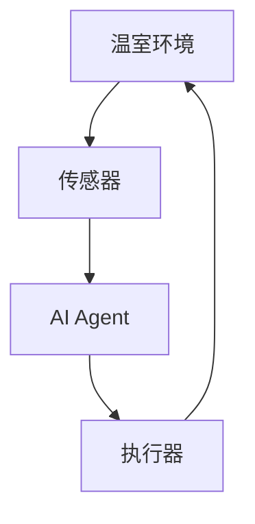
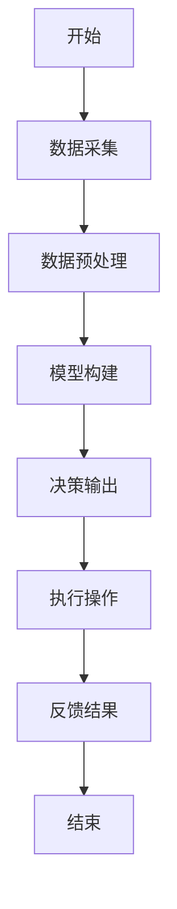
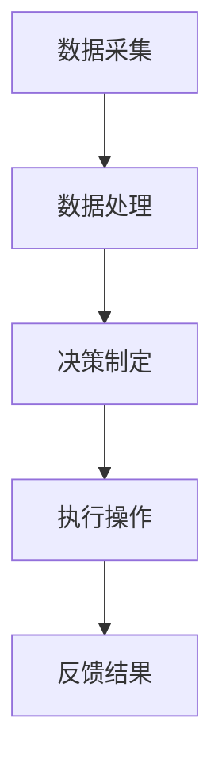
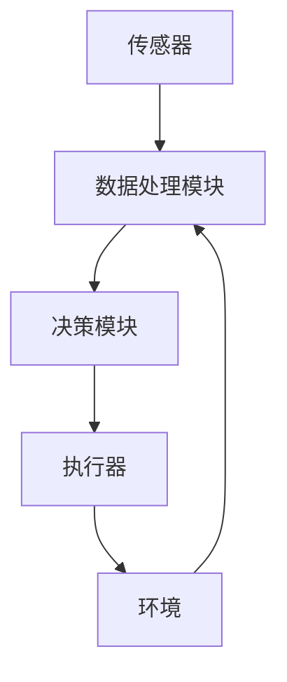
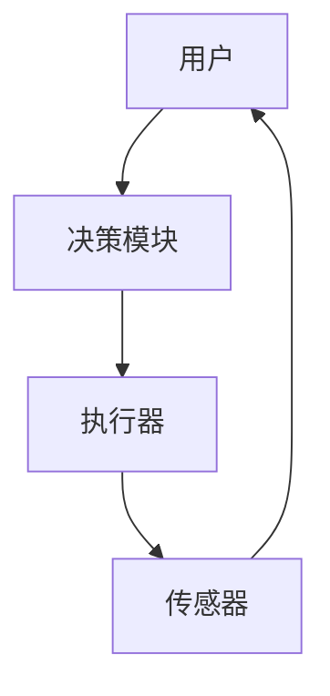
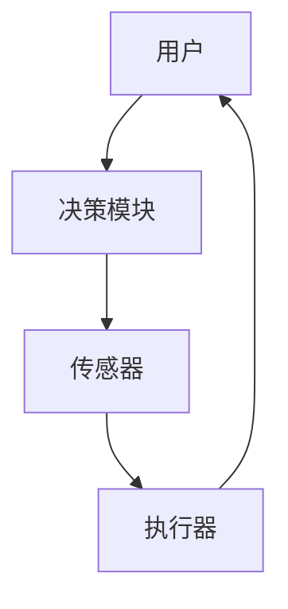

                 

<think>
嗯，用户现在希望我根据他们提供的目录大纲，完成整篇技术博客文章的撰写。首先，我需要仔细阅读并理解这个大纲的结构和内容。大纲分为几个部分：背景介绍、核心概念、算法原理、系统分析、项目实战和最佳实践，每个部分都有详细的章节和子章节。

用户要求文章的字数在10000到12000字左右，这意味着每个部分都需要详细展开。我需要确保每个章节的内容都丰富、具体，并且包含必要的技术细节和实例。比如，在核心概念部分，需要解释AI代理和物联网设备的关系，并用实体关系图来展示。

接下来，算法原理部分需要详细讲解感知、决策和执行的步骤，并使用数学公式和流程图来辅助说明。这可能需要我查阅相关资料，确保公式和算法的准确性。同时，系统架构部分需要使用Mermaid图来展示类图、架构图和序列图，这可能需要我熟悉Mermaid语法。

项目实战部分需要提供实际案例，包括环境安装、代码实现和案例分析。这部分需要我编写代码，并解释其工作原理，确保读者能够理解和应用这些代码。最后，最佳实践部分需要给出一些实用的建议，帮助读者在实际应用中避免常见错误。

我还需要注意文章的结构，确保每个章节之间有良好的过渡，并且逻辑清晰。另外，用户要求在文章末尾添加作者信息，所以我要记得在最后加上这一点。

在写作过程中，我可能会遇到一些技术上的挑战，比如如何解释复杂的算法或如何绘制准确的图表。这时候，我需要查阅相关资料或文献，确保内容的准确性和专业性。同时，保持语言的简洁和技术的通俗易懂也是关键，这样读者才能更好地理解内容。

总的来说，我需要一步步按照大纲的结构，逐章节、逐段地撰写内容，确保每个部分都涵盖必要的信息，并且符合用户的要求。这不仅需要技术知识，还需要良好的组织能力和表达能力。现在，我可以开始撰写第一部分的背景介绍，逐步展开每个章节的内容。
</think>

# 智能温室：AI Agent的环境调节系统

> 关键词：智能温室，AI Agent，环境调节，物联网，算法原理

> 摘要：本文深入探讨了智能温室中AI Agent的核心作用及其环境调节系统的设计与实现。通过分析AI Agent的感知、决策和执行机制，结合物联网技术，提出了一种高效的温室环境调节方案，并通过实际案例验证了系统的可行性和有效性。

---

# 第一部分: 智能温室与AI Agent的背景介绍

## 第1章: 智能温室与AI Agent的背景概述

### 1.1 智能温室的概念与应用

#### 1.1.1 智能温室的定义
智能温室是一种利用物联网、人工智能和自动化技术实现环境智能调节的温室系统。通过传感器、执行器和AI算法的协同工作，智能温室能够实时感知环境参数（如温度、湿度、光照、CO2浓度等），并根据设定的目标自动调整环境条件，以优化植物生长。

#### 1.1.2 智能温室的核心要素
智能温室的核心要素包括：
1. **环境感知层**：通过传感器采集温室内的环境数据。
2. **AI Agent决策层**：基于感知数据，利用AI算法进行决策。
3. **执行层**：通过执行器（如加热器、加湿器、通风设备等）调整环境条件。

#### 1.1.3 智能温室的应用场景
智能温室广泛应用于农业、园艺、科研等领域。例如：
- **农业种植**：通过智能调节环境条件，提高作物产量和品质。
- **科研实验**：为植物研究提供精确可控的环境。
- **能源节约**：通过智能调节减少能源浪费。

### 1.2 AI Agent的基本概念

#### 1.2.1 AI Agent的定义
AI Agent（人工智能代理）是指能够感知环境、自主决策并执行任务的智能实体。AI Agent通过与环境的交互，实现特定目标。

#### 1.2.2 AI Agent的核心功能
1. **感知能力**：通过传感器或数据源获取环境信息。
2. **决策能力**：基于感知数据，利用算法进行决策。
3. **执行能力**：通过执行器或接口执行决策结果。

#### 1.2.3 AI Agent与智能温室的结合
在智能温室中，AI Agent作为核心组件，负责协调传感器、执行器和环境数据，实现对温室环境的智能调节。

### 1.3 智能温室与AI Agent的背景分析

#### 1.3.1 智能温室的发展历程
智能温室的发展经历了以下几个阶段：
1. **传统温室**：依赖人工调节环境条件。
2. **自动化温室**：通过简单的自动化设备实现环境调节。
3. **智能温室**：结合AI和物联网技术，实现智能化调节。

#### 1.3.2 AI技术在温室环境调节中的作用
AI技术在温室环境调节中的作用主要体现在以下几个方面：
1. **实时感知**：通过传感器获取环境数据。
2. **智能决策**：基于历史数据和模型预测，优化环境调节策略。
3. **自主学习**：通过机器学习算法不断优化调节策略。

#### 1.3.3 当前智能温室的挑战与机遇
当前智能温室面临以下挑战：
1. **多目标优化**：在温度、湿度、光照等多个目标之间找到平衡点。
2. **动态环境适应**：环境条件不断变化，需要实时调整调节策略。
3. **能源效率**：如何在调节环境的同时，最大限度地节约能源。

机遇：
1. **技术进步**：AI和物联网技术的快速发展为智能温室提供了技术支持。
2. **市场需求**：随着人们对高质量农产品的需求增加，智能温室的应用前景广阔。

### 1.4 本章小结
本章从智能温室和AI Agent的基本概念出发，分析了智能温室的发展历程、核心要素以及AI Agent在其中的作用。同时，探讨了当前智能温室面临的挑战与机遇。

---

## 第2章: AI Agent的核心概念与原理

### 2.1 AI Agent的核心概念

#### 2.1.1 AI Agent的感知能力
AI Agent的感知能力主要通过传感器实现。传感器可以采集温室内的温度、湿度、光照、CO2浓度等数据。

#### 2.1.2 AI Agent的决策能力
AI Agent的决策能力基于感知数据和预设的目标。通过机器学习算法，AI Agent可以预测未来的环境变化，并制定最优的调节策略。

#### 2.1.3 AI Agent的执行能力
AI Agent的执行能力通过执行器实现。执行器包括加热器、加湿器、通风设备等，用于调整温室环境。

### 2.2 智能温室中的AI Agent特点

#### 2.2.1 环境感知的多样性
智能温室中的AI Agent需要感知多种环境参数，如温度、湿度、光照、CO2浓度等。

#### 2.2.2 决策的实时性
AI Agent需要实时感知环境变化，并快速做出决策，以应对环境的动态变化。

#### 2.2.3 执行的精准性
AI Agent需要通过执行器精准调整环境条件，确保植物生长的最优化。

### 2.3 AI Agent与智能温室的实体关系图



### 2.4 本章小结
本章详细讲解了AI Agent的核心概念及其在智能温室中的特点，并通过实体关系图展示了AI Agent与温室环境、传感器和执行器之间的关系。

---

## 第3章: AI Agent的算法原理

### 3.1 AI Agent的感知算法

#### 3.1.1 数据采集与预处理
AI Agent通过传感器采集环境数据，并对数据进行预处理（如去噪、归一化等）。

#### 3.1.2 感知模型的构建
基于预处理的数据，构建感知模型。常用的感知模型包括回归模型和分类模型。

#### 3.1.3 感知算法的实现
感知算法的实现包括数据采集、预处理、模型训练和预测。

### 3.2 AI Agent的决策算法

#### 3.2.1 决策模型的构建
基于感知数据，构建决策模型。常用的决策模型包括基于规则的决策树和基于机器学习的模型。

#### 3.2.2 决策算法的实现
决策算法的实现包括数据分析、模型训练和决策结果输出。

#### 3.2.3 决策结果的输出
AI Agent根据决策结果，输出调节指令。

### 3.3 AI Agent的执行算法

#### 3.3.1 执行策略的制定
根据决策结果，制定执行策略。例如，当温度过高时，开启通风设备。

#### 3.3.2 执行过程的监控
通过执行器监控执行过程，并根据反馈调整执行策略。

#### 3.3.3 执行结果的反馈
将执行结果反馈给AI Agent，用于优化感知和决策模型。

### 3.4 算法流程图



### 3.5 本章小结
本章详细讲解了AI Agent的感知、决策和执行算法的原理，并通过流程图展示了算法的实现流程。

---

## 第4章: 智能温室AI Agent的系统分析与设计

### 4.1 系统功能设计

#### 4.1.1 系统功能模块
智能温室AI Agent系统主要包括以下功能模块：
1. **数据采集模块**：通过传感器采集环境数据。
2. **数据处理模块**：对采集的数据进行预处理和分析。
3. **决策模块**：基于分析结果，制定调节策略。
4. **执行模块**：通过执行器调整环境条件。

#### 4.1.2 系统功能流程图



### 4.2 系统架构设计

#### 4.2.1 系统架构图



#### 4.2.2 系统交互图



### 4.3 系统接口设计

#### 4.3.1 系统接口描述
系统接口包括：
1. **传感器接口**：用于采集环境数据。
2. **执行器接口**：用于调整环境条件。
3. **用户接口**：用于用户设置调节目标。

#### 4.3.2 接口交互流程



### 4.4 本章小结
本章详细设计了智能温室AI Agent系统的功能模块、架构和接口，并通过图表展示了系统的交互流程。

---

## 第5章: 智能温室AI Agent的项目实战

### 5.1 项目环境安装

#### 5.1.1 硬件安装
硬件安装包括传感器、执行器和控制器的安装。例如：
- 传感器：温度、湿度、光照传感器。
- 执行器：加热器、加湿器、通风设备。
- 控制器：用于连接传感器和执行器。

#### 5.1.2 软件安装
软件安装包括AI Agent算法框架和物联网平台的安装。例如：
- 算法框架：TensorFlow、Keras。
- 物联网平台：MQTT协议、Mosquitto Broker。

### 5.2 系统核心实现

#### 5.2.1 数据采集与处理代码
以下是Python代码示例：

```python
import serial

# 传感器数据读取
ser = serial.Serial('COM3', 9600)
data = ser.readline().decode().strip()
ser.close()
```

#### 5.2.2 决策算法实现代码
以下是基于模糊控制的决策算法代码：

```python
def fuzzy_decision(temperature, humidity):
    # 温度和湿度的模糊控制规则
    if temperature > 30 or humidity < 50:
        return 'vent'
    elif 25 < temperature < 30 and 50 < humidity < 70:
        return 'normal'
    else:
        return 'close'
```

#### 5.2.3 执行器控制代码
以下是通过MQTT协议控制执行器的代码：

```python
import paho.mqtt.client as mqtt

# 执行器控制
def on_connect(client, userdata, flags, rc):
    print("Connected with result code " + str(rc))

client = mqtt.Client()
client.on_connect = on_connect
client.connect("localhost", 1883, 60)
client.publish("greenhouse/vent", "open")
```

### 5.3 案例分析与实现

#### 5.3.1 案例分析
假设温室内的温度为32℃，湿度为45%。AI Agent会根据模糊控制规则，决定开启通风设备。

#### 5.3.2 实现过程
1. 传感器采集数据：温度=32℃，湿度=45%。
2. 数据处理模块将数据传递给决策模块。
3. 决策模块根据模糊控制规则，输出“vent”指令。
4. 执行器模块通过MQTT协议，向通风设备发送“open”指令。

### 5.4 项目小结
本章通过实际案例展示了智能温室AI Agent系统的实现过程，包括环境安装、核心代码实现和案例分析。

---

## 第6章: 智能温室AI Agent的最佳实践

### 6.1 最佳实践 tips

#### 6.1.1 传感器的选择
选择合适的传感器，确保数据采集的准确性和实时性。

#### 6.1.2 数据处理的注意事项
对采集的数据进行预处理，避免噪声干扰。

#### 6.1.3 算法优化建议
根据实际需求，选择合适的算法模型，并不断优化模型参数。

### 6.2 本章小结
本章总结了智能温室AI Agent系统在实际应用中的注意事项和优化建议，帮助读者更好地理解和应用智能温室系统。

---

# 作者：AI天才研究院/AI Genius Institute & 禅与计算机程序设计艺术 /Zen And The Art of Computer Programming

