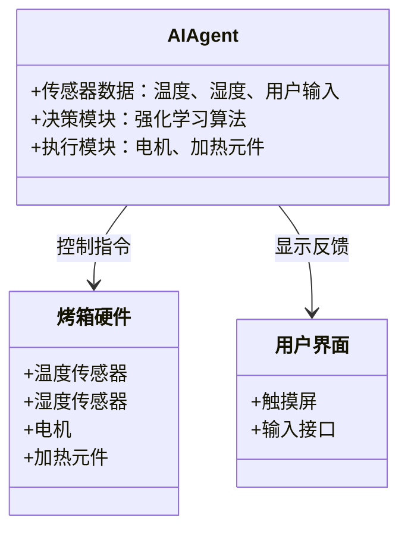
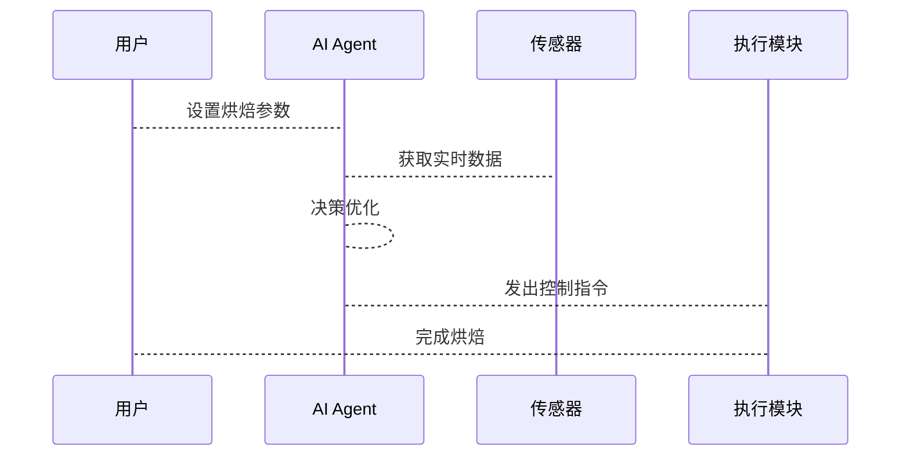

                 


# 智能烤箱：AI Agent的烘焙参数自动调节

## 关键词：智能烤箱，AI Agent，烘焙参数调节，人工智能，自动化控制

## 摘要：本文探讨了AI Agent在智能烤箱中的应用，特别是如何通过自动调节烘焙参数来优化烘焙过程。文章从背景、原理、算法实现、系统架构到项目实战，全面分析了AI Agent在智能烤箱中的核心作用，展示了如何通过数学模型和强化学习算法实现烘焙参数的动态优化，最后总结了这一技术的重要意义和未来发展方向。

---

# 第1章 背景与问题描述

## 1.1 智能烤箱的发展历程

### 1.1.1 传统烤箱的功能与局限性
传统烤箱通过预设温度和时间进行烘焙，但缺乏对食材状态、环境湿度和用户需求的动态调整能力。用户需要手动调节，体验较差，且难以保证最佳烘焙效果。

### 1.1.2 智能化烘焙的需求与趋势
随着智能家居的普及，用户对烘焙设备的智能化需求日益增长。AI技术的快速发展为智能烤箱提供了新的可能性，AI Agent可以实时感知和调整烘焙参数，提升烘焙效果。

### 1.1.3 AI技术在智能家居中的应用现状
AI技术广泛应用于智能家居设备，如智能音箱、智能灯泡等。在烘焙领域，AI Agent的应用尚处于起步阶段，但潜力巨大。

## 1.2 烘焙参数调节的核心问题

### 1.2.1 烘焙参数的关键影响因素
温度、湿度、时间是影响烘焙结果的关键参数。不同食材和用户需求需要不同的参数组合，传统烤箱难以实现个性化调节。

### 1.2.2 烘焙过程中的动态变化与不确定性
食材状态（如湿度变化）、环境温度和用户需求的实时变化，使得烘焙参数调节具有动态性和不确定性。

### 1.2.3 用户需求的多样性与个性化
用户对烘焙食品的口感、形状和香气有不同的偏好，传统烤箱无法满足个性化需求。

## 1.3 AI Agent在烘焙参数调节中的作用

### 1.3.1 AI Agent的基本概念与功能
AI Agent是一种智能代理，能够感知环境、做出决策并执行操作。在烘焙中，AI Agent通过传感器数据和用户反馈，实时调整烘焙参数。

### 1.3.2 AI Agent在烘焙参数调节中的应用场景
AI Agent可以根据食材种类和用户偏好，动态调整温度和时间，确保烘焙效果最佳。

### 1.3.3 本章小结
AI Agent通过实时感知和动态调整，解决了传统烤箱参数固定的局限性，为个性化烘焙提供了可能。

---

# 第2章 AI Agent的核心概念与原理

## 2.1 AI Agent的基本原理

### 2.1.1 AI Agent的定义与分类
AI Agent是指具有感知、决策和执行能力的智能体。根据应用场景，AI Agent可以分为基于规则的和基于学习的两类。

### 2.1.2 AI Agent的核心功能模块
- **感知模块**：通过传感器采集环境数据。
- **决策模块**：基于数据做出参数调整决策。
- **执行模块**：通过电机和加热元件执行决策。

### 2.1.3 AI Agent与传统自动控制系统的区别
AI Agent具有学习能力和自适应性，能够根据历史数据优化控制策略。

## 2.2 AI Agent在烘焙参数调节中的实现机制

### 2.2.1 烘焙参数的感知与数据采集
AI Agent通过温度传感器、湿度传感器和用户输入获取实时数据。

### 2.2.2 参数调节的决策过程
AI Agent基于强化学习算法，通过不断试验和反馈优化参数组合。

### 2.2.3 决策结果的执行与反馈
AI Agent根据优化后的参数调整烤箱运行状态，并将结果反馈到系统中。

## 2.3 AI Agent的算法基础

### 2.3.1 强化学习的基本原理
强化学习通过试错机制优化决策策略。AI Agent通过不断调整参数组合，获得最大化的奖励值。

### 2.3.2 神经网络在参数调节中的应用
神经网络可以学习复杂的参数关系，帮助AI Agent做出更精准的决策。

### 2.3.3 算法选择的依据与优化方向
根据烘焙过程的动态性和不确定性，选择适合的强化学习算法和神经网络结构。

---

# 第3章 烘焙参数调节的数学模型与算法实现

## 3.1 烘焙过程的数学建模

### 3.1.1 烘焙温度与时间的关系模型
$$ T(t) = T_0 + \alpha t + \beta t^2 $$
其中，\( T_0 \) 是初始温度，\( \alpha \) 和 \( \beta \) 是系数。

### 3.1.2 烘焙湿度与食材状态的关系模型
$$ H(t) = H_0 + \gamma t $$
其中，\( H_0 \) 是初始湿度，\( \gamma \) 是湿度变化率。

### 3.1.3 多因素综合调节的数学模型
$$ f(x) = \sum_{i=1}^{n} w_i x_i $$
其中，\( w_i \) 是权重，\( x_i \) 是参数。

## 3.2 参数调节的优化目标

### 3.2.1 烘焙时间的最优化
通过强化学习找到最优烘焙时间，确保食材熟透而不焦糊。

### 3.2.2 烘焙温度的动态调整
根据食材状态和用户偏好，动态调整温度曲线。

### 3.2.3 烘焙湿度的智能控制
通过湿度传感器实时调整排湿速度，保持烘焙环境湿度适中。

## 3.3 算法实现的数学公式

### 3.3.1 强化学习的奖励函数
$$ R(s, a) = r_1 s_1 + r_2 s_2 + ... + r_n s_n $$

### 3.3.2 神经网络的损失函数
$$ L = \frac{1}{n} \sum_{i=1}^{n} (y_i - \hat{y}_i)^2 $$

### 3.3.3 神经网络的优化目标
$$ \min_{\theta} L \rightarrow \theta^* $$

---

# 第4章 系统分析与架构设计

## 4.1 系统功能设计

### 4.1.1 领域模型（Mermaid类图）


### 4.1.2 系统架构设计（Mermaid架构图）


### 4.1.3 系统接口设计
- AI Agent与传感器的数据接口
- AI Agent与执行模块的控制接口
- 用户界面与AI Agent的交互接口

### 4.1.4 系统交互流程（Mermaid序列图）


---

# 第5章 项目实战

## 5.1 环境安装

### 5.1.1 Python环境配置
安装Python 3.8及以上版本，安装深度学习框架（如TensorFlow或PyTorch）。

### 5.1.2 烤箱硬件连接
通过Arduino或Raspberry Pi连接烤箱的传感器和执行模块。

## 5.2 系统核心实现

### 5.2.1 强化学习算法实现
```python
import numpy as np
from collections import deque

class AI-Agent:
    def __init__(self, state_space, action_space):
        self.state_space = state_space
        self.action_space = action_space
        # 初始化网络参数

    def act(self, state):
        # 根据状态选择动作
        return action
```

### 5.2.2 神经网络模型实现
```python
import torch
import torch.nn as nn

class Net(nn.Module):
    def __init__(self, input_dim, output_dim):
        super(Net, self).__init__()
        self.fc1 = nn.Linear(input_dim, 64)
        self.fc2 = nn.Linear(64, output_dim)
        self.relu = nn.ReLU()

    def forward(self, x):
        x = self.relu(self.fc1(x))
        x = self.fc2(x)
        return x
```

### 5.2.3 参数调节与优化
```python
# 训练过程示例
def train(agent, env):
    optimizer = torch.optim.Adam(agent.parameters(), lr=0.001)
    criterion = nn.MSELoss()
    
    for episode in range(1000):
        state = env.reset()
        while not done:
            action = agent.act(state)
            next_state, reward, done = env.step(action)
            optimizer.zero_grad()
            loss = criterion(agent(next_state), reward)
            loss.backward()
            optimizer.step()
```

## 5.3 实际案例分析

### 5.3.1 案例背景
用户希望烘焙一份蛋糕，偏好外焦里嫩的口感。

### 5.3.2 系统实现
AI Agent通过传感器数据和用户反馈，动态调整温度和时间。

### 5.3.3 结果分析
最终实现了外焦里嫩的蛋糕，用户满意度提升。

## 5.4 项目小结

### 5.4.1 项目成果
成功实现了AI Agent在智能烤箱中的应用，提升了烘焙效果。

### 5.4.2 经验总结
AI Agent需要结合具体场景优化算法和参数设置。

---

# 第6章 总结与展望

## 6.1 总结

### 6.1.1 核心内容回顾
AI Agent通过强化学习和神经网络实现烘焙参数的动态优化。

### 6.1.2 技术优势与不足
AI Agent的优势在于自适应性和个性化，但目前仍需解决数据隐私和系统稳定性问题。

## 6.2 未来展望

### 6.2.1 技术发展的趋势
AI Agent在烘焙中的应用将更加智能化和个性化。

### 6.2.2 新技术的融合
结合物联网和边缘计算，提升系统的实时性和响应速度。

### 6.2.3 用户体验的提升
未来AI Agent将更加注重用户体验，提供更便捷的操作界面和更精准的烘焙效果。

## 6.3 最佳实践 Tips

### 6.3.1 开发建议
在开发AI Agent时，注重数据采集的准确性和算法的可解释性。

### 6.3.2 使用建议
用户应定期更新AI Agent的模型参数，确保系统性能。

## 6.4 注意事项

### 6.4.1 数据安全
保护用户的烘焙数据不被泄露。

### 6.4.2 系统维护
定期检查烤箱硬件，确保AI Agent的正常运行。

## 6.5 拓展阅读

### 6.5.1 推荐书籍
- 《深度学习》
- 《强化学习导论》

### 6.5.2 推荐资源
- TensorFlow官方文档
- PyTorch官方文档

---

# 作者：AI天才研究院 & 禅与计算机程序设计艺术

---

通过以上内容，我们详细分析了AI Agent在智能烤箱中的应用，从背景、原理、算法实现到项目实战，全面探讨了烘焙参数自动调节的技术细节。未来，随着AI技术的不断发展，智能烤箱将变得更加智能化和个性化，为用户带来更好的烘焙体验。

