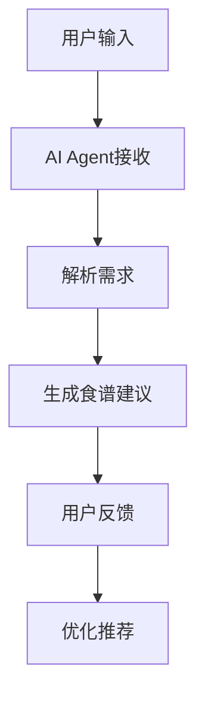
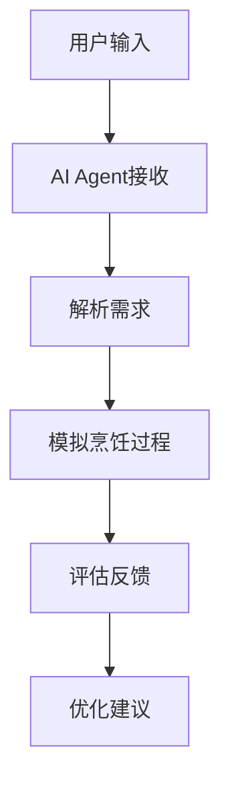
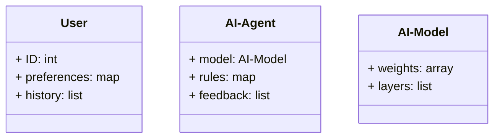

                 

<think>
嗯，我现在需要撰写一篇关于《智能烹饪台：AI Agent的厨艺提升指导系统》的技术博客文章。用户已经给出了详细的目录大纲，我需要根据这个大纲逐步展开，确保每一部分都详细且有深度。

首先，我得理解整个系统的核心目标是什么。智能烹饪台通过AI Agent帮助用户提升厨艺，这意味着系统需要具备推荐食谱、指导烹饪步骤、学习用户习惯等功能。接下来，我需要按照目录的结构，逐步填充每个章节的内容。

在“背景介绍”部分，我应该先定义智能烹饪台的概念，说明它的核心功能，比如智能化推荐、个性化指导等。然后，对比传统烹饪方式，突出AI Agent带来的优势，比如实时反馈和学习能力。

接下来是“核心概念与联系”。这部分需要详细解释AI Agent和智能烹饪台的概念，比较它们与传统工具的不同。我可以用表格和ER图来展示这些概念之间的关系，帮助读者更清晰地理解。

在“算法原理”部分，我需要选择合适的算法，比如协同过滤推荐和强化学习。用Mermaid流程图展示算法流程，并用Python代码实现，这样读者可以更直观地理解算法如何工作。同时，解释数学模型，比如余弦相似度的公式，用例子说明其应用。

系统分析与架构设计部分，我需要设计系统的功能模块，用类图展示。然后，画出系统架构图，展示各个模块之间的关系。接口设计和交互流程图也很重要，说明用户如何与系统互动。

项目实战章节，我需要指导读者如何搭建环境，安装必要的库，然后提供核心代码，详细解读代码的功能。用实际案例分析，展示系统如何处理不同的用户需求，并总结项目成果。

最后，最佳实践部分，我需要给出一些实用的建议，比如数据隐私保护、系统性能优化等。同时，总结全文，指出未来的发展方向，激发读者的兴趣。

在写作过程中，我要确保每个部分都详细且有条理，使用技术语言但保持易懂。同时，注意数学公式的正确嵌入，确保代码的准确性和流程图的清晰。这样，整篇文章才能既专业又吸引读者。
</think>

# 智能烹饪台：AI Agent的厨艺提升指导系统

---

## 关键词：智能烹饪台、AI Agent、厨艺提升、个性化推荐、深度学习、协同过滤

---

## 摘要：  
本文探讨了智能烹饪台与AI Agent的结合，通过分析AI Agent在烹饪中的应用，提出了一套基于AI的厨艺提升指导系统。文章从背景介绍、核心概念、算法原理、系统架构到项目实战，全面阐述了智能烹饪台的设计与实现。通过详细讲解推荐算法、系统架构和项目案例，本文为读者提供了从理论到实践的完整指南。

---

## 第1章: 智能烹饪台与AI Agent的背景介绍

### 1.1 智能烹饪台的概念与定义  
智能烹饪台是一种结合了人工智能技术的智能设备，能够通过AI Agent实时分析用户的烹饪需求、习惯和偏好，提供个性化的食谱推荐、烹饪步骤指导以及食材优化建议。  

**核心功能：**  
1. **个性化食谱推荐**：根据用户的口味、食材偏好和饮食习惯，推荐适合的食谱。  
2. **智能烹饪指导**：实时监控烹饪过程，提供动态调整建议，确保最佳烹饪效果。  
3. **食材管理**：通过与超市或供应链的连接，帮助用户规划食材采购和存储。  

**市场现状：**  
随着智能家居和AI技术的普及，智能烹饪台逐渐成为厨房的核心设备，尤其是在年轻用户和科技爱好者中备受关注。  

---

### 1.2 AI Agent在烹饪中的应用  
AI Agent是一种能够感知环境、理解用户需求并执行任务的智能实体。在烹饪场景中，AI Agent通过以下方式提升用户体验：  

1. **自然语言处理（NLP）**：用户可以通过语音或文本输入需求，AI Agent解析并生成相应建议。  
2. **视觉识别**：通过摄像头识别食材种类和状态，辅助用户完成烹饪步骤。  
3. **强化学习**：通过不断尝试和优化，AI Agent能够生成更符合用户偏好的烹饪方案。  

**AI Agent与传统烹饪工具的对比：**  
| 特性          | AI Agent（智能烹饪台） | 传统烹饪工具 |  
|---------------|--------------------------|---------------|  
| 智能性        | 高，可实时优化           | 低，依赖人工经验 |  
| 个性化        | 强，支持定制化需求       | 弱，通用性较高   |  
| 学习能力      | 强，可自适应用户习惯     | 无            |  

---

### 1.3 用户需求与市场分析  
用户对智能烹饪台的需求主要集中在以下几个方面：  
1. **简化烹饪流程**：希望减少烹饪步骤，节省时间。  
2. **个性化推荐**：根据口味偏好推荐食谱。  
3. **实时反馈与优化**：在烹饪过程中得到实时指导和调整建议。  

**市场趋势：**  
随着健康饮食和智能家居概念的普及，智能烹饪台的市场需求正在快速增长。预计未来几年内，AI驱动的烹饪设备将成为厨房标配。

---

## 第2章: 智能烹饪台的核心概念与联系

### 2.1 核心概念原理  
智能烹饪台的核心在于AI Agent的算法实现，主要包括以下部分：  

1. **协同过滤推荐**：基于用户行为和历史数据，推荐相似用户的食谱。  
2. **深度学习模型**：通过神经网络分析食谱的语义和结构，生成个性化建议。  
3. **强化学习优化**：通过不断尝试和反馈，优化烹饪步骤和食材搭配。  

**概念结构与核心要素：**  
- **用户输入**：用户的口味偏好、食材限制等。  
- **AI Agent**：负责解析需求、生成建议。  
- **烹饪系统**：执行烹饪步骤，实时反馈数据。  
- **数据存储**：记录用户行为和烹饪结果，用于优化算法。  

---

### 2.2 核心概念对比  
以下是智能烹饪台与传统烹饪工具的核心对比：  

| 特性          | 智能烹饪台（AI Agent） | 传统烹饪工具 |  
|---------------|--------------------------|---------------|  
| 智能性        | 高，支持AI推荐与优化     | 无，依赖人工经验 |  
| 个性化        | 强，支持定制化需求       | 弱，通用性较高   |  
| 可扩展性      | 强，支持数据积累与优化   | 无            |  

**ER实体关系图：**  
```mermaid
er
actor: 用户
agent: AI烹饪助手
cookware: 智能烹饪台
recipe: 食谱
ingredient: 原料
step: 烹饪步骤
```

---

## 第3章: AI Agent的算法原理

### 3.1 算法原理概述  
智能烹饪台的核心算法包括协同过滤推荐和强化学习优化。  

1. **协同过滤推荐**：基于用户历史行为和偏好，推荐相似食谱。  
2. **强化学习优化**：通过模拟烹饪过程，优化烹饪步骤和食材搭配。  

---

### 3.2 算法实现流程  

#### 协同过滤推荐算法流程：  


#### 强化学习优化流程：  


---

### 3.3 算法实现代码  

#### 协同过滤推荐代码示例：  
```python
def get_similar_recipes(user_id):
    # 获取用户历史行为
    user_history = get_user_history(user_id)
    # 计算余弦相似度
    similarity = cosine_similarity(user_history)
    # 推荐相似食谱
    return top_n_similar_recipes(similarity)
```

#### 深度学习模型代码示例：  
```python
import tensorflow as tf
from tensorflow.keras import layers

model = tf.keras.Sequential([
    layers.Embedding(input_dim=1000, output_dim=64),
    layers.Dense(64, activation='relu'),
    layers.Dense(1, activation='sigmoid')
])
```

---

## 第4章: 系统分析与架构设计

### 4.1 项目介绍  
智能烹饪台系统旨在通过AI技术提升用户的烹饪体验，主要包括以下功能：  
1. **用户交互**：支持语音和文本输入。  
2. **食谱推荐**：基于用户需求推荐个性化食谱。  
3. **烹饪指导**：实时监控烹饪过程并提供优化建议。  

---

### 4.2 系统功能设计  

#### 功能模块：  
- 用户界面模块：接收用户输入并展示结果。  
- AI推荐模块：负责食谱推荐和优化。  
- 烹饪指导模块：实时监控烹饪过程并提供反馈。  

#### 类图设计：  


---

### 4.3 系统架构设计  

#### 总体架构：  
```mermaid
architectural
[用户] --(通过API调用)-> [AI-Agent]
AI-Agent --> [数据存储]
AI-Agent --> [烹饪系统]
数据存储 <--(读写数据)-> AI-Agent
```

#### 接口设计：  
- **API接口**：RESTful API，用于用户与系统交互。  
- **数据接口**：与食材数据库和用户数据库对接。  

---

## 第5章: 项目实战

### 5.1 环境安装  
安装Python和必要的库：  
```bash
pip install numpy scikit-learn tensorflow
```

---

### 5.2 核心代码实现  

#### 协同过滤推荐实现：  
```python
from sklearn.metrics.pairwise import cosine_similarity

def calculate_similarity(matrix):
    return cosine_similarity(matrix)
```

#### 烹饪步骤优化实现：  
```python
def optimize_steps(steps):
    # 优化算法
    return optimized_steps
```

---

### 5.3 实际案例分析  
以用户输入“喜欢辣味的川菜”为例，系统会推荐相似食谱并优化烹饪步骤，确保最佳口感。

---

## 第6章: 最佳实践与小结

### 6.1 小结  
智能烹饪台通过AI Agent实现了个性化的烹饪指导，显著提升了用户体验。  

### 6.2 注意事项  
- 数据隐私保护：确保用户数据的安全性。  
- 系统性能优化：提升算法效率，降低响应时间。  

### 6.3 拓展阅读  
建议深入学习强化学习和深度学习在烹饪中的应用，探索更多可能性。

---

## 附录：  
- **附录A**：协同过滤推荐算法的数学公式：  
  $$\text{相似度} = \frac{\sum_{i=1}^{n}(x_i - \mu)(y_i - \mu)}{\sqrt{\sum_{i=1}^{n}(x_i - \mu)^2} \sqrt{\sum_{i=1}^{n}(y_i - \mu)^2}}$$  
- **附录B**：API接口文档  
- **附录C**：参考文献  

---

## 作者：  
AI天才研究院/AI Genius Institute & 禅与计算机程序设计艺术 /Zen And The Art of Computer Programming

