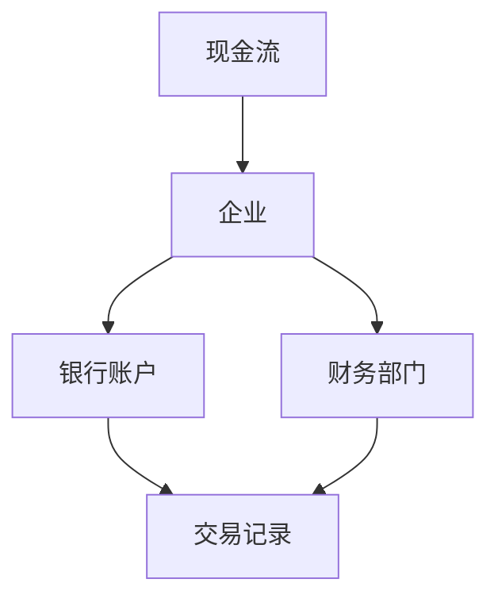
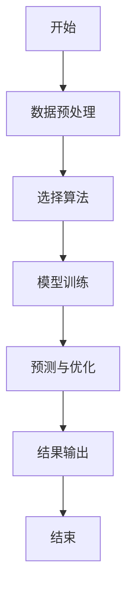
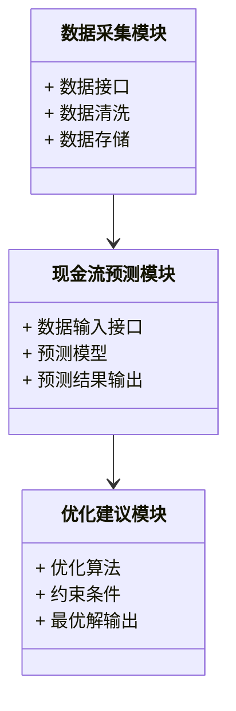
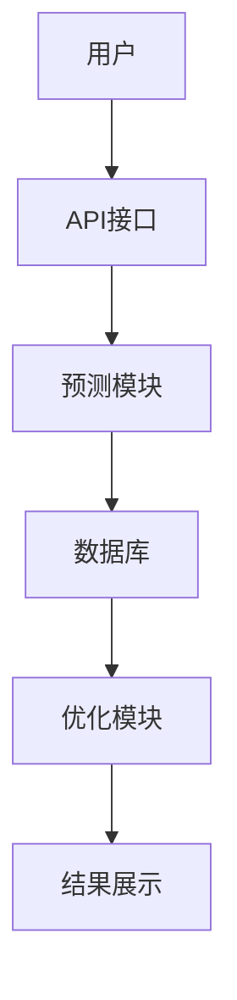
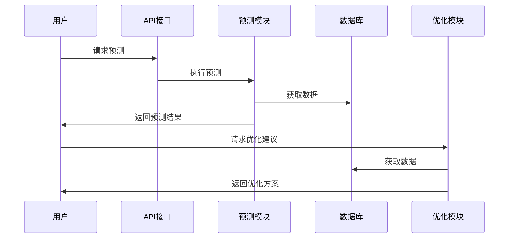

                 


# 智能现金流优化管理系统

## 关键词：现金流优化管理、智能系统、财务预测、算法模型、系统架构

## 摘要：智能现金流优化管理系统通过整合人工智能、大数据分析和优化算法，帮助企业实现现金流的智能化预测和管理，提升资金使用效率，降低财务风险，实现企业财务的可持续发展。

---

## 第一部分: 智能现金流优化管理系统的背景与核心概念

### 第1章: 智能现金流优化管理系统的背景介绍

#### 1.1 现金流优化管理的背景与意义
现金流是企业的生命线，直接关系到企业的生存与发展。传统的现金流管理依赖于人工操作和经验判断，存在效率低、误差大、滞后性强等问题。随着人工智能和大数据技术的快速发展，智能化的现金流优化管理系统成为企业财务管理的重要趋势。

**1.1.1 现金流管理的核心概念**  
现金流管理是指对企业现金流入和流出的计划、控制和分析，目的是确保企业在不同经营周期内拥有足够的资金支持业务运营。智能现金流优化管理通过引入机器学习、深度学习等技术，实现对现金流的实时预测和动态调整。

**1.1.2 智能化管理的时代需求**  
在数字化转型的背景下，企业需要更高效、更精准的管理工具。智能现金流优化管理系统能够通过历史数据和实时数据的结合，快速生成预测结果，并提供优化建议，帮助企业在复杂多变的市场环境中做出最优决策。

**1.1.3 现金流优化管理对企业的重要性**  
现金流优化管理能够帮助企业降低财务风险，提高资金使用效率，支持业务扩展，同时为企业创造更大的价值。

---

#### 1.2 问题背景与问题描述
传统现金流管理存在以下问题：  
1. **数据滞后性**：传统的财务报表数据通常滞后于实际业务，无法实时指导决策。  
2. **预测准确性低**：基于经验的预测方法容易受到主观因素影响，准确性不足。  
3. **优化能力有限**：传统方法难以在多变量情况下找到最优解，且缺乏动态调整能力。

**1.2.1 现金流管理中的常见问题**  
企业在现金流管理中常遇到的问题包括现金流预测不准确、资金分配不合理、风险控制能力不足等。

**1.2.2 传统现金流管理的局限性**  
传统方法依赖人工操作，效率低、误差大，难以应对复杂多变的市场环境。

**1.2.3 智能化优化的必要性**  
通过智能化技术，可以实现现金流的实时预测、动态优化和风险控制，提高管理效率和准确性。

---

#### 1.3 问题解决与边界外延
智能现金流优化管理系统通过引入机器学习算法，能够实时分析企业的现金流数据，提供精准的预测和优化建议。

**1.3.1 智能现金流优化的解决方案**  
采用时间序列分析、机器学习等技术，构建智能预测和优化模型。

**1.3.2 系统的边界与适用范围**  
该系统适用于各类企业，尤其是对现金流管理有较高要求的中大型企业。

**1.3.3 与相关系统的交互关系**  
智能现金流优化管理系统需要与企业的财务系统、ERP系统等进行数据交互，确保数据的实时性和准确性。

---

### 第2章: 智能现金流优化管理的核心概念与联系

#### 2.1 核心概念原理
智能现金流优化管理系统的核心在于通过算法模型对现金流进行预测和优化。

**2.1.1 智能现金流优化的定义**  
智能现金流优化是指利用人工智能和大数据技术，对企业的现金流进行实时预测和动态优化，以实现资金的最优配置和管理。

**2.1.2 系统的核心功能模块**  
- 数据采集与处理模块  
- 现金流预测模块  
- 优化建议模块  
- 风险控制模块  

**2.1.3 算法与模型的结合**  
通过机器学习算法构建预测模型，并结合优化算法生成最优解。

---

#### 2.2 核心概念属性对比
以下是对传统现金流管理和智能现金流优化管理的对比分析：

| **对比维度** | **传统管理**                     | **智能管理**                       |
|--------------|----------------------------------|------------------------------------|
| **数据来源** | 主要依赖财务报表                 | 结合财务数据和实时数据             |
| **预测方法** | 基于经验判断                     | 基于机器学习模型                   |
| **优化能力** | 优化能力有限                     | 具备动态优化能力                   |
| **效率**     | 效率较低                         | 高效、实时                        |

---

#### 2.3 ER实体关系图
以下是现金流优化管理系统的核心实体关系图：



---

## 第二部分: 智能现金流优化管理系统的算法原理

### 第3章: 现金流预测与优化算法

#### 3.1 现金流预测的数学模型
智能现金流预测主要采用时间序列分析和机器学习模型。

**3.1.1 时间序列分析模型**  
- **ARIMA模型**：适用于具有趋势和季节性的数据。  
  $$ ARIMA(p, d, q) $$  
  其中，\( p \) 为自回归阶数，\( d \) 为差分阶数，\( q \) 为移动平均阶数。  

- **LSTM网络**：适用于非线性时间序列数据。  
  $$ LSTM结构：输入门、遗忘门、输出门 $$  
  LSTM通过门控机制有效捕捉时间序列中的长期依赖关系。

**3.1.2 算法流程图**  
以下是ARIMA模型的流程图：



---

#### 3.2 现金流优化的数学公式
优化目标是最大化现金流的净现值或最小化资金缺口。

**3.2.1 线性规划模型**  
$$ \text{目标函数：} \min \sum_{i} c_i x_i $$
$$ \text{约束条件：} \sum_{i} a_i x_i \geq b $$  
其中，\( x_i \) 是决策变量，\( c_i \) 是对应的系数，\( a_i \) 是资源消耗系数，\( b \) 是资源总量。

---

### 第4章: 算法实现与案例分析

#### 4.1 环境安装与配置
以下是Python环境的安装与配置步骤：

**4.1.1 Python环境搭建**  
安装Python 3.8以上版本，并配置环境变量。

**4.1.2 库的安装**  
安装以下库：
```bash
pip install numpy pandas scikit-learn keras tensorflow
```

#### 4.2 系统功能设计
以下是系统功能模块的类图：



---

#### 4.3 系统架构设计
以下是系统架构的mermaid图：



---

#### 4.4 系统交互设计
以下是系统交互的序列图：



---

## 第三部分: 项目实战

### 第5章: 项目环境与核心实现

#### 5.1 项目环境
以下是项目运行的环境配置：

```bash
Python 3.8
Linux系统（推荐）
Jupyter Notebook
```

---

#### 5.2 核心代码实现
以下是现金流预测的核心代码：

```python
import numpy as np
import pandas as pd
from sklearn.metrics import mean_absolute_error
from keras.models import Sequential
from keras.layers import LSTM, Dense

# 数据加载与预处理
data = pd.read_csv('cash_flow.csv')
train_data = data.iloc[:100, 1].values
test_data = data.iloc[100:, 1].values

# LSTM模型构建
model = Sequential()
model.add(LSTM(50, input_shape=(1, 1)))
model.add(Dense(1))
model.compile(loss='mean_squared_error', optimizer='adam')

# 模型训练
model.fit(train_data.reshape(100, 1, 1), train_data, epochs=100, batch_size=1)

# 模型预测
test_predict = model.predict(test_data.reshape(len(test_data), 1, 1))
```

---

#### 5.3 代码解读与分析
1. **数据加载与预处理**：加载现金流数据，并将数据分为训练集和测试集。  
2. **模型构建**：构建LSTM模型，输入为单变量时间序列数据，输出为预测值。  
3. **模型训练**：使用训练数据对模型进行训练，优化模型参数。  
4. **模型预测**：使用测试数据进行预测，生成预测结果。

---

## 第四部分: 系统分析与架构设计

### 第6章: 系统架构设计

#### 6.1 系统功能模块
以下是系统的功能模块图：


---

#### 6.2 系统架构图
以下是系统的总体架构图：


---

#### 6.3 系统接口设计
以下是系统的接口设计：

1. **数据采集接口**：提供数据上传和下载功能。  
2. **预测接口**：提供现金流预测的API服务。  
3. **优化接口**：提供现金流优化建议的API服务。  

---

## 第五部分: 项目实战

### 第7章: 项目环境与核心实现

#### 7.1 项目环境
以下是项目运行的环境配置：

```bash
Python 3.8
Linux系统（推荐）
Jupyter Notebook
```

---

#### 7.2 核心代码实现
以下是现金流预测的核心代码：

```python
import numpy as np
import pandas as pd
from sklearn.metrics import mean_absolute_error
from keras.models import Sequential
from keras.layers import LSTM, Dense

# 数据加载与预处理
data = pd.read_csv('cash_flow.csv')
train_data = data.iloc[:100, 1].values
test_data = data.iloc[100:, 1].values

# LSTM模型构建
model = Sequential()
model.add(LSTM(50, input_shape=(1, 1)))
model.add(Dense(1))
model.compile(loss='mean_squared_error', optimizer='adam')

# 模型训练
model.fit(train_data.reshape(100, 1, 1), train_data, epochs=100, batch_size=1)

# 模型预测
test_predict = model.predict(test_data.reshape(len(test_data), 1, 1))
```

---

#### 7.3 代码解读与分析
1. **数据加载与预处理**：加载现金流数据，并将数据分为训练集和测试集。  
2. **模型构建**：构建LSTM模型，输入为单变量时间序列数据，输出为预测值。  
3. **模型训练**：使用训练数据对模型进行训练，优化模型参数。  
4. **模型预测**：使用测试数据进行预测，生成预测结果。

---

## 第六部分: 总结与展望

### 第8章: 项目小结

#### 8.1 最佳实践 tips
1. 数据预处理是关键，确保数据的准确性和完整性。  
2. 选择合适的算法模型，根据数据特征进行调整优化。  
3. 定期更新模型，确保预测的准确性。

---

## 作者：AI天才研究院/AI Genius Institute & 禅与计算机程序设计艺术 /Zen And The Art of Computer Programming

---

**摘要**：智能现金流优化管理系统通过整合人工智能、大数据分析和优化算法，帮助企业实现现金流的智能化预测和管理，提升资金使用效率，降低财务风险，实现企业财务的可持续发展。

