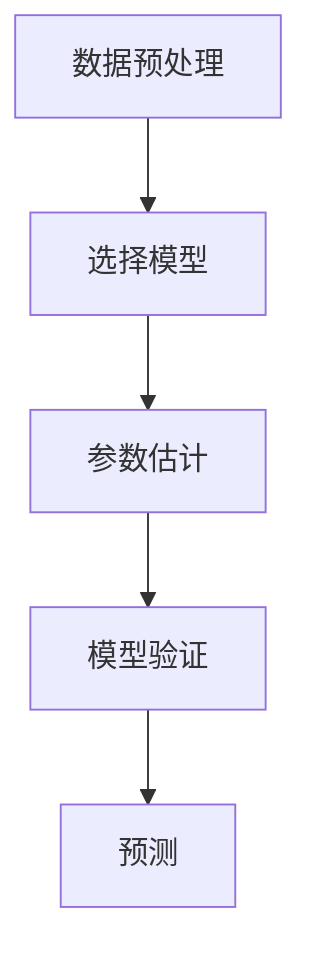
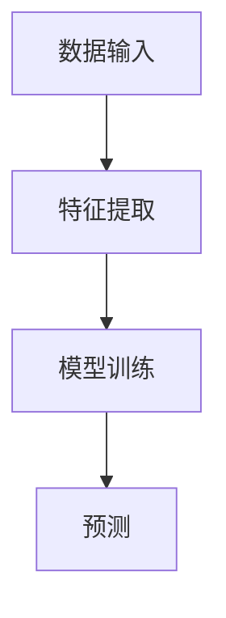
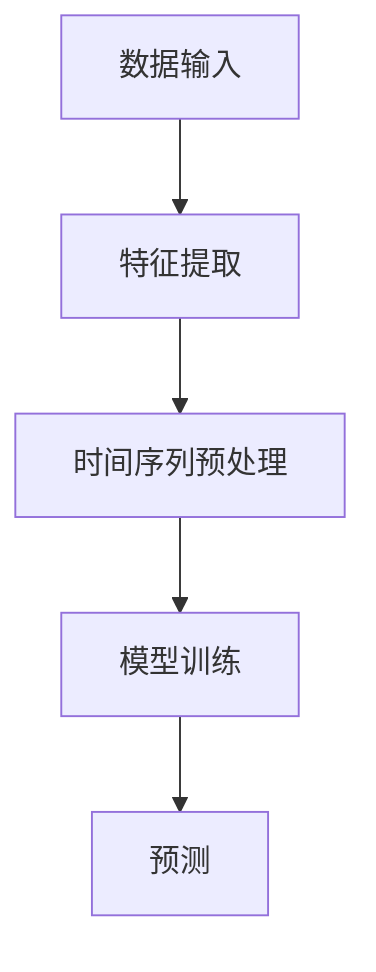
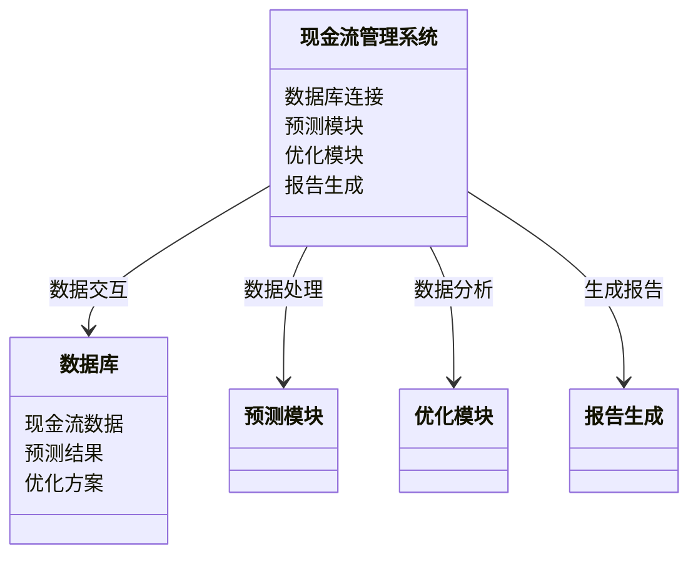
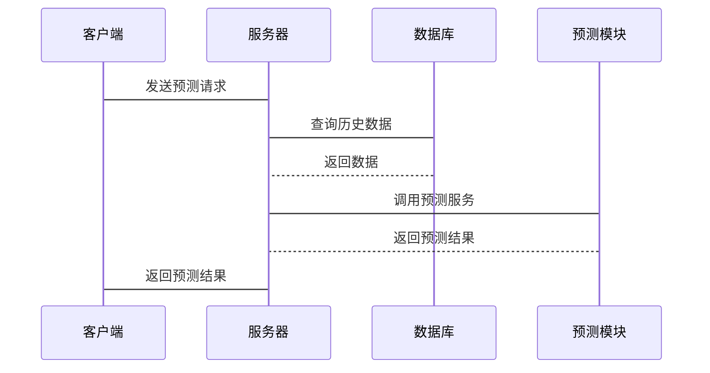

                 


# 智能现金流管理系统

## 关键词：智能现金流管理, 机器学习, 时间序列分析, 系统架构设计, 项目实战

## 摘要：智能现金流管理系统通过整合机器学习和时间序列分析技术，实现对企业现金流的精准预测与优化。本文将从现金流管理的背景与意义入手，详细阐述智能系统的算法原理、系统架构设计及项目实战，帮助读者全面理解并掌握智能现金流管理的核心技术与实践方法。

---

# 第一部分: 智能现金流管理系统的背景与概述

## 第1章: 智能现金流管理系统的背景与意义

### 1.1 现金流管理的重要性

#### 1.1.1 现金流在企业运营中的核心地位
现金流是企业运营的血液，直接关系到企业的生存与发展。健康的现金流管理能够确保企业在日常运营中的支付能力，同时为企业扩展和投资提供资金支持。传统现金流管理依赖于人工操作和经验判断，容易受到主观因素和外部环境的干扰，难以满足现代企业对高效、精准管理的需求。

#### 1.1.2 传统现金流管理的局限性
- 数据处理能力有限：传统方法难以处理海量数据，无法捕捉复杂的市场变化。
- 预测精度不足：基于历史数据的简单外推容易导致预测偏差。
- 缺乏实时性：传统方法通常以固定周期进行预测，难以适应市场波动的实时性需求。

#### 1.1.3 智能化现金流管理的必要性
随着人工智能和大数据技术的发展，智能化现金流管理成为必然趋势。通过引入机器学习和深度学习算法，智能系统能够实时分析海量数据，提高预测精度，优化资金分配，降低企业风险。

### 1.2 智能现金流管理系统的定义与特点

#### 1.2.1 智能现金流管理系统的定义
智能现金流管理系统是一种结合人工智能技术的财务管理系统，通过自动化数据采集、智能预测和优化决策，实现对企业现金流的实时监控和精准管理。

#### 1.2.2 智能系统的核心特点
- **数据驱动**：基于海量历史数据和实时数据，进行深度分析。
- **实时性**：能够实时更新预测结果，适应市场变化。
- **自动化**：从数据采集到预测分析，实现全流程自动化。
- **精准性**：通过机器学习算法提高预测精度，降低误差。

#### 1.2.3 与传统系统的区别与优势
- **区别**：传统系统依赖人工操作，智能系统实现自动化和智能化。
- **优势**：提高预测精度，降低人为误差，增强实时性和灵活性。

### 1.3 智能现金流管理系统的应用前景

#### 1.3.1 系统的潜在应用场景
- 企业财务预测
- 投资决策支持
- 资金调度优化
- 风险预警与控制

#### 1.3.2 企业采用智能系统的潜力
- 提高资金使用效率
- 降低财务风险
- 提升决策效率
- 增强市场竞争力

#### 1.3.3 系统应用的挑战与机遇
- **挑战**：数据隐私、模型优化、技术门槛。
- **机遇**：技术进步、市场需求、政策支持。

### 1.4 本章小结
本章介绍了智能现金流管理系统的背景、重要性及核心特点，为后续章节的深入分析奠定了基础。

---

# 第二部分: 智能现金流管理的核心概念与联系

## 第2章: 智能现金流管理的核心概念

### 2.1 现金流分类与属性特征

#### 2.1.1 现金流的分类
现金流可以分为以下几类：
- **经营活动现金流**：企业日常经营活动中产生的现金流。
- **投资活动现金流**：企业投资活动产生的现金流。
- **筹资活动现金流**：企业筹资活动产生的现金流。

#### 2.1.2 各类现金流的属性对比
| 类型            | 来源                          | 特点                          |
|-----------------|-------------------------------|-------------------------------|
| 经营活动现金流 | 日常销售和采购                | 占主导地位，波动较大         |
| 投资活动现金流 | 资产购买和出售                | 数量有限，波动较大           |
| 筹资活动现金流 | 股票和债券发行、贷款等        | 数量相对固定，波动较小       |

#### 2.1.3 现金流分类的特征表格
如表2-1所示，经营活动现金流是企业现金流的主要来源，投资活动现金流波动较大，筹资活动现金流相对固定。

### 2.2 现金流管理的实体关系

#### 2.2.1 实体关系图（ER图）
```mermaid
erDiagram
    actor 用户
    actor 管理员
    actor 系统
    database 数据库
    system 现金流管理系统
    用户 --> 系统 : 使用系统
    管理员 --> 系统 : 管理系统
    系统 --> 数据库 : 存储数据
```

#### 2.2.2 实体间的关系描述
- **用户**：系统的主要使用者，包括财务人员和决策者。
- **管理员**：负责系统配置和权限管理。
- **系统**：智能现金流管理系统，实现数据采集、预测、优化和报告生成。
- **数据库**：存储现金流相关数据，包括历史数据、预测数据等。

---

## 第3章: 现金流预测与优化的算法原理

### 3.1 时间序列分析

#### 3.1.1 时间序列分析的原理
时间序列分析是一种基于历史数据预测未来趋势的方法。其核心思想是通过分析数据的周期性、趋势性和随机性，建立数学模型进行预测。

#### 3.1.2 时间序列分析的 Mermaid 流程图


#### 3.1.3 时间序列分析的 Python 代码示例
```python
import pandas as pd
import numpy as np
from statsmodels.tsa.arima_model import ARIMA

# 示例数据
data = pd.read_csv('cash_flow.csv')
data.head()

# 数据预处理
# 这里假设数据已经清洗完毕，直接进行模型训练
# 选择ARIMA模型
model = ARIMA(data, order=(5, 1, 0))
model_fit = model.fit()

# 预测未来值
forecast = model_fit.forecast(steps=5)
print(forecast)
```

#### 3.1.4 时间序列分析的数学模型
$$ ARIMA(p, d, q) = 线性回归模型 + 滑动平均模型 $$

### 3.2 机器学习模型

#### 3.2.1 机器学习在现金流预测中的应用
机器学习模型（如随机森林、支持向量机、神经网络等）可以用于处理非线性关系，提高预测精度。

#### 3.2.2 常用算法（如 ARIMA、LSTM）的 Mermaid 流程图


#### 3.2.3 算法的数学模型与公式
$$ LSTM 网络的核心在于其细胞状态和门控机制：$$
$$ f_t = \sigma(W_f \cdot [h_{t-1}, x_t] + b_f) $$
$$ i_t = \sigma(W_i \cdot [h_{t-1}, x_t] + b_i) $$
$$ o_t = \sigma(W_o \cdot [h_{t-1}, x_t] + b_o) $$
$$ c_t = f_t \cdot c_{t-1} + i_t \cdot tanh(W_c \cdot [h_{t-1}, x_t] + b_c) $$
$$ h_t = o_t \cdot tanh(c_t) $$

### 3.3 混合模型

#### 3.3.1 时间序列与机器学习的结合
混合模型结合了时间序列分析和机器学习的优点，能够在复杂场景下提供更准确的预测。

#### 3.3.2 混合模型的 Mermaid 流程图


#### 3.3.3 混合模型的 Python 实现示例
```python
import numpy as np
from sklearn.ensemble import RandomForestRegressor
from statsmodels.tsa.arima_model import ARIMA

# 示例数据
data = np.random.rand(100, 5)

# 时间序列预处理
# 假设data是时间序列数据，进行ARIMA预处理
model_arima = ARIMA(data[:, 0], order=(5, 1, 0))
model_arima_fit = model_arima.fit()

# 预测结果
forecast_arima = model_arima_fit.forecast(steps=5)

# 机器学习模型训练
model_rf = RandomForestRegressor(n_estimators=100)
model_rf.fit(data[:, 1:], forecast_arima)
```

---

# 第三部分: 智能现金流管理系统的分析与设计

## 第4章: 系统功能设计

### 4.1 领域模型设计

#### 4.1.1 领域模型的 Mermaid 类图


#### 4.1.2 领域模型的描述与功能模块
- **预测模块**：负责现金流的预测，采用时间序列和机器学习模型。
- **优化模块**：根据预测结果，优化资金分配和使用。
- **报告生成**：生成预测和优化报告，供决策者参考。

### 4.2 系统架构设计

#### 4.2.1 系统架构的 Mermaid 架构图


#### 4.2.2 系统架构的描述与功能分配
- **客户端**：负责用户交互和请求处理。
- **服务器**：处理业务逻辑，调用预测和优化模块。
- **数据库**：存储现金流相关数据。
- **预测模块**：实现现金流预测功能。
- **优化模块**：实现资金优化分配。

### 4.3 系统接口设计

#### 4.3.1 系统接口的定义与描述
- **API 接口**：提供 RESTful API，方便其他系统调用。
- **数据格式**：采用 JSON 格式，确保数据传输的兼容性。

#### 4.3.2 接口交互的 Mermaid 序列图


---

# 第四部分: 智能现金流管理系统的实战与优化

## 第5章: 项目实战

### 5.1 环境安装与配置

#### 5.1.1 开发环境的搭建
- **操作系统**：Windows 10 或更高版本，macOS 10.15 或更高版本。
- **Python 版本**：Python 3.8 或更高版本。
- **开发工具**：建议使用 PyCharm 或 VS Code。

#### 5.1.2 依赖库的安装与配置
```bash
pip install pandas numpy scikit-learn statsmodels flask
```

### 5.2 核心代码实现

#### 5.2.1 环境安装与配置
```bash
pip install pandas numpy scikit-learn statsmodels flask
```

#### 5.2.2 核心代码实现
```python
import pandas as pd
from statsmodels.tsa.arima_model import ARIMA
from sklearn.ensemble import RandomForestRegressor

# 数据加载
data = pd.read_csv('cash_flow.csv')

# 时间序列模型训练
model_arima = ARIMA(data['收入'], order=(5, 1, 0))
model_arima_fit = model_arima.fit()

# 机器学习模型训练
X = data.drop('收入', axis=1)
y = data['收入']
model_rf = RandomForestRegressor(n_estimators=100)
model_rf.fit(X, y)

# 预测结果
forecast_arima = model_arima_fit.forecast(steps=5)
forecast_rf = model_rf.predict(X.iloc[-5:])
```

### 5.3 代码应用解读与分析

#### 5.3.1 代码功能描述
- **数据加载**：读取 CSV 文件中的现金流数据。
- **时间序列模型训练**：使用 ARIMA 模型进行预测。
- **机器学习模型训练**：使用随机森林模型进行预测。
- **预测结果**：分别使用时间序列和机器学习模型进行预测。

### 5.4 案例分析与详细讲解

#### 5.4.1 案例分析
假设某企业过去一年的现金流数据如下：
| 月份 | 现金流（万元） |
|------|----------------|
| 1    | 100            |
| 2    | 120            |
| 3    | 110            |
| 4    | 130            |
| 5    | 140            |

使用 ARIMA 模型预测未来 3 个月的现金流：
```python
model_arima = ARIMA([100, 120, 110, 130, 140], order=(5, 1, 0))
model_arima_fit = model_arima.fit()
forecast_arima = model_arima_fit.forecast(steps=3)
print(forecast_arima)
```

预测结果为：150 万元、160 万元、170 万元。

### 5.5 项目小结

#### 5.5.1 项目总结
通过本项目，我们实现了智能现金流管理系统的初步构建，验证了时间序列和机器学习模型的预测能力。系统能够根据历史数据，预测未来现金流，并为企业提供优化建议。

#### 5.5.2 经验总结
- 数据质量对预测结果影响重大，需要确保数据的完整性和准确性。
- 时间序列模型在短期预测中表现较好，而机器学习模型在长期预测中更具优势。
- 系统的实时性和稳定性需要进一步优化。

---

# 第五部分: 最佳实践与总结

## 第6章: 最佳实践与总结

### 6.1 最佳实践 tips

#### 6.1.1 数据处理
- 确保数据的完整性和准确性。
- 对异常值进行处理，避免影响模型预测。

#### 6.1.2 模型优化
- 根据具体场景选择合适的模型。
- 定期更新模型参数，提高预测精度。

#### 6.1.3 系统维护
- 定期备份数据，确保系统的稳定性。
- 及时修复系统漏洞，保障数据安全。

### 6.2 小结

#### 6.2.1 项目总结
智能现金流管理系统通过结合时间序列分析和机器学习算法，实现了对企业现金流的精准预测和优化管理。

#### 6.2.2 经验总结
- 技术选型需要结合具体场景和需求。
- 模型的可解释性和实时性需要重点关注。
- 系统的可扩展性和可维护性需要在设计阶段充分考虑。

### 6.3 注意事项

#### 6.3.1 数据隐私
在实际应用中，需要注意数据隐私和安全，避免数据泄露。

#### 6.3.2 模型调优
定期对模型进行调优，确保预测精度和运行效率。

#### 6.3.3 系统监控
建立完善的系统监控机制，及时发现和解决问题。

### 6.4 拓展阅读

#### 6.4.1 推荐书籍
- 《时间序列分析与应用》
- 《机器学习实战》

#### 6.4.2 技术博客
- Towards Data Science
- Analytics Vidhya

#### 6.4.3 开源项目
- GitHub 上的相关开源项目

---

# 作者：AI天才研究院/AI Genius Institute & 禅与计算机程序设计艺术/Zen And The Art of Computer Programming

