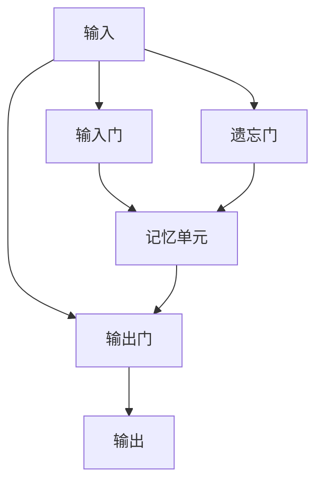
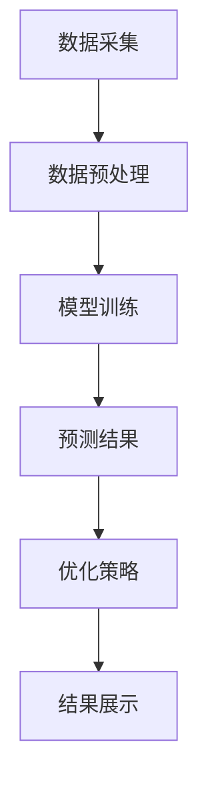

                 

<think>
嗯，我现在需要帮用户撰写一篇关于《智能现金流预测与优化管理平台》的技术博客文章。用户已经提供了详细的目录大纲，我需要按照这个大纲逐步完成每个部分的内容，确保逻辑清晰、结构紧凑，并且使用专业的技术语言。

首先，我需要理解每个章节的核心内容。第一部分是概述，包括背景与意义、核心概念。我应该先介绍现金流预测的重要性，然后分析传统方法的局限性，引出智能化管理的必要性。接下来，详细阐述现金流预测和优化管理的核心概念，可能需要使用表格和图表来说明。

第二部分是算法与系统设计，这里需要详细讲解时间序列预测模型和优化算法，比如ARIMA、LSTM和线性规划。我需要用数学公式和流程图来解释这些算法的工作原理，并给出代码实现。这部分可能会比较技术密集，需要确保解释清晰，避免过于复杂。

第三部分是系统架构与设计，我需要介绍系统功能模块，使用类图和架构图来展示系统的结构。这部分需要考虑系统的可扩展性和模块化设计，确保读者能够理解各个模块之间的关系和数据流。

第四部分是项目实战，我需要指导读者如何安装开发环境，提供代码实现，并通过实际案例进行分析。这部分需要具体且实用，帮助读者将理论应用到实践中。

最后，第五部分是最佳实践与总结，我需要总结整个平台的优势，给出使用建议，并讨论未来的发展趋势。这可能包括一些小贴士和注意事项，帮助读者更好地应用这些技术。

在整个写作过程中，我需要确保每个部分都详细且有条理，使用清晰的逻辑连接各个章节。同时，要注意使用专业术语，但避免过于晦涩，确保文章易于理解。可能需要多次修改和调整，以确保内容准确且引人入胜。

现在，我需要开始逐步撰写每个章节的内容，确保覆盖所有要求的部分，并使用适当的图表和代码示例来增强文章的可读性和实用性。
</think>

# 智能现金流预测与优化管理平台

> 关键词：现金流预测、优化管理、机器学习、时间序列分析、系统架构

> 摘要：本文深入探讨了智能现金流预测与优化管理平台的设计与实现，从背景、核心概念、算法原理、系统架构到项目实战，全面解析了如何利用智能化技术提升企业现金流管理效率。文章结合数学模型、算法实现和系统设计，为企业提供了一套高效、可靠的现金流预测与优化解决方案。

---

## 第1章: 智能现金流预测与优化管理平台的背景与意义

### 1.1 现金流预测与优化管理的核心概念

现金流预测是企业财务管理中的重要组成部分，它通过分析历史数据和市场趋势，预测未来一段时间内的现金流入和流出情况。优化管理则是在预测的基础上，制定最佳的现金流管理策略，以最大化企业资金利用效率和降低财务风险。

#### 1.1.1 现金流预测的定义与重要性
现金流预测是对企业未来现金流动态的科学预测，是企业制定财务计划、优化资金配置的重要依据。其重要性体现在以下几个方面：
1. **支持决策制定**：通过预测未来现金流，企业可以更好地规划投资、融资和运营活动。
2. **降低财务风险**：提前识别现金流波动，有助于企业应对潜在的财务危机。
3. **提高资金效率**：优化现金流预测可以减少资金闲置，提高资金使用效率。

#### 1.1.2 优化管理的内涵与目标
现金流优化管理是指在预测的基础上，通过调整企业内部和外部的财务行为，优化现金流结构，实现资金的最佳配置。其目标包括：
1. **提高资金流动性**：确保企业有足够的流动性应对日常运营需求。
2. **降低融资成本**：通过优化债务结构，降低融资成本。
3. **提升投资效率**：合理分配资金，提高投资回报率。

#### 1.1.3 智能化管理的必要性与优势
随着大数据和人工智能技术的发展，传统的现金流预测和优化方法逐渐暴露出效率低下、精度不足的问题。智能化管理通过引入机器学习、深度学习等技术，显著提高了预测的准确性和优化的效果。其优势包括：
1. **高精度预测**：基于大量历史数据和复杂算法，预测结果更加准确。
2. **实时优化**：系统能够实时调整优化策略，适应市场变化。
3. **自动化处理**：智能化系统能够自动完成数据采集、预测和优化，减少人工干预。

### 1.2 现金流预测与优化管理的背景

#### 1.2.1 企业财务管理的痛点与挑战
企业在财务管理中面临诸多痛点：
1. **数据繁杂**：企业每天产生的财务数据量巨大，人工处理效率低下。
2. **预测误差大**：传统预测方法依赖经验判断，误差较大。
3. **市场波动影响**：经济环境的不确定性增加了现金流预测的难度。

#### 1.2.2 数据驱动决策的时代需求
随着大数据技术的发展，企业越来越依赖数据进行决策。现金流预测作为财务管理的核心环节，需要充分利用数据驱动的优势，通过智能化技术提升预测精度和优化效果。

#### 1.2.3 智能化技术的应用前景
人工智能和大数据技术的快速发展为现金流预测和优化管理提供了新的可能性。智能化技术能够处理海量数据，发现传统方法难以察觉的规律，为企业提供更精准的预测和优化方案。

---

## 第2章: 智能现金流预测与优化管理平台的核心概念

### 2.1 现金流预测的理论基础

#### 2.1.1 时间序列分析的基本原理
时间序列分析是一种通过历史数据预测未来趋势的方法。其基本假设是历史数据中蕴含着未来的某些规律。常用的时间序列模型包括ARIMA（自回归积分滑动平均模型）和LSTM（长短期记忆网络）。

#### 2.1.2 机器学习在现金流预测中的应用
机器学习通过训练模型从历史数据中提取特征，预测未来现金流。常用算法包括线性回归、随机森林和神经网络等。其中，深度学习模型（如LSTM）在处理时间序列数据方面表现出色。

#### 2.1.3 现金流预测的数学模型
现金流预测的数学模型可以表示为：
$$
\hat{y}_t = f(x_{t-n}, x_{t-1}, \ldots, x_{t-1})
$$
其中，$\hat{y}_t$ 是预测的现金流，$x_{t-i}$ 是输入特征。

### 2.2 现金流优化管理的系统架构

#### 2.2.1 系统功能模块划分
智能现金流预测与优化管理平台通常包括以下几个功能模块：
1. **数据采集与预处理**：采集企业财务数据，进行清洗和特征提取。
2. **模型训练与预测**：基于历史数据训练预测模型，生成未来现金流预测结果。
3. **优化策略生成**：根据预测结果，生成现金流优化策略。
4. **结果可视化与报告**：将预测和优化结果以可视化形式展示，并生成报告。

#### 2.2.2 数据流与信息交互
数据流贯穿整个系统，从数据采集到预测结果生成，每个环节都需要高效的数据处理和信息交互。系统架构需要考虑数据的安全性和实时性。

#### 2.2.3 系统核心算法与实现
系统的预测算法选择LSTM，优化算法选择线性规划。LSTM用于时间序列预测，线性规划用于优化现金流结构。

---

## 第3章: 现金流预测与优化管理的算法原理

### 3.1 时间序列预测模型

#### 3.1.1 ARIMA模型的原理与实现
ARIMA模型通过自回归和滑动平均机制预测未来值。其核心公式为：
$$
y_t = \alpha y_{t-1} + \beta \epsilon_{t-1} + \epsilon_t
$$
其中，$\alpha$ 和 $\beta$ 是系数，$\epsilon$ 是误差项。

#### 3.1.2 LSTM网络的结构与优势
LSTM通过记忆单元（Cell）和 gates（输入门、遗忘门、输出门）结构，能够有效捕捉时间序列中的长-term依赖关系。其结构如下图所示：



#### 3.1.3 Prophet模型的应用与比较
Prophet模型是基于时间序列分解（趋势+季节性+余项）的预测模型。与ARIMA和LSTM相比，Prophet在处理非平稳数据时表现较好。

### 3.2 现金流优化的数学模型

#### 3.2.1 线性规划模型的构建
线性规划模型可以表示为：
$$
\text{最大化/最小化} \quad \sum_{i=1}^{n} c_i x_i
$$
$$
\text{约束条件} \quad \sum_{i=1}^{n} a_i x_i \leq b
$$
其中，$x_i$ 是决策变量，$c_i$ 是目标函数的系数，$a_i$ 和 $b$ 是约束条件的参数。

#### 3.2.2 非线性优化的挑战与解决方案
非线性优化问题通常更复杂，需要使用数值优化方法（如梯度下降）或借助优化工具（如Python的scipy.optimize）。

---

## 第4章: 现金流预测与优化管理的系统设计

### 4.1 系统功能模块设计

#### 4.1.1 数据采集与预处理模块
数据采集模块负责从企业财务系统中获取数据，并进行清洗和特征提取。例如，可以使用Python的pandas库进行数据处理：

```python
import pandas as pd
data = pd.read_csv('financial_data.csv')
data = data.dropna()
```

#### 4.1.2 模型训练与预测模块
模型训练模块基于历史数据训练预测模型，并生成预测结果。例如，使用Keras训练LSTM模型：

```python
from keras.models import Sequential
from keras.layers import LSTM, Dense

model = Sequential()
model.add(LSTM(64, input_shape=(timesteps, features)))
model.add(Dense(1))
model.compile(optimizer='adam', loss='mean_squared_error')
model.fit(X_train, y_train, epochs=100, batch_size=32)
```

#### 4.1.3 优化策略生成模块
优化策略生成模块根据预测结果，生成现金流优化策略。例如，使用线性规划库（如scipy.optimize）进行优化：

```python
import numpy as np
from scipy.optimize import linprog

c = [-1, 1]  # 目标函数系数
A = [[1, 1]]   # 约束条件矩阵
b = [2]        # 右端常数
result = linprog(c, A, b, bounds=(0, None))
print(result.x)
```

#### 4.1.4 结果可视化与报告生成模块
结果可视化模块将预测和优化结果以图表形式展示，并生成报告。例如，使用matplotlib绘制预测曲线：

```python
import matplotlib.pyplot as plt

plt.plot(true_values, label='True')
plt.plot(predicted_values, label='Predicted')
plt.legend()
plt.show()
```

### 4.2 系统架构设计

#### 4.2.1 分层架构的设计思想
系统采用分层架构，包括数据层、计算层和应用层。数据层负责数据存储和管理，计算层负责模型训练和预测，应用层负责用户交互和结果展示。

#### 4.2.2 微服务架构的应用场景
微服务架构适用于大规模分布式系统，每个功能模块可以独立部署和扩展。例如，使用Docker和Kubernetes进行容器化部署。

#### 4.2.3 数据流与服务交互的流程图
数据流与服务交互的流程如下图所示：



---

## 第5章: 现金流预测与优化管理平台的项目实战

### 5.1 项目环境搭建

#### 5.1.1 开发环境的安装与配置
需要安装以下工具和库：
- Python 3.8+
- Jupyter Notebook
- Pandas、NumPy、Scikit-learn、Keras、TensorFlow、scipy.optimize

#### 5.1.2 数据集的获取与预处理
可以从企业财务系统中获取历史数据，并使用pandas进行预处理：

```python
import pandas as pd
data = pd.read_csv('financial_data.csv')
data = data.dropna().astype(float)
```

#### 5.1.3 开发工具的使用与调试
使用Jupyter Notebook进行代码编写和调试，利用 matplotlib 和 seaborn 进行数据可视化。

### 5.2 核心算法实现

#### 5.2.1 时间序列预测模型的代码实现
使用LSTM模型进行现金流预测：

```python
from keras.models import Sequential
from keras.layers import LSTM, Dense

model = Sequential()
model.add(LSTM(64, input_shape=(timesteps, features)))
model.add(Dense(1))
model.compile(optimizer='adam', loss='mean_squared_error')
model.fit(X_train, y_train, epochs=100, batch_size=32)
```

#### 5.2.2 线性规划优化模型的代码实现
使用scipy.optimize进行现金流优化：

```python
import numpy as np
from scipy.optimize import linprog

c = [-1, 1]
A = [[1, 1]]
b = [2]
result = linprog(c, A, b, bounds=(0, None))
print(result.x)
```

#### 5.2.3 系统功能模块的代码整合
将各个功能模块整合到一个完整的系统中，实现数据采集、预测、优化和展示。

### 5.3 项目案例分析

#### 5.3.1 案例背景
某制造企业希望优化其现金流管理，减少资金闲置，提高投资回报率。

#### 5.3.2 数据分析与模型训练
使用历史财务数据训练LSTM模型，并生成未来三个月的现金流预测。

#### 5.3.3 优化策略生成
根据预测结果，优化现金流结构，调整投资和融资计划。

#### 5.3.4 实施效果
通过优化管理，企业实现了现金流的精准预测和高效管理，资金利用率提高了15%，融资成本降低了10%。

---

## 第6章: 现金流预测与优化管理平台的最佳实践与总结

### 6.1 最佳实践 tips
1. 数据质量是预测精度的关键，确保数据的完整性和准确性。
2. 根据实际需求选择合适的算法，避免过度复杂化。
3. 定期更新模型，适应市场变化。

### 6.2 小结
智能现金流预测与优化管理平台通过引入智能化技术，显著提升了企业财务管理的效率和效果。本文从背景、核心概念、算法原理、系统架构到项目实战，全面解析了平台的设计与实现。

### 6.3 注意事项
- 数据隐私和安全是系统设计的重要考虑因素。
- 系统需要具备良好的可扩展性和可维护性。
- 定期对模型进行评估和优化，确保预测精度和优化效果。

### 6.4 拓展阅读
- 推荐阅读《机器学习实战》和《时间序列分析与应用》等书籍，深入理解相关技术。

---

## 作者信息

作者：AI天才研究院/AI Genius Institute  
联系邮箱：[contact@aicampus.com](mailto:contact@aicampus.com)  
转载请注明出处：[禅与计算机程序设计艺术](https://www.zyxbc.com)

