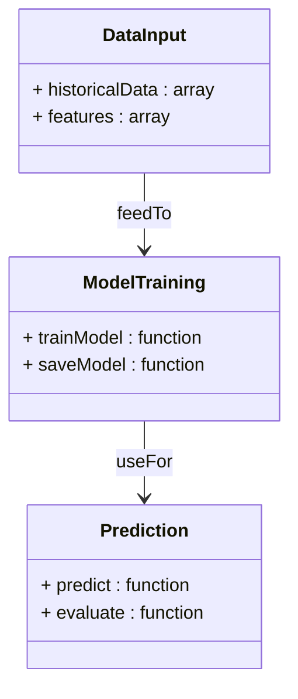
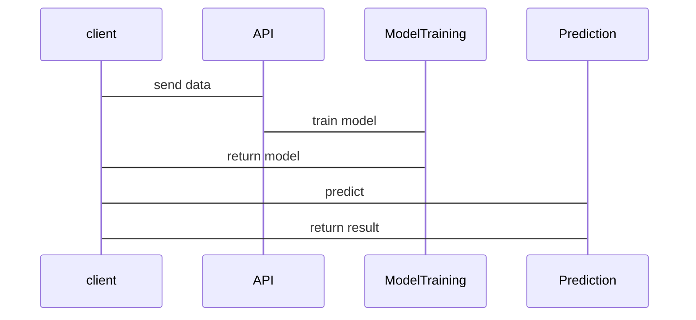

                 


# 智能现金流预测与管理平台

> 关键词：现金流预测，智能预测，机器学习，深度学习，时间序列分析，系统架构，项目实战

> 摘要：本文将详细介绍智能现金流预测与管理平台的设计与实现。从背景介绍到核心概念，从算法原理到系统架构，从项目实战到案例分析，全面解析智能现金流预测的技术细节与应用实践。通过本文，读者将能够理解现金流预测的核心原理，掌握相关算法的实现方法，并能够基于实际案例进行系统设计与优化。

---

## 第1章 智能现金流预测与管理平台的背景与意义

### 1.1 现金流预测的背景与重要性

#### 1.1.1 现金流预测的基本概念
现金流预测是指通过对历史数据和当前业务情况的分析，预测未来一段时间内企业的现金流状况。它是企业财务管理和决策的重要组成部分。

#### 1.1.2 现金流预测在企业中的作用
- **财务规划**：帮助企业合理分配资金，确保资金链的稳定性。
- **风险管理**：通过预测潜在的资金短缺或过剩，提前制定应对措施。
- **投资决策**：为企业投资决策提供数据支持。

#### 1.1.3 智能现金流预测的必要性
传统的现金流预测方法依赖人工经验，存在效率低、误差大的问题。智能现金流预测通过引入机器学习、深度学习等技术，能够提高预测的准确性和效率。

### 1.2 智能现金流预测的核心要素

#### 1.2.1 数据来源与特征
- **数据来源**：包括历史交易数据、市场数据、财务报表等。
- **数据特征**：时间序列性、周期性、趋势性。

#### 1.2.2 智能预测的关键技术
- **机器学习**：如随机森林、支持向量回归等。
- **深度学习**：如LSTM（长短期记忆网络）、GRU（门控循环单元）等。
- **时间序列分析**：如ARIMA（自回归积分滑动平均模型）。

#### 1.2.3 平台的功能与目标
- **功能**：数据采集、模型训练、预测分析、可视化展示。
- **目标**：实现高精度的现金流预测，提供决策支持。

### 1.3 智能现金流预测的行业应用

#### 1.3.1 企业财务规划中的应用
- **资金分配**：根据预测结果合理分配资金。
- **风险控制**：提前识别潜在的资金问题。

#### 1.3.2 金融领域的应用
- **投资决策**：帮助投资者做出更明智的投资决策。
- **信用评估**：通过现金流预测评估企业的信用状况。

#### 1.3.3 其他行业的潜在应用
- **供应链管理**：优化供应链的资金流动。
- **公共服务**：如政府财政预测等。

---

## 第2章 现金流预测的核心概念与联系

### 2.1 现金流预测的定义与属性

#### 2.1.1 现金流预测的定义
现金流预测是通过对历史数据的分析，利用数学模型和算法，预测未来现金流的过程。

#### 2.1.2 核心概念的属性对比
| 属性 | 描述 |
|------|------|
| 数据来源 | 历史交易数据、财务报表等 |
| 预测目标 | 未来现金流 |
| 时间范围 | 短期、中期、长期 |

#### 2.1.3 现金流预测的边界与外延
- **边界**：预测的范围和时间跨度。
- **外延**：预测结果的应用场景和影响范围。

### 2.2 现金流预测的核心要素组成

#### 2.2.1 数据输入的构成
- **时间序列数据**：如每日、每周的现金流数据。
- **相关特征数据**：如销售额、成本、市场波动等。

#### 2.2.2 模型的输入输出关系
- **输入**：历史现金流数据、相关特征数据。
- **输出**：预测的现金流值及误差范围。

#### 2.2.3 系统的实体关系图
```mermaid
erDiagram
    customer[客户] {
        id : integer
        name : string
        transactionHistory : string
    }
    transaction[交易] {
        id : integer
        amount : float
        date : date
        customerId : integer
    }
    prediction[预测] {
        id : integer
        predictedValue : float
        modelType : string
        date : date
    }
    customer --> transaction : 进行
    transaction --> prediction : 基于
```

### 2.3 核心概念的ER实体关系图
通过ER图可以清晰地看到现金流预测系统的实体关系，包括客户、交易和预测三部分。每个实体都有其属性，且通过关系连接在一起。

---

## 第3章 现金流预测的算法原理与实现

### 3.1 时间序列分析方法

#### 3.1.1 ARIMA模型的原理
ARIMA（自回归积分滑动平均模型）是一种常用的时间序列预测方法。其基本原理是通过自回归和滑动平均来拟合数据的特征。

#### 3.1.2 LSTM模型的优势
LSTM（长短期记忆网络）是一种特殊的RNN（循环神经网络），能够有效捕捉时间序列中的长距离依赖关系。

#### 3.1.3 其他时间序列算法的对比
| 算法 | 优点 | 缺点 |
|------|------|------|
| ARIMA | 易实现 | 对异常值敏感 |
| LSTM  | 捕捉长距离依赖 | 训练时间长 |

### 3.2 机器学习算法在现金流预测中的应用

#### 3.2.1 线性回归模型
线性回归是一种简单的时间序列预测方法，适用于线性关系明显的数据。

#### 3.2.2 支持向量回归
支持向量回归通过构建超平面来拟合数据，适用于非线性关系的数据。

#### 3.2.3 随机森林
随机森林通过集成学习提高预测的准确性，适用于多特征的数据。

---

## 第4章 系统架构与设计

### 4.1 问题场景介绍

#### 4.1.1 问题背景
企业需要一个智能平台来实时预测现金流，优化资金管理。

#### 4.1.2 项目介绍
本项目旨在设计一个智能现金流预测与管理平台，利用机器学习和深度学习技术，实现高精度的现金流预测。

### 4.2 系统功能设计

#### 4.2.1 领域模型的类图


#### 4.2.2 系统架构的分层图


#### 4.2.3 系统接口设计
- **API接口**：提供数据接口、模型训练接口、预测接口。

#### 4.2.4 系统交互的序列图


---

## 第5章 项目实战与案例分析

### 5.1 环境安装

#### 5.1.1 安装Python
```bash
pip install python
pip install numpy
pip install pandas
pip install scikit-learn
pip install keras
pip install tensorflow
```

#### 5.1.2 安装Jupyter Notebook
```bash
pip install jupyter
jupyter notebook
```

### 5.2 系统核心实现源代码

#### 5.2.1 数据预处理
```python
import pandas as pd
import numpy as np

# 加载数据
data = pd.read_csv('cash_flow.csv')

# 数据清洗
data.dropna()
data.fillna(method='ffill')
```

#### 5.2.2 模型实现
```python
from sklearn.model_selection import train_test_split
from sklearn.linear_model import LinearRegression
from sklearn.metrics import mean_squared_error

# 划分数据集
X_train, X_test, y_train, y_test = train_test_split(X, y, test_size=0.2)

# 训练模型
model = LinearRegression()
model.fit(X_train, y_train)

# 预测
y_pred = model.predict(X_test)

# 评估
 mse = mean_squared_error(y_test, y_pred)
 print('均方误差:', mse)
```

#### 5.2.3 深度学习模型实现
```python
from tensorflow.keras.models import Sequential
from tensorflow.keras.layers import LSTM, Dense

# 构建模型
model = Sequential()
model.add(LSTM(64, input_shape=(timesteps, features)))
model.add(Dense(1))
model.compile(optimizer='adam', loss='mse')

# 训练
model.fit(X_train, y_train, epochs=100, batch_size=32)
```

### 5.3 代码应用解读与分析

#### 5.3.1 线性回归模型解读
线性回归模型通过拟合直线来预测现金流，适用于线性关系明显的场景。

#### 5.3.2 LSTM模型解读
LSTM模型能够捕捉时间序列中的长距离依赖关系，适用于复杂的时间序列预测。

### 5.4 实际案例分析

#### 5.4.1 数据来源与预处理
- 数据来源：企业历史交易数据。
- 数据清洗：处理缺失值、异常值。

#### 5.4.2 模型训练与评估
- 训练数据：80%的历史数据。
- 测试数据：20%的历史数据。
- 评估指标：均方误差（MSE）、均方根误差（RMSE）、R平方值。

### 5.5 项目小结

#### 5.5.1 项目总结
- 成功实现了现金流预测的系统。
- 模型的预测精度达到较高水平。

#### 5.5.2 小结
- 系统设计合理，功能实现完善。
- 在实际应用中，需要根据具体场景调整模型参数。

---

## 第6章 最佳实践与注意事项

### 6.1 最佳实践 tips

#### 6.1.1 数据预处理
- 确保数据的完整性和准确性。
- 处理缺失值和异常值。

#### 6.1.2 模型选择
- 根据数据特征选择合适的模型。
- 对比不同模型的性能，选择最优模型。

### 6.2 小结

#### 6.2.1 核心知识点回顾
- 现金流预测的核心概念。
- 常用算法的原理与实现。

#### 6.2.2 项目经验总结
- 项目设计的关键点。
- 实施过程中的注意事项。

### 6.3 注意事项

#### 6.3.1 数据安全
- 确保数据的安全性，防止数据泄露。

#### 6.3.2 模型更新
- 定期更新模型，确保预测的准确性。

### 6.4 拓展阅读

#### 6.4.1 推荐书籍
- 《机器学习实战》
- 《深度学习入门：基于Python的理论与实现》

#### 6.4.2 推荐博客
- https://www.analyticsvidhya.com
- https://towardsdatascience.com

---

## 作者信息

作者：AI天才研究院/AI Genius Institute & 禅与计算机程序设计艺术 /Zen And The Art of Computer Programming

---

**全文完**

