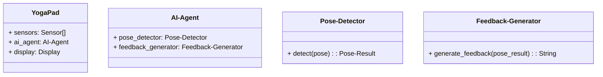
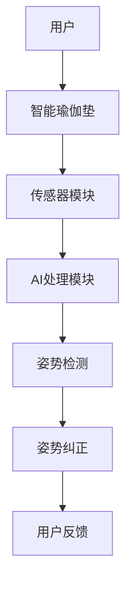
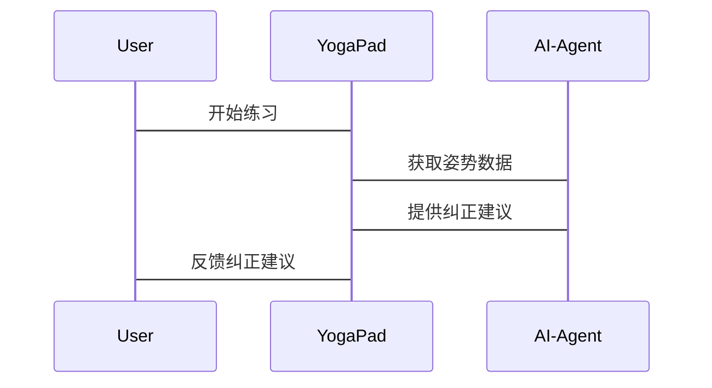

                 


# 智能瑜伽垫：AI Agent的姿势纠正系统

> 关键词：智能瑜伽垫，AI Agent，姿势纠正，深度学习，物联网，实时反馈

> 摘要：本文详细介绍了智能瑜伽垫的设计与实现，探讨了AI Agent在姿势纠正中的应用，从算法原理到系统架构，从项目实战到总结与展望，全面解析了智能瑜伽垫的技术与实践。

---

## 第一部分：背景介绍

### 第1章：智能瑜伽垫的背景与问题背景

#### 1.1 问题背景
- **1.1.1 瑜伽练习的重要性与普及**  
  瑜伽是一种结合了身体、心灵和精神的练习方式，近年来在全球范围内迅速普及。它不仅有助于改善身体柔韧性，还能缓解压力、提升专注力。然而，许多人在练习过程中由于缺乏专业指导，容易出现姿势错误，导致练习效果不佳甚至受伤。

- **1.1.2 传统瑜伽练习中的常见问题**  
  传统瑜伽练习主要依赖教练的现场指导，但普通人很难随时随地获得专业指导。此外，传统瑜伽垫无法提供实时反馈，难以纠正用户的姿势错误。

- **1.1.3 现有瑜伽辅助工具的局限性**  
  当前市场上的瑜伽辅助工具（如镜子、视频指导等）存在以下问题：  
  - 无法实时反馈用户的姿势错误；  
  - 依赖于用户自身的观察和纠正能力；  
  - 无法提供个性化的指导。

#### 1.2 问题描述
- **1.2.1 瑜伽姿势纠正的需求**  
  用户在练习瑜伽时，需要一个能够实时监测姿势并提供纠正建议的工具。

- **1.2.2 现有技术在姿势纠正中的不足**  
  现有的瑜伽辅助工具无法结合人工智能技术，难以实现个性化的、实时的姿势纠正。

- **1.2.3 智能瑜伽垫的解决方案**  
  智能瑜伽垫通过结合AI Agent技术，能够实时监测用户的姿势，并通过振动、语音等方式提供纠正建议。

#### 1.3 问题解决
- **1.3.1 智能瑜伽垫的核心功能**  
  智能瑜伽垫的核心功能包括：  
  - 实时监测用户的姿势；  
  - 提供个性化的纠正建议；  
  - 记录用户的练习数据。

- **1.3.2 AI Agent在姿势纠正中的作用**  
  AI Agent通过深度学习算法，能够识别用户的姿势，并根据预设的规则提供纠正建议。

- **1.3.3 智能瑜伽垫的技术实现路径**  
  智能瑜伽垫的技术实现路径包括：  
  - 传感器数据采集；  
  - 姿势检测与分析；  
  - AI Agent提供纠正建议。

#### 1.4 边界与外延
- **1.4.1 智能瑜伽垫的功能边界**  
  智能瑜伽垫的功能主要集中在姿势纠正和数据记录，不涉及其他功能（如音乐播放、计时等）。

- **1.4.2 相关技术的外延扩展**  
  智能瑜伽垫的相关技术可以扩展到其他健身领域，例如智能跑步机、智能哑铃等。

- **1.4.3 与其他智能健身设备的对比**  
  智能瑜伽垫与其他智能健身设备的对比如下：  
  | 功能 | 智能瑜伽垫 | 智能跑步机 | 智能哑铃 |
  |------|------------|-------------|----------|
  | 核心功能 | 姿势纠正 | 步伐监测 | 动作识别 |
  | 传感器类型 | 压力传感器、加速度传感器 | 跑步传感器、心率传感器 | 加速度传感器、力传感器 |

#### 1.5 核心概念与联系
- **1.5.1 核心概念的定义与属性特征对比表格**  
  下表展示了智能瑜伽垫中的核心概念及其属性特征：  
  | 概念 | 定义 | 属性特征 |
  |------|------|----------|
  | AI Agent | 一种能够感知环境并执行任务的智能体 | 实时监测、自主决策、个性化反馈 |
  | 姿势检测 | 通过传感器数据识别用户姿势 | 高精度、实时性、可定制化 |
  | 姿势纠正 | 根据检测结果提供纠正建议 | 个性化、实时反馈、可量化 |

- **1.5.2 AI Agent与瑜伽垫的实体关系图（Mermaid流程图）**  
  ```mermaid
  graph TD
      A[Ai Agent] --> B[瑜伽垫]
      B --> C[传感器]
      C --> D[姿势检测]
      D --> E[姿势纠正]
      E --> F[用户反馈]
  ```

---

## 第二部分：算法原理讲解

### 第3章：AI Agent的算法原理

#### 3.1 姿势检测算法
- **3.1.1 基于深度学习的姿势检测**  
  姿势检测的核心算法是基于深度学习的姿势检测模型，常用的模型包括ResNet、Hourglass、以及最新的PoseNet等。以下是一个简化的姿势检测流程：  
  ```mermaid
  graph TD
      A[输入图像] --> B[特征提取]
      B --> C[姿态预测]
      C --> D[输出关键点]
  ```

  其中，特征提取部分使用ResNet网络提取图像的深层特征，姿态预测部分使用一个全连接层或回归网络预测每个关键点的坐标。

- **3.1.2 姿势检测的Python实现代码**  
  下面是一个简单的姿势检测代码示例：  
  ```python
  import tensorflow as tf
  from tensorflow.keras import layers

  def pose_detection_model(input_shape):
      inputs = layers.Input(shape=input_shape)
      x = layers.Conv2D(64, (3,3), activation='relu')(inputs)
      x = layers.MaxPooling2D((2,2))(x)
      x = layers.Conv2D(128, (3,3), activation='relu')(x)
      x = layers.MaxPooling2D((2,2))(x)
      x = layers.Flatten()(x)
      x = layers.Dense(128, activation='relu')(x)
      outputs = layers.Dense(16, activation='sigmoid')(x)  # 8 key points * 2 coordinates
      return tf.keras.Model(inputs=inputs, outputs=outputs)

  model = pose_detection_model((256, 256, 3))
  model.compile(optimizer='adam', loss='binary_crossentropy', metrics=['accuracy'])
  ```

- **3.1.3 姿势检测的数学模型与公式**  
  姿势检测的核心是回归问题，目标是通过图像预测每个关键点的坐标。假设我们有N个关键点，每个关键点的坐标可以通过以下公式计算：  
  $$ y_i = \sigma(w_i^T x + b_i) $$  
  其中，$x$是输入图像的特征向量，$w_i$和$b_i$是第i个关键点的权重和偏置。

#### 3.2 姿势纠正算法
- **3.2.1 基于反馈机制的姿势纠正算法**  
  姿势纠正算法的核心是根据检测到的姿势错误，生成纠正建议。以下是一个简化的流程：  
  ```mermaid
  graph TD
      A[姿势检测结果] --> B[错误识别]
      B --> C[纠正建议]
      C --> D[用户反馈]
  ```

- **3.2.2 姿势纠正的Python实现代码**  
  下面是一个简单的姿势纠正算法实现：  
  ```python
  def pose_correction(pose_detection_result):
      # 假设pose_detection_result是一个包含关键点坐标的列表
      # 每个关键点的坐标为(x, y)
      # 这里简单地检查肩部是否对齐
      if abs(pose_detection_result[0][0] - pose_detection_result[1][0]) > 0.1:
          return "调整肩膀，使肩膀对齐"
      else:
          return "姿势正确，继续练习"
  ```

- **3.2.3 姿势纠正的数学模型与公式**  
  姿势纠正算法通常基于反馈机制，通过比较检测到的姿势与标准姿势之间的差异，生成纠正建议。假设标准姿势的关键点坐标为$S = \{s_1, s_2, ..., s_n\}$，检测到的姿势关键点坐标为$D = \{d_1, d_2, ..., d_n\}$，纠正建议可以通过以下公式生成：  
  $$ \text{纠正建议} = \argmin_{i} \sum_{j=1}^n |s_j - d_j| $$  

---

## 第三部分：系统分析与架构设计

### 第4章：智能瑜伽垫的系统架构

#### 4.1 问题场景介绍
智能瑜伽垫的应用场景包括家庭健身、健身房、瑜伽课程等。用户通过智能瑜伽垫进行瑜伽练习时，系统能够实时监测用户的姿势，并通过振动或语音提供纠正建议。

#### 4.2 项目介绍
智能瑜伽垫是一个结合了AI技术的智能健身设备，主要由以下几个部分组成：  
- 传感器模块：用于采集用户的姿势数据；  
- AI处理模块：用于姿势检测与纠正；  
- 用户交互模块：用于反馈纠正建议。

#### 4.3 系统功能设计（领域模型Mermaid类图）


#### 4.4 系统架构设计（Mermaid架构图）


#### 4.5 系统交互（Mermaid序列图）


---

## 第四部分：项目实战

### 第5章：智能瑜伽垫的实现

#### 5.1 环境安装
- **硬件环境**：需要一个支持AI处理的微控制器（如Raspberry Pi）和相关传感器（如 MPU6050）。  
- **软件环境**：Python 3.8+，TensorFlow 2.0+，OpenCV。

#### 5.2 核心代码实现
- **传感器数据采集**：  
  ```python
  import smbus

  class MPU6050:
      def __init__(self, address=0x68):
          self.bus = smbus.SMBus(1)
          self.address = address
          self.distortions = []

      def get_data(self):
          # 获取加速度和角速度数据
          data = self.bus.read_i2c_block_data(self.address, 0x3B, 6)
          return data
  ```

- **姿势检测与纠正**：  
  ```python
  from tensorflow.keras.models import load_model

  class PoseCorrector:
      def __init__(self, model_path):
          self.model = load_model(model_path)
          self.standard_pose = self.load_standard_pose()

      def load_standard_pose(self):
          # 加载标准姿势数据
          return [ (0.5, 0.5), (0.6, 0.5), ... ]  # 示例数据

      def correct_pose(self, detected_pose):
          # 检测到的姿势与标准姿势对比，生成纠正建议
          differences = [abs(detected - standard) for detected, standard in zip(detected_pose, self.standard_pose)]
          max_diff = max(differences)
          if max_diff > 0.1:
              return "调整肩膀，使肩膀对齐"
          else:
              return "姿势正确，继续练习"
  ```

- **用户反馈**：  
  ```python
  import time

  class FeedbackGenerator:
      def __init__(self):
          pass

      def generate_feedback(self, correction建议):
          # 通过振动或语音反馈纠正建议
          if correction建议 == "调整肩膀，使肩膀对齐":
              return "您的肩膀未对齐，请调整"
          else:
              return "您的姿势正确，请继续保持"
  ```

#### 5.3 测试与优化
- **测试步骤**：  
  1. 连接传感器模块，获取用户的姿势数据；  
  2. 通过AI处理模块进行姿势检测与纠正；  
  3. 反馈纠正建议，观察用户的反馈效果。  

- **优化建议**：  
  - 提高姿势检测的准确率；  
  - 优化用户的反馈体验（如增加多种反馈方式）；  
  - 增加用户数据的记录与分析功能。

#### 5.4 实际案例分析
以下是一个实际案例的分析：  
- **用户A**：在练习下犬式时，肩膀未对齐。系统检测到错误后，反馈纠正建议：“调整肩膀，使肩膀对齐”。用户调整后，系统确认姿势正确，继续练习。

---

## 第五部分：总结与展望

### 第6章：总结与展望

#### 6.1 总结
智能瑜伽垫通过结合AI Agent技术，能够实时监测用户的姿势并提供纠正建议，显著提升了瑜伽练习的效果。本文详细介绍了智能瑜伽垫的核心概念、算法原理、系统架构以及实现过程，为读者提供了全面的技术解析。

#### 6.2 展望
未来，智能瑜伽垫可以进一步优化姿势检测的准确率，增加更多的姿势类型支持，并扩展到其他健身领域（如普拉提、舞蹈等）。此外，结合增强现实技术（AR），智能瑜伽垫还可以为用户提供更加沉浸式的练习体验。

---

## 小结

智能瑜伽垫作为AI技术在健身领域的创新应用，不仅提升了用户的练习效果，还为智能健身设备的发展提供了新的方向。本文通过详细的技术解析和实际案例分析，展示了智能瑜伽垫的巨大潜力和实际应用价值。

---

## 作者

**作者：AI天才研究院/AI Genius Institute & 禅与计算机程序设计艺术/Zen And The Art of Computer Programming**

---

*本文由AI天才研究院原创，转载请注明出处。*

