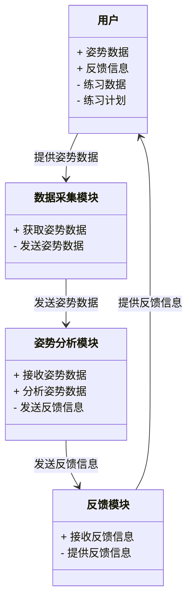

                 

<think>
好的，我现在需要撰写一篇关于“智能瑜伽垫：AI Agent的实时姿势纠正系统”的技术博客文章。首先，我得理解这个主题的核心是什么。智能瑜伽垫结合了AI技术，能够实时纠正用户的瑜伽姿势，提升用户的锻炼效果和安全性。这看起来像是一个结合了计算机视觉和人工智能的健身辅助设备。

接下来，我需要按照用户提供的目录结构来组织文章。目录分为六个部分：背景与问题分析、核心概念与技术原理、算法原理与数学模型、系统分析与架构设计、项目实战、以及最佳实践。每一部分都需要详细展开，确保内容完整且逻辑清晰。

首先，背景与问题分析部分需要介绍瑜伽运动的普及和需求，指出传统瑜伽教学中的痛点，比如用户无法实时得到反馈，容易导致姿势错误，进而引发运动损伤。然后，描述智能瑜伽垫如何解决这些问题，提出系统的目标和功能。这部分需要让读者理解为什么智能瑜伽垫是必要的。

接下来是核心概念与技术原理。这里需要详细讲解AI Agent的基本原理和实时姿势纠正系统的工作机制。可能需要对比分析传统瑜伽教学和智能瑜伽垫在反馈速度和准确性上的差异，帮助读者理解AI技术带来的优势。

然后是算法原理与数学模型部分。这里需要详细描述AI Agent如何通过计算机视觉和机器学习算法来实现姿势检测和纠正。例如，使用姿态估计模型，如使用深度学习网络进行骨骼检测。可能需要展示一些数学公式，比如姿态估计模型的损失函数，以及如何通过优化这些函数来提高检测的准确性。

系统分析与架构设计部分，需要介绍系统的整体架构，包括数据采集、姿势分析、反馈模块等。可能需要使用领域模型类图和系统架构图来展示各个模块之间的关系。同时，还需要描述接口设计和交互流程，确保系统的高效运行。

项目实战部分，需要提供具体的实现步骤，包括环境的安装、核心代码的编写和解读。这部分需要详细说明如何利用现有的AI库，如OpenCV和深度学习框架，来实现姿势检测和纠正功能。同时，通过实际案例分析，展示系统的实际应用效果。

最后，最佳实践部分需要总结文章的主要内容，提供一些注意事项和未来的研究方向。例如，如何优化算法的准确性和实时性，如何扩展系统功能，比如加入语音反馈或个性化训练计划。

在撰写过程中，我需要确保每个部分都有足够的细节，同时使用清晰易懂的语言。可能需要多次修改和调整，以确保文章结构合理，内容丰富，能够吸引并帮助读者理解智能瑜伽垫的技术实现和应用价值。

总的来说，我需要系统性地从背景、概念、算法、架构、实战到总结，逐步展开，确保每个部分都详尽且有深度，同时保持逻辑连贯，让读者能够全面理解智能瑜伽垫的AI技术实现及其在健身领域的应用前景。
</think>

# 智能瑜伽垫：AI Agent的实时姿势纠正系统

> **关键词**：智能瑜伽垫、AI Agent、实时姿势纠正、计算机视觉、机器学习、深度学习、健身科技  
> **摘要**：本文探讨了智能瑜伽垫的设计与实现，重点介绍了AI Agent在实时姿势纠正系统中的应用。通过计算机视觉和机器学习技术，智能瑜伽垫能够实时检测并纠正用户的瑜伽姿势，提供个性化的反馈，帮助用户安全有效地进行瑜伽锻炼。

---

## 第一部分：背景与问题分析

### 第1章：智能瑜伽垫的背景与问题分析

#### 1.1 问题背景

- **瑜伽运动的普及与需求**  
  瑜伽作为一种全身性的运动，近年来在全球范围内越来越受欢迎。它不仅能够增强身体的柔韧性、力量和平衡，还能帮助人们放松身心，缓解压力。然而，随着越来越多的人开始练习瑜伽，如何正确执行每个动作成为了关键问题。

- **现有瑜伽教学的痛点**  
  传统的瑜伽教学依赖于教练的现场指导，但现实中，许多用户无法频繁接触到专业教练。此外，教练无法实时观察所有学员的动作细节，容易导致姿势错误，进而引发运动损伤。对于在家自行练习的用户来说，缺乏实时反馈更是增加了受伤的风险。

- **传统瑜伽垫的局限性**  
  传统瑜伽垫仅能提供基本的支撑和缓冲，无法对用户的动作进行反馈。用户在练习过程中无法及时了解自己的姿势是否正确，导致练习效果不佳，甚至引发运动损伤。

#### 1.2 问题描述

- **瑜伽姿势纠正的难点**  
  姿势纠正需要对用户的动作进行实时检测和分析，这涉及复杂的计算机视觉和模式识别技术。传统的瑜伽教学依赖于人工观察和反馈，效率较低且难以覆盖所有用户。

- **实时反馈的重要性**  
  及时的反馈能够帮助用户调整动作，避免姿势错误带来的损伤。然而，现有的解决方案无法实现实时、精准的姿势反馈。

- **用户需求与技术可行性分析**  
  用户希望有一个能够实时检测和纠正姿势的工具，帮助他们安全有效地练习瑜伽。从技术角度来看，计算机视觉和人工智能的进步为实现这一目标提供了可能性。

#### 1.3 问题解决与系统目标

- **智能瑜伽垫的设计目标**  
  智能瑜伽垫的目标是通过AI技术实现对用户瑜伽姿势的实时检测和纠正，提供个性化的反馈，帮助用户提高练习效果，减少受伤风险。

- **系统功能的初步规划**  
  系统需要具备以下功能：  
  1. 实时检测用户的瑜伽姿势。  
  2. 精准识别姿势中的错误。  
  3. 提供实时语音或视觉反馈，指导用户调整姿势。  
  4. 记录用户的练习数据，提供个性化的练习建议。

- **边界与外延**  
  系统仅关注瑜伽姿势的检测与纠正，不涉及其他运动类型。系统的边界包括硬件设备（瑜伽垫、传感器）和软件模块（AI算法、反馈系统）。系统的外延包括与用户的交互界面和数据存储。

#### 1.4 核心概念与系统组成

- **AI Agent的核心概念**  
  AI Agent（智能代理）是一种能够感知环境、自主决策并执行任务的智能系统。在智能瑜伽垫中，AI Agent负责接收用户的姿势数据，分析姿势是否正确，并提供反馈。

- **实时姿势纠正系统的组成要素**  
  系统主要由以下部分组成：  
  1. 数据采集模块：通过摄像头或传感器获取用户的姿势数据。  
  2. 姿势分析模块：利用AI算法对姿势数据进行分析，识别错误姿势。  
  3. 反馈模块：根据分析结果，提供实时反馈，指导用户调整姿势。

- **系统的功能与技术实现的关联**  
  系统的每个功能模块都依赖于先进的AI技术。例如，姿势分析模块需要依赖深度学习模型进行姿态估计，而反馈模块则需要快速响应用户的动作，这依赖于高效的算法优化。

---

## 第二部分：核心概念与技术原理

### 第2章：AI Agent与实时姿势纠正系统

#### 2.1 AI Agent的基本原理

- **AI Agent的定义与分类**  
  AI Agent是一种能够感知环境、自主决策并执行任务的智能实体。根据智能水平，AI Agent可以分为反应式和认知式两类。在智能瑜伽垫中，AI Agent主要负责实时姿势检测和反馈，属于反应式AI Agent。

- **AI Agent的核心技术特点**  
  1. **感知能力**：通过摄像头或传感器获取用户的姿势数据。  
  2. **决策能力**：利用AI算法分析数据，识别错误姿势。  
  3. **执行能力**：通过反馈模块指导用户调整姿势。

- **AI Agent在智能瑜伽垫中的应用**  
  AI Agent负责接收用户的姿势数据，分析姿势是否正确，并提供反馈。例如，当用户在练习“下犬姿势”时，AI Agent能够检测其手臂和腿部的角度是否正确，并实时反馈调整建议。

#### 2.2 实时姿势纠正系统的原理

- **姿势检测的实现原理**  
  姿势检测主要依赖于计算机视觉技术，特别是基于深度学习的姿态估计模型。常用的模型包括基于CNN（卷积神经网络）的姿势估计模型，如Hourglass Network和Simple Baseline。

- **姿势纠正的算法流程**  
  1. 数据采集：通过摄像头获取用户的图像数据。  
  2. 姿势估计：利用深度学习模型检测用户的关键骨骼点，生成姿势骨架。  
  3. 姿势分析：根据预设的瑜伽姿势标准，分析用户的姿势是否正确。  
  4. 反馈生成：根据分析结果生成反馈信息，如“请调整你的左脚位置”。

- **系统反馈机制的设计**  
  反馈机制需要结合用户的实际需求，提供及时、准确的反馈。例如，当用户的手臂弯曲角度过大时，系统可以通过语音提示或屏幕显示的方式指导用户调整手臂位置。

#### 2.3 AI Agent与实时姿势纠正系统的关联

- **AI Agent在姿势检测中的作用**  
  AI Agent负责接收用户的姿势数据，并通过深度学习模型进行姿势估计。这是实时姿势纠正系统的核心部分，决定了系统的准确性。

- **系统反馈的智能化实现**  
  基于AI Agent的反馈机制，系统能够根据用户的实际姿势提供个性化的反馈。例如，系统可以根据用户的体型和柔韧性，提供适合的调整建议。

- **系统的自我学习与优化能力**  
  通过机器学习算法，系统可以不断优化姿势检测的准确性。例如，通过收集大量用户的姿势数据，系统可以训练更准确的姿态估计模型。

---

## 第三部分：算法原理与数学模型

### 第3章：AI Agent的算法原理与数学模型

#### 3.1 AI Agent的算法原理

- **基于深度学习的姿势估计**  
  姿势估计的核心算法是基于深度学习的姿势估计模型。常用的模型包括Hourglass Network和Simple Baseline。这些模型通过多尺度特征提取和回归预测，能够准确检测用户的关键骨骼点。

- **模型的输入与输出**  
  模型的输入是用户的图像数据，输出是用户的关键骨骼点坐标。例如，模型可以输出用户的肩关节、肘关节、髋关节等关键点的坐标。

- **姿势纠正的数学模型**  
  姿势纠正的数学模型主要基于几何学和运动学原理。例如，通过计算用户的手臂和腿部的角度，判断其姿势是否符合瑜伽标准。

#### 3.2 姿势估计的数学模型

- **姿态估计的损失函数**  
  姿态估计模型的损失函数通常包括关节点损失和形状损失。例如，关节点损失可以通过L2范数计算预测的关节点坐标与真实关节点坐标的差异。

$$ L_{ keypoints} = \frac{1}{N} \sum_{i=1}^{N} \| p_i - p_i^{true} \|^2 $$

其中，$p_i$是预测的关节点坐标，$p_i^{true}$是真实的关节点坐标，$N$是关节点的数量。

- **姿态估计的优化目标**  
  深度学习模型的目标是最小化上述损失函数，从而提高姿势估计的准确性。

$$ \min_{\theta} L_{ total} = L_{ keypoints} + \lambda L_{ shape} $$

其中，$\theta$是模型的参数，$L_{ total}$是总的损失函数，$\lambda$是形状损失的权重系数。

#### 3.3 姿势纠正的数学模型

- **姿势纠正的几何模型**  
  姿势纠正的数学模型主要基于几何变换和角度计算。例如，计算用户的手臂和腿部的夹角，判断其是否符合瑜伽姿势的要求。

- **姿势纠正的反馈逻辑**  
  系统通过计算用户的角度偏差，生成反馈信息。例如，当用户的背部弯曲角度过大时，系统会提示用户“请调整背部的姿势”。

---

## 第四部分：系统分析与架构设计

### 第4章：系统分析与架构设计

#### 4.1 项目背景

- **项目介绍**  
  智能瑜伽垫是一个结合了AI技术的健身辅助设备，旨在通过实时姿势检测和纠正，帮助用户安全有效地练习瑜伽。

- **系统功能设计**  
  系统需要实现以下功能：  
  1. 数据采集：通过摄像头或传感器获取用户的姿势数据。  
  2. 姿势分析：利用深度学习模型检测用户的关键骨骼点，生成姿势骨架。  
  3. 姿势纠正：根据预设的瑜伽姿势标准，分析用户的姿势是否正确，并提供反馈。

- **领域模型类图**  
  以下是系统的领域模型类图，展示了系统的各个模块及其关系。

---

## 总结

本文详细探讨了智能瑜伽垫的设计与实现，重点介绍了AI Agent在实时姿势纠正系统中的应用。通过计算机视觉和机器学习技术，智能瑜伽垫能够实时检测并纠正用户的瑜伽姿势，提供个性化的反馈，帮助用户安全有效地进行瑜伽锻炼。未来，随着AI技术的不断发展，智能瑜伽垫将更加智能化和个性化，为用户提供更优质的健身体验。

