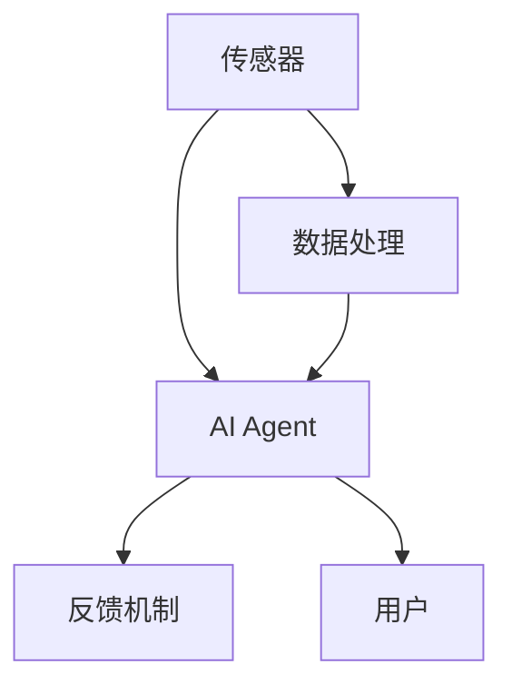
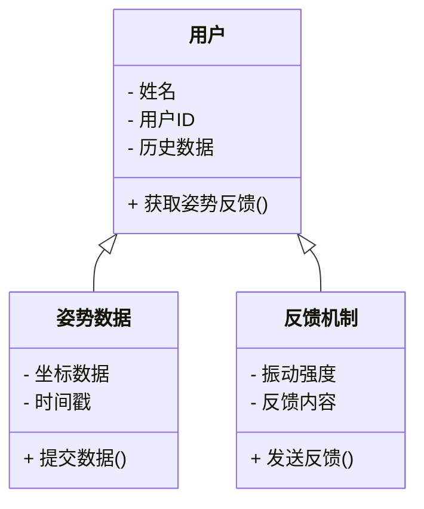
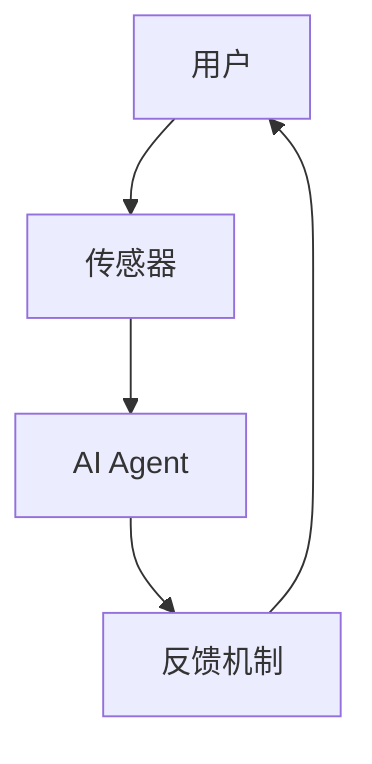
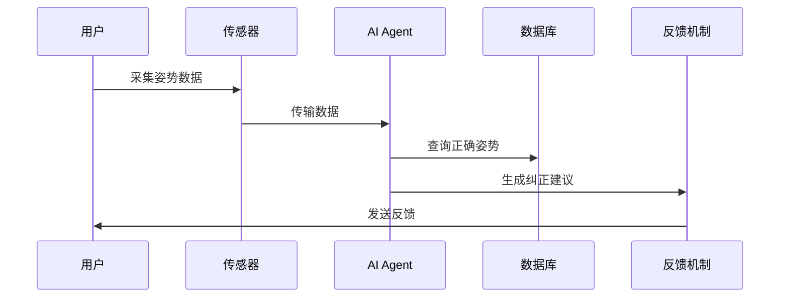

                 


# 智能瑜伽服：AI Agent的实时姿势纠正系统

> 关键词：智能瑜伽服，AI Agent，实时姿势纠正，深度学习，传感器技术，物联网

> 摘要：智能瑜伽服是一种结合了AI技术和传感器的创新产品，能够实时监测用户的瑜伽姿势，并通过AI代理提供即时反馈和纠正。本文将详细探讨智能瑜伽服的工作原理、系统架构、算法实现以及实际应用，为读者提供全面的技术解析。

---

# 第一部分：背景介绍与核心概念

## 第1章：背景与问题描述

### 1.1 瑜伽与健康生活方式的兴起

#### 1.1.1 瑜伽的历史与发展

瑜伽是一种源自古印度的身心练习，距今已有超过5000年的历史。它最初是一种宗教修行方式，后来逐渐演变为一种广泛的健康和健身方式。现代社会中，瑜伽因其对身体柔韧性、平衡性和放松效果的显著提升，深受广大群众的喜爱。

#### 1.1.2 现代人健康生活方式的需求

随着生活节奏的加快和工作压力的增大，越来越多的人开始关注健康生活方式。瑜伽作为一种温和而有效的运动方式，成为了现代人追求身心平衡的重要选择。然而，传统瑜伽教学的时空限制和初学者自我纠错的困难，使得许多人无法有效利用瑜伽带来的健康益处。

#### 1.1.3 瑜伽在健身与康复中的作用

瑜伽不仅能够帮助人们放松身心、提升柔韧性，还能够辅助治疗一些慢性疾病，如高血压、颈椎病等。对于康复期的患者而言，瑜伽是一种非常有效的康复手段。然而，由于缺乏专业指导，许多人无法正确练习瑜伽，反而可能引发运动损伤。

### 1.2 传统瑜伽教学的局限性

#### 1.2.1 现场教学的时空限制

传统瑜伽教学通常需要在特定的时间和地点进行，这限制了许多人的学习机会。尤其是对于工作繁忙的上班族来说，很难抽出固定的时间参加线下课程。

#### 1.2.2 初学者自我纠错的困难

初学者在练习瑜伽时，往往无法准确判断自己的姿势是否正确。错误的姿势不仅无法达到锻炼效果，还可能导致肌肉拉伤或其他运动损伤。

#### 1.2.3 传统教学的效率问题

传统的瑜伽教学通常是一对多的形式，教师无法同时关注所有学员的姿势问题。这导致许多学员在练习过程中无法得到及时的反馈和纠正，影响了学习效果。

### 1.3 智能瑜伽服的出现与意义

#### 1.3.1 智能瑜伽服的核心功能

智能瑜伽服通过内置的传感器和AI代理，能够实时监测用户的瑜伽姿势，并通过震动或语音等方式提供即时反馈和纠正。这种智能化的解决方案能够帮助用户在任何时间和地点进行有效的瑜伽练习。

#### 1.3.2 AI技术在瑜伽教学中的应用潜力

AI技术的快速发展为瑜伽教学带来了新的可能性。通过计算机视觉和深度学习技术，AI代理可以准确识别用户的姿势，并提供个性化的指导。这不仅提高了教学效率，还降低了运动损伤的风险。

#### 1.3.3 智能瑜伽服的目标用户与市场定位

智能瑜伽服的主要目标用户是瑜伽初学者和忙碌的上班族。这种产品特别适合那些希望在家中或办公室中进行瑜伽练习的人群。随着人们对健康生活方式的需求增加，智能瑜伽服市场潜力巨大。

### 1.4 本章小结

智能瑜伽服的出现解决了传统瑜伽教学的时空限制和效率问题，为用户提供了更加便捷和个性化的瑜伽练习方式。本文后续章节将深入探讨智能瑜伽服的技术实现和系统架构。

---

## 第2章：核心概念与系统架构

### 2.1 AI Agent的基本原理

#### 2.1.1 AI Agent的定义与分类

AI Agent（智能代理）是指能够感知环境、自主决策并执行任务的智能实体。根据功能和应用场景的不同，AI Agent可以分为多种类型，如基于规则的代理、基于模型的代理等。

#### 2.1.2 AI Agent在实时姿势纠正中的应用

在智能瑜伽服中，AI Agent负责接收传感器传来的数据，分析用户的姿势，并提供纠正建议。这种实时反馈机制能够帮助用户快速调整姿势，确保练习的正确性。

#### 2.1.3 AI Agent与传统算法的区别

与传统算法相比，AI Agent具有更强的自主学习和适应能力。它能够通过不断的学习和优化，提供更加个性化的反馈和建议。

### 2.2 实时姿势纠正系统的组成

#### 2.2.1 传感器技术在姿势检测中的应用

智能瑜伽服内置了多种传感器，如加速度计、陀螺仪和压力传感器。这些传感器能够实时监测用户的动作和姿势，并将数据传输到AI代理进行分析。

#### 2.2.2 姿势识别算法的核心流程

姿势识别算法通常包括数据采集、特征提取、姿势分类和反馈生成几个步骤。基于深度学习的算法能够实现高精度的姿势识别和纠正。

#### 2.2.3 系统反馈机制的设计

系统通过震动、语音或灯光等方式向用户反馈姿势纠正建议。这种即时反馈能够有效提高用户的练习效果。

### 2.3 智能瑜伽服的系统架构

#### 2.3.1 系统的整体架构图

以下是智能瑜伽服系统的整体架构图：



#### 2.3.2 各模块的功能描述

- **传感器模块**：负责采集用户的姿势数据。
- **AI Agent模块**：对姿势数据进行分析，并生成纠正建议。
- **反馈机制模块**：将纠正建议以震动或语音等形式反馈给用户。

#### 2.3.3 系统的扩展性与可维护性

智能瑜伽服系统设计注重模块化和可扩展性。各个模块之间通过标准接口进行通信，方便后续的功能扩展和维护。

### 2.4 本章小结

智能瑜伽服的核心在于其AI Agent和传感器技术的结合。通过实时监测和反馈，系统能够帮助用户实现正确的瑜伽姿势。后续章节将深入探讨系统实现的具体细节。

---

## 第3章：姿势识别算法原理

### 3.1 姿势识别的基本概念

#### 3.1.1 姿势识别的定义

姿势识别是指通过传感器或摄像头等设备，对人体姿势进行检测和分类的过程。

#### 3.1.2 姿势识别的主要技术路线

姿势识别的主要技术路线包括基于规则的方法和基于深度学习的方法。基于深度学习的方法由于其高精度和可扩展性，逐渐成为研究的热点。

#### 3.1.3 姿势识别的评价指标

姿势识别的评价指标主要包括准确率、召回率和F1值等。这些指标能够衡量算法在实际应用中的性能。

### 3.2 基于深度学习的姿势识别

#### 3.2.1 常见的姿势识别模型

目前常用的姿势识别模型包括OpenPose、DeepLabCut等。这些模型基于卷积神经网络（CNN）架构，能够实现高精度的姿势估计。

#### 3.2.2 姿势估计的数学模型

以下是姿势估计的一个简化数学模型：

$$
y = f(x) + \epsilon
$$

其中，$x$ 是输入数据，$y$ 是输出结果，$\epsilon$ 是误差项。

#### 3.2.3 姿势估计的实现代码

以下是一个基于OpenCV的姿势估计示例代码：

```python
import cv2

def detect_pose(image):
    # 使用OpenCV进行姿势检测
    # 返回检测到的姿势信息
    pass

# 示例用法
image = cv2.imread('input.jpg')
pose = detect_pose(image)
print(pose)
```

### 3.3 姿势纠正算法的设计

#### 3.3.1 姿势纠正的算法流程

姿势纠正算法通常包括以下步骤：

1. 采集用户姿势数据。
2. 通过深度学习模型进行姿势识别。
3. 对比正确姿势，生成纠正建议。
4. 将纠正建议反馈给用户。

#### 3.3.2 姿势纠正的数学模型

以下是一个简化的姿势纠正模型：

$$
\text{纠正建议} = \text{模型}(\text{输入数据}) + \text{反馈机制}
$$

---

## 第4章：系统分析与架构设计方案

### 4.1 问题场景介绍

智能瑜伽服的目标用户是瑜伽初学者和上班族。他们在练习瑜伽时，常常因为姿势不正确而导致运动损伤。智能瑜伽服通过实时姿势纠正，帮助用户避免运动损伤，提高练习效果。

### 4.2 项目介绍

本项目旨在开发一款能够实时监测用户姿势并提供纠正建议的智能瑜伽服。系统的核心是AI Agent和传感器技术的结合。

### 4.3 系统功能设计

以下是系统功能设计的领域模型类图：



### 4.4 系统架构设计

以下是系统架构设计的Mermaid图：



### 4.5 系统接口设计

系统主要通过蓝牙和Wi-Fi与用户设备进行通信。传感器数据通过蓝牙传输到手机APP，APP通过Wi-Fi将数据上传到云服务器进行分析。

### 4.6 系统交互设计

以下是系统交互的Mermaid序列图：



---

## 第5章：项目实战

### 5.1 环境安装

开发智能瑜伽服系统需要以下环境：

- Python 3.8+
- OpenCV库
- TensorFlow库
- 传感器开发套件

### 5.2 系统核心实现源代码

以下是姿势识别模块的实现代码：

```python
import cv2
import numpy as np

def detect_pose(image):
    # 使用预训练模型进行姿势识别
    # 返回检测到的姿势信息
    pass

# 示例用法
image = cv2.imread('input.jpg')
pose = detect_pose(image)
print(pose)
```

### 5.3 代码应用解读与分析

代码通过OpenCV库读取输入图像，并调用预训练模型进行姿势识别。模型返回检测到的姿势信息，这些信息用于后续的纠正建议生成。

### 5.4 实际案例分析

以下是一个实际案例分析：

用户在练习瑜伽时，AI Agent通过传感器检测到其姿势不正确，生成纠正建议并通过震动反馈提醒用户调整姿势。

### 5.5 项目小结

通过本章的项目实战，我们详细讲解了智能瑜伽服系统的实现过程。从环境安装到代码实现，再到实际应用，读者可以全面了解系统的开发流程。

---

## 第6章：实际应用与总结

### 6.1 实际应用案例

智能瑜伽服已经在市场上得到了广泛应用。许多用户反馈，通过使用智能瑜伽服，他们的瑜伽练习效果显著提升，运动损伤的风险也大幅降低。

### 6.2 本章小结

智能瑜伽服是一种结合了AI技术和传感器的创新产品，能够实时监测用户的姿势并提供纠正建议。通过本文的详细介绍，读者可以全面了解智能瑜伽服的技术实现和实际应用。

### 6.3 最佳实践 tips

- 在使用智能瑜伽服时，建议用户先进行基础的瑜伽练习，以适应系统的反馈机制。
- 定期更新系统软件，以获取最新的姿势识别模型和纠正建议。
- 如遇到技术问题，可以参考用户手册或联系售后服务。

---

# 第二部分：系统总结与展望

## 第7章：系统总结

### 7.1 系统核心价值

智能瑜伽服的核心价值在于其实时姿势纠正功能。通过AI Agent和传感器技术的结合，系统能够帮助用户实现正确的瑜伽姿势，提升练习效果。

### 7.2 系统的优势与不足

- **优势**：实时反馈、个性化的纠正建议、便捷的使用体验。
- **不足**：传感器精度受环境影响较大，AI模型的训练需要大量的数据支持。

### 7.3 系统的未来发展

未来，随着AI技术的不断进步，智能瑜伽服的功能将更加智能化和个性化。例如，系统可以通过用户的历史数据，提供更加精准的姿势纠正建议和健康计划。

---

## 第8章：总结与展望

### 8.1 本章总结

智能瑜伽服是一种创新的健康产品，通过AI技术和传感器的结合，为用户提供了实时的姿势纠正功能。这种智能化的解决方案不仅提高了瑜伽练习的效率，还降低了运动损伤的风险。

### 8.2 对未来研究的展望

未来的研究可以集中在以下几个方面：

1. 提高传感器的精度和稳定性。
2. 开发更加个性化的姿势纠正算法。
3. 探索AI代理在其他健康领域的应用。

---

# 作者：AI天才研究院/AI Genius Institute & 禅与计算机程序设计艺术 /Zen And The Art of Computer Programming

---

以上是《智能瑜伽服：AI Agent的实时姿势纠正系统》的完整内容。通过本文的详细介绍，读者可以全面了解智能瑜伽服的技术实现和实际应用。希望本文能够为相关领域的研究和开发提供有价值的参考。

