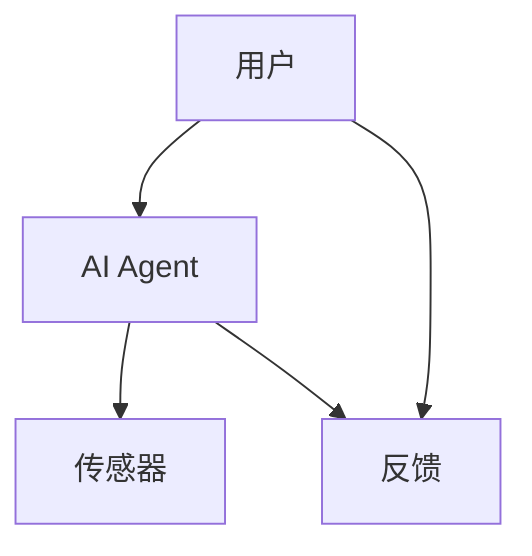
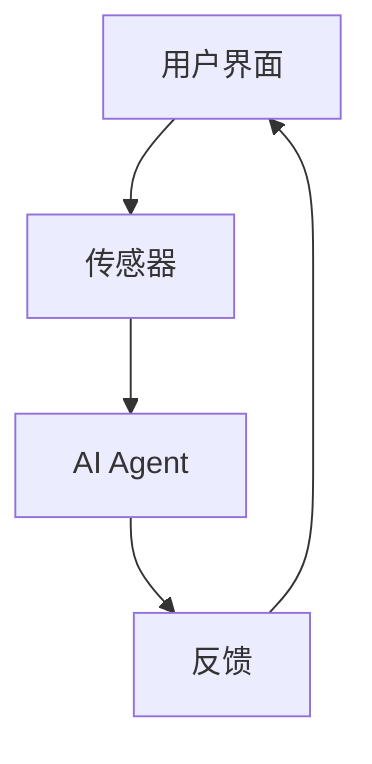

                 


# 智能瑜伽球：AI Agent的平衡训练指导

## 关键词：
智能瑜伽球、AI Agent、平衡训练、人工智能、运动指导

## 摘要：
智能瑜伽球通过集成AI Agent技术，能够实时分析用户的动作并提供个性化的平衡训练指导。本文深入探讨了AI Agent在智能瑜伽球中的应用，从背景介绍、核心概念到算法原理、系统架构，再到项目实战和总结，全面解析了智能瑜伽球的设计与实现过程。通过本文，读者可以理解如何利用AI技术提升瑜伽训练的效果和安全性。

---

## 第一部分：背景介绍

### 第1章：传统瑜伽训练的局限性

#### 1.1 瑜伽训练的定义与重要性
瑜伽是一种结合了身体、呼吸和冥想的练习方式，旨在提高身体的柔韧性、平衡性、力量和心理健康。传统瑜伽训练主要依赖于教练的指导和用户的自我练习，但存在以下问题：
- 用户可能缺乏正确的姿势指导，容易受伤。
- 瑜伽动作的难度和进度无法根据用户的能力自动调整。
- 瑜伽训练缺乏数据分析和个性化建议。

#### 1.2 现代人对瑜伽训练的需求变化
随着生活节奏的加快，人们对健康和身心平衡的需求日益增加。然而，许多人因为工作繁忙或缺乏专业指导，难以坚持系统的瑜伽训练。智能设备的普及为瑜伽训练提供了新的可能性。

#### 1.3 传统瑜伽训练中的常见问题
- 缺乏实时反馈，用户难以纠正错误姿势。
- 瑜伽动作的难度和进度无法个性化调整。
- 瑜伽训练缺乏数据分析和科学指导。

---

### 第2章：AI Agent与智能瑜伽球的结合

#### 2.1 AI Agent的基本概念
AI Agent是一种能够感知环境、做出决策并执行动作的智能实体。它能够通过传感器获取数据，利用算法进行分析，并根据结果采取相应的行动。

#### 2.2 智能瑜伽球的定义与目标
智能瑜伽球是一种结合了AI技术的瑜伽训练设备，能够通过内置的传感器感知用户的动作，并通过AI Agent提供实时反馈和个性化指导。其目标是帮助用户安全、高效地进行瑜伽训练，避免受伤，提高训练效果。

#### 2.3 智能瑜伽球的核心目标
- 提供实时的姿势纠正和反馈。
- 根据用户的水平自动调整训练难度。
- 提供个性化的训练计划和建议。

---

## 第二部分：AI Agent的核心原理与概念

### 第3章：AI Agent的核心原理

#### 3.1 AI Agent的感知、决策与执行机制
AI Agent通过以下三个步骤实现其功能：
1. **感知**：通过传感器获取环境数据。
2. **决策**：利用算法对数据进行分析，做出决策。
3. **执行**：根据决策结果执行相应的动作。

#### 3.2 AI Agent的核心算法概述
AI Agent的核心算法包括：
- 强化学习：通过奖励机制优化决策。
- 监督学习：通过标记数据进行分类和回归。
- 无监督学习：通过聚类和降维技术发现数据中的模式。

#### 3.3 AI Agent与智能瑜伽球的结合方式
智能瑜伽球通过以下方式结合AI Agent：
- 传感器数据采集：通过内置的加速度计、陀螺仪等传感器获取用户的动作数据。
- 数据分析：利用AI算法分析用户的动作，识别错误姿势。
- 实时反馈：通过语音或视觉提示纠正用户的姿势。

---

### 第4章：AI Agent的属性特征对比

#### 4.1 不同AI Agent的属性对比
| 特性       | 传统AI Agent | 基于强化学习的AI Agent | 基于监督学习的AI Agent |
|------------|--------------|------------------------|------------------------|
| 决策方式   | 基于规则     | 基于奖励机制           | 基于标记数据           |
| 应用场景   | 静态环境     | 动态环境               | 数据丰富的环境           |
| 灵活性     | 较低         | 较高                   | 中等                   |

#### 4.2 智能瑜伽球AI Agent的特征分析
智能瑜伽球AI Agent具有以下特征：
- 实时性：能够快速响应用户的动作。
- 个性化：根据用户的水平调整训练计划。
- 可扩展性：能够不断优化算法，提升性能。

#### 4.3 AI Agent的ER实体关系图


---

## 第三部分：算法原理与系统架构设计

### 第5章：AI Agent的算法原理

#### 5.1 强化学习算法
强化学习是一种通过奖励机制优化决策的算法。在智能瑜伽球中，AI Agent可以通过强化学习优化用户的动作反馈。

#### 5.2 算法原理的数学模型
强化学习的数学模型如下：
$$ R = r_1 + r_2 + \dots + r_n $$
其中，$R$ 是累积奖励，$r_i$ 是每一步的奖励。

#### 5.3 算法实现的代码示例
```python
import numpy as np
import gym

env = gym.make('CartPole-v0')
env.seed(42)

agent = AI_AGENT(env.observation_space.shape[0], env.action_space.n)

for episode in range(1000):
    state = env.reset()
    total_reward = 0
    done = False
    while not done:
        action = agent.act(state)
        next_state, reward, done, info = env.step(action)
        agent.remember(state, action, reward, next_state)
        agent.replay()
        state = next_state
        total_reward += reward
    print(f"Episode {episode}: Total Reward = {total_reward}")
```

---

### 第6章：系统架构与交互设计

#### 6.1 问题场景与项目介绍
智能瑜伽球的系统架构包括传感器、AI Agent、用户交互界面和反馈模块。

#### 6.2 系统功能设计
| 模块       | 功能描述                       |
|------------|------------------------------|
| 用户交互模块 | 提供用户输入和反馈             |
| 传感器数据采集模块 | 采集用户的动作数据           |
| AI Agent模块 | 分析数据并生成反馈           |
| 反馈模块   | 提供实时反馈和个性化建议       |

#### 6.3 系统架构图


---

## 第四部分：项目实战与总结

### 第7章：环境安装与系统实现

#### 7.1 环境安装
安装所需的Python库：
```bash
pip install numpy gym tensorflow
```

#### 7.2 核心功能实现
实现AI Agent的核心功能：
```python
class AI_AGENT:
    def __init__(self, state_size, action_size):
        self.state_size = state_size
        self.action_size = action_size
        # 简单的感知器网络
        self.model = self.build_model()

    def build_model(self):
        model = Sequential()
        model.add(Dense(32, input_dim=self.state_size, activation='relu'))
        model.add(Dense(self.action_size, activation='linear'))
        model.compile(optimizer='adam', loss='mse')
        return model
```

#### 7.3 案例分析
通过实际案例分析AI Agent在智能瑜伽球中的应用效果。

---

### 第8章：项目总结与注意事项

#### 8.1 项目总结
智能瑜伽球通过AI Agent技术实现了实时反馈和个性化指导，显著提升了瑜伽训练的效果和安全性。

#### 8.2 注意事项
- 硬件精度：传感器的精度直接影响AI Agent的反馈准确性。
- 数据隐私：用户的动作数据需要严格加密和保护。
- 算法优化：需要不断优化AI算法，提高反馈的实时性和准确性。

#### 8.3 拓展阅读
- 加强学习在运动指导中的应用
- 智能设备与AI技术的结合

---

## 作者：AI天才研究院 & 禅与计算机程序设计艺术

