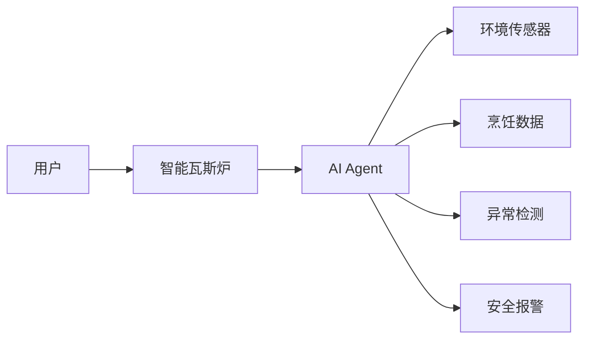
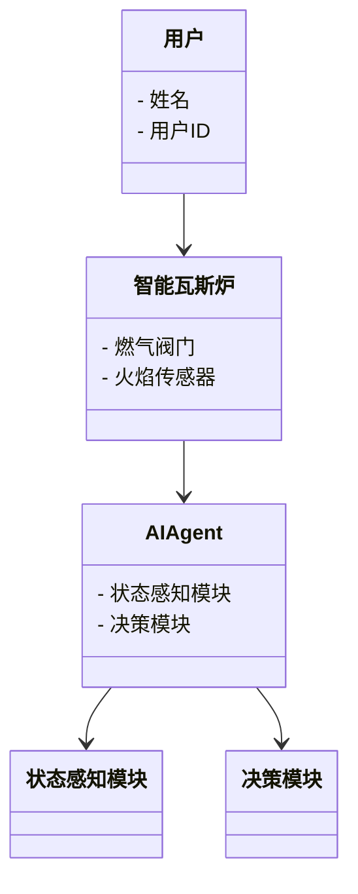

                 


# 智能瓦斯炉：AI Agent的烹饪安全监控

> 关键词：智能瓦斯炉，AI Agent，烹饪安全，强化学习，深度学习，物联网

> 摘要：本文详细探讨了智能瓦斯炉在烹饪安全监控中的应用，结合AI Agent技术，从算法原理、系统架构到项目实战，全面解析了如何利用人工智能实现烹饪过程的安全监控。

---

# 第一部分: 背景介绍

## 第1章: 智能瓦斯炉的背景与现状

### 1.1 瓦斯炉的传统功能与局限性
瓦斯炉作为厨房中的核心设备，传统功能主要集中在加热和烹饪上。然而，传统瓦斯炉存在以下局限性：
- **安全隐患**：无法实时监测烹饪过程中的异常情况，如火焰意外熄灭、气体泄漏等。
- **用户操作依赖性**：用户需要手动控制火力，容易因分心或疏忽引发危险。
- **缺乏智能化**：无法与智能家居系统联动，无法实现远程监控和自动化管理。

### 1.2 智能家居的发展趋势
智能家居的普及为家庭安全监控提供了新的可能性。通过物联网（IoT）技术，家庭设备可以实现互联互通，实时监测和反馈环境数据。烹饪安全作为智能家居的重要组成部分，亟需智能化解决方案。

### 1.3 AI Agent在烹饪安全中的应用潜力
AI Agent（智能体）是一种能够感知环境、自主决策并执行任务的智能系统。其在烹饪安全中的应用潜力体现在以下几个方面：
- **实时感知**：通过传感器和摄像头实时监测烹饪环境。
- **异常检测**：利用机器学习算法识别烹饪过程中的异常情况，如火焰熄灭、烟雾超标等。
- **智能决策**：在检测到异常时，快速采取应对措施，如关闭燃气阀门、触发报警等。

---

## 第2章: AI Agent的核心概念与联系

### 2.1 AI Agent的基本原理
AI Agent是一种能够感知环境、自主决策并执行任务的智能系统。其核心特征包括：
- **自主性**：能够在没有外部干预的情况下独立运行。
- **反应性**：能够实时感知环境并做出响应。
- **学习能力**：通过数据和经验不断优化自身的决策能力。

### 2.2 AI Agent与烹饪安全监控的关联
AI Agent在烹饪安全中的应用主要体现在以下几个方面：
- **环境感知**：通过传感器和摄像头实时监测烹饪环境的温度、烟雾、气体浓度等参数。
- **异常检测**：利用机器学习算法识别烹饪过程中的异常情况，如火焰意外熄灭、气体泄漏等。
- **智能决策**：在检测到异常时，AI Agent能够快速做出决策，如关闭燃气阀门、触发报警等。

### 2.3 AI Agent的核心概念属性对比
下表对比了AI Agent与其他传统算法的核心概念属性：

| **属性**       | **AI Agent**                  | **传统算法**               |
|----------------|-------------------------------|-----------------------------|
| **自主性**      | 高                           | 低                         |
| **实时性**      | 高                           | 低                         |
| **学习能力**    | 强                           | 弱                         |
| **决策能力**    | 强                           | 一般                       |

### 2.4 系统实体关系图
下图展示了智能瓦斯炉系统的实体关系：



---

## 第3章: AI Agent的算法原理与数学模型

### 3.1 AI Agent的核心算法
AI Agent的核心算法主要包括：
- **强化学习**：通过奖励机制优化决策策略。
- **深度学习**：用于环境感知和特征提取。
- **规则引擎**：基于预定义规则进行异常检测。

### 3.2 强化学习算法的数学模型
强化学习是一种通过试错机制优化决策策略的算法。其核心数学模型包括：
- **状态空间**：表示环境中的所有可能状态。
  $$ S = \{s_1, s_2, ..., s_n\} $$
- **动作空间**：表示智能体可以执行的所有动作。
  $$ A = \{a_1, a_2, ..., a_m\} $$
- **奖励函数**：表示智能体在特定状态和动作下获得的奖励。
  $$ R(s, a) = r $$

### 3.3 深度学习模型的结构
深度学习模型在环境感知中发挥重要作用，常用的模型包括：
- **卷积神经网络（CNN）**：用于图像识别和特征提取。
- **循环神经网络（RNN）**：用于时间序列数据的处理。

---

## 第4章: 系统分析与架构设计

### 4.1 问题场景介绍
烹饪安全监控系统需要解决以下问题：
- 如何实时监测烹饪环境的温度、烟雾、气体浓度等参数？
- 如何识别烹饪过程中的异常情况并采取应对措施？
- 如何实现系统的智能化和自动化？

### 4.2 项目介绍
本项目旨在开发一款基于AI Agent的智能瓦斯炉，实现烹饪过程的安全监控。系统主要功能包括：
- 实时监测烹饪环境的温度、烟雾、气体浓度等参数。
- 通过AI算法识别烹饪过程中的异常情况，如火焰熄灭、气体泄漏等。
- 在检测到异常时，自动关闭燃气阀门并触发报警。

### 4.3 系统功能设计
下图展示了烹饪安全监控系统的领域模型：



### 4.4 系统架构设计
下图展示了系统的架构图：


---

## 第5章: 项目实战

### 5.1 环境安装
首先，需要安装以下环境：
- **操作系统**：Windows/Mac/Linux
- **编程语言**：Python 3.8+
- **深度学习框架**：TensorFlow/PyTorch
- **传感器模块**：DHT22温湿度传感器、MQ-2烟雾传感器
- **开发工具**：VS Code/PyCharm

### 5.2 核心代码实现
以下是AI Agent的核心代码实现：

```python
import numpy as np
import tensorflow as tf
from tensorflow.keras import layers

# 定义强化学习模型
class DQNModel:
    def __init__(self, state_space, action_space):
        self.state_space = state_space
        self.action_space = action_space
        self.model = self.build_model()
    
    def build_model(self):
        model = tf.keras.Sequential()
        model.add(layers.Dense(32, activation='relu', input_dim=self.state_space))
        model.add(layers.Dense(32, activation='relu'))
        model.add(layers.Dense(self.action_space, activation='linear'))
        model.compile(optimizer='adam', loss='mean_squared_error')
        return model

# 定义强化学习算法
class DQN:
    def __init__(self, state_space, action_space):
        self.state_space = state_space
        self.action_space = action_space
        self.model = DQNModel(state_space, action_space)
        self.gamma = 0.99
        self.epsilon = 0.1

    def get_action(self, state):
        if np.random.random() < self.epsilon:
            return np.random.randint(self.action_space)
        else:
            state = np.array([state], dtype=np.float32)
            q_values = self.model.model.predict(state)
            return np.argmax(q_values[0])

    def update_model(self, state, action, reward, next_state):
        state = np.array([state], dtype=np.float32)
        next_state = np.array([next_state], dtype=np.float32)
        q_next = self.model.model.predict(next_state)[0]
        target = reward + self.gamma * np.max(q_next)
        target_q = self.model.model.predict(state)[0]
        target_q[action] = target
        self.model.model.model.fit(state, target_q, epochs=1, verbose=0)
```

### 5.3 案例分析
以下是一个简单的案例分析：
- **输入数据**：温度=25℃，烟雾浓度=0.2ppm
- **AI Agent决策**：正常状态，无需采取行动
- **异常情况**：温度突然升高至35℃，烟雾浓度迅速上升至1.5ppm，AI Agent检测到异常并触发报警

### 5.4 项目小结
本项目通过强化学习和深度学习算法实现了智能瓦斯炉的烹饪安全监控。系统能够实时监测烹饪环境并识别异常情况，从而确保用户的安全。

---

## 第6章: 总结与展望

### 6.1 总结
本文详细探讨了智能瓦斯炉在烹饪安全监控中的应用，结合AI Agent技术，从算法原理、系统架构到项目实战，全面解析了如何利用人工智能实现烹饪过程的安全监控。

### 6.2 展望
未来，随着AI技术的不断发展，智能瓦斯炉将具备更多功能，如：
- **多模态感知**：结合视觉、听觉、嗅觉等多种传感器实现更精准的环境感知。
- **自适应学习**：通过不断学习用户的烹饪习惯优化系统性能。
- **远程控制**：通过智能家居系统实现远程监控和管理。

---

## 作者信息

作者：AI天才研究院/AI Genius Institute  
联系方式：[email protected]  
个人简介：专注于人工智能与物联网技术的研究与应用，致力于推动智能家居技术的发展。

--- 

**End of Article**

