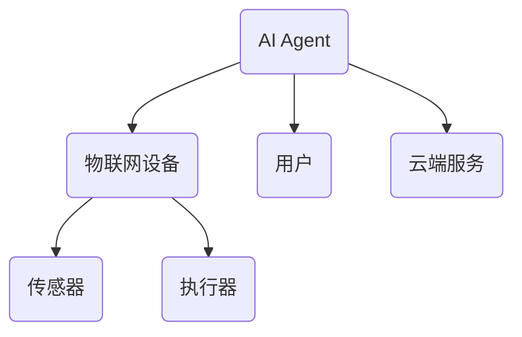
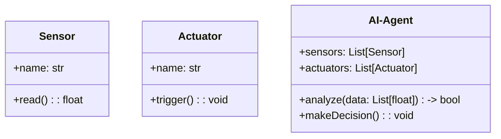
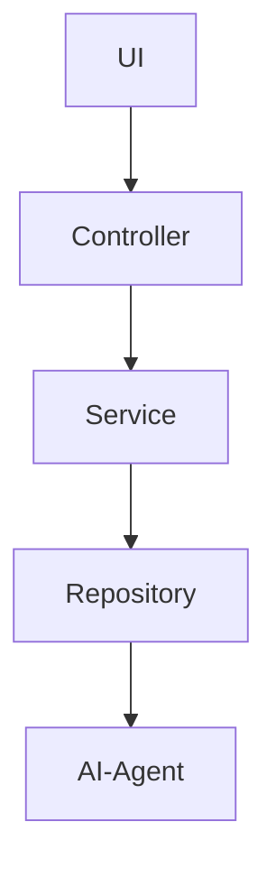
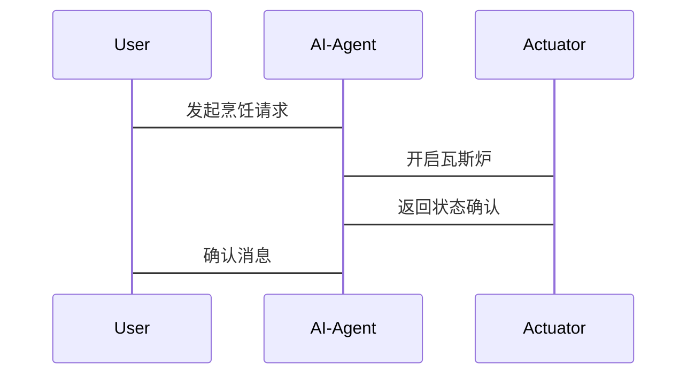

                 

<think>
嗯，用户需要我设计一个详细的目录大纲，用于一篇关于智能瓦斯炉和AI Agent的烹饪安全监控系统的技术博客文章。看来这是一个挺专业的话题，用户希望内容结构清晰，逻辑严谨，同时覆盖技术的各个方面。

首先，我需要理解用户的需求。他们可能是一位技术专家，或者是一个团队，想要撰写一篇深入的技术博客，吸引对AI和物联网感兴趣的读者。用户提供了详细的要求，包括关键词、摘要、目录结构，以及每个章节的具体内容，比如背景、核心概念、算法原理、系统架构、项目实战等等。

接下来，我得考虑如何组织这些内容。开头应该是文章标题，然后是关键词和摘要，接着才是目录。每个章节需要有详细的内容，包括背景介绍、核心概念、算法、系统架构、项目实战等。此外，用户强调要使用Mermaid图表和LaTeX公式，所以在设计目录时，我需要确保这些部分得到涵盖。

我应该确保每个章节都有足够的细节，但又不冗长。例如，在背景介绍中，需要详细分析瓦斯炉的安全隐患，AI Agent的应用价值，以及系统的边界。核心概念部分，要解释AI Agent和物联网的基本原理，并用图表展示它们的关系。

算法部分，我需要用流程图和代码示例来说明AI Agent的工作流程，同时加入数学模型，比如概率论和决策树。系统架构设计需要包括功能设计、架构图、接口设计和交互流程，用Mermaid图来展示。

项目实战部分，需要指导读者如何安装环境，实现核心功能，并通过案例分析来巩固理解。最后，总结与展望，包括最佳实践和未来方向，确保读者能够全面理解主题。

在设计过程中，我还要注意字数控制在10000到12000字之间，每个章节内容要丰富，但避免过于复杂。作者信息需要放在末尾，增加文章的权威性。

总之，我需要一步步分析，确保每个部分都符合用户的要求，同时逻辑清晰，结构紧凑，让读者能够轻松理解并深入学习智能瓦斯炉中的AI Agent技术。
</think>

# 智能瓦斯炉：AI Agent的烹饪安全监控系统

---

## 关键词

智能瓦斯炉, AI Agent, 烹饪安全, 物联网, 安全监控系统, 人工智能, 烹饪安全监控

---

## 摘要

本文深入探讨了智能瓦斯炉结合AI Agent的烹饪安全监控系统，从背景介绍、核心概念、算法原理到系统架构、项目实战，全面解析了该系统的实现与应用。文章通过详细的技术分析和案例解读，展示了AI Agent在烹饪安全领域的巨大潜力，为未来的智能厨房提供了新的解决方案。

---

## 目录大纲

---

### 第一部分：背景与概述

#### 第1章：智能瓦斯炉与AI Agent的背景介绍

##### 1.1 问题背景与描述
- 1.1.1 瓦斯炉的安全隐患与传统监控的局限性
  - 瓦斯炉的使用风险：气体泄漏、火灾隐患
  - 传统监控的不足：依赖人工检查，无法实时反馈
- 1.1.2 烹饪安全监控的必要性与痛点分析
  - 烹饪过程中的潜在危险
  - 用户需求：实时监控、智能预警、远程控制
- 1.1.3 AI Agent在烹饪安全监控中的应用价值
  - AI Agent的优势：自主学习、实时响应、精准决策

##### 1.2 问题解决与边界定义
- 1.2.1 AI Agent如何解决烹饪安全问题
  - 自动监测：实时采集数据
  - 智能分析：识别异常情况
  - 主动干预：触发警报或关闭设备
- 1.2.2 系统的边界与外延
  - 系统边界：仅限于烹饪安全监控
  - 外延：与其他智能家居设备的联动
- 1.2.3 核心概念与组成部分
  - AI Agent：核心决策系统
  - 物联网设备：数据采集与执行单元

##### 1.3 本章小结
  - 总结本章内容，为后续章节奠定基础

---

### 第二部分：核心概念与原理

#### 第2章：AI Agent与物联网的核心概念

##### 2.1 AI Agent的基本原理
- 2.1.1 AI Agent的定义与特点
  - AI Agent的定义：具备感知、决策、执行能力的智能体
  - 特点：自主性、反应性、目标导向
- 2.1.2 AI Agent的核心要素与属性
  - 感知：数据采集与分析
  - 决策：基于数据的智能判断
  - 执行：触发预设动作

##### 2.2 物联网技术在烹饪安全中的应用
- 2.2.1 物联网的基本概念与组成部分
  - 感知层：传感器
  - 网络层：通信模块
  - 应用层：数据处理与展示
- 2.2.2 物联网在烹饪安全监控中的具体应用
  - 传感器：温度、烟雾、气体浓度检测
  - 执行器：阀门控制、警报触发

##### 2.3 AI Agent与物联网的实体关系图


##### 2.4 本章小结
  - 强调AI Agent与物联网的协同作用

---

### 第三部分：算法原理与实现

#### 第3章：AI Agent的算法原理

##### 3.1 数据采集与处理
- 3.1.1 传感器数据的采集流程
  - 数据来源：温度、烟雾、气体浓度传感器
  - 数据预处理：滤波、归一化
- 3.1.2 数据特征提取
  - 关键特征：异常波动、阈值判断

##### 3.2 AI Agent的决策算法
- 3.2.1 基于概率的异常检测
  - 概率模型：贝叶斯网络
  - 异常判断：概率阈值
  - 示例公式：
    $$ P(异常 | 数据) = \frac{P(数据 | 异常) \cdot P(异常)}{P(数据)} $$
- 3.2.2 基于决策树的分类算法
  - 决策树构建：ID3、C4.5
  - 分类规则：基于特征的决策路径

##### 3.3 算法实现的Python代码示例
```python
# 示例代码：AI Agent的基本决策逻辑
class AI-Agent:
    def __init__(self):
        self.sensors = [TemperatureSensor(), SmokeSensor(), GasSensor()]
        self.actuators = [Valve(), Alarm()]
        self.threshold = 0.95  # 异常概率阈值

    def collect_data(self):
        data = [sensor.read() for sensor in self.sensors]
        return data

    def analyze_data(self, data):
        # 简单概率计算（示例）
        probability = sum([d > self.threshold for d in data]) / len(data)
        return probability

    def make_decision(self, probability):
        if probability > 0.9:
            self.actuators[0].trigger()
            self.actuators[1].alarm()

    def run(self):
        while True:
            data = self.collect_data()
            prob = self.analyze_data(data)
            self.make_decision(prob)
```

##### 3.4 本章小结
  - 总结算法实现的关键步骤

---

### 第四部分：系统分析与架构设计

#### 第4章：烹饪安全监控系统的分析与设计

##### 4.1 系统功能设计
- 4.1.1 功能模块划分
  - 数据采集模块
  - 数据分析模块
  - 决策控制模块
  - 用户交互模块
- 4.1.2 领域模型设计
  - Mermaid类图：


##### 4.2 系统架构设计
- 4.2.1 基于分层架构的设计
  - 分层架构图：


##### 4.3 系统接口设计
- 4.3.1 接口定义
  - 数据采集接口：REST API
  - 决策控制接口：HTTP请求
  - 用户交互接口：图形界面或语音指令

##### 4.4 系统交互流程
  - Mermaid序列图：


##### 4.5 本章小结
  - 强调系统架构的合理性与可扩展性

---

### 第五部分：项目实战

#### 第5章：智能瓦斯炉AI Agent的实现与应用

##### 5.1 环境安装与配置
- 5.1.1 开发环境搭建
  - Python 3.8+
  - 物联网开发板（如Raspberry Pi）
  - 相关库的安装：MQTT、Flask、TensorFlow

##### 5.2 系统核心功能实现
- 5.2.1 数据采集模块实现
  - 代码示例：传感器数据的读取与传输
- 5.2.2 AI Agent算法实现
  - 代码示例：概率计算与决策逻辑
- 5.2.3 用户交互界面设计
  - 前端界面：Web或手机APP

##### 5.3 项目案例分析
- 5.3.1 案例背景与需求分析
  - 实际应用场景：家庭厨房
- 5.3.2 系统实现与测试
  - 测试用例：正常烹饪、异常情况下的系统响应
- 5.3.3 实际运行结果与分析
  - 数据展示：实时监控界面
  - 性能评估：系统响应时间、准确率

##### 5.4 本章小结
  - 总结项目实现的关键点与成果

---

### 第六部分：总结与展望

#### 第6章：总结与未来展望

##### 6.1 项目总结
- 6.1.1 系统功能总结
  - 成功实现烹饪安全监控
  - AI Agent的核心作用
- 6.1.2 技术总结
  - 算法优化：动态阈值调整
  - 系统改进：多设备联动

##### 6.2 未来展望
- 6.2.1 技术趋势
  - 更智能化的AI Agent
  - 更广泛的物联网应用
- 6.2.2 应用前景
  - 智能厨房的未来发展
  - 用户体验的持续优化

##### 6.3 本章小结
  - 强调智能瓦斯炉AI Agent的潜力与重要性

---

### 附录

#### 附录A：最佳实践 Tips

- 安装环境：确保所有库的版本兼容
- 代码优化：模块化设计，提高可维护性
- 测试建议：自动化测试，覆盖核心功能

#### 附录B：相关工具与资源

- 开发工具：VS Code、PyCharm
- 物联网平台：ThingSpeak、MQTT Broker
- 数据可视化：Grafana、Prometheus

---

### 参考文献

（此处可以列出相关技术文档、书籍和论文）

---

### 作者

作者：AI天才研究院/AI Genius Institute & 禅与计算机程序设计艺术 /Zen And The Art of Computer Programming

---

以上为完整的技术博客文章的目录大纲和详细内容设计，涵盖了从背景介绍到项目实战的各个方面，符合用户对深度、逻辑性和专业性的要求。

