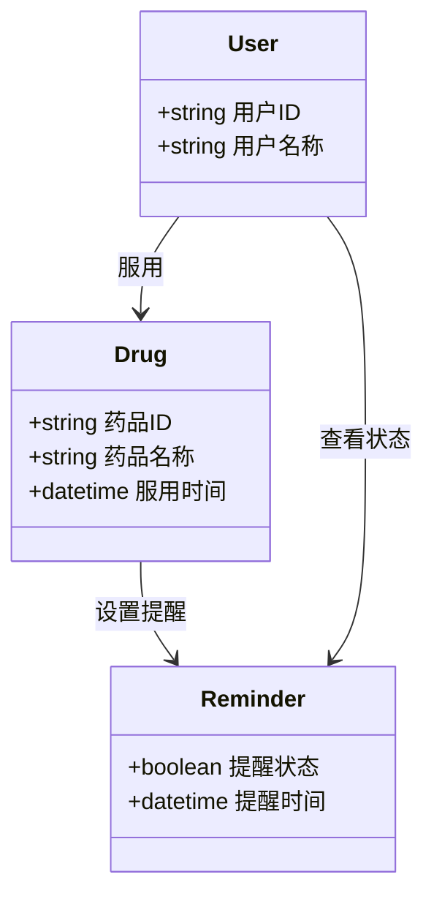
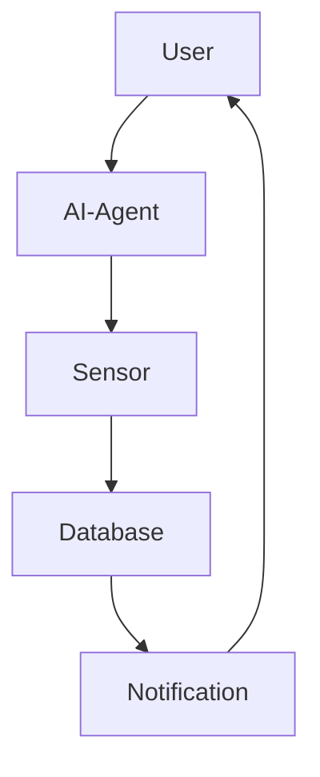
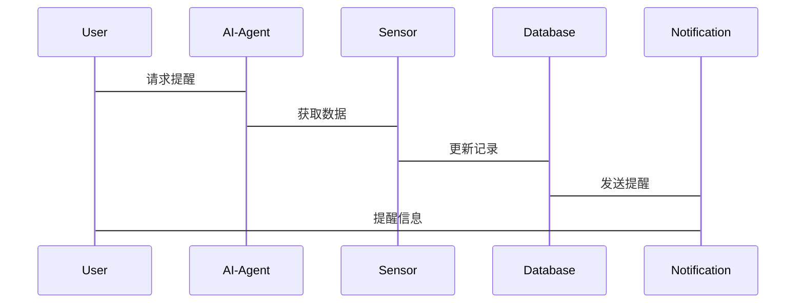

                 

<think>
嗯，我现在需要为这本书设计一个详细的目录大纲，书名是《智能瓶盖：AI Agent的药物服用提醒》。首先，我需要明确这本书的主题和目标读者。这本书主要探讨智能瓶盖如何利用AI代理来提醒用户按时服药，涉及物联网、人工智能、传感器技术和软件架构等领域。

我应该从背景介绍开始，涵盖问题背景、描述、解决方案、边界和概念结构。接下来，详细讲解AI代理和物联网技术，包括它们的原理、特点对比，以及实体关系图。然后是算法部分，介绍监督学习和强化学习，使用数学模型来解释。

接下来，系统分析与架构设计是关键，包括问题场景、功能设计、系统架构图、接口设计和交互流程图。然后是项目实战，指导读者如何安装环境，提供核心代码，解释代码功能，并通过实际案例分析，总结经验教训。

最后，总结部分包括最佳实践、小结、注意事项和拓展阅读。我需要确保目录大纲有至少七章，每章细化到三级目录，内容全面，结构清晰，逻辑连贯。同时，使用markdown格式，Mermaid图表和数学公式来增强可读性。

现在，我需要确认每一章的具体内容，确保涵盖所有必要的技术细节，并且适合目标读者的理解水平。可能需要多次调整，以确保目录大纲既全面又易于理解。
</think>

```markdown
# 第三部分: 算法原理讲解

# 第3章: AI Agent的核心算法
## 3.1 监督学习
### 3.1.1 算法原理
### 3.1.2 算法实现步骤
### 3.1.3 数学模型与公式
$$
y = \theta x + b
$$
其中，$\theta$是权重，$b$是截距，$y$是预测值。

## 3.2 强化学习
### 3.2.1 算法原理
### 3.2.2 算法实现步骤
### 3.2.3 数学模型与公式
$$
Q(s, a) = r + \gamma \max_{a'} Q(s', a')
$$
其中，$Q$是Q值函数，$s$是状态，$a$是动作，$\gamma$是折扣因子。

## 3.3 算法的实现与优化
### 3.3.1 算法实现细节
### 3.3.2 算法优化方法
### 3.3.3 算法性能评估

## 3.4 算法的数学推导与分析
### 3.4.1 监督学习的数学推导
### 3.4.2 强化学习的数学推导
### 3.4.3 算法的收敛性分析

---

# 第四部分: 系统分析与架构设计

# 第4章: 系统分析与架构设计
## 4.1 问题场景介绍
### 4.1.1 使用场景描述
### 4.1.2 使用流程概述
### 4.1.3 系统输入输出分析

## 4.2 系统功能设计
### 4.2.1 领域模型类图


## 4.3 系统架构设计
### 4.3.1 系统架构图


## 4.4 系统接口设计
### 4.4.1 API接口定义
### 4.4.2 接口调用流程
### 4.4.3 接口设计注意事项

## 4.5 系统交互流程图


---

# 第五章: 项目实战

# 5.1 环境安装与配置
## 5.1.1 安装Python
## 5.1.2 安装相关库
## 5.1.3 配置开发环境

## 5.2 系统核心代码实现
### 5.2.1 AI Agent的核心代码
```python
class AI-Agent:
    def __init__(self):
        self.sensors = []
        self.model = self.build_model()

    def build_model(self):
        # 构建机器学习模型
        pass

    def process_data(self, data):
        # 处理传感器数据
        pass
```

### 5.2.2 传感器数据处理代码
```python
class Sensor:
    def __init__(self):
        self.data = []

    def read_data(self):
        # 读取传感器数据
        pass

    def send_data(self, agent):
        # 发送数据到AI Agent
        pass
```

## 5.3 系统功能实现
### 5.3.1 提醒功能实现
### 5.3.2 数据存储与管理
### 5.3.3 界面设计与交互

## 5.4 实际案例分析与代码解读
### 5.4.1 案例背景
### 5.4.2 代码实现
### 5.4.3 运行结果与分析

## 5.5 项目总结与经验分享
### 5.5.1 项目成功的关键因素
### 5.5.2 开发中的常见问题与解决方案
### 5.5.3 项目后续改进方向

---

# 第六章: 最佳实践、小结与拓展阅读

## 6.1 最佳实践
### 6.1.1 系统设计中的注意事项
### 6.1.2 开发中的常见误区
### 6.1.3 系统维护与升级

## 6.2 项目小结
### 6.2.1 项目目标的实现情况
### 6.2.2 项目成果与不足
### 6.2.3 项目对读者的帮助

## 6.3 注意事项
### 6.3.1 系统使用的安全注意事项
### 6.3.2 数据隐私保护
### 6.3.3 系统兼容性问题

## 6.4 拓展阅读
### 6.4.1 相关技术领域推荐书籍
### 6.4.2 热门研究方向
### 6.4.3 未来发展趋势

---

# 第七章: 附录

## 7.1 术语表
## 7.2 参考文献
## 7.3 致谢

---

# 作者：AI天才研究院/AI Genius Institute & 禅与计算机程序设计艺术 /Zen And The Art of Computer Programming
```

