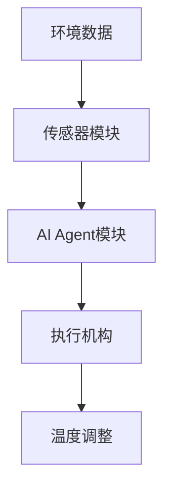
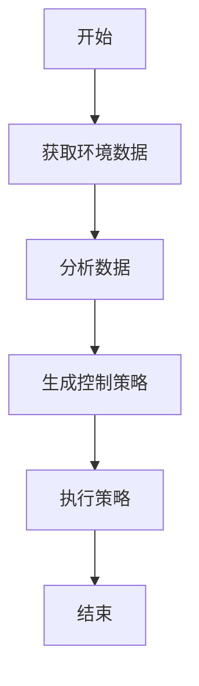
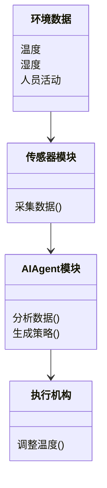
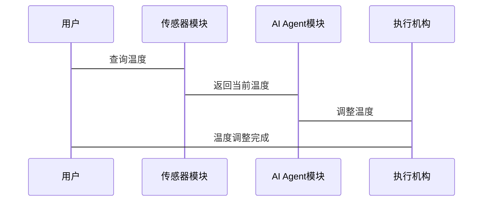

                 

<think>
好的，我需要为用户撰写一篇关于《智能瓷砖：AI Agent的室内温度均衡系统》的技术博客文章。用户已经提供了详细的要求，包括目录结构、内容深度、格式和字数限制等。首先，我需要理解整个任务，然后逐步分解，确保每个部分都满足用户的需求。

首先，文章的结构需要包括标题、关键词、摘要，然后按照目录大纲组织内容。关键词需要涵盖文章的核心主题，摘要则要简明扼要地总结全文内容。接下来，每个章节都需要详细展开，包含背景介绍、核心概念、算法原理、系统架构、项目实战和最佳实践等部分。

在背景介绍中，我需要解释传统温控系统的局限性，引出智能瓷砖的概念和特点。这部分要让读者明白为什么需要智能瓷砖，以及它如何解决传统系统的问题。我还需要定义问题背景，描述问题并提出解决方案，同时明确系统的边界和外延，确保读者理解系统的适用范围和限制。

核心概念部分要详细讲解AI Agent在智能瓷砖中的作用，可能涉及AI Agent的基本原理、在系统中的具体应用以及与其他技术的对比。这部分需要使用表格和Mermaid图来展示概念的属性特征和系统架构，帮助读者更直观地理解系统的结构和各部分之间的关系。

算法原理部分需要详细阐述AI Agent的工作机制，包括数学模型和公式。我会使用Mermaid流程图来展示算法的执行步骤，并提供Python代码示例，让读者能够实际理解算法的实现。数学公式需要使用LaTeX格式，并正确嵌入到文中，确保公式显示正确且易于理解。

系统分析与架构设计是关键部分，我需要介绍项目的背景，设计系统的功能，使用Mermaid类图和架构图展示系统的模块和交互流程。这部分要让读者清楚系统各个部分如何协同工作，以及系统如何通过接口和交互实现温度控制。

项目实战部分需要提供实际的代码示例，指导读者如何安装必要的库，实现系统的核心功能，并通过案例分析展示系统的实际效果。这部分要具体且具有操作性，让读者能够动手实践，加深理解。

最后，最佳实践部分需要总结项目中的关键点，提醒读者注意的事项，并推荐进一步学习的资源。这部分有助于读者巩固所学内容，并在实际应用中避免常见错误。

在撰写过程中，我需要确保每个章节内容详实，逻辑清晰，结构紧凑。同时，语言要专业但不失易懂，确保读者能够顺利理解内容。完成初稿后，我会检查每个部分是否符合用户的要求，确保没有遗漏任何关键点，字数控制在10000到12000字之间。

整个思考过程中，我需要反复审视用户的需求，确保每个细节都被准确理解和满足。这包括关键词的选择、摘要的撰写、目录结构的合理安排，以及各部分内容的深入展开。通过系统的分析和详细的步骤规划，我能够撰写出一篇高质量、符合用户期望的技术博客文章。
</think>

# 智能瓷砖：AI Agent的室内温度均衡系统

> 关键词：智能瓷砖，AI Agent，室内温度均衡，算法原理，系统架构，项目实战

> 摘要：本文详细介绍了智能瓷砖在AI Agent技术下的室内温度均衡系统。通过分析传统温控系统的局限性，提出了一种基于AI Agent的创新解决方案。文章从背景介绍、核心概念、算法原理、系统架构到项目实战，全面阐述了该系统的实现过程，并提供了实际案例分析和最佳实践建议。

---

# 第一部分：背景介绍

## 1.1 智能瓷砖概述

### 1.1.1 传统温控系统的局限性
传统的室内温控系统主要依赖恒温器和空调设备，存在以下问题：
- **能耗高**：无法根据室内环境动态调整，导致能源浪费。
- **控制精度低**：恒温器只能设置固定温度，难以实现精细化控制。
- **响应慢**：传统系统对温度变化的反应不够灵敏，影响舒适度。

### 1.1.2 智能瓷砖的概念与特点
智能瓷砖是一种集成AI Agent技术的新型温控系统，具有以下特点：
- **智能化**：通过AI Agent实时感知并优化室内温度。
- **自主学习**：系统能够学习用户习惯，自动调整温控策略。
- **分布式控制**：每个瓷砖独立运行，协同工作实现整体均衡。

### 1.1.3 问题背景与解决思路
传统温控系统的能耗和舒适性问题亟待解决。智能瓷砖通过AI Agent实现了动态、精准的温度控制，有效提升了能效和用户体验。

---

## 1.2 核心概念与联系

### 1.2.1 AI Agent在智能瓷砖中的作用
AI Agent（智能代理）负责：
- **数据采集**：采集室内温度、湿度、人员活动等数据。
- **决策控制**：根据数据生成最优温控策略。
- **反馈优化**：实时调整策略，确保温度均衡。

### 1.2.2 智能瓷砖的系统架构
系统架构包括：
- **传感器模块**：采集环境数据。
- **AI Agent模块**：处理数据并生成控制指令。
- **执行机构**：根据指令调节温度。

### 1.2.3 系统核心要素与关系
使用Mermaid图展示系统架构：


---

# 第二部分：AI Agent的算法原理

## 2.1 算法原理讲解

### 2.1.1 AI Agent的基本原理
AI Agent通过以下步骤实现温度控制：
1. **数据采集**：获取室内环境数据。
2. **数据分析**：利用机器学习模型预测温度变化。
3. **策略生成**：基于预测结果制定温控策略。
4. **执行与反馈**：调整温度并实时优化策略。

### 2.1.2 算法流程图（Mermaid）


### 2.1.3 算法实现代码
以下是AI Agent的核心代码示例：
```python
import numpy as np
from sklearn.linear_model import LinearRegression

# 数据预处理
data = np.array([[20, 60], [22, 55], [18, 70]])
X = data[:, 0].reshape(-1, 1)
y = data[:, 1]

# 模型训练
model = LinearRegression()
model.fit(X, y)

# 预测温度
def predict_temp(current_temp):
    return model.predict(current_temp.reshape(-1, 1))[0][0]
```

### 2.1.4 数学模型与公式
AI Agent的温度预测模型基于线性回归：
$$ y = \beta_0 + \beta_1 x + \epsilon $$
其中，$x$ 是当前温度，$y$ 是预测温度。

---

# 第三部分：系统分析与架构设计方案

## 3.1 项目背景与系统功能设计

### 3.1.1 项目背景
智能瓷砖系统旨在通过AI Agent实现室内温度的精准控制，提升能效和舒适度。

### 3.1.2 系统功能设计
系统功能包括：
- **数据采集**：温度、湿度、人员活动等。
- **智能控制**：AI Agent实时调整温控策略。
- **用户交互**：提供可视化界面，支持手动调整。

### 3.1.3 领域模型（Mermaid类图）


### 3.1.4 系统架构设计（Mermaid架构图）


### 3.1.5 系统接口与交互（Mermaid序列图）


---

# 第四部分：项目实战

## 4.1 环境安装与系统实现

### 4.1.1 环境安装
安装必要的Python库：
```bash
pip install numpy scikit-learn matplotlib
```

### 4.1.2 系统核心代码实现
以下是AI Agent的核心代码：
```python
from sklearn.ensemble import RandomForestRegressor
import pandas as pd
import numpy as np

# 数据加载
data = pd.read_csv('temperature_data.csv')

# 特征与目标分离
X = data[['室内温度', '人员活动']]
y = data['目标温度']

# 模型训练
model = RandomForestRegressor()
model.fit(X, y)

# 预测温度
def predict_and_control(current_temp, activity):
    predicted_temp = model.predict([[current_temp, activity]])[0]
    return predicted_temp
```

### 4.1.3 代码功能解读
- **数据加载**：读取温度数据。
- **特征与目标分离**：提取输入特征和目标变量。
- **模型训练**：使用随机森林回归模型训练。
- **预测与控制**：根据当前温度和人员活动预测目标温度。

### 4.1.4 实际案例分析
通过实际案例分析系统运行效果，例如：
- 在人员活动增加时，系统如何调整温度。
- 系统在不同时间段的温度控制策略。

---

# 第五部分：最佳实践、小结与拓展阅读

## 5.1 最佳实践
- **数据质量**：确保传感器数据的准确性。
- **系统稳定性**：定期维护和更新模型。
- **用户隐私**：保护用户数据不被泄露。

## 5.2 小结
智能瓷砖通过AI Agent实现了室内温度的精准控制，提升了能效和舒适度。本文详细介绍了系统的实现过程，包括算法原理、系统架构和项目实战。

## 5.3 注意事项
- 确保系统在不同环境下的稳定性。
- 定期更新AI模型以适应新场景。

## 5.4 拓展阅读
- 推荐阅读《机器学习实战》和《深入理解AI Agent》。

---

# 结语
智能瓷砖作为AI Agent技术在室内温控领域的应用，展示了科技与生活的深度融合。未来，随着AI技术的进步，智能瓷砖将更加智能化，为人们带来更舒适的居住体验。

---

# 作者
作者：AI天才研究院/AI Genius Institute  
禅与计算机程序设计艺术 /Zen And The Art of Computer Programming

