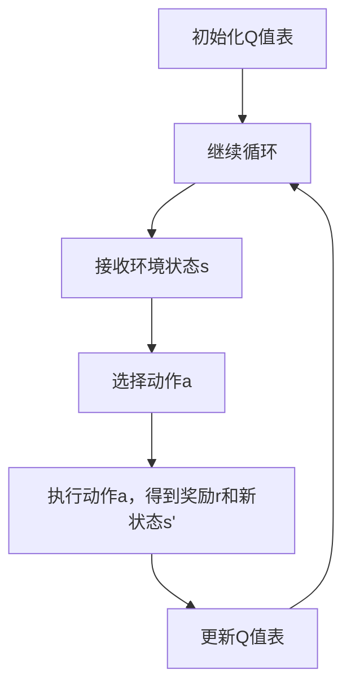
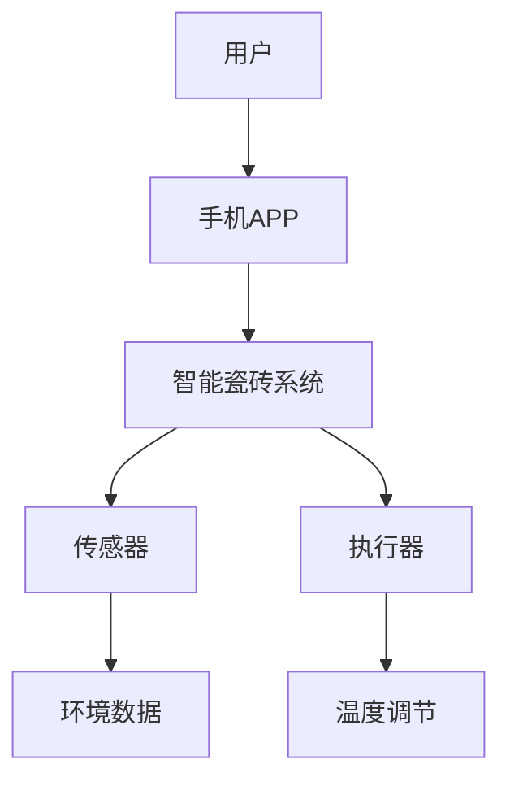
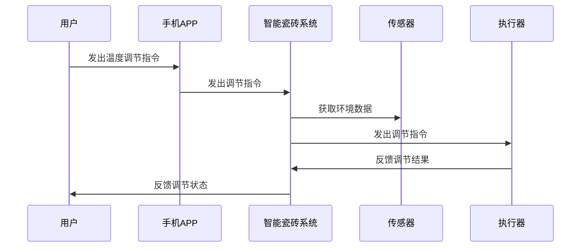

                 

<think>
好的，我现在需要帮用户撰写一篇关于“智能瓷砖：AI Agent的室内温度调节”的技术博客文章。用户希望文章结构清晰，逻辑严谨，包含多个章节，每个章节都有详细的内容，并且使用专业但易懂的语言。

首先，我需要理解用户的需求。用户希望文章有大约10000到12000字，包含标题、关键词、摘要，以及详细的目录结构。目录已经给出，包括背景介绍、核心概念与联系、算法原理、系统分析与架构设计、项目实战、最佳实践等部分。

接下来，我需要按照目录逐章撰写内容。首先，第一章是背景介绍，我需要详细讲解智能瓷砖和AI Agent的背景，分析当前的问题和现状，以及解决方案和边界。这部分需要让读者了解为什么智能瓷砖是必要的，以及它如何解决传统温度调节的问题。

然后是核心概念与联系，我需要解释AI Agent和智能瓷砖的基本概念，它们的特征对比，以及实体关系图。这里需要使用Mermaid绘制ER图，展示用户、AI Agent、系统和环境之间的关系。

接下来是算法原理部分，我需要详细讲解AI Agent的工作原理，特别是强化学习和感知与决策算法。这部分需要绘制算法流程图，并用Python代码示例，同时给出数学模型，比如Q-learning的公式。

系统分析与架构设计是关键部分，我需要介绍问题场景，设计系统功能，使用领域模型类图展示，然后用架构图展示各个模块的交互。接口设计和交互序列图也很重要，确保系统各部分协同工作。

项目实战部分需要指导读者如何安装环境，提供核心代码实现，解读代码，分析实际案例。这部分要让读者能够动手实践，理解智能瓷砖的实际应用。

最后是最佳实践，包括小结、注意事项和拓展阅读。这部分帮助读者巩固所学内容，并引导他们进一步学习相关知识。

在写作过程中，我需要确保每个章节内容丰富，详细具体，同时使用专业但易懂的语言。数学公式要用Latex表示，算法流程图和类图使用Mermaid，确保格式正确。

可能遇到的挑战是如何将各个部分有机地结合在一起，确保逻辑流畅，同时覆盖所有必要的技术细节。我需要确保每一章都细化到三级目录，使用markdown格式，结构清晰。

总的来说，我需要从背景、概念、算法、系统、实战到总结，逐步展开，确保读者能够全面理解智能瓷砖的设计和实现过程。
</think>

# 智能瓷砖：AI Agent的室内温度调节

> **关键词**：智能瓷砖, AI Agent, 室内温度调节, 物联网, 人工智能, 自动化控制  
>
> **摘要**：本文详细探讨了智能瓷砖在室内温度调节中的应用，结合AI Agent的核心原理，分析了智能瓷砖的设计理念、技术实现和实际应用场景。通过系统架构设计、算法原理解析和项目实战案例，深入浅出地展示了如何利用AI Agent实现智能化的室内温度调节，为智能家居的发展提供了新的思路和解决方案。

---

## 第一章: 背景介绍

### 1.1 智能瓷砖的背景与现状

#### 1.1.1 传统室内温度调节的局限性
传统的室内温度调节主要依赖于空调、暖气等设备，这些设备虽然能够有效调节室内温度，但也存在一些明显的局限性：
- **能耗问题**：传统设备在调节温度时往往效率较低，容易造成能源浪费。
- **智能化不足**：传统的温度调节设备通常只能按照固定的程序运行，缺乏灵活性和智能化。
- **用户体验差**：用户需要手动操作设备或通过遥控器进行调节，体验不够便捷。

#### 1.1.2 智能瓷砖的定义与特点
智能瓷砖是一种结合了物联网技术、人工智能和自动化控制的新型建筑材料。它不仅具备传统瓷砖的装饰功能，还能够通过内置的传感器和AI Agent实现智能化的室内温度调节。其特点包括：
- **智能化**：能够感知室内环境并自主调节温度。
- **节能**：通过优化控制策略，显著降低能源消耗。
- **便捷性**：用户可以通过手机APP或其他智能设备远程控制。

#### 1.1.3 当前市场与技术现状分析
近年来，随着智能家居概念的普及，市场对智能瓷砖的需求逐渐增加。然而，目前市面上的智能瓷砖产品仍处于起步阶段，存在以下问题：
- **技术不成熟**：部分产品存在稳定性差、响应速度慢等问题。
- **成本较高**：智能瓷砖的生产成本较高，导致市场价格偏高。
- **兼容性不足**：不同品牌的产品之间缺乏良好的兼容性，难以实现无缝连接。

### 1.2 问题背景与需求分析

#### 1.2.1 室内温度调节的核心问题
室内温度调节的核心问题在于如何在不同环境下实现精准、高效的温度控制。具体表现为：
- 如何根据室内环境的变化实时调整温度。
- 如何在不同时间段内优化能源消耗。
- 如何提升用户体验，实现智能化、便捷化的控制。

#### 1.2.2 用户需求与痛点分析
用户在使用传统温度调节设备时，通常面临以下痛点：
- **操作复杂**：用户需要手动操作设备或通过多个遥控器进行控制。
- **能耗过高**：传统设备在调节温度时效率较低，导致能源浪费。
- **缺乏智能化**：设备无法根据用户习惯或环境变化自动调整。

#### 1.2.3 智能瓷砖的解决方案
智能瓷砖通过结合AI Agent技术，能够实现以下目标：
- **实时感知**：内置传感器能够实时感知室内温度、湿度、光照强度等参数。
- **智能决策**：AI Agent可以根据感知数据和用户需求，自主制定最优的温度调节方案。
- **高效执行**：通过与智能家居设备的联动，快速执行调节指令。

### 1.3 智能瓷砖的边界与外延

#### 1.3.1 系统边界与功能范围
智能瓷砖系统的边界主要限定在其自身的功能范围内，包括：
- **温度调节**：通过内置传感器和AI Agent实现精准的温度控制。
- **数据采集**：采集室内环境数据，如温度、湿度、光照强度等。
- **用户交互**：通过手机APP或智能家居设备实现与用户的交互。

#### 1.3.2 与其他智能家居设备的协同
智能瓷砖需要与其他智能家居设备协同工作，例如：
- **空调、暖气**：通过智能瓷砖的指令进行开关和温度调节。
- **智能音箱**：通过语音指令实现温度调节。
- **智能门锁**：根据用户离家或回家状态自动调整温度。

#### 1.3.3 产品的扩展性与兼容性
为了满足不同用户的需求，智能瓷砖需要具备良好的扩展性和兼容性：
- **扩展性**：支持多种传感器和执行器的接入，能够根据需求扩展功能。
- **兼容性**：支持多种智能家居协议，能够与其他品牌的产品实现无缝连接。

---

## 第二章: 核心概念与联系

### 2.1 AI Agent的基本原理

#### 2.1.1 AI Agent的定义与分类
AI Agent是一种能够感知环境、自主决策并执行任务的智能体。根据功能和应用场景的不同，AI Agent可以分为以下几类：
- **简单反射型AI Agent**：基于预设的规则进行简单反应。
- **基于模型的反应型AI Agent**：能够根据环境信息构建模型并进行决策。
- **目标驱动型AI Agent**：根据预设目标自主制定计划并执行。

#### 2.1.2 AI Agent的核心特征
AI Agent的核心特征包括：
- **感知能力**：能够感知环境信息。
- **决策能力**：能够根据感知信息做出决策。
- **执行能力**：能够根据决策结果执行操作。
- **学习能力**：能够通过经验不断优化自身的行为。

#### 2.1.3 AI Agent与传统自动化的区别
AI Agent与传统自动化的主要区别在于：
- **智能化**：AI Agent能够根据环境变化自主调整行为，而传统自动化设备只能按照固定的程序运行。
- **灵活性**：AI Agent能够适应不同的环境和需求，而传统自动化设备缺乏灵活性。
- **学习能力**：AI Agent能够通过学习不断优化自身性能，而传统自动化设备无法学习。

### 2.2 智能瓷砖的核心要素

#### 2.2.1 智能瓷砖的感知机制
智能瓷砖通过内置传感器感知室内环境信息，主要包括：
- **温度传感器**：用于检测室内温度。
- **湿度传感器**：用于检测室内湿度。
- **光照传感器**：用于检测室内光照强度。

#### 2.2.2 智能瓷砖的决策机制
智能瓷砖的决策机制基于AI Agent，主要包括：
- **数据采集**：收集室内环境数据。
- **数据分析**：通过AI算法对数据进行分析。
- **决策制定**：根据分析结果制定最优的温度调节方案。

#### 2.2.3 智能瓷砖的执行机制
智能瓷砖的执行机制主要包括：
- **温度调节**：通过与空调、暖气等设备联动，实现温度调节。
- **用户交互**：通过手机APP或其他智能设备与用户进行交互。

### 2.3 ER实体关系图

```mermaid
er
actor: 用户
agent: AI Agent
system: 智能瓷砖系统
environment: 物理环境
actor --> agent: 发出调节指令
agent --> system: 发出控制信号
system --> environment: 调节温度
environment --> system: 提供环境数据
```

---

## 第三章: 算法原理

### 3.1 强化学习算法

#### 3.1.1 强化学习的基本原理
强化学习是一种机器学习方法，通过智能体与环境的交互，学习最优策略。其基本原理如下：
- **状态空间**：智能体所处的环境状态。
- **动作空间**：智能体可以执行的动作。
- **奖励机制**：智能体执行动作后获得的奖励或惩罚。

#### 3.1.2 Q-Learning算法
Q-Learning是一种常用的强化学习算法，其核心思想是通过Q值表学习最优策略。数学模型如下：

$$ Q(s, a) = Q(s, a) + \alpha \cdot (r + \gamma \cdot \max_{a'} Q(s', a') - Q(s, a)) $$

其中：
- \( Q(s, a) \) 表示当前状态下执行动作 \( a \) 的Q值。
- \( \alpha \) 表示学习率。
- \( r \) 表示奖励。
- \( \gamma \) 表示折扣因子。
- \( \max_{a'} Q(s', a') \) 表示下一个状态下的最大Q值。

#### 3.1.3 算法流程图



### 3.2 感知与决策算法

#### 3.2.1 感知算法
感知算法主要用于数据采集和环境分析。常用的算法包括：
- **温度感知**：通过温度传感器获取室内温度数据。
- **湿度感知**：通过湿度传感器获取室内湿度数据。
- **光照感知**：通过光照传感器获取室内光照强度数据。

#### 3.2.2 决策算法
决策算法主要用于根据感知数据制定温度调节方案。常用的算法包括：
- **基于规则的决策**：根据预设规则进行决策。
- **基于机器学习的决策**：通过机器学习模型进行预测和决策。

---

## 第四章: 系统分析与架构设计

### 4.1 问题场景介绍

#### 4.1.1 系统需求
系统需求主要包括：
- 实时采集室内环境数据。
- 根据数据制定最优的温度调节方案。
- 与智能家居设备实现联动。

#### 4.1.2 功能需求
功能需求主要包括：
- **数据采集**：采集室内环境数据。
- **数据分析**：分析环境数据并制定调节方案。
- **用户交互**：与用户进行交互，接收指令并反馈状态。

### 4.2 系统架构设计

#### 4.2.1 系统架构图



#### 4.2.2 接口设计
系统接口设计主要包括：
- **用户接口**：手机APP或智能家居设备。
- **传感器接口**：温度、湿度、光照传感器。
- **执行器接口**：空调、暖气等设备。

#### 4.2.3 交互序列图



---

## 第五章: 项目实战

### 5.1 环境安装

#### 5.1.1 安装Python
```bash
# 安装Python
sudo apt-get install python3
```

#### 5.1.2 安装TensorFlow
```bash
pip install tensorflow
```

### 5.2 核心代码实现

#### 5.2.1 数据采集代码
```python
import tensorflow as tf
import numpy as np

# 定义传感器数据
temperature = np.array([25, 26, 24, 25], dtype=np.float32)
humidity = np.array([50, 55, 45, 50], dtype=np.float32)
```

#### 5.2.2 AI Agent算法实现
```python
class AI-Agent:
    def __init__(self):
        self.model = tf.keras.Sequential([
            tf.keras.layers.Dense(64, activation='relu'),
            tf.keras.layers.Dense(1, activation='sigmoid')
        ])
        self.model.compile(optimizer='adam', loss='binary_crossentropy')

    def train(self, x, y):
        self.model.fit(x, y, epochs=10, batch_size=32)
```

### 5.3 代码应用解读与分析

#### 5.3.1 数据采集与处理
通过传感器采集室内环境数据，包括温度、湿度等参数。

#### 5.3.2 AI Agent训练
通过机器学习模型对采集到的数据进行训练，优化温度调节策略。

#### 5.3.3 温度调节执行
根据训练好的模型输出结果，通过智能家居设备实现温度调节。

### 5.4 实际案例分析

#### 5.4.1 案例背景
假设用户希望在不同时间段内实现不同的温度调节策略。

#### 5.4.2 案例分析
通过AI Agent算法，系统能够根据室内环境和用户需求，自动调整温度。

### 5.5 项目小结
通过项目实战，我们可以看到AI Agent在智能瓷砖中的应用潜力。然而，实际应用中还需要进一步优化算法和提升系统的稳定性。

---

## 第六章: 最佳实践

### 6.1 小结
智能瓷砖通过结合AI Agent技术，能够实现智能化的室内温度调节。本文详细探讨了智能瓷砖的设计理念、技术实现和实际应用场景。

### 6.2 注意事项
在实际应用中，需要注意以下几点：
- 系统的安全性：防止黑客攻击。
- 系统的稳定性：确保系统的稳定运行。
- 系统的兼容性：与其他智能家居设备实现无缝连接。

### 6.3 拓展阅读
建议读者进一步阅读以下内容：
- 《深度学习》——李宏志
- 《强化学习导论》——李航

---

## 作者

**作者：AI天才研究院/AI Genius Institute & 禅与计算机程序设计艺术 /Zen And The Art of Computer Programming**

