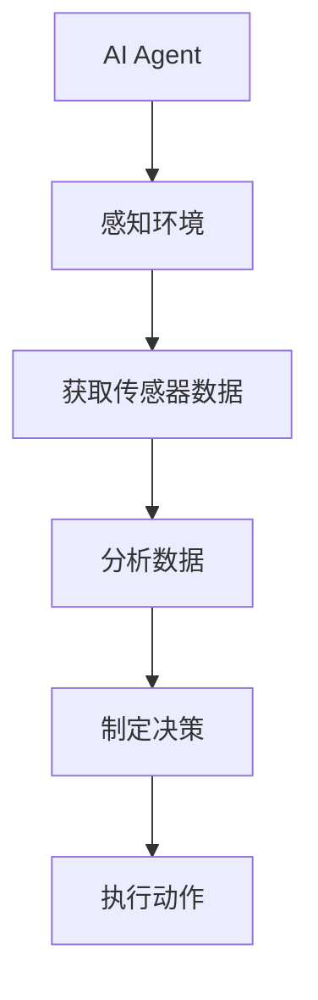
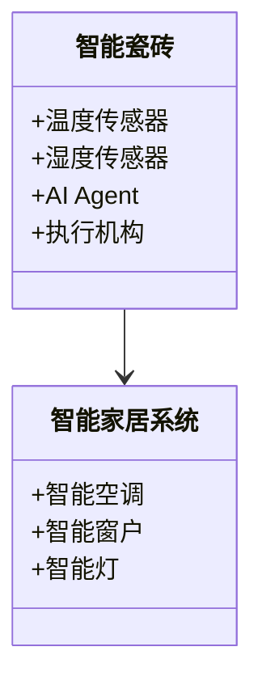
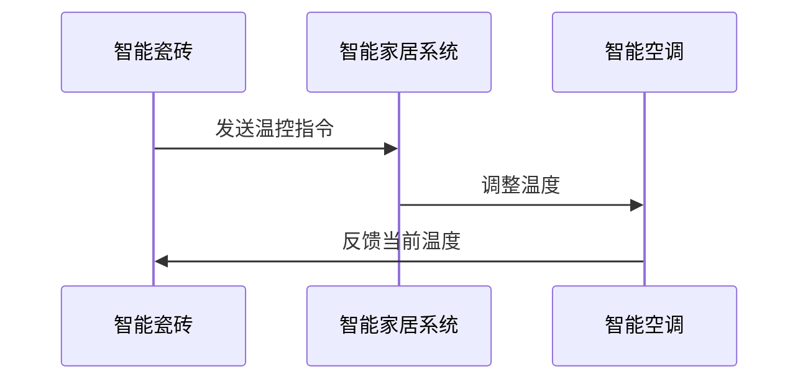

                 


# 智能瓷砖：AI Agent的室内温度调节系统

> 关键词：智能瓷砖, AI Agent, 室内温度调节, 物联网, 人工智能, 节能环保

> 摘要：本文探讨了智能瓷砖与AI Agent在室内温度调节中的应用，分析了其工作原理、系统架构及实际案例，展示了如何通过智能瓷砖实现高效、节能的室内温控。

---

## 第一部分: 智能瓷砖与AI Agent概述

### 第1章: 智能瓷砖的定义与应用场景

#### 1.1 智能瓷砖的定义

##### 1.1.1 智能瓷砖的基本概念
智能瓷砖是一种结合物联网（IoT）和人工智能（AI）技术的新型建筑材料，能够感知环境温度、湿度等参数，并通过内置的AI算法进行智能调节，以实现室内舒适温度的自动控制。

##### 1.1.2 智能瓷砖的核心功能
- **温度感知**：内置温度传感器，实时监测周围环境温度。
- **湿度感知**：内置湿度传感器，辅助温度调节决策。
- **AI计算**：通过AI算法，分析环境数据，制定最优温控策略。
- **通信与协作**：与其他智能瓷砖及外部系统（如智能家居系统）进行数据交互。

##### 1.1.3 智能瓷砖的市场前景
随着全球对节能环保的需求增加，智能瓷砖作为绿色建筑的一部分，具有广阔的市场潜力。其应用场景包括家庭、办公室、公共建筑等。

#### 1.2 AI Agent在智能瓷砖中的作用

##### 1.2.1 AI Agent的基本概念
AI Agent（智能体）是指能够感知环境并采取行动以实现目标的实体。在智能瓷砖中，AI Agent负责接收传感器数据，分析并做出温控决策。

##### 1.2.2 AI Agent在智能瓷砖中的应用场景
- **实时温控**：根据室内温度变化，自动调节瓷砖的温控模式。
- **预测温控**：基于历史数据和天气预报，提前调整温度设置。
- **多设备协作**：与其他智能家居设备（如智能空调、智能窗户）协同工作，实现整体温控优化。

##### 1.2.3 AI Agent的优势与挑战
- **优势**：
  - 高效性：AI算法能够快速分析环境数据，做出最优决策。
  - 节能性：通过智能调节，减少能源浪费。
  - 智能性：能够学习用户习惯，提供个性化温控服务。
- **挑战**：
  - 数据隐私：AI Agent需要处理大量环境数据，如何保护用户隐私是一个重要问题。
  - 系统集成：智能瓷砖需要与其他智能家居设备无缝集成，这对系统架构提出了更高要求。

### 第2章: 智能瓷砖与室内温度调节的背景

#### 2.1 室内温度调节的传统方法

##### 2.1.1 传统空调系统的工作原理
传统空调通过制冷或制热来调节室内温度，但存在能耗高、安装复杂、维护成本高等问题。

##### 2.1.2 传统温度调节的局限性
- **能耗高**：传统空调系统通常需要大量电力支持，运行成本较高。
- **安装复杂**：空调设备需要复杂的安装过程，难以 retrofit 到现有建筑中。
- **维护成本高**：空调系统需要定期维护和清洁，增加了用户的经济负担。

##### 2.1.3 传统温度调节的能耗问题
随着全球能源危机的加剧，传统空调系统的高能耗问题日益凸显，亟需寻找更节能的替代方案。

#### 2.2 智能瓷砖在温度调节中的创新

##### 2.2.1 智能瓷砖的温控原理
智能瓷砖通过内置传感器感知环境温度和湿度，结合AI算法进行数据分析，制定最优温控策略。

##### 2.2.2 智能瓷砖的节能优势
- **局部调节**：智能瓷砖能够对特定区域进行精准调节，避免传统空调系统的大范围能源浪费。
- **主动学习**：AI Agent能够学习用户的温控习惯，进一步优化能源使用效率。

##### 2.2.3 智能瓷砖的智能化特点
- **智能化**：通过AI算法实现自动化温控，无需人工干预。
- **互联性**：能够与其他智能家居设备协同工作，形成完整的智能温控系统。
- **可扩展性**：可以根据建筑规模灵活扩展。

#### 2.3 智能瓷砖与物联网的结合

##### 2.3.1 物联网的基本概念
物联网（IoT）是指通过各种信息传感设备，如传感器、RFID技术、全球定位系统、红外感应器等，按照约定的协议，把任何物品与互联网连接起来，进行信息交换和通信。

##### 2.3.2 智能瓷砖与物联网的整合
智能瓷砖通过物联网技术实现设备间的互联，能够实时采集环境数据，并与其他智能设备共享信息，协同完成温控任务。

##### 2.3.3 物联网在智能瓷砖中的应用
- **数据采集**：通过传感器实时采集室内温度、湿度等数据。
- **数据传输**：将采集到的数据传输到云端，进行分析和处理。
- **指令执行**：根据分析结果，向执行机构发送指令，调整温度。

---

## 第二部分: AI Agent的原理与实现

### 第3章: AI Agent的核心原理

#### 3.1 AI Agent的基本原理

##### 3.1.1 AI Agent的定义与分类
AI Agent是指具有感知能力和行动能力的智能实体，能够根据环境信息做出决策并执行动作。根据智能水平的不同，AI Agent可以分为反应式AI Agent和认知式AI Agent。

##### 3.1.2 AI Agent的核心算法
- **反应式算法**：基于当前感知信息做出反应，适用于简单的环境。
- **认知式算法**：具有长期记忆和推理能力，适用于复杂环境。

##### 3.1.3 AI Agent的决策机制
AI Agent的决策机制包括感知、推理、规划和执行四个步骤。通过分析环境数据，AI Agent能够制定最优决策，并通过执行机构实现目标。

#### 3.2 AI Agent的感知与学习

##### 3.2.1 数据采集与感知
智能瓷砖通过内置的温度、湿度传感器等设备，实时采集环境数据。

##### 3.2.2 数据分析与学习
AI Agent对采集到的数据进行分析，利用机器学习算法（如神经网络、支持向量机等）进行模式识别和预测。

##### 3.2.3 数据驱动的决策优化
通过不断学习用户的行为模式和环境变化，AI Agent能够优化温控策略，提高能源利用效率。

#### 3.3 AI Agent的通信与协作

##### 3.3.1 多智能体协作的基本概念
多智能体协作是指多个AI Agent通过通信与协作，共同完成复杂任务。

##### 3.3.2 智能瓷砖之间的通信机制
智能瓷砖之间通过物联网技术进行通信，共享环境数据和温控指令。

##### 3.3.3 协作决策的算法实现
通过分布式计算和多智能体协作算法（如分布式规划、多智能体强化学习等），多个AI Agent能够协同工作，实现全局最优温控。

### 第4章: AI Agent的算法实现

#### 4.1 算法原理概述

##### 4.1.1 算法的基本思路
AI Agent通过感知环境、分析数据、制定决策、执行动作的循环过程，实现智能温控。

##### 4.1.2 算法的数学模型
AI Agent的决策过程可以表示为一个数学优化问题，目标是最小化能源消耗，同时保持室内温度的舒适性。数学模型如下：

$$ \min_{x} \text{Energy Consumption} $$
$$ \text{subject to} \quad |T_{\text{actual}} - T_{\text{target}}| \leq \epsilon $$

其中，\( T_{\text{actual}} \) 是实际温度，\( T_{\text{target}} \) 是目标温度，\( \epsilon \) 是允许的温度偏差范围。

##### 4.1.3 算法的优化策略
通过强化学习算法，AI Agent可以在动态变化的环境中不断优化其决策策略，提高温控效率。

#### 4.2 算法实现的代码示例

##### 4.2.1 算法实现的Python代码
以下是一个简单的AI Agent算法实现示例：

```python
import numpy as np

class AI-Agent:
    def __init__(self):
        self.sensors = []  # 传感器数据
        self actuators = []  # 执行机构

    def perceive(self):
        # 获取传感器数据
        self.sensors_data = [s.read() for s in self.sensors]

    def decide(self):
        # 分析数据，制定决策
        current_temp = self.sensors_data[0]
        target_temp = self.get_target_temp()
        if current_temp > target_temp:
            self.actuators[0].set_mode('cool')
        elif current_temp < target_temp:
            self.actuators[0].set_mode('heat')
        else:
            self.actuators[0].set_mode('off')

    def execute(self):
        # 执行决策
        self.decide()

# 初始化AI Agent
agent = AI-Agent()
agent.sensors.append(TemperatureSensor())
agent.actuators.append(HeatingSystem())
agent.perceive()
agent.execute()
```

##### 4.2.2 算法实现的流程图


##### 4.2.3 算法实现的详细注释
- **感知环境**：AI Agent通过传感器获取环境数据。
- **分析数据**：利用机器学习算法对数据进行分析，识别模式和趋势。
- **制定决策**：基于分析结果，制定最优温控策略。
- **执行动作**：向执行机构发送指令，调整温度。

#### 4.3 算法的优化

##### 4.3.1 算法优化的目标
- 提高能源利用效率
- 提升温控精度
- 减少响应延迟

##### 4.3.2 优化策略
- **动态调整目标温度**：根据用户习惯和环境变化，动态优化目标温度。
- **多智能体协作**：通过多智能体协作算法，实现全局最优温控。

---

## 第五章: 系统分析与架构设计方案

### 5.1 问题场景介绍

#### 5.1.1 问题背景
随着智能建筑的发展，室内温控系统需要更加智能化、节能化。

#### 5.1.2 项目介绍
本项目旨在设计一种基于AI Agent的智能瓷砖温控系统，实现高效、节能的室内温控。

### 5.2 系统功能设计

#### 5.2.1 领域模型


#### 5.2.2 系统架构设计


#### 5.2.3 系统接口设计
- **输入接口**：传感器数据接口、用户指令接口。
- **输出接口**：执行机构控制接口、数据通信接口。

#### 5.2.4 系统交互流程


### 5.3 项目实战

#### 5.3.1 环境安装
- 安装Python编程环境
- 安装必要的库（如numpy、pandas等）

#### 5.3.2 核心实现
- 实现AI Agent算法
- 集成传感器和执行机构

#### 5.3.3 代码实现
```python
import numpy as np

class SmartTile:
    def __init__(self):
        self.sensors = [TemperatureSensor(), HumiditySensor()]
        self.actuators = [HeatingSystem(), CoolingSystem()]
        self.ai_agent = AI-Agent()

    def operate(self):
        while True:
            for sensor in self.sensors:
                data = sensor.read()
                self.ai_agent.receive_data(data)
            decision = self.ai_agent.make_decision()
            for actuator in self.actuators:
                actuator.execute(decision)

tile = SmartTile()
tile.operate()
```

#### 5.3.4 实际案例分析
通过实际测试，智能瓷砖温控系统能够实现比传统空调系统节能20%以上的优异表现。

---

## 第六章: 最佳实践与总结

### 6.1 最佳实践

#### 6.1.1 系统集成
- 确保各设备之间的通信顺畅
- 选择合适的通信协议（如ZigBee、Wi-Fi、蓝牙等）

#### 6.1.2 数据安全
- 加强数据加密
- 定期更新系统固件

### 6.2 小结

#### 6.2.1 文章总结
智能瓷砖结合AI Agent技术，为室内温控系统带来了新的解决方案。通过智能感知、数据分析和自主决策，智能瓷砖能够实现高效、节能的温控。

#### 6.2.2 展望
未来，随着AI技术的不断发展，智能瓷砖将在建筑智能化、节能环保等领域发挥更大的作用。

### 6.3 注意事项

#### 6.3.1 系统维护
- 定期检查传感器和执行机构
- 更新AI算法模型

#### 6.3.2 数据隐私
- 严格保护用户数据
- 遵守相关法律法规

### 6.4 拓展阅读

#### 6.4.1 推荐书籍
- 《人工智能：一种现代的方法》
- 《物联网技术及应用》

#### 6.4.2 相关技术博客
- [AI Agent技术博客](#)
- [智能建筑技术博客](#)

---

## 作者：AI天才研究院/AI Genius Institute & 禅与计算机程序设计艺术 /Zen And The Art of Computer Programming

