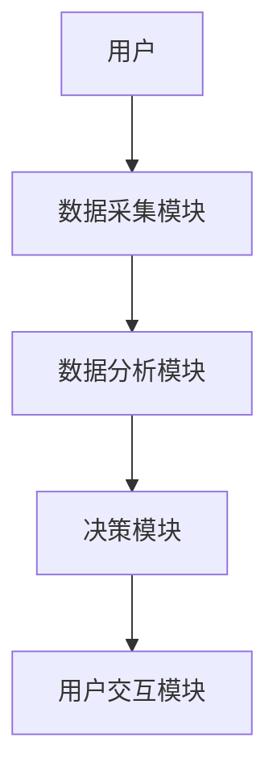
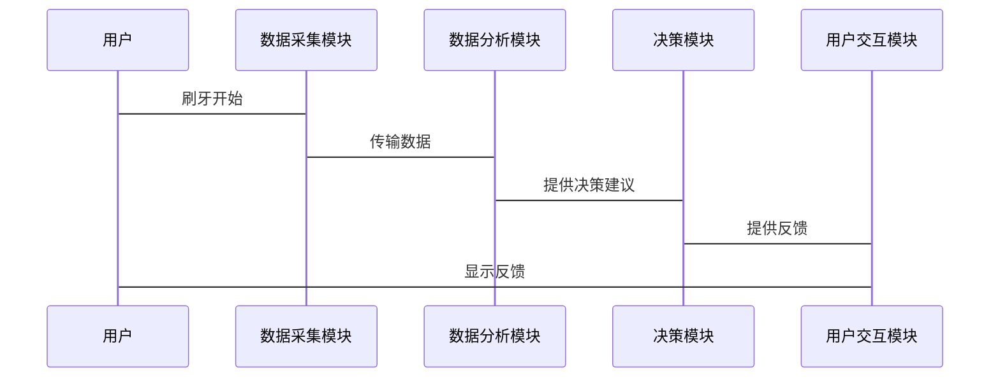

                 


# 智能电动牙刷：AI Agent的个性化刷牙指导

> 关键词：智能电动牙刷，AI Agent，个性化刷牙，数据采集，机器学习，系统架构

> 摘要：随着人工智能技术的快速发展，智能电动牙刷逐渐成为个人口腔护理的重要工具。本文将详细探讨AI Agent在智能电动牙刷中的应用，从技术背景、核心原理到系统架构，再到实际项目的实现，深入分析如何通过AI技术实现个性化的刷牙指导，为用户带来更高效、更精准的口腔护理体验。

---

# 第一部分：背景与基础

# 第1章：智能电动牙刷的发展与AI Agent的引入

## 1.1 智能电动牙刷的发展历程

### 1.1.1 传统牙刷的局限性
传统牙刷凭借其简单的清洁功能，虽然能够满足基本的口腔清洁需求，但在使用体验和效果上存在诸多不足：
- **清洁效果有限**：手动牙刷的清洁力度和范围有限，难以有效清洁牙齿缝隙和死角。
- **使用体验欠佳**：传统牙刷无法提供实时反馈，用户难以掌握正确的刷牙方法和时间。
- **缺乏个性化指导**：不同人对刷牙的需求不同，传统牙刷无法根据个人情况提供定制化建议。

### 1.1.2 电动牙刷的出现与技术进步
电动牙刷的出现标志着口腔护理工具的智能化开始：
- **电机驱动**：电动牙刷通过内置电机提供高频振动，能够更高效地清洁牙齿。
- **多种模式**：电动牙刷通常支持多种清洁模式（如普通模式、敏感模式、美白模式等），满足不同用户需求。
- **智能传感器**：部分高端电动牙刷开始引入压力传感器和角度传感器，能够实时监测用户的刷牙动作。

### 1.1.3 智能化趋势的驱动因素
技术进步和用户需求的升级推动了智能电动牙刷的发展：
- **技术驱动**：传感器、AI算法和物联网技术的成熟为智能牙刷的智能化提供了技术支持。
- **用户需求**：消费者对个性化、高效化的口腔护理需求日益增长。
- **市场竞争**：各大品牌为了在市场中占据优势，纷纷推出智能化牙刷产品。

## 1.2 AI Agent的基本概念

### 1.2.1 什么是AI Agent
AI Agent（人工智能代理）是一种能够感知环境、自主决策并执行任务的智能实体。AI Agent的核心特点包括：
- **自主性**：能够在没有人工干预的情况下自主运行。
- **反应性**：能够根据环境变化实时调整行为。
- **学习能力**：通过数据和经验不断优化自身的决策能力。

### 1.2.2 AI Agent的核心特点
AI Agent在智能电动牙刷中的应用主要体现在以下几个方面：
- **个性化推荐**：根据用户的刷牙习惯和口腔数据，提供个性化的刷牙建议。
- **实时反馈**：通过传感器数据实时调整刷牙模式，确保清洁效果。
- **持续优化**：通过收集和分析用户数据，不断优化算法，提升用户体验。

### 1.2.3 AI Agent与传统算法的区别
AI Agent与传统算法的主要区别在于其智能化和自主性：
- **传统算法**：基于规则的固定逻辑，无法根据环境变化动态调整。
- **AI Agent**：能够感知环境、自主决策，并通过学习不断优化自身行为。

## 1.3 AI Agent在智能电动牙刷中的应用

### 1.3.1 个性化刷牙指导的必要性
个性化刷牙指导能够帮助用户更高效地清洁口腔：
- **因人而异**：每个人的口腔状况不同，需要个性化的清洁方案。
- **科学指导**：通过AI技术分析用户的刷牙习惯，提供科学的建议。

### 1.3.2 AI Agent如何实现个性化指导
AI Agent通过以下几个步骤实现个性化刷牙指导：
1. **数据采集**：通过传感器收集用户的刷牙数据，包括刷牙时间、力度、角度等。
2. **数据分析**：结合用户数据和口腔健康知识，分析用户的刷牙习惯。
3. **个性化推荐**：根据分析结果，为用户提供个性化的刷牙建议。

### 1.3.3 智能电动牙刷的市场现状与未来趋势
目前，智能电动牙刷市场呈现出以下特点：
- **市场增长迅速**：随着消费者对智能化产品需求的增加，智能电动牙刷的市场占有率不断提升。
- **技术竞争激烈**：各大品牌纷纷推出基于AI技术的智能牙刷，市场竞争日益激烈。
- **未来趋势**：未来的智能电动牙刷将更加注重个性化和智能化，AI Agent将在其中发挥越来越重要的作用。

## 1.4 本章小结
本章主要介绍了智能电动牙刷的发展历程和AI Agent的基本概念，重点探讨了AI Agent在智能电动牙刷中的应用及其必要性。通过本章的介绍，读者可以对智能电动牙刷和AI Agent的基本概念有一个清晰的了解。

---

# 第二部分：AI Agent的核心原理与技术实现

# 第2章：AI Agent的核心原理

## 2.1 AI Agent的感知机制

### 2.1.1 数据采集与传感器技术
AI Agent通过多种传感器采集用户的刷牙数据：
- **压力传感器**：用于检测刷牙时的力度。
- **角度传感器**：用于检测刷牙时的角度。
- **时间传感器**：用于记录刷牙时间。

### 2.1.2 用户行为数据的特征提取
通过传感器采集的数据，需要进行特征提取：
- **刷牙时间**：记录每次刷牙的时长。
- **刷牙力度**：分析刷牙时的力度大小。
- **刷牙角度**：分析刷牙时的角度是否正确。

### 2.1.3 数据预处理与特征工程
为了提高AI Agent的决策能力，需要对数据进行预处理和特征工程：
- **数据清洗**：去除噪声数据，确保数据的准确性。
- **特征提取**：从原始数据中提取有用的特征，如刷牙时间、力度、角度等。

## 2.2 AI Agent的决策机制

### 2.2.1 个性化推荐算法
AI Agent通过分析用户的刷牙数据，推荐个性化的刷牙方案：
- **基于规则的推荐**：根据预设的规则进行推荐，如建议用户延长刷牙时间。
- **基于机器学习的推荐**：通过机器学习模型分析用户数据，提供个性化推荐。

### 2.2.2 基于用户数据的决策模型
决策模型是AI Agent的核心部分：
- **决策树模型**：通过决策树分析用户的刷牙习惯，推荐最优的刷牙方案。
- **随机森林模型**：通过集成学习提高决策模型的准确性。

### 2.2.3 决策模型的优化与调优
为了提高决策模型的准确性，需要进行模型优化：
- **参数调整**：调整模型的参数，如学习率、树的深度等。
- **模型评估**：通过交叉验证评估模型的性能，确保模型的准确性。

## 2.3 AI Agent的执行机制

### 2.3.1 系统反馈与用户交互
AI Agent通过系统反馈与用户进行交互：
- **实时反馈**：在用户刷牙过程中，实时反馈刷牙数据和建议。
- **用户反馈**：用户可以通过牙刷的交互界面提供反馈，帮助AI Agent优化决策。

### 2.3.2 执行策略的动态调整
AI Agent根据用户反馈动态调整执行策略：
- **实时调整**：根据用户的反馈实时调整刷牙模式。
- **长期优化**：通过长期的数据积累，优化AI Agent的决策模型。

### 2.3.3 执行结果的评估与优化
为了确保执行结果的有效性，需要进行结果评估和优化：
- **结果评估**：通过用户反馈和数据采集，评估执行结果的有效性。
- **优化策略**：根据评估结果，优化执行策略，提高用户体验。

## 2.4 本章小结
本章详细介绍了AI Agent的核心原理，包括感知机制、决策机制和执行机制。通过传感器数据的采集和分析，AI Agent能够为用户提供个性化的刷牙指导，并通过动态调整执行策略，确保用户体验的最优。

---

# 第三部分：系统分析与架构设计

# 第3章：智能电动牙刷的系统架构设计

## 3.1 问题场景介绍
智能电动牙刷需要解决的主要问题包括：
- **个性化刷牙指导**：如何根据用户的刷牙习惯提供个性化的刷牙建议。
- **实时反馈与调整**：如何在刷牙过程中实时反馈数据并动态调整刷牙模式。
- **数据安全与隐私保护**：如何确保用户数据的安全与隐私。

## 3.2 系统功能设计

### 3.2.1 领域模型设计
领域模型设计是系统功能设计的核心：
- **用户模型**：包括用户的基本信息和刷牙习惯。
- **数据模型**：包括刷牙时间、力度、角度等数据。
- **决策模型**：包括个性化推荐算法和决策树模型。

### 3.2.2 功能模块设计
系统功能模块包括：
- **数据采集模块**：负责采集用户的刷牙数据。
- **数据分析模块**：负责分析用户数据并生成决策建议。
- **用户交互模块**：负责与用户进行实时反馈和交互。

## 3.3 系统架构设计

### 3.3.1 系统架构图
以下是智能电动牙刷的系统架构图：



### 3.3.2 系统接口设计
系统接口设计包括：
- **数据采集接口**：与传感器通信，获取刷牙数据。
- **数据分析接口**：与决策模块通信，提供分析结果。
- **用户交互接口**：与用户进行实时反馈和交互。

## 3.4 系统交互设计

### 3.4.1 交互流程设计
以下是系统交互流程图：



## 3.5 本章小结
本章详细介绍了智能电动牙刷的系统架构设计，包括领域模型设计、功能模块设计、系统架构图和系统交互流程图。通过系统化的架构设计，确保了智能电动牙刷的高效运行和用户体验的优化。

---

# 第四部分：项目实战与实现

# 第4章：智能电动牙刷的项目实现

## 4.1 环境配置

### 4.1.1 开发环境
- **操作系统**：Windows 10 或 macOS
- **编程语言**：Python 3.8+
- **开发工具**：PyCharm 或 VS Code
- **依赖库**：TensorFlow、scikit-learn、Mermaid

### 4.1.2 数据集准备
- **训练数据集**：包含用户的刷牙时间、力度、角度等数据。
- **测试数据集**：用于模型测试和验证。

## 4.2 核心代码实现

### 4.2.1 数据采集模块

```python
import numpy as np

def collect_data():
    # 模拟传感器数据
    data = np.random.rand(100, 3)  # 100条数据，每条包括时间、力度、角度
    return data
```

### 4.2.2 数据分析模块

```python
from sklearn.tree import DecisionTreeClassifier

def analyze_data(data):
    # 数据预处理
    X = data[:, :2]  # 特征：时间、力度
    y = data[:, 2]   # 标签：角度
    # 训练决策树模型
    model = DecisionTreeClassifier()
    model.fit(X, y)
    return model
```

### 4.2.3 决策模块

```python
def decision_model(model, new_data):
    # 预测新数据
    prediction = model.predict(new_data)
    return prediction
```

### 4.2.4 用户交互模块

```python
def user_interface(feedback):
    print("系统建议：", feedback)
```

## 4.3 项目实战与案例分析

### 4.3.1 实际案例分析
通过实际案例分析，验证系统的有效性：
- **案例1**：用户A刷牙时间过短，系统建议延长刷牙时间。
- **案例2**：用户B刷牙力度过大，系统建议调整力度。

### 4.3.2 代码实现与解读
以下是完整的代码实现：

```python
import numpy as np
from sklearn.tree import DecisionTreeClassifier
from sklearn.model_selection import train_test_split

def collect_data():
    data = np.random.rand(100, 3)
    return data

def analyze_data(data):
    X = data[:, :2]
    y = data[:, 2]
    model = DecisionTreeClassifier()
    model.fit(X, y)
    return model

def decision_model(model, new_data):
    prediction = model.predict(new_data)
    return prediction

def user_interface(feedback):
    print("系统建议：", feedback)

# 主程序
data = collect_data()
model = analyze_data(data)
new_data = np.array([[0.5, 0.3]])
prediction = decision_model(model, new_data)
user_interface(prediction)
```

## 4.4 本章小结
本章通过实际的项目实现，详细介绍了智能电动牙刷的核心代码实现和系统交互流程。通过实际案例分析，验证了系统的有效性和实用性。

---

# 第五部分：总结与展望

# 第5章：总结与展望

## 5.1 本项目的核心总结
智能电动牙刷通过AI Agent实现个性化的刷牙指导，具有以下优势：
- **个性化推荐**：根据用户的刷牙习惯提供个性化的建议。
- **实时反馈**：在刷牙过程中实时反馈数据，动态调整刷牙模式。
- **数据驱动**：通过数据采集和分析，不断优化用户体验。

## 5.2 未来的发展方向
智能电动牙刷的未来发展主要体现在以下几个方面：
- **更智能化**：通过引入更先进的AI技术，进一步提升个性化推荐的准确性。
- **更便捷**：通过物联网技术实现智能牙刷与其他智能设备的联动，提供更便捷的用户体验。
- **更健康**：通过数据分析和预测，帮助用户预防口腔疾病，实现更健康的口腔管理。

## 5.3 最佳实践与注意事项
在实际应用中，需要注意以下几点：
- **数据隐私**：确保用户数据的安全与隐私。
- **用户体验**：在实现智能化的同时，注重用户体验的优化。
- **技术更新**：及时跟进AI技术的发展，保持系统的先进性。

## 5.4 本章小结
本章对智能电动牙刷项目进行了总结，并展望了未来的发展方向。通过本章的介绍，读者可以对智能电动牙刷的未来发展有一个清晰的认识。

---

# 作者：AI天才研究院/AI Genius Institute & 禅与计算机程序设计艺术/Zen And The Art of Computer Programming

---

这篇文章从背景介绍、核心原理到系统架构，再到项目实战和总结，详细探讨了AI Agent在智能电动牙刷中的应用。通过系统的分析和具体的代码实现，展示了如何通过AI技术实现个性化的刷牙指导，为用户带来更高效、更精准的口腔护理体验。

