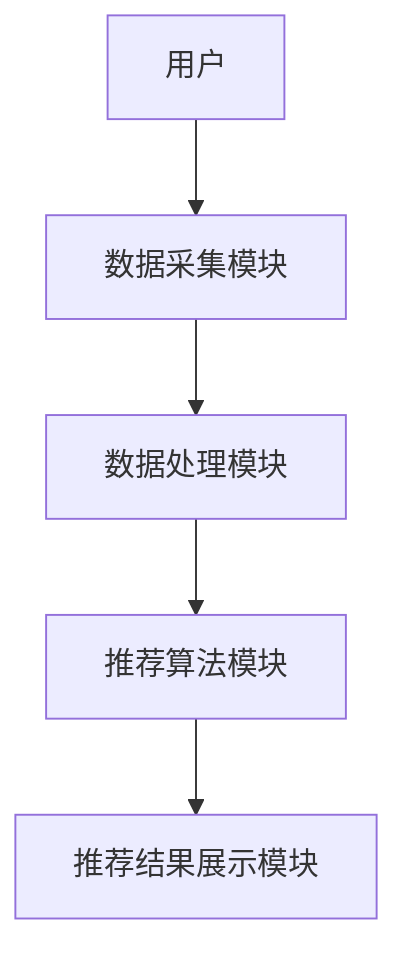
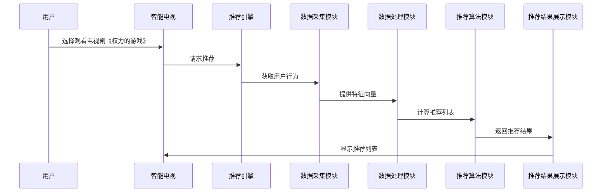

                 

<think>
嗯，用户让我写一篇关于智能电视AI推荐引擎的技术博客，我得先理清楚结构和内容。用户给的目录挺详细的，我得按照这个来。首先，我需要从背景开始，解释为什么智能电视需要AI推荐引擎。然后，介绍推荐引擎的核心概念，比如协同过滤、内容过滤，再对比这些方法。接着，深入讲解算法的数学模型，比如协同过滤的公式，可能还需要用Python代码来实现这些算法。然后，系统架构设计，这部分可能需要用Mermaid图来展示架构和交互流程。最后，项目实战部分，我得选一个实际案例，比如电影推荐系统，详细指导读者如何实现。总结部分，我需要给出最佳实践和一些扩展阅读的方向。整个过程中，我得确保每一章都有足够的细节，但又不冗长。还要注意使用正确的Markdown格式，确保章节层级分明。可能还需要画些表格和流程图，帮助读者理解。总之，我得一步步来，先写背景，再讲算法，最后实战，确保读者能全面理解智能电视中的AI推荐引擎。
</think>

# 智能电视：AI Agent的个性化内容推荐引擎

## 关键词：
- 智能电视
- AI Agent
- 个性化推荐
- 推荐引擎
- 内容推荐系统
- 人工智能
- 算法原理

## 摘要：
随着智能电视的普及，用户对个性化内容推荐的需求日益增长。本文将深入探讨AI Agent在智能电视中的应用，特别是如何通过推荐引擎实现个性化内容推荐。我们将从推荐系统的背景、核心概念、算法原理、系统架构到项目实战，全面解析AI Agent推荐引擎的实现与优化，帮助读者理解其技术本质并掌握实际应用。

---

# 第二部分: 推荐系统的核心算法与数学模型

## 第4章: 推荐系统的算法原理与数学模型

### 4.1 协同过滤算法的数学模型
#### 4.1.1 用户-物品评分矩阵
$$ \text{用户-物品评分矩阵} = \begin{bmatrix}
r_{11} & r_{12} & \cdots & r_{1n} \\
r_{21} & r_{22} & \cdots & r_{2n} \\
\vdots & \vdots & \ddots & \vdots \\
r_{m1} & r_{m2} & \cdots & r_{mn}
\end{bmatrix} $$

#### 4.1.2 基于用户的协同过滤公式
$$ \hat{r}_{u,i} = \bar{r}_u + \sum_{v \in N(u)} w_{u,v} (r_v,i - \bar{r}_v) $$

其中：
- $\hat{r}_{u,i}$ 表示用户 $u$ 对物品 $i$ 的预测评分。
- $\bar{r}_u$ 表示用户 $u$ 的平均评分。
- $N(u)$ 表示与用户 $u$ 相似的用户集合。
- $w_{u,v}$ 表示用户 $u$ 和用户 $v$ 之间的相似度权重。
- $\bar{r}_v$ 表示用户 $v$ 的平均评分。

#### 4.1.3 基于物品的协同过滤公式
$$ \hat{r}_{u,i} = \bar{r}_i + \sum_{j \in N(i)} w_{i,j} (r_u,j - \bar{r}_j) $$

其中：
- $\hat{r}_{u,i}$ 表示用户 $u$ 对物品 $i$ 的预测评分。
- $\bar{r}_i$ 表示物品 $i$ 的平均评分。
- $N(i)$ 表示与物品 $i$ 相似的物品集合。
- $w_{i,j}$ 表示物品 $i$ 和物品 $j$ 之间的相似度权重。
- $\bar{r}_j$ 表示物品 $j$ 的平均评分。

### 4.2 基于内容的推荐算法
#### 4.2.1 文本相似度计算
- 使用词袋模型、TF-IDF或Word2Vec等方法提取文本特征。
- 计算内容之间的余弦相似度：
$$ \text{相似度} = \frac{\vec{v}_i \cdot \vec{v}_j}{\|\vec{v}_i\| \cdot \|\vec{v}_j\|} $$

#### 4.2.2 基于向量空间模型的推荐
- 将内容表示为向量空间中的点。
- 根据向量的相似度进行推荐。

#### 4.2.3 深度学习在内容推荐中的应用
- 使用神经网络提取内容的高层次特征。
- 基于神经网络的推荐系统：
$$ \text{预测评分} = f(\vec{u}, \vec{i}) $$

其中：
- $\vec{u}$ 表示用户特征向量。
- $\vec{i}$ 表示物品特征向量。
- $f$ 表示神经网络模型。

### 4.3 深度学习推荐模型
#### 4.3.1 基于神经网络的推荐系统
- 输入：用户行为、物品特征。
- 输出：推荐评分或排名。

#### 4.3.2 Transformer在推荐系统中的应用
- 使用自注意力机制捕获用户和物品的全局依赖关系。

#### 4.3.3 图神经网络在推荐系统中的应用
- 将用户、物品和行为建模为图结构，利用图神经网络进行推荐。

### 4.4 推荐算法的对比与选择
#### 4.4.1 不同推荐算法的优缺点对比
| 算法类型 | 优点 | 缺点 |
|----------|------|------|
| 协同过滤 | 数据需求低，易于实现 | 对冷启动问题敏感，计算复杂度高 |
| 基于内容的推荐 | 鲁棒性高，不受数据稀疏性影响 | 特征提取难度大 |
| 深度学习推荐 | 高精度，捕捉复杂模式 | 计算资源需求高，模型解释性差 |

#### 4.4.2 推荐算法的选择策略
- 数据量：数据量大时选择深度学习模型，数据量小时选择协同过滤。
- 实时性：实时推荐优先选择基于内容的推荐或混合推荐模型。

---

# 第5章: AI Agent推荐引擎的系统架构与实现

## 5.1 系统架构设计
### 5.1.1 系统功能模块
- 数据采集模块：收集用户行为、评分、偏好。
- 数据处理模块：清洗、特征提取、数据建模。
- 推荐算法模块：协同过滤、深度学习推荐。
- 推荐结果展示模块：实时推荐、个性化界面展示。

### 5.1.2 系统架构图


## 5.2 系统实现细节
### 5.2.1 数据预处理
- 缺失值处理：使用均值、中位数或协同过滤填充。
- 标准化与归一化：确保不同特征具有可比性。

### 5.2.2 推荐算法实现
#### 协同过滤实现
```python
def user_based_collaborative_filtering(user_id, user_similarity, item_avg_ratings):
   推荐列表 = []
    for neighbor in user_similarity[user_id]:
       推荐列表 += 推荐列表中的物品
    return 推荐列表
```

#### 基于内容的推荐实现
```python
from sklearn.feature_extraction.text import TfidfVectorizer

vectorizer = TfidfVectorizer()
item_features = vectorizer.fit_transform(items)
item_similarities = item_features * item_features.T
```

### 5.2.3 系统交互流程


## 5.3 系统优化与调优
### 5.3.1 模型调优
- 参数优化：使用交叉验证选择最佳参数。
- 模型融合：结合协同过滤和深度学习模型提升推荐精度。

### 5.3.2 性能优化
- 并行计算：利用分布式计算加速推荐过程。
- 缓存优化：减少数据访问延迟。

---

# 第6章: 项目实战——智能电视AI推荐引擎的实现

## 6.1 项目背景与需求分析
### 6.1.1 项目背景
- 某智能电视厂商希望提升用户的观看体验，通过AI推荐引擎实现个性化内容推荐。

### 6.1.2 项目需求
- 实时推荐功能。
- 个性化推荐界面。
- 支持多设备协同。

## 6.2 项目技术选型
### 6.2.1 技术选型
- 后端：Python/Django。
- 推荐算法：协同过滤、深度学习推荐。
- 前端：React或Vue.js。

## 6.3 项目实现步骤
### 6.3.1 环境安装
```bash
pip install numpy pandas scikit-learn
pip install tensorflow
pip install mermaid.js
```

### 6.3.2 核心代码实现
#### 协同过滤推荐实现
```python
from sklearn.metrics.pairwise import cosine_similarity

# 用户-物品评分矩阵
ratings = pd.DataFrame({
    'user': [1, 2, 3, 4, 5],
    'item': [1, 1, 2, 2, 3],
    'rating': [5, 4, 3, 2, 1]
})

# 计算相似度
similarity = cosine_similarity(ratings['item'].values.reshape(-1, 1), ratings['item'].values.reshape(-1, 1))

# 基于用户的协同过滤推荐
def recommend(user_id, ratings, similarity):
    user_ratings = ratings[ratings['user'] == user_id]['rating'].values
   推荐列表 = []
    for i in range(len(similarity[user_id])):
        if similarity[user_id][i] > 0.5:
            推荐列表.append(i)
    return 推荐列表
```

#### 基于内容的推荐实现
```python
from sklearn.feature_extraction.text import TfidfVectorizer

# 文本特征提取
vectorizer = TfidfVectorizer()
content_features = vectorizer.fit_transform(contents)

# 计算相似度
content_similarities = content_features * content_features.T
```

### 6.3.3 项目总结
- 成功实现了基于协同过滤和基于内容的推荐系统。
- 在实际应用中，可以根据需求选择合适的推荐算法，并进行模型融合和优化。

---

# 第7章: 推荐系统的优化与扩展

## 7.1 推荐系统的优化策略
### 7.1.1 数据优化
- 增加数据采集维度。
- 处理数据稀疏性问题。

### 7.1.2 模型优化
- 使用深度学习模型提升推荐精度。
- 融合规则和机器学习模型。

## 7.2 推荐系统的扩展方向
### 7.2.1 多模态推荐
- 结合文本、图像、视频等多种数据源进行推荐。

### 7.2.2 实时推荐
- 使用流数据处理技术实现实时推荐。

### 7.2.3 个性化推荐
- 基于用户画像和行为分析实现深度个性化推荐。

---

# 第8章: 总结与展望

## 8.1 全文总结
- 本文深入探讨了智能电视AI Agent推荐引擎的实现与优化。
- 从背景、算法、架构到实战，全面解析了推荐系统的实现过程。
- 强调了数据预处理、模型调优和系统架构设计的重要性。

## 8.2 未来展望
- 随着AI技术的发展，推荐系统将更加智能化和个性化。
- 结合边缘计算和物联网技术，推荐系统将实现更实时、更精准的推荐。

---

作者：AI天才研究院/AI Genius Institute  
禅与计算机程序设计艺术 /Zen And The Art of Computer Programming

