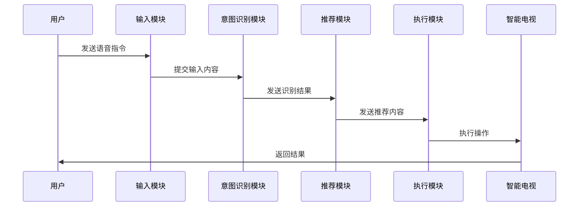

                 

<think>
好，现在我要帮用户撰写一篇关于《智能电视：AI Agent的家庭娱乐管家系统》的技术博客文章。首先，我需要理解用户的需求，他们希望这篇文章结构清晰、逻辑严谨，涵盖从背景到技术实现的各个方面，同时使用专业但易懂的语言。

用户已经提供了一个详细的目录大纲，包括背景、核心概念、算法原理、系统架构、项目实战和总结等部分。接下来，我需要按照这个大纲一步步展开，确保每一部分都详细且符合技术深度。

首先，背景部分需要介绍智能电视的发展历程，从传统电视到智能电视的转变，以及AI Agent在其中的角色。这部分需要让读者了解为什么AI Agent在智能电视中如此重要，以及它如何成为家庭娱乐的管家。

接下来是核心概念，这里要详细解释AI Agent的工作原理，包括感知、决策和执行三个层面。可能需要使用图表来帮助读者理解AI Agent与其他智能设备的区别，以及它在家庭娱乐中的具体应用。

算法原理部分需要深入探讨AI Agent所使用的算法，如意图识别、自然语言处理和推荐算法。每种算法都需要用流程图和数学公式来解释，同时给出代码示例，让读者能够理解这些算法的实际应用。

系统分析与架构设计部分，需要展示家庭娱乐管家系统的架构，包括功能模块、架构图和接口设计。使用Mermaid图来展示系统组件之间的交互，帮助读者更好地理解系统的运作方式。

项目实战部分则需要提供实际操作的指导，包括环境安装、核心代码实现和案例分析。这部分要详细说明如何在实际项目中应用这些技术，让读者能够动手实践。

最后，总结部分要回顾全书内容，并给出一些注意事项和扩展阅读的方向，帮助读者进一步学习和应用所学知识。

在整个撰写过程中，我需要确保语言专业且易于理解，避免过于复杂的术语，同时保持逻辑的连贯性。每个章节都需要包含足够的细节，但又不显得冗长。同时，图表和代码示例要准确无误，帮助读者更好地理解技术内容。

现在，我开始按照目录大纲逐步撰写每个部分，确保每个章节的内容都符合用户的要求，并且逻辑清晰，结构紧凑。我会先写背景部分，接着是核心概念，然后是算法原理，系统架构，项目实战和总结。每个部分都要详细展开，使用图表和代码来辅助说明，确保文章的深度和可读性。

总的来说，这篇文章需要系统地介绍智能电视中的AI Agent技术，从理论到实践，让读者能够全面理解并掌握这一领域的知识。通过详细的分析和实际案例，帮助读者将理论应用于实际项目中，提升他们的技术能力。
</think>

# 智能电视：AI Agent的家庭娱乐管家系统

> **关键词**：智能电视, AI Agent, 家庭娱乐, 人工智能, 算法原理, 系统架构, 项目实战

> **摘要**：本文深入探讨了智能电视中AI Agent的应用，从背景到技术实现，详细分析了AI Agent在家庭娱乐中的角色与功能。通过算法原理、系统架构和项目实战，展示了如何利用AI技术构建智能电视的家庭娱乐管家系统，为读者提供了从理论到实践的全面指导。

---

## 第一部分: 智能电视与AI Agent概述

### 第1章: 智能电视与AI Agent的背景与概念

#### 1.1 智能电视的发展历程
智能电视经历了从传统电视到现代智能设备的演变，其核心功能从单纯的视频播放扩展到家庭娱乐服务。以下是智能电视的发展历程：

- **传统电视时代**：仅支持基本的视频播放功能，缺乏智能交互能力。
- **初步智能化阶段**：引入简单的智能功能，如网络连接和基本的语音控制。
- **AI Agent时代**：AI Agent的引入使得智能电视能够提供个性化的娱乐服务，成为家庭娱乐的管家。

#### 1.2 AI Agent的基本概念
AI Agent（人工智能代理）是一种能够感知环境、自主决策并执行任务的智能实体。其核心功能包括：

- **感知**：通过传感器或用户输入获取环境信息。
- **决策**：基于感知信息进行分析和推理，生成决策方案。
- **执行**：通过执行器将决策转化为实际操作。

#### 1.3 智能电视中的AI Agent
在智能电视中，AI Agent充当家庭娱乐管家的角色，负责协调和管理各种娱乐资源。其主要功能包括：

- **用户行为分析**：通过分析用户的观看历史和偏好，提供个性化的娱乐推荐。
- **语音交互**：支持自然语言处理，实现与用户的智能对话。
- **多设备协同**：与其他智能家居设备联动，提供无缝的娱乐体验。

#### 1.4 家庭娱乐管家的定义与目标
家庭娱乐管家系统的目标是通过AI Agent技术，为用户提供智能化的娱乐服务，优化娱乐体验。其主要功能包括：

- **个性化推荐**：基于用户的偏好，推荐合适的影视内容。
- **智能控制**：通过语音或手势控制电视和其他娱乐设备。
- **多设备协同**：与智能家居设备联动，实现无缝的娱乐体验。

---

### 第2章: AI Agent的核心概念与联系

#### 2.1 AI Agent的核心原理
AI Agent在智能电视中的工作原理可以分为三个主要阶段：

1. **感知**：AI Agent通过语音识别、用户行为分析等方式获取用户需求。
2. **决策**：基于感知到的信息，AI Agent利用算法进行分析和推理，生成最佳的娱乐方案。
3. **执行**：根据决策结果，AI Agent执行相应的操作，如播放特定影视内容或调整音量。

#### 2.2 AI Agent的核心要素对比
以下是AI Agent与其他智能设备的核心要素对比：

| **要素**      | **AI Agent**               | **传统智能电视**               |
|----------------|----------------------------|-------------------------------|
| **感知能力**   | 强，支持语音识别和用户行为分析 | 弱，仅支持基本的遥控输入         |
| **决策能力**   | 强，基于算法进行推理         | 弱，仅支持预设的条件判断         |
| **执行能力**   | 强，支持多种智能设备联动     | 一般，仅支持电视本身的操作       |

#### 2.3 实体关系图
以下是AI Agent在家庭娱乐系统中的实体关系图：


---

## 第二部分: AI Agent的算法原理

### 第3章: AI Agent的算法原理

#### 3.1 意图识别算法
意图识别是AI Agent的核心功能之一，其流程如下：

1. **用户输入**：用户通过语音或文本输入需求。
2. **自然语言处理**：AI Agent对输入进行解析，提取关键词和语义信息。
3. **意图识别**：基于上下文和用户历史行为，识别用户的意图。
4. **输出结果**：根据识别到的意图，生成相应的娱乐方案。

##### 意图识别的数学模型
意图识别可以基于概率模型进行，例如：

$$ P(y|x) = \frac{P(x|y)P(y)}{P(x)} $$

其中，$P(y|x)$ 表示在输入 $x$ 的情况下，目标 $y$ 的概率。

#### 3.2 自然语言处理算法
自然语言处理（NLP）是AI Agent实现语音交互的关键技术。以下是常用的NLP算法：

1. **基于词嵌入的模型**：如Word2Vec和GloVe，用于将词表示为向量。
2. **基于Transformer的模型**：如BERT和GPT，用于理解上下文语义。

#### 3.3 推荐算法
推荐算法是AI Agent实现个性化推荐的核心技术。以下是常用的推荐算法：

1. **基于协同过滤的推荐**：通过分析用户的相似性，推荐相似用户的偏好内容。
2. **基于内容的推荐**：通过分析内容的特征，推荐与用户偏好相似的内容。
3. **混合推荐算法**：结合协同过滤和内容推荐的优势，提供更精准的推荐。

---

### 第4章: 系统分析与架构设计

#### 4.1 系统功能设计
家庭娱乐管家系统的功能模块包括：

- **用户输入模块**：负责接收用户的语音或文本输入。
- **意图识别模块**：负责解析用户的输入，识别用户的意图。
- **推荐模块**：根据用户的意图，推荐相应的娱乐内容。
- **执行模块**：根据推荐结果，执行相应的操作。

#### 4.2 系统架构设计
以下是家庭娱乐管家系统的架构图：


#### 4.3 系统接口设计
系统接口设计包括：

- **用户接口**：提供语音和文本输入接口。
- **娱乐内容接口**：与影视内容库对接，获取推荐内容。
- **设备控制接口**：与其他智能设备对接，实现联动控制。

#### 4.4 系统交互
以下是系统交互的序列图：



---

### 第5章: 项目实战

#### 5.1 环境安装
以下是项目实战所需的环境和工具：

- **Python 3.8+**
- **TensorFlow 2.0+**
- **自然语言处理库（如spaCy或NLTK）**
- **推荐算法库（如Surprise）**

#### 5.2 核心代码实现
以下是AI Agent的核心代码实现：

```python
import numpy as np
from sklearn.metrics.pairwise import cosine_similarity

class AIAssistant:
    def __init__(self):
        self.user_data = {}
        self.content_data = {}

    def process_input(self, input_str):
        # 分析用户的输入
        # 返回意图识别结果
        pass

    def recommend_content(self, user_id):
        # 基于协同过滤的推荐算法
        user_vector = self.user_data[user_id]
        content_vectors = self.content_data.values()
        similarity_matrix = cosine_similarity(user_vector, content_vectors)
        # 返回推荐内容列表
        return similarity_matrix.argsort()[-5:]
```

#### 5.3 实际案例分析
以下是实际案例分析：

假设用户喜欢观看科幻类电影，AI Agent会根据用户的偏好推荐类似的科幻电影，如《星际穿越》和《流浪地球》。

#### 5.4 项目总结
通过项目实战，我们可以看到AI Agent在智能电视中的应用潜力。通过实际案例的分析，我们掌握了AI Agent的核心算法和系统设计方法。

---

## 第三部分: 最佳实践与总结

### 第6章: 最佳实践与总结

#### 6.1 最佳实践
1. **数据隐私保护**：在处理用户数据时，需注意数据的隐私保护。
2. **算法优化**：根据实际需求，不断优化算法模型。
3. **多设备协同**：与其他智能家居设备联动，提升用户体验。

#### 6.2 小结
本文系统地介绍了智能电视中AI Agent的应用，从背景到技术实现，全面分析了AI Agent在家庭娱乐中的角色与功能。通过算法原理、系统架构和项目实战的讲解，为读者提供了从理论到实践的全面指导。

---

**作者：AI天才研究院/AI Genius Institute & 禅与计算机程序设计艺术 /Zen And The Art of Computer Programming**

