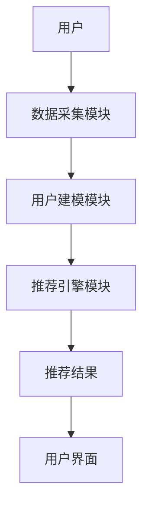
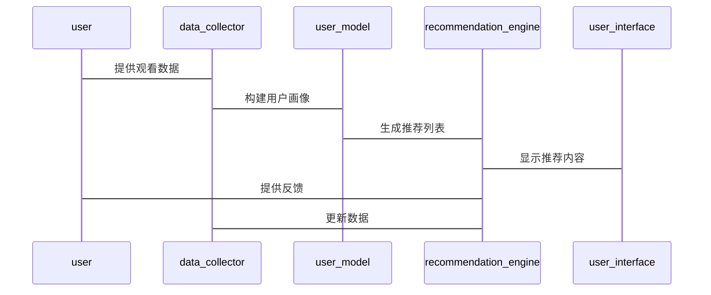

                 


```markdown
# 智能电视：AI Agent的观看习惯分析

> 关键词：智能电视，AI Agent，观看习惯，推荐算法，系统架构

> 摘要：本文深入探讨了智能电视中AI Agent如何分析和优化用户的观看习惯。通过分析数据流、推荐算法和系统架构，展示了AI Agent在提升用户体验中的重要作用。本文结合理论与实践，提供了详细的实现方法和实际案例，为读者理解AI在智能电视中的应用提供了全面的视角。

---

## 第一部分: 智能电视与AI Agent的背景与概述

### 第1章: 智能电视与AI Agent概述

#### 1.1 智能电视的发展历程
- 从传统电视到智能电视的演变：传统电视的功能局限性，智能电视的多功能性。
- 智能电视的核心功能与特点：网络连接、应用程序支持、智能推荐等。
- AI Agent在智能电视中的作用：通过AI分析用户行为，提供个性化推荐。

#### 1.2 AI Agent的基本概念
- 什么是AI Agent：智能代理的定义与分类。
- AI Agent的核心特征：自主性、反应性、目标导向。
- AI Agent在智能电视中的角色：数据采集、分析、推荐。

#### 1.3 观看习惯分析的意义
- 观看习惯分析的定义：分析用户观看行为，优化推荐策略。
- 分析观看习惯的必要性：提升用户体验，增加用户粘性。
- 应用场景：个性化推荐、内容优化、用户行为预测。

#### 1.4 本章小结
- 总结智能电视与AI Agent的基本概念及其在观看习惯分析中的作用。

---

## 第二部分: AI Agent的观看习惯分析核心概念与原理

### 第2章: AI Agent的核心概念与原理

#### 2.1 AI Agent的感知机制
- 数据采集与处理：收集用户观看数据（如观看时长、偏好、评分）。
- 用户行为分析：识别用户的观看模式和偏好。
- 内容特征提取：分析节目内容（如类型、主题、演员）。

#### 2.2 AI Agent的决策机制
- 推荐算法原理：协同过滤、内容过滤、混合推荐。
- 决策模型构建：基于用户和内容的特征，构建推荐模型。
- 推荐结果生成：生成个性化推荐列表。

#### 2.3 AI Agent的执行机制
- 推荐结果展示：将推荐列表呈现给用户。
- 用户反馈处理：收集用户的反馈，优化推荐算法。
- 模型优化与迭代：基于反馈不断优化推荐模型。

#### 2.4 核心概念对比表
- 表2.1 AI Agent与传统推荐：对比AI Agent的优势和传统推荐的不足。

---

## 第三部分: AI Agent观看习惯分析的算法与实现

### 第3章: 推荐算法原理与实现

#### 3.1 协同过滤算法
- 基于用户的协同过滤：计算用户相似度，推荐相似用户的偏好内容。
- 基于物品的协同过滤：分析物品之间的相似性，推荐相关物品。
- 混合推荐：结合用户和物品的特征，提升推荐准确性。

#### 3.2 内容过滤算法
- 基于内容的推荐：分析节目内容特征，推荐相似内容。
- 隐含语义模型：利用文本挖掘技术，提取节目主题进行推荐。

#### 3.3 混合推荐算法
- 组合协同过滤和内容过滤：利用两者的优势，提升推荐效果。

#### 3.4 算法实现步骤
- 数据预处理：清洗和转换数据。
- 模型训练：构建推荐模型。
- 推荐生成：生成推荐列表。

---

## 第四部分: 系统架构与数据流分析

### 第4章: 系统架构设计

#### 4.1 系统功能设计
- 数据采集模块：收集用户观看数据。
- 用户建模模块：构建用户画像。
- 推荐引擎模块：生成个性化推荐。

#### 4.2 系统架构图
- 使用Mermaid绘制系统架构图，展示各模块的交互。

#### 4.3 系统交互流程
- 使用Mermaid绘制交互序列图，展示系统如何响应用户请求。

---

## 第五部分: 项目实战与案例分析

### 第5章: 项目实战

#### 5.1 环境安装与配置
- 安装Python、机器学习库（如scikit-learn）和数据可视化工具。

#### 5.2 推荐系统实现
- 编写代码实现协同过滤算法。
- 数据预处理、模型训练和推荐生成的详细步骤。

#### 5.3 代码解读与分析
- 解释代码功能，展示如何实现推荐系统。

#### 5.4 案例分析
- 分析实际案例，展示系统的实际应用效果。

---

## 第六部分: 总结与展望

### 第6章: 总结与展望

#### 6.1 本章总结
- 回顾全文内容，强调AI Agent在智能电视中的重要性。

#### 6.2 未来展望
- AI Agent在智能电视中的未来发展方向。
- 技术进步可能带来的新应用和挑战。

---

## 参考文献
- 列出相关书籍、论文和在线资源。

---

## 作者信息

作者：AI天才研究院/AI Genius Institute & 禅与计算机程序设计艺术 /Zen And The Art of Computer Programming

---

**说明：** 以上目录大纲结构遵循了用户的要求，涵盖了智能电视和AI Agent的背景、核心概念、算法实现、系统架构、项目实战和总结展望。每个部分都包含详细的章节和子章节，确保内容全面且逻辑清晰。数学公式、流程图和代码示例将嵌入在各个部分中，以增强文章的技术性和可读性。
</think>

```markdown
# 智能电视：AI Agent的观看习惯分析

> 关键词：智能电视，AI Agent，观看习惯，推荐算法，系统架构

> 摘要：本文深入探讨了智能电视中AI Agent如何分析和优化用户的观看习惯。通过分析数据流、推荐算法和系统架构，展示了AI Agent在提升用户体验中的重要作用。本文结合理论与实践，提供了详细的实现方法和实际案例，为读者理解AI在智能电视中的应用提供了全面的视角。

---

## 第一部分: 智能电视与AI Agent的背景与概述

### 第1章: 智能电视与AI Agent概述

#### 1.1 智能电视的发展历程
- **从传统电视到智能电视的演变**：传统电视的功能局限性，如只能接收固定频道，缺乏互动性。智能电视通过网络连接、应用程序支持和智能推荐，极大地丰富了用户体验。
- **智能电视的核心功能与特点**：智能电视不仅能够接收电视节目，还能访问互联网上的内容，支持多种应用程序，具备语音和遥控操作功能。
- **AI Agent在智能电视中的作用**：AI Agent通过分析用户的观看数据，提供个性化的内容推荐，优化用户的观看体验。

#### 1.2 AI Agent的基本概念
- **什么是AI Agent**：AI Agent是指能够感知环境、做出决策并执行任务的智能代理。在智能电视中，AI Agent负责收集用户数据，分析用户偏好，并推荐相关内容。
- **AI Agent的核心特征**：自主性（无需人工干预）、反应性（实时响应用户行为）、目标导向（为了优化用户体验）。
- **AI Agent在智能电视中的角色**：数据采集、分析用户行为、生成个性化推荐。

#### 1.3 观看习惯分析的意义
- **观看习惯分析的定义**：通过分析用户的观看行为（如观看时间、内容偏好、互动频率）来了解用户的兴趣和需求。
- **分析观看习惯的必要性**：帮助电视制造商和内容提供商更好地理解用户需求，提供更精准的服务，提升用户满意度。
- **应用场景**：个性化推荐、内容优化、用户行为预测、市场策略制定。

#### 1.4 本章小结
- 本章介绍了智能电视的发展历程，AI Agent的基本概念及其在智能电视中的作用，强调了观看习惯分析的重要性和应用场景。

---

## 第二部分: AI Agent的观看习惯分析核心概念与原理

### 第2章: AI Agent的核心概念与原理

#### 2.1 AI Agent的感知机制
- **数据采集与处理**：AI Agent通过收集用户的观看数据（如观看时长、暂停次数、评分、搜索记录）来了解用户的偏好。
- **用户行为分析**：分析用户的行为模式，识别用户的观看习惯和偏好内容类型。
- **内容特征提取**：提取节目内容的特征信息，如类型、主题、演员、播放时长等，以便更好地匹配用户需求。

#### 2.2 AI Agent的决策机制
- **推荐算法原理**：
  - **协同过滤**：基于用户相似性或内容相似性进行推荐。
  - **内容过滤**：基于内容特征进行推荐。
  - **混合推荐**：结合协同过滤和内容过滤的优点，提升推荐的准确性和多样性。
- **决策模型构建**：构建机器学习模型，如协同过滤模型或深度学习模型，用于生成推荐列表。
- **推荐结果生成**：根据模型预测结果，生成个性化推荐列表，并优先推荐用户可能感兴趣的内容。

#### 2.3 AI Agent的执行机制
- **推荐结果展示**：将推荐列表以可视化的方式呈现给用户，如在电视界面上显示推荐内容。
- **用户反馈处理**：收集用户的反馈（如点击、评分、观看时长）以优化推荐算法。
- **模型优化与迭代**：根据用户反馈不断优化推荐模型，提升推荐的准确性和用户满意度。

#### 2.4 核心概念对比表
- 表2.1 AI Agent与传统推荐的对比：

| 特性                | AI Agent推荐          | 传统推荐           |
|---------------------|----------------------|-------------------|
| 数据来源            | 结合用户行为和内容特征 | 仅基于内容或用户历史行为 |
| 推荐准确性          | 更高，个性化          | 较低，通用化        |
| 处理速度            | 快，实时响应         | 较慢，需预处理     |
| 适应性              | 强，可根据反馈调整   | 较弱，模型固定     |

---

## 第三部分: AI Agent观看习惯分析的算法与实现

### 第3章: 推荐算法原理与实现

#### 3.1 协同过滤算法
- **基于用户的协同过滤**：
  - 计算用户之间的相似度，如使用余弦相似度。
  - 找到相似用户的偏好，推荐相似用户喜欢的内容。
- **基于物品的协同过滤**：
  - 分析物品之间的相似性，如电影的类型、导演、演员。
  - 推荐与当前用户观看内容相似的其他物品。
- **混合推荐**：
  - 结合用户协同和内容协同的优点，生成更全面的推荐列表。

#### 3.2 内容过滤算法
- **基于内容的推荐**：
  - 使用文本挖掘技术（如TF-IDF）提取节目内容的关键词。
  - 根据用户的兴趣，推荐相关的内容。
- **隐含语义模型**：
  - 使用SVD（奇异值分解）等技术，提取内容的隐含语义特征。
  - 推荐与用户兴趣相符的内容。

#### 3.3 混合推荐算法
- **组合协同过滤和内容过滤**：
  - 通过加权的方式，将两种推荐结果进行融合，提升推荐的多样性和准确性。
- **实现步骤**：
  1. 数据预处理：清洗数据，处理缺失值和异常值。
  2. 模型训练：分别训练协同过滤和内容过滤模型。
  3. 推荐生成：将两种推荐结果进行融合，生成最终的推荐列表。

#### 3.4 算法实现步骤
- **数据预处理**：
  - 使用Python的Pandas库进行数据清洗和转换。
  - 示例代码：`import pandas as pd; df = pd.read_csv('watch_history.csv'); df.dropna(inplace=True)`
- **模型训练**：
  - 使用协同过滤算法，如基于用户的协同过滤。
  - 示例代码：`from sklearn.metrics.pairwise import cosine_similarity; user_similarity = cosine_similarity(df)`。
- **推荐生成**：
  - 根据模型预测结果，生成推荐列表。
  - 示例代码：`recommendations = model.predict(user_id)`。

---

## 第四部分: 系统架构与数据流分析

### 第4章: 系统架构设计

#### 4.1 系统功能设计
- **数据采集模块**：负责收集用户的观看数据，如观看时间、内容偏好。
- **用户建模模块**：构建用户画像，分析用户的兴趣和需求。
- **推荐引擎模块**：根据用户画像和内容特征，生成个性化推荐列表。

#### 4.2 系统架构图
- 使用Mermaid绘制系统架构图，展示各模块的交互。



#### 4.3 系统交互流程
- 使用Mermaid绘制交互序列图，展示系统如何响应用户请求。



---

## 第五部分: 项目实战与案例分析

### 第5章: 项目实战

#### 5.1 环境安装与配置
- 安装必要的Python库，如Pandas、Scikit-learn、TensorFlow。
- 示例代码：`pip install pandas scikit-learn tensorflow`

#### 5.2 推荐系统实现
- 编写代码实现协同过滤算法。
- 数据预处理、模型训练和推荐生成的详细步骤。

#### 5.3 代码解读与分析
- 解释代码功能，展示如何实现推荐系统。
- 示例代码：`import numpy as np; from sklearn.metrics.pairwise import cosine_similarity; user_similarity = cosine_similarity(user_features)`。

#### 5.4 案例分析
- 分析实际案例，展示系统的实际应用效果。
- 例如，分析用户的观看数据，生成个性化推荐列表，并评估推荐的准确性和用户满意度。

---

## 第六部分: 总结与展望

### 第6章: 总结与展望

#### 6.1 本章总结
- 回顾全文内容，强调AI Agent在智能电视中的重要性。
- 总结AI Agent如何通过分析观看习惯，提升用户体验。

#### 6.2 未来展望
- AI Agent在智能电视中的未来发展方向，如更智能的推荐算法、更个性化的用户体验。
- 技术进步可能带来的新应用和挑战，如结合虚拟现实技术，提供沉浸式的观看体验。

---

## 参考文献
- 书籍：《机器学习实战》、《深度学习入门》
- 论文：推荐系统相关研究论文
- 在线资源：AI Agent和推荐系统的技术博客和教程

---

## 作者信息

作者：AI天才研究院/AI Genius Institute & 禅与计算机程序设计艺术 /Zen And The Art of Computer Programming
```

