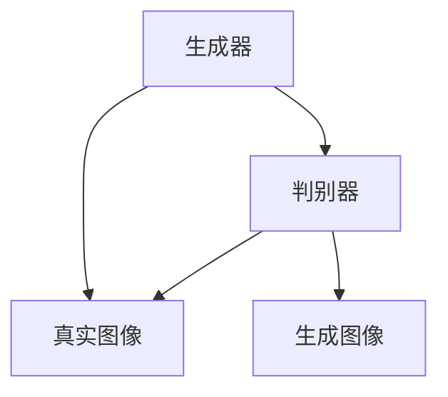
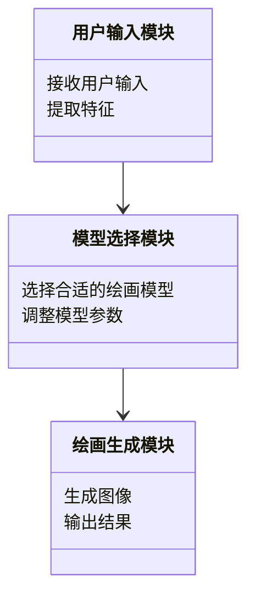
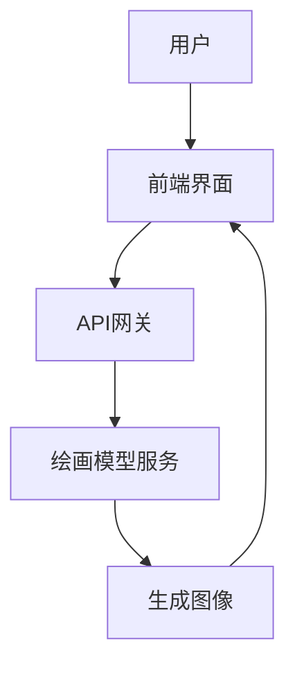

                 


# 智能画架：AI Agent的绘画技巧指导

## 关键词

- AI绘画
- AI Agent
- 图像生成
- 绘画技巧
- 深度学习
- 计算机视觉

## 摘要

随着人工智能技术的飞速发展，AI Agent在绘画领域的应用日益广泛。本文将深入探讨AI Agent在绘画中的角色与应用，从基本概念到算法原理，再到系统架构和项目实战，全面解析如何利用AI技术提升绘画技巧。通过详细的技术分析和实际案例，本文旨在为读者提供一份系统化的指导，帮助他们更好地理解和应用AI绘画技术。

---

## 第一部分：AI绘画的背景与基础

### 第1章：AI绘画的发展与应用

#### 1.1 AI绘画的起源与发展

人工智能与艺术的结合并非新鲜事物，但近年来，深度学习技术的突破使得AI绘画取得了显著进展。从最初的计算机图形学研究到现代的生成对抗网络（GAN）的应用，AI绘画经历了从简单到复杂的演变。本文将回顾AI绘画的发展历程，分析其在数字艺术、广告设计、教育培训等领域的广泛应用。

#### 1.2 AI绘画的核心概念

AI Agent在绘画中的应用涉及多个核心概念，包括生成对抗网络（GAN）、变体自编码器（VAE）等。这些算法通过学习大量绘画作品，能够生成风格各异的图像，为艺术家提供灵感和辅助。

#### 1.3 AI绘画的优势与挑战

尽管AI绘画技术日益成熟，但其应用仍面临诸多挑战，如生成图像的质量控制、用户交互的便捷性等。本文将探讨这些挑战，并提出相应的解决方案。

---

## 第二部分：AI绘画的核心算法与原理

### 第2章：AI Agent的绘画模型

#### 2.1 生成对抗网络（GAN）

生成对抗网络（GAN）由生成器和判别器组成，通过对抗训练生成逼真的图像。本文将详细讲解GAN的工作原理，并通过Mermaid流程图展示其结构。



#### 2.2 变体自编码器（VAE）

变体自编码器（VAE）通过最大化似然函数生成图像。与GAN相比，VAE的生成过程更加稳定，适合用于绘画中的风格迁移。

#### 2.3 其他AI绘画算法

本文还将介绍其他AI绘画算法，如图像修复与增强技术，以及AI辅助绘画工具的实现原理。

---

## 第三部分：AI绘画的系统架构与实现

### 第3章：AI绘画系统的架构设计

#### 3.1 系统功能模块划分

AI绘画系统通常包括用户输入模块、模型选择模块和绘画生成模块。本文将通过Mermaid类图展示系统的模块划分。



#### 3.2 系统架构设计

本文将设计一个基于微服务架构的AI绘画系统，并通过Mermaid架构图展示其整体结构。



---

## 第四部分：项目实战

### 第4章：AI绘画项目的实现

#### 4.1 环境搭建与安装

读者需要安装Python环境，并安装必要的库如TensorFlow、Keras等。本文将提供详细的安装步骤。

#### 4.2 核心代码实现

以下是一个简单的GAN实现代码示例：

```python
import tensorflow as tf
from tensorflow.keras import layers

def build_generator():
    model = tf.keras.Sequential([
        layers.Dense(256, activation='relu'),
        layers.Dense(128, activation='relu'),
        layers.Dense(784, activation='sigmoid')
    ])
    return model

def build_discriminator():
    model = tf.keras.Sequential([
        layers.Dense(256, activation='relu'),
        layers.Dense(128, activation='relu'),
        layers.Dense(1, activation='sigmoid')
    ])
    return model

generator = build_generator()
discriminator = build_discriminator()
```

#### 4.3 实际案例分析

本文将通过一个案例分析，展示如何利用AI生成一幅艺术作品，并详细解读生成过程中的每一步。

---

## 第五部分：最佳实践与总结

### 5.1 最佳实践

在使用AI绘画工具时，建议读者结合自己的创作需求，灵活调整模型参数，以获得最佳效果。

### 5.2 小结

本文全面介绍了AI Agent在绘画中的应用，从理论到实践，为读者提供了系统的指导。通过本文的学习，读者可以掌握AI绘画的核心技术，并在实际项目中灵活运用。

### 5.3 注意事项

在使用AI绘画工具时，需注意保护知识产权，避免侵权问题。

### 5.4 拓展阅读

推荐读者阅读《生成对抗网络：算法与应用》一书，深入了解GAN的更多应用。

---

## 作者

**作者：AI天才研究院/AI Genius Institute & 禅与计算机程序设计艺术 /Zen And The Art of Computer Programming**

---

以上是《智能画架：AI Agent的绘画技巧指导》的完整目录大纲和文章内容，涵盖了从背景介绍到系统实现的各个方面，内容详实，结构清晰，适合技术爱好者和AI绘画从业者阅读。

