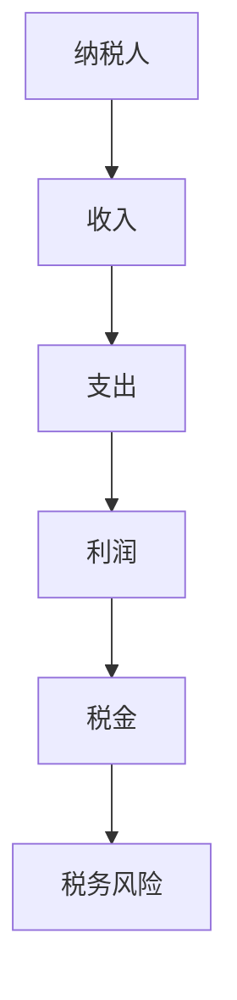
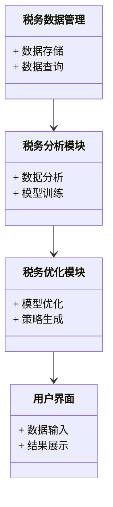
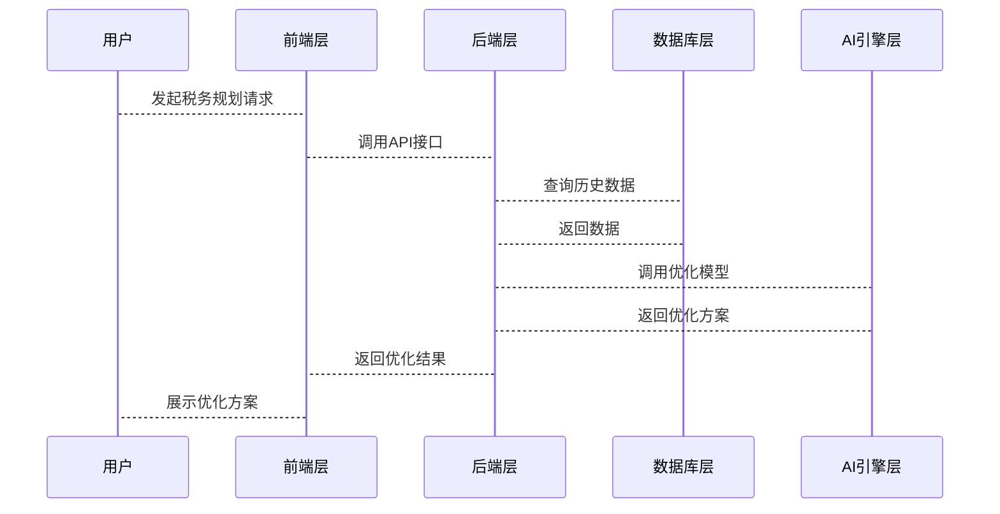

                 

<think>
好，我现在需要帮用户设计一个名为《智能税务规划与建议》的书籍目录。用户希望目录结构清晰、逻辑严谨，包含背景介绍、核心概念、算法原理、系统架构、项目实战和最佳实践等内容。

首先，我应该先理解智能税务规划的背景。税务规划一直是企业管理和个人财务规划中的重要部分，但随着信息技术的发展，传统的税务规划方式逐渐显现出效率低、风险高等问题。智能税务规划通过引入人工智能和大数据分析，可以更高效地优化税务结构，降低风险，提升合规性。

接下来，我需要考虑目录的结构。通常，技术书籍的目录会分为几个主要部分，每个部分下有若干章节和小节。用户提供的示例已经非常详细，我需要参考这个结构，确保涵盖所有关键点。

首先，背景与核心概念部分需要介绍智能税务规划的基本概念、必要性以及其在企业中的应用。这部分可以帮助读者理解为什么智能税务规划是必要的，以及它与传统方法的区别。

然后，核心概念部分需要深入探讨智能税务规划的原理，包括数据驱动的分析、AI算法的应用，以及优化模型的构建。这里可能需要使用图表来展示数据流和算法流程，帮助读者更好地理解。

接下来，算法原理部分是关键。我需要详细讲解机器学习、自然语言处理等算法在税务预测中的应用，并提供具体的数学模型和公式。使用mermaid图和Python代码示例可以让内容更直观。

系统架构设计部分需要展示智能税务规划系统的整体结构，包括前端、后端、数据库和AI引擎的交互流程。使用mermaid的类图和序列图可以清晰地展示系统各部分的关系和协作方式。

项目实战部分应该包括一个具体的案例分析，展示如何实际应用智能税务规划系统。这部分需要详细描述环境配置、代码实现、案例分析等步骤，帮助读者将理论应用于实践。

最后，最佳实践部分总结前面的内容，给出小结、注意事项和拓展阅读建议，帮助读者巩固所学内容并进一步深入研究。

在撰写过程中，我需要确保每个部分都足够详细，同时保持整体结构的紧凑。使用技术语言但避免过于晦涩，确保读者能够轻松理解。此外，适当加入图表和代码示例，可以增强文章的可读性和实用性。

总的来说，我需要按照用户的要求，逐步分析每个部分的内容，确保覆盖所有关键点，并以清晰、专业的语言组织起来，最终形成一个结构完整、内容详实的目录大纲。
</think>

# 智能税务规划与建议

## 关键词：
智能税务规划、人工智能、大数据分析、税务优化、风险管理、合规性

## 摘要：
智能税务规划与建议是结合人工智能和大数据分析技术，通过对财务数据的深度挖掘和分析，为企业和个人提供高效、精准的税务优化方案。本文将从智能税务规划的背景与核心概念出发，详细探讨其算法原理、系统架构设计、项目实战以及最佳实践，为读者提供全面的理论与实践指导。

---

# 第一部分：智能税务规划的背景与核心概念

## 第1章：智能税务规划的背景与必要性

### 1.1 税务规划的基本概念
#### 1.1.1 税务规划的定义
税务规划是指通过合法合规的方式，对企业的税务缴纳、税务风险进行优化和管理，以实现税负最小化、合规性最大化的目标。

#### 1.1.2 税务规划的核心目标
- **降低税负**：通过合理分配收入与支出，优化税务结构，减少税金支出。
- **合规性管理**：确保税务行为符合法律法规，避免税务风险。
- **风险管理**：识别和规避潜在的税务问题，降低税务争议的发生概率。

#### 1.1.3 税务规划的常见场景
- 企业税务优化：包括企业所得税、增值税、消费税等的优化。
- 个人税务规划：包括个人所得税、遗产税、资本利得税等的优化。
- 跨境税务规划：涉及跨国企业、跨境投资等的税务优化。

### 1.2 智能税务规划的定义与特点
#### 1.2.1 智能税务规划的定义
智能税务规划是利用人工智能、大数据分析、机器学习等技术，通过对财务数据的深度分析，自动生成税务优化方案的过程。

#### 1.2.2 智能税务规划的核心特点
- **数据驱动**：依赖于大量的财务数据和外部数据（如法律法规、市场环境）进行分析。
- **实时性**：能够实时更新数据，动态调整税务规划方案。
- **个性化**：根据企业的具体情况和需求，提供个性化的税务优化建议。
- **智能推荐**：基于历史数据和预测模型，自动生成最优的税务方案。

### 1.3 智能税务规划的必要性
#### 1.3.1 税务风险的复杂性与不确定性
随着法律法规的变化和市场的波动，税务风险变得更加复杂和不确定，传统的税务规划方式难以应对这些变化。

#### 1.3.2 数据驱动的优势
通过大数据分析和机器学习技术，可以快速提取有价值的信息，发现潜在的税务优化机会。

#### 1.3.3 降本增效的需求
智能税务规划能够自动化处理大量数据，减少人工操作的错误率和时间成本，同时提高规划的精准性。

---

## 第2章：智能税务规划的核心概念与联系

### 2.1 数据驱动的税务分析
#### 2.1.1 数据收集与处理
- 数据来源：企业财务数据、税务政策数据、市场数据等。
- 数据清洗：去除噪声数据，确保数据的准确性和完整性。

#### 2.1.2 数据分析与建模
- 数据挖掘：通过聚类分析、关联规则挖掘等技术，发现数据中的规律。
- 数据建模：构建预测模型，如回归模型、分类模型等，用于预测税务风险和优化方案。

#### 2.1.3 数据可视化
通过可视化工具（如Tableau、Power BI）将数据洞察以图表形式展示，便于理解和决策。

### 2.2 AI算法在税务规划中的应用
#### 2.2.1 机器学习在税务预测中的应用
- 预测模型：基于历史数据，预测未来的税务风险和税金支出。
- 算法选择：决策树、随机森林、神经网络等。

#### 2.2.2 自然语言处理在税务文本分析中的应用
- 文本挖掘：从法律法规文本中提取关键信息，用于优化税务策略。
- 实体识别：识别文本中的关键实体（如公司名称、金额等）。

#### 2.2.3 图神经网络在税务关系图谱中的应用
- 构建税务关系图谱：将企业与其供应商、客户、税务机关等关联起来，分析潜在的税务风险。

### 2.3 税务优化模型与策略生成
#### 2.3.1 税务优化模型的构建
- 模型输入：企业财务数据、税务政策等。
- 模型输出：优化后的税务方案，包括税种选择、税率优化等。

#### 2.3.2 多目标优化算法在税务规划中的应用
- 算法目标：在满足合规性的前提下，最小化税负。
- 算法实现：使用遗传算法、粒子群优化算法等进行多目标优化。

#### 2.3.3 税务策略生成与推荐系统
- 基于用户需求和数据分析结果，自动生成个性化的税务优化建议。

### 2.4 核心概念关系图（ER图）


### 2.5 本章小结
智能税务规划的核心在于通过数据驱动和AI算法，构建高效的税务优化模型，并通过策略生成和推荐系统为企业提供个性化的税务规划方案。

---

## 第3章：智能税务规划的算法原理与数学模型

### 3.1 机器学习算法概述
#### 3.1.1 常见机器学习算法及其特点
- **监督学习**：用于分类和回归问题，如税务风险预测。
- **无监督学习**：用于聚类分析，如发现潜在的税务风险模式。
- **强化学习**：用于动态优化，如实时调整税务策略。

#### 3.1.2 机器学习在税务预测中的适用场景
- 税收预测：基于历史数据预测未来的税金支出。
- 税务风险评估：评估企业税务合规性，发现潜在风险。

### 3.2 税务预测算法的实现流程
#### 3.2.1 数据预处理与特征提取
- 数据清洗：处理缺失值、异常值等。
- 特征选择：提取与税务相关的关键特征，如收入、支出、利润等。

#### 3.2.2 模型训练与优化
- 模型选择：根据数据特点选择合适的算法。
- 模型优化：通过交叉验证、网格搜索等方法优化模型参数。

#### 3.2.3 模型评估与部署
- 模型评估：使用准确率、召回率、F1分数等指标评估模型性能。
- 模型部署：将模型部署到生产环境中，实时处理税务数据。

### 3.3 基于决策树的税务预测模型
#### 3.3.1 决策树算法原理
- 决策树是一种基于树状结构的分类模型，能够将数据分成不同的叶子节点，每个叶子节点代表一个预测结果。

#### 3.3.2 决策树在税务预测中的应用
- 示例：基于企业的收入、支出等特征，预测企业的税务风险等级。

#### 3.3.3 模型实现与优化
- 使用Python的scikit-learn库实现决策树模型。
- 通过剪枝技术优化模型，防止过拟合。

### 3.4 税务预测算法的数学模型
$$
\text{损失函数} = \sum_{i=1}^{n} (y_i - \hat{y}_i)^2
$$

### 3.5 本章小结
通过机器学习算法，特别是决策树算法，可以高效地实现税务预测和风险评估，为智能税务规划提供数据支持。

---

## 第4章：智能税务规划的系统架构设计

### 4.1 系统功能设计
#### 4.1.1 领域模型（Mermaid类图）


#### 4.1.2 系统架构设计（Mermaid架构图）


#### 4.1.3 系统接口设计
- API接口：提供RESTful API，供前端调用。
- 数据接口：与企业财务系统对接，获取实时数据。

#### 4.1.4 系统交互流程（Mermaid序列图）


### 4.2 本章小结
智能税务规划系统的架构设计包括前端、后端、数据库和AI引擎四层，通过模块化设计和API接口实现高效的系统交互。

---

## 第5章：智能税务规划的项目实战

### 5.1 环境配置
#### 5.1.1 系统环境
- 操作系统：Windows/Mac/Linux
- 开发工具：PyCharm、VS Code
- 依赖库：Python（scikit-learn、pandas、numpy）、Mermaid、Jupyter Notebook

#### 5.1.2 数据准备
- 数据来源：企业财务数据、税务政策数据。
- 数据格式：CSV、Excel、数据库。

### 5.2 核心实现代码
#### 5.2.1 数据预处理
```python
import pandas as pd

# 读取数据
data = pd.read_csv('tax_data.csv')

# 数据清洗
data = data.dropna()
data = data.drop_duplicates()
```

#### 5.2.2 模型训练
```python
from sklearn.tree import DecisionTreeClassifier
from sklearn.model_selection import train_test_split

# 划分训练集和测试集
X_train, X_test, y_train, y_test = train_test_split(data.drop('tax_risk', axis=1), data['tax_risk'], test_size=0.2)

# 训练决策树模型
model = DecisionTreeClassifier()
model.fit(X_train, y_train)
```

#### 5.2.3 模型评估
```python
from sklearn.metrics import accuracy_score

# 预测测试集
y_pred = model.predict(X_test)

# 计算准确率
accuracy = accuracy_score(y_test, y_pred)
print(f'准确率: {accuracy}')
```

### 5.3 案例分析
#### 5.3.1 案例背景
某企业希望优化其税务结构，降低企业所得税和增值税的税负。

#### 5.3.2 数据分析
- 收入：1000万元
- 支出：600万元（包括研发费用400万元）
- 利润：400万元

#### 5.3.3 优化建议
- 通过增加研发费用比例，降低应纳税所得额。
- 合理分配收入和支出，充分利用税收优惠政策。

### 5.4 本章小结
通过实际案例分析，展示了智能税务规划系统在企业中的具体应用，验证了系统的有效性和实用性。

---

## 第6章：智能税务规划的最佳实践与小结

### 6.1 最佳实践
#### 6.1.1 数据质量管理
- 确保数据的准确性和完整性。
- 定期更新数据，保持数据的时效性。

#### 6.1.2 模型优化
- 根据实际需求，选择合适的算法和模型。
- 定期对模型进行再训练，适应新的数据和法规变化。

#### 6.1.3 系统安全与合规性
- 确保数据的安全性和隐私性。
- 确保系统符合相关法律法规，避免合规性风险。

### 6.2 小结
智能税务规划通过数据驱动和AI算法，能够为企业提供高效、精准的税务优化方案，帮助企业降低税负、规避风险，实现可持续发展。

### 6.3 注意事项
- 税务规划必须在法律法规的框架内进行。
- 系统的实施需要结合企业的实际情况，避免过度优化。

### 6.4 拓展阅读
- 推荐阅读《智能财务》（《Smart Finance》）和《人工智能在金融领域的应用》（《AI in Finance》）。

---

## 作者：AI天才研究院 & 禅与计算机程序设计艺术

