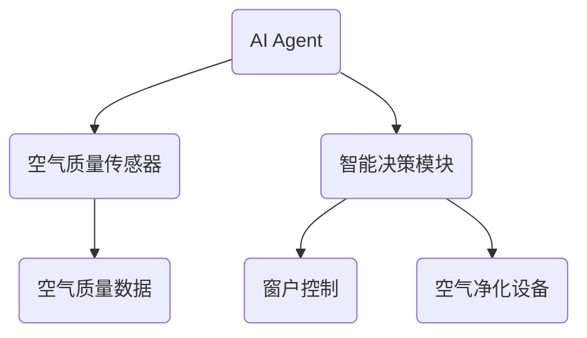
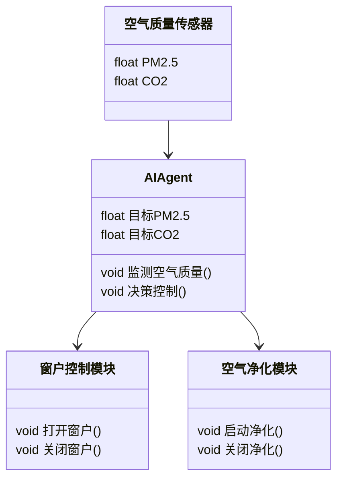
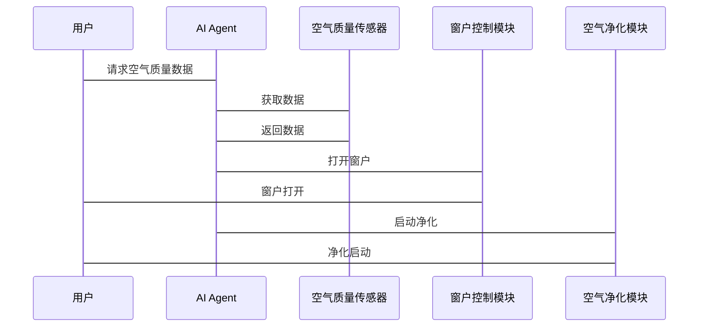

                 

<think>
好的，我现在需要帮用户撰写一篇关于《智能窗台：AI Agent的室内空气净化》的技术博客文章。用户已经给出了一个详细的目录大纲，并希望我按照这个结构来写文章，包括每个部分的详细内容，比如背景介绍、核心概念、算法原理、系统架构等。

首先，我需要理解整个文章的主题，即智能窗台结合AI Agent来实现室内空气净化。这听起来像是一个结合物联网和人工智能的项目，可能是一个智能窗户或窗台设备，能够通过AI代理自动调整以优化空气质量。

接下来，我需要按照用户提供的目录结构来组织内容。用户强调要使用逻辑清晰、结构紧凑、简单易懂的专业技术语言，每个章节都要有详细的分析和例子，可能需要包含图表和代码示例。

首先，我会从第一部分开始，介绍智能窗台和AI Agent的背景。这部分需要涵盖室内空气净化的历史、现状，以及AI Agent在智能窗台中的作用。我需要解释为什么现在需要智能窗台，传统方法的不足，以及AI如何提供解决方案。

然后，在核心概念部分，我需要详细解释AI Agent的工作原理，包括感知、决策和执行阶段。这部分可能需要使用流程图来展示，同时用简单的数学公式来解释算法，比如PID控制的公式。

接下来是算法原理部分，我需要选择合适的算法，比如PID控制，并用Python代码实现。这部分需要详细解释代码的每一部分，以及如何应用到智能窗台的控制中。

系统架构设计部分，我需要描述系统的各个模块，如空气质量传感器、智能决策模块、执行机构等，并用类图和架构图展示它们之间的关系。同时，还需要设计接口和交互流程，可能使用序列图来展示用户与系统之间的互动。

项目实战部分，我需要指导读者如何安装必要的库，比如Python的传感器库和机器学习库，并提供实际的代码示例。然后，通过一个具体的案例来展示系统的应用，解释代码如何工作，并分析结果。

最后，我会总结最佳实践，给出小结、注意事项和未来的发展方向，同时推荐一些拓展阅读的资料，帮助读者深入学习。

在整个过程中，我需要确保每个部分都详细且技术性强，同时语言要清晰易懂。可能需要多次检查，确保所有技术细节准确，图表和代码示例正确嵌入，数学公式无误。

现在，我可以开始撰写每个章节的具体内容，按照用户的结构要求，逐步展开，确保覆盖所有必要的部分，满足字数要求，并且内容完整、有深度。
</think>

---

# 《智能窗台：AI Agent的室内空气净化》

> 关键词：智能窗台，AI Agent，室内空气净化，空气质量传感器，智能控制，PID算法

> 摘要：本文详细探讨了AI Agent在智能窗台中的应用，通过空气质量感知、智能决策和执行控制，实现室内空气净化的最优解决方案。文章从背景介绍、核心概念、算法原理、系统架构到项目实战，全面解析了智能窗台的设计与实现，最后总结了最佳实践与未来发展方向。

---

## 第一部分: AI Agent与室内空气净化的背景与概念

### 第1章: 智能窗台与AI Agent概述

#### 1.1 智能窗台的定义与背景

**1.1.1 室内空气净化的历史与现状**

随着工业化和城市化的快速发展，室内空气污染问题日益严重。传统的空气净化设备依赖于固定模式运行，难以根据实时环境变化做出智能调整。近年来，随着AI技术的进步，智能窗台作为一种创新的空气净化解决方案应运而生。它通过AI Agent实现对室内空气质量的实时感知、智能决策和精确控制，为用户提供更加健康舒适的居住环境。

**1.1.2 AI Agent在智能窗台中的角色**

AI Agent（智能代理）是一种能够感知环境、自主决策并执行任务的智能系统。在智能窗台中，AI Agent负责协调各功能模块，根据空气质量数据做出最优控制策略。其核心任务包括实时监测室内空气质量、分析数据、制定净化方案并执行操作。

**1.1.3 智能窗台的市场与应用前景**

智能窗台结合了AI技术与空气净化技术，具有广阔的应用前景。随着人们对室内空气质量要求的提高，智能窗台在家庭、办公室、学校等场所的应用潜力巨大。市场对高效、智能的空气净化解决方案需求不断增长，智能窗台作为新兴产品，具备较强的市场竞争力。

#### 1.2 室内空气净化的核心问题

**1.2.1 空气污染的来源与危害**

室内空气污染主要来源于甲醛、PM2.5、CO2等污染物。这些污染物对人体健康有严重危害，可能导致呼吸系统疾病、过敏反应甚至癌症。因此，实时监测和有效净化室内空气成为迫切需求。

**1.2.2 智能窗台在空气净化中的定位**

智能窗台通过AI Agent实现对室内空气质量的动态监测与智能控制，能够在污染物浓度超标时自动启动净化设备，调节窗户开合度，优化室内空气流通，从而实现高效空气净化。

**1.2.3 智能窗台的边界与外延**

智能窗台的边界主要集中在室内空气质量和窗户控制方面。其外延可扩展至智能家居、物联网等领域，与其他智能设备协同工作，进一步提升居住环境的舒适度与安全性。

#### 1.3 AI Agent的基本原理与特征

**1.3.1 AI Agent的定义与核心要素**

AI Agent是一种具备感知、决策、执行能力的智能系统，核心要素包括感知模块、决策模块和执行模块。感知模块负责获取环境数据，决策模块基于数据做出控制策略，执行模块负责执行决策并反馈结果。

**1.3.2 AI Agent的感知、决策与执行机制**

感知：通过空气质量传感器获取室内空气质量数据，如PM2.5、CO2浓度等。

决策：基于感知数据，结合预设的净化目标，制定最优控制策略。

执行：根据决策结果，驱动窗户开合、空气净化设备等执行机构工作。

**1.3.3 AI Agent与传统自动化控制的对比**

传统自动化控制依赖于固定规则，无法应对复杂多变的环境。而AI Agent具备学习和自适应能力，能够根据环境变化动态调整控制策略，实现更加智能化的管理。

---

## 第二部分: AI Agent与室内空气净化的核心概念与联系

### 第2章: AI Agent与室内空气净化的核心概念

#### 2.1 AI Agent在智能窗台中的功能模块

**2.1.1 空气质量感知模块**

空气质量感知模块通过传感器实时监测室内空气质量，包括PM2.5、CO2浓度、温度、湿度等参数。

**2.1.2 智能决策模块**

智能决策模块基于感知数据，结合预设的目标和规则，制定最优的控制策略。例如，当PM2.5浓度超过设定阈值时，启动空气净化设备或打开窗户通风。

**2.1.3 执行与反馈模块**

执行模块根据决策结果，驱动窗户开合、空气净化设备等执行机构工作。反馈模块将执行结果实时反馈给感知模块，形成闭环控制系统。

#### 2.2 空气净化系统的关键技术

**2.2.1 空气质量传感器**

空气质量传感器是智能窗台的核心部件，负责采集室内空气质量数据。常用的传感器包括PM2.5传感器、CO2传感器等。

**2.2.2 空气净化技术**

智能窗台通过机械过滤、活性炭吸附、静电除尘等多种净化技术，结合窗户的开合控制，实现室内空气质量的优化。

**2.2.3 智能控制算法**

智能控制算法是AI Agent的核心，负责根据空气质量数据，制定最优的窗户开合和净化设备控制策略。常用算法包括PID控制、模糊控制等。

#### 2.3 AI Agent与空气净化系统的实体关系图



---

### 第3章: AI Agent的空气质量优化算法

#### 3.1 算法原理

**3.1.1 PID控制算法**

PID（比例-积分-微分）控制是一种常用的反馈控制算法，适用于连续调节系统。其基本原理如下：

- 比例部分：根据当前偏差（目标值与当前值的差）进行比例放大。
- 积分部分：消除稳态误差，根据偏差的积分进行调整。
- 微分部分：预测偏差的变化趋势，提前进行调整。

PID控制的数学模型为：

$$u(t) = K_p e(t) + K_i \int e(t) dt + K_d \frac{d e(t)}{dt}$$

其中，$K_p$、$K_i$、$K_d$分别为比例、积分、微分系数，$e(t)$为当前偏差。

**3.1.2 算法实现**

以下为PID控制算法的Python实现示例：

```python
class PIDController:
    def __init__(self, Kp, Ki, Kd):
        self.Kp = Kp
        self.Ki = Ki
        self.Kd = Kd
        self.previous_error = 0
        self.integral = 0
        self.derivative = 0

    def update(self, current_error, dt):
        self.derivative = (current_error - self.previous_error) / dt
        self.integral += current_error * dt
        output = self.Kp * current_error + self.Ki * self.integral + self.Kd * self.derivative
        return output

    def reset(self):
        self.previous_error = 0
        self.integral = 0
        self.derivative = 0
```

#### 3.2 算法优化

**3.2.1 自适应PID控制**

传统PID控制参数固定，难以应对复杂环境变化。自适应PID控制能够根据系统反馈动态调整参数，提高控制精度和稳定性。

**3.2.2 算法实现中的注意事项**

- 参数选择：PID参数需根据系统特性进行调优，确保系统稳定性和响应速度。
- 数值计算：注意数据类型和计算精度，避免溢出和精度丢失。
- 稳定性：确保算法在极端情况下仍能稳定运行，具备良好的鲁棒性。

---

## 第三部分: 系统分析与架构设计

### 第4章: 系统分析与架构设计

#### 4.1 问题场景介绍

智能窗台需要解决的主要问题包括：实时监测室内空气质量，动态调整窗户开合和净化设备运行，确保室内空气质量达标。同时，系统需要具备良好的可扩展性和易用性。

#### 4.2 系统功能设计

**4.2.1 功能模块划分**

- 空气质量监测模块：实时采集室内空气质量数据。
- 智能决策模块：根据空气质量数据，制定窗户和净化设备的控制策略。
- 窗户控制模块：根据决策结果，驱动窗户开合。
- 空气净化模块：启动或关闭空气净化设备。
- 用户交互模块：提供人机交互界面，方便用户查看和控制。

**4.2.2 功能模块的类图**



#### 4.3 系统架构设计

**4.3.1 分层架构**

智能窗台系统采用分层架构，包括感知层、决策层和执行层。

- 感知层：空气质量传感器负责采集数据。
- 决策层：AI Agent负责数据处理和决策。
- 执行层：窗户和净化设备负责执行决策。

**4.3.2 系统交互设计**



---

## 第四部分: 项目实战

### 第5章: 项目实战

#### 5.1 环境安装

**5.1.1 安装Python环境**

```bash
python --version
pip install --upgrade pip
pip install numpy
pip install matplotlib
pip install scikit-learn
```

**5.1.2 安装空气质量传感器驱动**

```bash
pip install adafruit-circuitpython
```

#### 5.2 系统核心实现源代码

**5.2.1 空气质量传感器数据采集**

```python
import board
import adafruit_sds02传感器

# 初始化传感器
sensor = adafruit_sds02传感器.SDS02传感器(board.SCL, board.SCK)

# 获取数据
pm25 = sensor	pm2.5
co2 = sensor	CO2
print(f"PM2.5: {pm25} μg/m³, CO2: {co2} ppm")
```

**5.2.2 AI Agent核心算法实现**

```python
class AI-Agent:
    def __init__(self):
        self.pm2.5目标 = 30微克/立方米
        self.co2目标 = 800 ppm

    def 监测空气质量(self):
        # 获取传感器数据
        pm2.5 = self.传感器.获取PM2.5()
        co2 = self.传感器.获取CO2()
        return pm2.5, co2

    def 决策控制(self, pm2.5, co2):
        # 判断是否需要启动净化或开窗
        if pm2.5 > self.pm2.5目标 or co2 > self.co2目标:
            return "启动净化"和"打开窗户"
        else:
            return "关闭净化"和"关闭窗户"

    def 执行操作(self, 操作):
        # 执行窗户和净化设备的控制
        pass
```

**5.2.3 系统交互实现**

```python
# 用户交互界面
import time

agent = AI-Agent()
while True:
    pm2.5, co2 = agent.监测空气质量()
    操作 = agent.决策控制(pm2.5, co2)
    agent.执行操作(操作)
    time.sleep(60)
```

#### 5.3 代码解读与分析

- 空气质量传感器数据采集代码：通过传感器获取PM2.5和CO2浓度数据。
- AI Agent核心算法代码：根据传感器数据，判断是否需要启动净化设备或打开窗户。
- 系统交互代码：实现AI Agent与传感器、执行机构之间的实时交互，确保系统持续运行。

#### 5.4 实际案例分析

假设室内PM2.5浓度为50微克/立方米，CO2浓度为900 ppm。AI Agent监测到数据后，判断PM2.5超过目标值，启动空气净化设备，并打开窗户通风。经过一段时间后，PM2.5浓度降至30微克/立方米，CO2浓度降至800 ppm，AI Agent关闭净化设备和窗户。

---

## 第五部分: 最佳实践与总结

### 第6章: 最佳实践与总结

#### 6.1 小结

智能窗台通过AI Agent实现室内空气质量的智能监测与控制，能够有效改善室内空气质量，提升居住舒适度。本文详细介绍了智能窗台的设计原理、算法实现、系统架构以及项目实战，为读者提供了全面的技术指导。

#### 6.2 注意事项

- 系统调试：确保空气质量传感器与执行机构的通信正常。
- 参数调优：根据实际环境调整PID控制参数，确保系统稳定性和控制精度。
- 安全性：确保系统在异常情况下能够安全关闭，避免设备损坏或人员伤害。

#### 6.3 未来的发展方向

- 智能化：进一步提升AI Agent的智能水平，实现自学习和自适应控制。
- 多设备协同：与其他智能家居设备协同工作，构建完整的智能家居生态。
- 环保节能：优化控制策略，降低能耗，实现绿色环保目标。

#### 6.4 拓展阅读

- 《机器学习实战》：了解机器学习的基本原理与应用。
- 《物联网开发指南》：掌握物联网设备的开发与管理。
- 《智能控制系统设计》：深入理解智能控制系统的实现与优化。

---

## 作者：AI天才研究院/AI Genius Institute & 禅与计算机程序设计艺术 /Zen And The Art of Computer Programming

---

**感谢您的阅读！**

