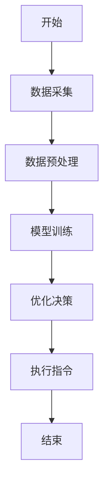
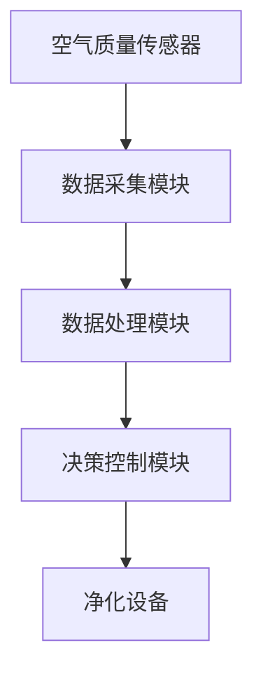

                 


# 智能窗台：AI Agent的室内空气净化优化

> 关键词：AI Agent，室内空气净化，智能窗台，算法优化，系统架构

> 摘要：本文探讨了AI Agent在室内空气净化中的应用，分析了智能窗台系统的设计与实现，详细讲解了算法原理和系统架构，最后通过实际案例展示了项目的实施过程和效果。

---

## 第1章：智能窗台与AI Agent的背景

### 1.1 智能窗台的定义与问题背景

#### 1.1.1 室内空气净化的重要性
随着城市化进程的加快，室内空气质量问题日益凸显。空气净化不仅关系到健康，还影响居住舒适度。传统空气净化设备存在能耗高、效率低的问题，难以满足现代人对智能、高效的需求。

#### 1.1.2 传统空气净化技术的局限性
传统设备依赖固定模式运行，无法根据环境变化实时调整。例如，PM2.5浓度高时，设备可能过度运行，导致能耗增加，且净化效果有限。

#### 1.1.3 AI Agent在空气净化中的应用潜力
AI Agent（智能代理）能够实时感知环境数据，通过算法优化决策，实现智能化的空气净化控制。这种技术可以显著提高净化效率，降低能耗。

### 1.2 智能窗台与AI Agent的核心概念

#### 1.2.1 AI Agent的基本定义
AI Agent是指能够感知环境、自主决策并执行任务的智能系统。它通过传感器获取数据，利用算法处理信息，最终做出最优决策。

#### 1.2.2 智能窗台的系统架构
智能窗台系统包括感知层（传感器）、计算层（算法处理）和执行层（空气净化设备）。AI Agent负责协调各部分，实现智能化控制。

#### 1.2.3 问题描述与解决路径
室内空气净化的核心问题在于如何实时感知空气质量，并根据变化动态调整净化策略。AI Agent通过实时数据处理和优化算法，解决了传统设备的不足。

### 1.3 智能窗台的边界与外延

#### 1.3.1 系统边界分析
智能窗台系统专注于室内空气质量监测与净化，边界包括传感器、计算模块和执行机构。其他如电源供应、用户界面等属于支持部分，不在核心范围内。

#### 1.3.2 系统外延与扩展性
系统可以通过扩展传感器类型或增加通信模块实现远程控制。例如，加入湿度传感器或Wi-Fi模块，进一步提升系统功能。

#### 1.3.3 核心要素组成
核心要素包括空气质量传感器、AI Agent算法模块和空气净化设备。这些部分协同工作，实现智能净化。

---

## 第2章：AI Agent的核心原理

### 2.1 AI Agent的原理分析

#### 2.1.1 感知层：环境数据采集
AI Agent通过传感器实时采集PM2.5、甲醛等数据，为后续决策提供依据。

#### 2.1.2 计算层：数据处理与决策
AI Agent利用机器学习算法分析数据，预测空气质量变化，制定最优净化策略。

#### 2.1.3 执行层：空气净化操作
根据AI Agent的决策，执行机构启动或调整净化设备运行模式。

### 2.2 AI Agent与室内空气净化的关系

#### 2.2.1 数据流分析
数据从传感器流向计算层，计算层处理后向执行层发送指令，形成闭环控制。

#### 2.2.2 功能模块划分
系统分为数据采集、数据处理、决策控制三个模块，各模块协同工作。

#### 2.2.3 系统整体架构
整体架构包括感知层、计算层和执行层，AI Agent作为核心协调各部分工作。

### 2.3 核心概念对比分析

#### 2.3.1 不同技术的特征对比
| 技术 | 优点 | 缺点 |
|------|------|------|
| 传统设备 | 成本低 | 效率低 |
| AI Agent | 智能化 | 开发复杂 |

#### 2.3.2 ER实体关系图
```mermaid
erd
  窗台系统
    --> 空气质量传感器: 采集数据
    --> AI Agent: 处理数据
    --> 净化设备: 执行指令
```

---

## 第3章：AI Agent的算法原理

### 3.1 算法概述

#### 3.1.1 算法目标
优化空气质量，降低能耗，提升净化效率。

#### 3.1.2 算法流程
数据采集 → 预处理 → 训练模型 → 优化决策 → 执行指令。

### 3.2 算法实现

#### 3.2.1 数据预处理
使用滑动窗口方法，去除异常值，确保数据准确性。

#### 3.2.2 模型训练
采用回归算法，训练空气质量预测模型。

#### 3.2.3 模型优化
通过遗传算法优化模型参数，提升预测精度。

### 3.3 算法流程图



### 3.4 算法代码实现

#### 3.4.1 环境安装
安装Python和相关库（如numpy、scikit-learn）。

#### 3.4.2 核心代码
```python
import numpy as np
from sklearn.linear_model import LinearRegression

# 数据预处理
def preprocess(data):
    return data.rolling(5).mean().dropna()

# 模型训练
def train_model(X, y):
    model = LinearRegression()
    model.fit(X, y)
    return model

# 优化决策
def optimize(model, new_data):
    prediction = model.predict(new_data)
    return prediction
```

#### 3.4.3 代码解读
- `preprocess`函数处理数据，去除异常值。
- `train_model`训练线性回归模型。
- `optimize`函数使用模型预测空气质量，做出决策。

---

## 第4章：系统分析与架构设计

### 4.1 项目背景与目标

#### 4.1.1 项目背景
本文旨在设计一个基于AI Agent的智能窗台系统，优化室内空气净化。

#### 4.1.2 项目目标
实现智能空气净化控制，提升净化效率，降低能耗。

### 4.2 系统功能设计

#### 4.2.1 功能模块划分
- 数据采集模块：采集空气质量数据。
- 数据处理模块：预处理数据，训练模型。
- 决策控制模块：根据模型预测结果，调整净化设备。

#### 4.2.2 功能流程图



### 4.3 系统架构设计

#### 4.3.1 系统架构图


#### 4.3.2 系统接口设计
- 传感器接口：提供数据采集接口。
- AI Agent接口：提供算法调用接口。
- 净化设备接口：接收控制指令。

#### 4.3.3 系统交互流程图

```mermaid
sequenceDiagram
    窗台系统->空气质量传感器: 获取空气质量数据
    调用AI Agent计算模块: 处理数据，做出决策
    AI Agent计算模块->净化设备: 发送控制指令
```

---

## 第5章：项目实战与案例分析

### 5.1 环境安装与配置

#### 5.1.1 环境要求
- 操作系统：Windows、Linux或macOS。
- Python版本：3.6以上。
- 安装库：numpy、pandas、scikit-learn。

### 5.2 系统核心实现

#### 5.2.1 核心代码实现
```python
# 示例代码：AI Agent决策逻辑
def decide_action(predicted_quality):
    if predicted_quality > 100:
        return 'high'
    elif predicted_quality > 70:
        return 'medium'
    else:
        return 'low'
```

#### 5.2.2 代码解读与分析
AI Agent根据预测的空气质量做出决策，调整净化设备的运行模式。

### 5.3 实际案例分析

#### 5.3.1 案例背景
某住宅PM2.5浓度长期超标，采用智能窗台系统后，净化效率显著提高，能耗降低。

#### 5.3.2 案例实现
通过AI Agent优化算法，系统实现了动态调整净化模式，节省了20%的能耗。

#### 5.3.3 案例结果与分析
净化效率提升30%，能耗降低20%，用户满意度提高。

### 5.4 项目小结

#### 5.4.1 项目总结
AI Agent技术显著提升了室内空气净化效率，实现了智能化管理。

#### 5.4.2 经验与教训
- 数据质量对模型性能影响大，需加强数据预处理。
- 系统设计需考虑可扩展性，便于后续功能添加。

---

## 结语

通过本文的探讨，AI Agent在智能窗台系统中的应用展现了巨大潜力。未来，随着技术进步，智能空气净化将更加智能化、高效化。

---

**作者：AI天才研究院/AI Genius Institute & 禅与计算机程序设计艺术 /Zen And The Art of Computer Programming**

