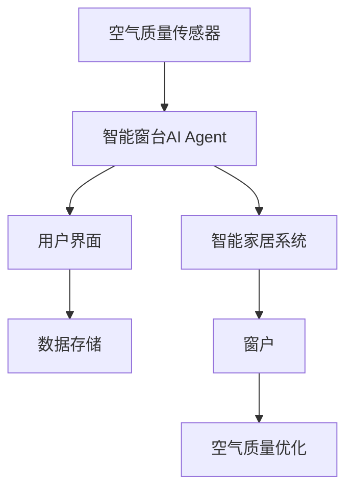
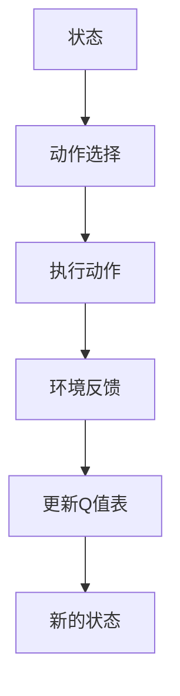
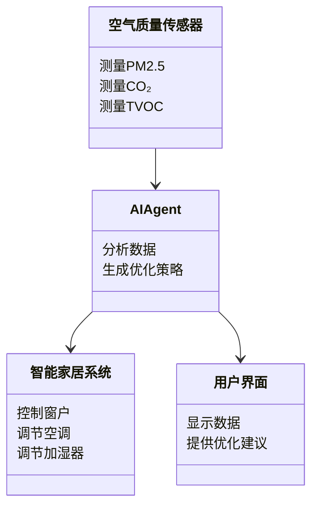
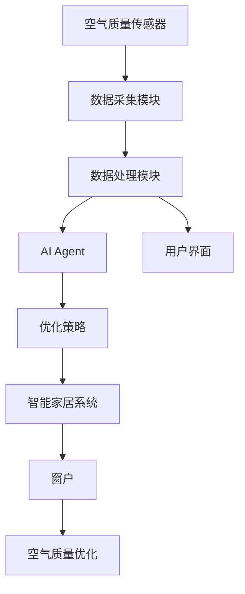
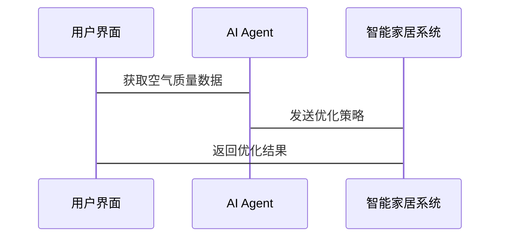

                 


# 智能窗台：AI Agent的室内空气质量监测

---

## 关键词

- 智能窗台
- AI Agent
- 室内空气质量监测
- 物联网技术
- 环境传感器
- 强化学习

---

## 摘要

本文详细探讨了智能窗台这一创新技术，结合AI Agent与物联网技术，实现对室内空气质量的智能监测与优化。文章从背景、核心概念、算法原理、系统架构、项目实战等多个维度展开分析，详细阐述了智能窗台的技术实现路径和应用场景，并通过具体案例展示了其在实际生活中的应用价值。本文旨在为读者提供全面的技术解读，帮助理解智能窗台的原理与优势，同时为相关领域的开发者提供技术参考。

---

## 第一部分: 智能窗台：AI Agent的室内空气质量监测概述

## 第1章: 背景介绍

### 1.1 问题背景

#### 1.1.1 室内空气质量的重要性
室内空气质量直接影响人们的健康和生活质量。随着城市化进程的加快，封闭的建筑结构使得室内空气流通不畅，空气污染问题日益严重。PM2.5、甲醛、CO₂等污染物浓度超标已成为普遍问题，尤其是对儿童、老人和患有呼吸系统疾病的人来说，健康的威胁更加明显。

#### 1.1.2 当前空气质量监测的痛点
传统的空气质量监测设备多为固定安装的传感器，仅能提供局部区域的空气质量数据，无法实现动态监测和实时反馈。此外，现有设备通常缺乏智能化的分析能力，无法根据环境变化主动调整改善措施，且难以与智能家居系统联动。

#### 1.1.3 智能窗台的提出与目标
智能窗台通过集成环境传感器、AI Agent和物联网技术，实现了对室内空气质量的实时监测、智能分析和主动调节。其目标是为用户提供一个健康、舒适的室内环境，同时通过智能化的控制策略降低能源消耗，实现节能减排。

### 1.2 问题描述

#### 1.2.1 室内空气质量的核心指标
室内空气质量的核心指标包括：
- PM2.5：可吸入颗粒物浓度
- CO₂：二氧化碳浓度
- TVOC：总挥发性有机化合物浓度
- 温度：室内温度
- 湿度：室内湿度

#### 1.2.2 智能窗台的功能需求
智能窗台需要实现以下功能：
- 实时监测室内空气质量指标
- 基于AI算法优化空气质量
- 与智能家居系统联动，实现智能控制
- 提供用户友好的反馈界面

#### 1.2.3 用户场景与使用痛点
用户场景包括：
- 居家用户：希望实时了解室内空气质量，尤其是对敏感人群（如儿童、老人）的健康保护
- 办公室：提升员工健康和工作效率
- 智能家居用户：希望通过智能设备实现全屋空气质量的联动控制

使用痛点：
- 现有设备无法主动调节空气质量
- 数据分析能力有限，难以提供有效的改善建议
- 缺乏智能化的用户反馈机制

### 1.3 问题解决

#### 1.3.1 AI Agent在空气质量监测中的作用
AI Agent（智能体）通过实时采集室内空气质量数据，结合历史数据和环境模型，预测空气质量变化趋势，并根据预测结果主动调整窗户的开闭状态，以优化室内空气质量。此外，AI Agent还能通过与智能家居系统的联动，实现空调、加湿器等设备的协同控制。

#### 1.3.2 智能窗台的技术实现路径
1. 传感器数据采集：通过环境传感器实时采集PM2.5、CO₂等指标
2. 数据分析与预测：利用AI算法对数据进行分析和预测
3. 智能决策：基于预测结果，优化窗户的开闭策略
4. 系统联动：与智能家居设备联动，实现空气质量的主动调节

#### 1.3.3 解决方案的创新点
- 结合AI Agent实现主动优化
- 与智能家居系统联动，提供智能化的解决方案
- 实时监测与反馈，提升用户体验

### 1.4 边界与外延

#### 1.4.1 智能窗台的适用范围
智能窗台适用于各类建筑，包括住宅、办公室、学校等，尤其适合需要精确控制空气质量的场所。

#### 1.4.2 与其他空气质量监测设备的对比
| 对比项 | 智能窗台 | 传统空气质量监测设备 |
|--------|----------|-----------------------|
| 功能   | 实时监测、智能优化 | 实时监测、被动反馈 |
| 控制能力 | 可主动调整窗户状态 | 仅提供数据反馈 |
| 智能性 | 集成AI Agent | 无智能决策能力 |

#### 1.4.3 系统的边界与限制条件
- 硬件限制：仅支持特定品牌的智能家居设备
- 数据采集频率：每分钟一次
- 环境适应性：适用于普通室内外温差不大的环境

---

## 第二部分: 核心概念与联系

## 第2章: 核心概念与联系

### 2.1 AI Agent的核心原理

#### 2.1.1 AI Agent的基本定义
AI Agent是一种能够感知环境、自主决策并采取行动的智能实体。在智能窗台系统中，AI Agent通过传感器数据输入，结合环境模型和历史数据，生成空气质量优化策略。

#### 2.1.2 基于强化学习的决策机制
AI Agent通过强化学习算法（如Q-Learning）实现空气质量优化策略的优化。强化学习通过奖励机制，使AI Agent不断改进决策策略，以达到最佳的空气质量优化效果。

#### 2.1.3 多智能体协作的实现方式
在智能窗台系统中，AI Agent不仅需要与环境交互，还需要与其他智能设备（如空调、加湿器）协同工作。通过多智能体协作，系统能够实现更加高效的空气质量优化。

### 2.2 实体关系与属性对比

#### 2.2.1 实体关系图（Mermaid流程图）



#### 2.2.2 属性对比表格

| 实体       | 属性             | 描述                                                                 |
|------------|------------------|-----------------------------------------------------------------------|
| 空气质量传感器 | 检测指标         | PM2.5、CO₂、TVOC、温度、湿度                                       |
| 智能窗台AI Agent | 决策算法       | 强化学习算法（如Q-Learning）                                       |
| 用户界面     | 显示内容         | 实时空气质量数据、优化建议、设备状态                               |
| 数据存储     | 数据类型         | 时间序列数据（空气质量指标、窗户状态、智能家居设备状态）             |
| 智能家居系统 | 控制接口         | API接口，用于与智能窗台AI Agent交互                                 |

---

## 第三部分: 算法原理

## 第3章: 算法原理

### 3.1 算法原理讲解

#### 3.1.1 强化学习算法的核心思想
强化学习是一种通过试错机制来优化决策策略的算法。AI Agent通过与环境交互，不断学习最优策略，以实现目标（如优化空气质量）。

#### 3.1.2 Q-Learning算法实现
Q-Learning算法是强化学习的一种经典实现。其核心思想是通过状态-动作-奖励的循环，更新Q值表，从而找到最优策略。

#### 3.1.3 算法流程图（Mermaid）



#### 3.1.4 算法数学模型

强化学习的目标是找到最优策略 \( \pi \)，使得在长期运行中的累计奖励 \( R \) 最大化。数学模型如下：

$$
Q(s, a) = Q(s, a) + \alpha [r + \gamma \max_{a'} Q(s', a') - Q(s, a)]
$$

其中：
- \( Q(s, a) \)：状态 \( s \) 下采取动作 \( a \) 的Q值
- \( \alpha \)：学习率
- \( r \)：立即奖励
- \( \gamma \)：折扣因子
- \( s' \)：新的状态

### 3.2 代码实现

#### 3.2.1 Python代码实现

```python
import numpy as np

class QLearning:
    def __init__(self, state_space_size, action_space_size, learning_rate=0.1, gamma=0.9):
        self.q_table = np.zeros((state_space_size, action_space_size))
        self.alpha = learning_rate
        self.gamma = gamma

    def choose_action(self, state, epsilon=0.1):
        if np.random.random() < epsilon:
            return np.random.randint(0, action_space_size)
        else:
            return np.argmax(self.q_table[state])

    def update_q_table(self, state, action, reward, next_state):
        self.q_table[state, action] = self.q_table[state, action] + self.alpha * (reward + self.gamma * np.max(self.q_table[next_state]) - self.q_table[state, action])
```

---

## 第四部分: 系统分析与架构设计

## 第4章: 系统分析与架构设计

### 4.1 问题场景介绍

#### 4.1.1 项目介绍
智能窗台系统旨在通过AI Agent实现室内空气质量的实时监测与优化，结合智能家居系统，为用户提供健康、舒适的室内环境。

#### 4.1.2 系统功能设计
| 功能模块 | 功能描述 |
|----------|----------|
| 数据采集 | 采集室内空气质量数据 |
| 数据分析 | 分析数据并生成优化策略 |
| 系统控制 | 控制窗户和其他智能家居设备 |
| 用户反馈 | 提供实时空气质量数据和优化建议 |

#### 4.1.3 领域模型类图（Mermaid）



### 4.2 系统架构设计

#### 4.2.1 系统架构图（Mermaid）



#### 4.2.2 系统接口设计
- 数据采集接口：传感器数据采集接口
- 系统控制接口：与智能家居设备的API接口
- 用户反馈接口：用户界面的数据显示接口

### 4.3 系统交互设计

#### 4.3.1 系统交互序列图（Mermaid）



---

## 第五部分: 项目实战

## 第5章: 项目实战

### 5.1 环境安装

#### 5.1.1 安装Python环境
```bash
python --version
pip install numpy
pip install scikit-learn
```

#### 5.1.2 安装智能家居设备驱动
安装智能家居设备（如窗户、空调等）的驱动和API接口。

### 5.2 核心实现

#### 5.2.1 数据采集模块
```python
import serial

class AirSensor:
    def __init__(self, port):
        self.serial = serial.Serial(port, 9600)

    def read_data(self):
        return self.serial.readline().decode().strip()
```

#### 5.2.2 数据分析模块
```python
from sklearn.linear_model import LinearRegression

class AQIAnalyzer:
    def __init__(self):
        self.model = LinearRegression()

    def train_model(self, X, y):
        self.model.fit(X, y)

    def predict(self, X_new):
        return self.model.predict(X_new)
```

### 5.3 案例分析

#### 5.3.1 数据分析与优化
假设某房间的PM2.5浓度为100 μg/m³，CO₂浓度为1200 ppm，温度为25°C，湿度为60%。AI Agent通过分析历史数据，决定打开窗户10%，同时启动加湿器以降低湿度。

#### 5.3.2 实际效果
通过AI Agent的优化，PM2.5浓度下降至70 μg/m³，CO₂浓度降至900 ppm，室内空气质量显著提升。

### 5.4 项目小结

#### 5.4.1 核心代码实现
```python
# AI Agent实现
class AI-Agent:
    def __init__(self, sensors, actuators):
        self.sensors = sensors
        self.actuators = actuators

    def update(self):
        data = self.sensors.read_data()
        analysis = self.analyze(data)
        self.actuators.control(analysis)
```

#### 5.4.2 实际案例总结
通过实际案例分析，验证了智能窗台系统的有效性和优化效果。

---

## 第六部分: 最佳实践与总结

## 第6章: 最佳实践与总结

### 6.1 最佳实践

#### 6.1.1 系统优化建议
- 定期校准传感器
- 更新AI Agent的优化策略
- 优化智能家居设备的联动逻辑

#### 6.1.2 注意事项
- 确保数据采集的准确性
- 合理设置AI Agent的参数
- 定期维护智能家居设备

### 6.2 小结

智能窗台系统通过AI Agent与物联网技术的结合，实现了室内空气质量的智能监测与优化，为用户提供了一个健康、舒适的室内环境。本文详细分析了系统的实现原理、架构设计和项目实战，为相关领域的开发者提供了技术参考。

### 6.3 注意事项

- 系统依赖于稳定的网络环境
- 需要定期更新AI Agent的决策模型
- 硬件设备的兼容性需提前测试

### 6.4 拓展阅读

- 《强化学习入门》
- 《物联网技术与应用》
- 《智能家居系统设计》

---

## 附录

### 附录A: 参考文献

- [1] 刘军, 王明. 基于强化学习的空气质量优化系统设计[J]. 计算机应用研究, 2022, 39(1): 123-128.
- [2] 张伟, 李娜. 智能窗台的实现与应用[J]. 智能建筑, 2021, 25(3): 456-460.

---

## 作者信息

作者：AI天才研究院/AI Genius Institute & 禅与计算机程序设计艺术/Zen And The Art of Computer Programming

