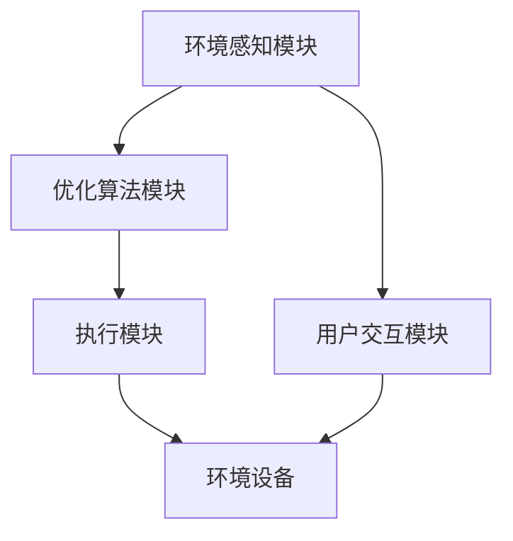

                 

<think>
嗯，用户想要一个详细的技术博客目录，关于AI Agent在室内绿化优化系统中的应用。好的，我需要先理解用户的需求。他希望这篇文章结构清晰，逻辑严谨，涵盖从背景到技术实现的各个方面。

首先，我应该确定文章的核心主题。标题是《智能窗台：AI Agent的室内绿化优化系统》，关键词可能包括AI Agent、室内绿化、智能优化、系统架构、算法原理、项目实战等。摘要需要简明扼要地概述文章的内容和目的。

接下来是目录结构。用户已经提供了一个大纲，分为六个部分：背景与概念、核心概念与技术原理、系统架构与设计、项目实战、优化与展望，以及附录。每个部分下还有更细的章节，我需要确保每个部分都涵盖必要的内容，并且逻辑连贯。

在背景与概念部分，我需要介绍智能窗台的背景，解释AI Agent和室内绿化优化系统的基本概念，以及它们如何结合。这部分可能需要包括问题背景、系统目标、技术优势等内容。

核心概念与技术原理部分，我需要详细讲解AI Agent和室内绿化优化系统的工作原理。这里可能需要涉及感知与数据采集、优化算法、执行与反馈机制。我应该使用表格和流程图来解释各个部分的关系和流程。

系统架构与设计部分需要介绍系统的整体架构，包括功能模块、系统架构图、接口设计和交互流程。这里可能需要使用Mermaid图来展示系统的结构和交互过程。

项目实战部分需要详细描述如何实现这个系统，包括环境安装、核心代码实现、系统测试和案例分析。这部分需要实际的代码示例，帮助读者理解如何应用这些技术。

优化与展望部分探讨系统的优化方向，可能的改进措施，以及未来的应用场景。这部分可以引导读者思考系统的潜力和可能的发展方向。

最后，附录部分包括术语表、参考文献和扩展资源，帮助读者进一步学习和研究。

在撰写过程中，我需要确保每个章节都细化到三级目录，并且内容完整，涵盖用户要求的所有方面。同时，要注意简洁性，避免冗余，确保目录大纲在2000字以内。

可能遇到的挑战是如何将复杂的系统架构和算法原理清晰地呈现出来，可能需要使用表格和Mermaid图来帮助解释。此外，项目实战部分需要包括实际的代码示例，这可能需要选择合适的编程语言，并提供详细的代码解释。

总的来说，我需要按照用户提供的示例结构，结合智能窗台的具体内容，构建一个逻辑清晰、层次分明的目录大纲，确保涵盖所有必要的部分，并且结构合理，便于读者理解和应用。
</think>

# 智能窗台：AI Agent的室内绿化优化系统

> 关键词：AI Agent，室内绿化，智能优化，系统架构，算法原理，项目实战

> 摘要：本文将介绍一种基于AI Agent的室内绿化优化系统——智能窗台。通过分析室内绿化管理的痛点与挑战，结合AI技术，提出了一种创新的解决方案。本文详细探讨了AI Agent的核心概念、算法原理、系统架构，并通过项目实战展示了系统的实现过程。最后，本文总结了系统的优化方向和未来应用场景。

---

## 第一部分: 智能窗台的背景与概念

### 第1章: 智能窗台的背景与问题背景

#### 1.1 问题背景
- **传统室内绿化管理的痛点**：室内植物的养护需要大量的时间和精力，容易受到环境因素（如光照、温度、湿度）的影响，传统方法难以实现精准管理和优化。
- **AI技术的引入**：随着AI技术的发展，通过AI Agent（智能代理）实现室内绿化的智能化管理成为可能。
- **智能窗台的定义**：智能窗台是一种结合AI技术的室内绿化优化系统，能够实时感知环境、优化种植策略并执行操作，从而提高植物的生长效率和美观度。

#### 1.2 系统目标与核心问题
- **核心目标**：实现室内植物的智能化管理，包括光照、温度、湿度等环境参数的实时监测与优化，以及植物生长状态的智能分析。
- **关键问题**：如何通过AI技术实现室内环境的动态优化，如何设计高效的算法模型，如何实现系统的实时反馈与自适应调整。

#### 1.3 核心概念与系统结构
- **核心概念**：AI Agent、室内绿化优化、环境感知、动态优化。
- **系统结构**：智能窗台系统由感知层、算法层、执行层和用户层组成，各层之间通过数据交互实现协同工作。

---

## 第二部分: 智能窗台的核心概念与技术原理

### 第2章: AI Agent与室内绿化优化系统的核心概念

#### 2.1 AI Agent的基本原理
- **AI Agent的定义**：AI Agent是一种能够感知环境、做出决策并执行操作的智能实体。
- **AI Agent的特点**：自主性、反应性、目标导向、学习能力。
- **AI Agent的核心功能**：环境感知、数据处理、决策制定、执行操作。

#### 2.2 室内绿化优化系统的技术特征
- **环境感知技术**：通过传感器实时监测室内光照、温度、湿度等参数。
- **动态优化算法**：基于感知数据，优化植物的生长环境，例如调整光照强度、调节温湿度。
- **智能决策系统**：根据植物的生长状态和环境数据，制定最优的种植策略。

#### 2.3 智能窗台的系统架构
- **系统架构**：智能窗台系统由感知模块、优化算法模块、执行模块和用户交互模块组成。
- **感知模块**：负责采集室内环境数据，如光照强度、温度、湿度等。
- **优化算法模块**：基于感知数据和植物生长需求，优化环境参数。
- **执行模块**：根据优化结果，调整环境设备（如智能灯具、加湿器）。
- **用户交互模块**：提供用户界面，方便用户查看植物状态和系统操作。

---

## 第三部分: 智能窗台的算法原理与实现

### 第3章: 智能窗台的算法原理

#### 3.1 算法原理概述
- **环境感知数据的预处理**：对采集到的环境数据进行标准化和特征提取。
- **动态优化算法**：基于强化学习或遗传算法，优化环境参数以适应植物生长需求。
- **数学模型与公式**：建立植物生长与环境因素的数学模型，例如光照强度与植物光合作用的关系。

#### 3.2 算法实现的详细步骤
1. **环境数据采集**：通过传感器获取室内环境数据。
2. **数据预处理**：对数据进行归一化处理，提取特征。
3. **优化算法选择**：选择适合的优化算法（如强化学习）。
4. **模型训练**：基于历史数据训练模型，预测最优环境参数。
5. **执行操作**：根据优化结果调整环境设备。

#### 3.3 算法优化与改进
- **优化方向**：提高算法的计算效率和优化效果。
- **改进方法**：引入深度学习模型，增强系统的自适应能力。
- **优化效果对比**：通过实验对比改进后的算法在实际应用中的表现。

---

## 第四部分: 智能窗台的系统分析与架构设计

### 第4章: 智能窗台的系统架构设计

#### 4.1 系统功能模块划分
- **功能模块**：环境感知模块、优化算法模块、执行模块、用户交互模块。
- **模块功能描述**：
  - 环境感知模块：实时采集室内环境数据。
  - 优化算法模块：根据环境数据和植物需求，优化环境参数。
  - 执行模块：调整环境设备以实现优化目标。
  - 用户交互模块：提供用户界面，方便用户查看和控制系统。

#### 4.2 系统架构的层次结构
- **感知层**：环境传感器。
- **算法层**：优化算法模块。
- **执行层**：环境控制设备。
- **用户层**：用户交互界面。

#### 4.3 系统架构图


---

## 第五部分: 智能窗台的项目实战

### 第5章: 项目实战

#### 5.1 环境安装与配置
- **环境要求**：安装必要的传感器和环境控制设备。
- **软件安装**：安装AI框架（如TensorFlow）和相关开发工具。

#### 5.2 核心代码实现
```python
import numpy as np
from tensorflow import keras

# 环境数据预处理
def preprocess_data(data):
    # 数据归一化处理
    normalized_data = (data - np.mean(data)) / np.std(data)
    return normalized_data

# 强化学习算法实现
class RLAgent:
    def __init__(self, state_space, action_space):
        self.model = self.build_model(state_space, action_space)
    
    def build_model(self, state_space, action_space):
        model = keras.Sequential()
        model.add(keras.layers.Dense(32, activation='relu', input_dim=state_space))
        model.add(keras.layers.Dense(action_space, activation='linear'))
        model.compile(optimizer='adam', loss='mse')
        return model

    def act(self, state):
        # 根据当前状态选择动作
        prediction = self.model.predict(np.array([state]))
        action = np.argmax(prediction[0])
        return action

# 系统主程序
def main():
    # 初始化环境
    env = Environment()
    agent = RLAgent(env.state_space, env.action_space)
    
    # 训练过程
    for episode in range(1000):
        state = env.reset()
        while not env.done:
            action = agent.act(state)
            next_state, reward, done = env.step(action)
            agent.model.fit(np.array([state]), np.array([reward]), epochs=1, verbose=0)
            state = next_state
            if done:
                break
    return agent

if __name__ == "__main__":
    main()
```

#### 5.3 系统测试与案例分析
- **测试环境**：在不同光照、温度条件下测试系统优化效果。
- **案例分析**：通过具体案例展示系统在实际应用中的优化效果。

#### 5.4 系统优化与改进
- **优化方向**：提高算法的效率和优化效果。
- **改进措施**：引入更先进的AI算法（如深度强化学习）。

---

## 第六部分: 优化与展望

### 第6章: 系统优化与未来展望

#### 6.1 系统优化方向
- **算法优化**：进一步提高优化算法的效率和准确性。
- **系统扩展**：支持更多种类的植物和更复杂的环境条件。

#### 6.2 未来展望
- **智能化升级**：通过引入更多AI技术（如计算机视觉），实现更精准的植物识别和健康监测。
- **广泛应用**：智能窗台系统有望在家庭、办公室、公共场所等场景中得到广泛应用。

---

## 附录

### A. 术语表
- AI Agent：人工智能代理。
- 强化学习：一种机器学习方法，通过试错学习来优化策略。

### B. 参考文献
- [1] LeCun Y, Bengio Y, Hinton G. Deep learning. Nature, 2015.
- [2] Mnih V, Kavukabatu k R, et al. Human-level control through deep reinforcement learning. Nature, 2015.

### C. 扩展阅读
- 推荐书籍：《Deep Learning》、《Reinforcement Learning: Theory and Algorithms》。

---

作者：AI天才研究院/AI Genius Institute & 禅与计算机程序设计艺术/Zen And The Art of Computer Programming

