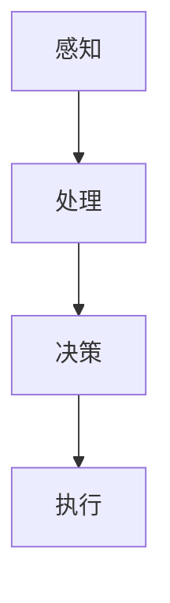
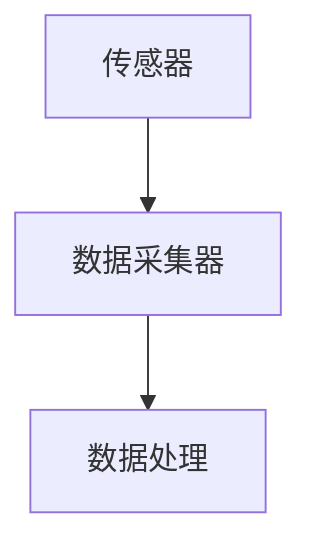
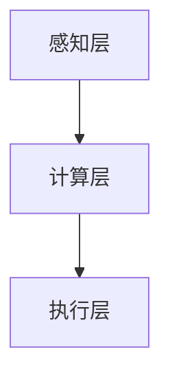

                 

<think>
好，我现在需要根据用户的要求，撰写一篇关于《智能窗台：AI Agent的植物生长监测》的技术博客文章。用户已经给出了目录大纲，我需要按照这个大纲一步步来写。

首先，用户强调文章要逻辑清晰、结构紧凑、语言专业，同时使用一步一步的分析推理方式。这意味着我需要确保每一部分都详细且有条理，能够引导读者逐步理解主题。

接下来，用户要求文章的关键词和摘要部分。关键词需要涵盖核心技术点，比如AI Agent、植物生长监测、智能传感器、机器学习、物联网等。摘要部分要简明扼要地概括文章的核心内容，说明AI Agent如何通过智能传感器和机器学习模型实现植物生长的实时监测和优化。

然后，用户提供了目录大纲，分为七章。每章都有具体的子章节，涵盖背景介绍、核心概念、算法原理、系统架构、项目实战、优化与扩展以及总结展望。我需要按照这个结构来展开内容，确保每章内容详细且有深度。

在撰写过程中，我需要特别注意以下几点：

1. **核心概念与原理**：需要详细解释AI Agent的基本原理、分类及其在植物监测中的应用。可能需要比较不同的AI Agent类型，并举例说明它们在不同场景下的应用。

2. **算法原理**：机器学习、深度学习和强化学习在植物生长监测中的应用。需要使用mermaid流程图来展示算法的工作流程，同时用Python代码和数学公式详细说明，如线性回归、决策树等模型。

3. **系统架构设计**：需要描述系统的模块划分、功能设计以及架构图。这部分可能需要使用mermaid的类图、架构图和序列图来展示系统的结构和交互过程。

4. **项目实战**：详细说明环境搭建、代码实现、数据处理和模型部署。提供实际的代码示例，并解释每部分的功能，帮助读者理解如何应用这些技术。

5. **优化与扩展**：讨论系统的优化方法，如算法优化和传感器优化，同时考虑与其他技术（如IoT和边缘计算）的结合。还需要分析实际应用中的挑战，如数据隐私和环境适应性。

6. **总结与展望**：回顾全书内容，总结AI Agent在植物监测中的优势，并展望未来的发展方向，如多模态数据融合和实时决策优化。

在写作过程中，我需要确保每一部分都涵盖用户要求的内容，同时保持文章的连贯性和逻辑性。此外，还要注意使用适当的术语和专业语言，但避免过于复杂，确保读者能够理解。

最后，文章末尾需要添加作者信息，注明来自AI天才研究院和禅与计算机程序设计艺术。这将增加文章的权威性和专业性。

总的来说，我需要按照用户的要求，系统地展开每一章的内容，确保每一部分都详细且有深度，最终完成一篇高质量的技术博客文章。
</think>

# 智能窗台：AI Agent的植物生长监测

> **关键词**：AI Agent、植物生长监测、智能传感器、机器学习、物联网

> **摘要**：  
本文探讨AI Agent在植物生长监测中的应用，通过智能传感器和机器学习模型实现植物生长的实时监测和优化。文章详细介绍了AI Agent的核心概念、算法原理、系统架构，并通过项目实战展示具体实现。同时，分析了系统的优化方法和实际应用中的挑战，展望了未来发展方向。

---

## 第1章: 背景介绍

### 1.1 问题背景与目标
#### 1.1.1 植物生长监测的背景
随着城市化进程加快，室内种植和垂直农业成为趋势。植物生长监测需求迫切，但传统方法依赖人工经验，效率低且精度差。

#### 1.1.2 AI Agent在植物监测中的作用
AI Agent能够实时感知环境数据，分析植物生长状态，优化生长条件，实现自动化监测与管理。

#### 1.1.3 本书的目标与意义
本书旨在介绍AI Agent在植物生长监测中的技术实现，帮助读者理解其原理和应用，推动智能农业的发展。

### 1.2 问题描述与解决
#### 1.2.1 植物生长监测的核心问题
如何实时、准确地监测植物生长状态？如何利用AI技术优化生长环境？

#### 1.2.2 AI Agent如何解决这些问题
AI Agent通过智能传感器采集数据，利用机器学习模型分析植物状态，优化生长条件。

#### 1.2.3 边界与外延
本文仅关注植物生长监测，不涉及植物病虫害诊断或其他农业应用。

### 1.3 核心概念与联系
#### 1.3.1 AI Agent的核心要素
- **感知能力**：通过传感器采集数据。
- **决策能力**：基于数据做出决策。
- **执行能力**：通过执行机构优化环境。

#### 1.3.2 植物生长监测的关键指标
- **光合作用**：影响植物生长速率。
- **环境因素**：温度、湿度、光照等。

#### 1.3.3 核心概念的ER实体关系图
```mermaid
er
    %% ER图
    classDiagram
    class 植物 {
        植物ID
        生长阶段
        健康状态
    }
    class 环境数据 {
        数据ID
        温度
        湿度
        光照
    }
    class AI Agent {
        AgentID
        感知数据
        决策规则
    }
    植物 -->> 环境数据: 监测
    AI Agent --> 植物: 优化
```

---

## 第2章: AI Agent的核心概念与原理

### 2.1 AI Agent的基本原理
#### 2.1.1 AI Agent的定义与分类
- **定义**：AI Agent是能够感知环境并采取行动的智能实体。
- **分类**：
  - **反应式AI Agent**：实时响应环境变化。
  - **认知式AI Agent**：具备推理和规划能力。

#### 2.1.2 AI Agent的工作流程


#### 2.1.3 AI Agent与传统算法的对比
| 特性         | AI Agent              | 传统算法          |
|--------------|-----------------------|-------------------|
| 自适应性      | 强                   | 弱                |
| 实时性        | 强                   | 弱                |
| 环境交互      | 支持                 | 不支持            |

### 2.2 AI Agent在植物监测中的应用
#### 2.2.1 AI Agent的感知能力
- **传感器数据**：温度、湿度、光照等。
- **数据融合**：多源数据融合提升准确性。

#### 2.2.2 AI Agent的决策机制
- **规则驱动**：基于预设规则做出决策。
- **数据驱动**：基于机器学习模型预测结果。

#### 2.2.3 AI Agent的执行能力
- **执行机构**：如智能灯、喷水装置等。
- **反馈机制**：实时调整执行策略。

### 2.3 AI Agent的核心算法
#### 2.3.1 机器学习算法
- **线性回归**：用于预测植物生长速率。
  $$ y = \beta_0 + \beta_1 x $$

- **决策树**：用于分类植物健康状态。
  ```python
  from sklearn.tree import DecisionTreeClassifier
  model = DecisionTreeClassifier()
  ```

#### 2.3.2 深度学习算法
- **卷积神经网络（CNN）**：用于图像识别。
  ```python
  import tensorflow as tf
  model = tf.keras.models.Sequential()
  ```

#### 2.3.3 强化学习算法
- **Q-learning**：用于优化决策策略。
  ```python
  def q_learning(state, action):
      return reward
  ```

---

## 第3章: 植物生长监测的基础知识

### 3.1 植物生长的基本原理
#### 3.1.1 光合作用与植物生长
光合作用是植物生长的核心，AI Agent可以通过监测光照强度优化光能利用。

#### 3.1.2 植物生长的周期性
植物生长分为种子萌发、生长期、成熟期，AI Agent可实时跟踪各阶段特征。

#### 3.1.3 植物生长的环境因素
温度、湿度、光照、养分等因素均影响植物生长。

### 3.2 传感器技术与数据采集
#### 3.2.1 常见的植物监测传感器
- **温湿度传感器**：DHT11、DHT22。
- **光照传感器**：BH1750。

#### 3.2.2 数据采集的流程


#### 3.2.3 数据预处理方法
- **去噪处理**：消除传感器噪声。
- **归一化**：统一数据范围。

### 3.3 数据特征提取与分析
#### 3.3.1 数据特征的提取方法
- **统计特征**：均值、方差。
- **时间序列特征**：趋势、周期性。

#### 3.3.2 数据特征的分析方法
- **可视化分析**：绘制折线图、柱状图。
- **相关性分析**：计算特征间的相关系数。

#### 3.3.3 数据特征与植物生长的关系
通过机器学习模型，分析特征对植物生长的影响权重。

---

## 第4章: AI Agent的算法原理

### 4.1 机器学习算法
#### 4.1.1 线性回归
用于预测植物生长速率。
$$ y = \beta_0 + \beta_1 x $$

#### 4.1.2 支持向量机（SVM）
用于分类植物健康状态。
```python
from sklearn import svm
model = svm.SVC()
```

### 4.2 深度学习算法
#### 4.2.1 卷积神经网络（CNN）
用于图像识别，如叶片病害检测。
```python
import tensorflow as tf
model = tf.keras.models.Sequential()
```

#### 4.2.2 循序神经网络（RNN）
用于时间序列分析，如预测生长周期。
```python
from keras.layers import LSTM
model = LSTM(units=64)(...)
```

### 4.3 强化学习算法
#### 4.3.1 Q-learning
用于优化决策策略。
```python
def q_learning(state, action):
    return reward
```

---

## 第5章: 系统架构设计

### 5.1 系统模块划分
- **感知层**：传感器采集数据。
- **计算层**：数据处理与分析。
- **执行层**：优化环境条件。

### 5.2 功能设计
- **数据采集**：实时采集环境数据。
- **数据分析**：分析植物生长状态。
- **决策优化**：优化生长环境。

### 5.3 系统架构图


---

## 第6章: 项目实战

### 6.1 环境搭建
- **硬件**：Raspberry Pi、传感器。
- **软件**：Python、TensorFlow、Scikit-learn。

### 6.2 核心代码实现
```python
import numpy as np
from sklearn.linear_model import LinearRegression

# 示例代码：预测植物生长速率
X = np.array([1, 2, 3, 4, 5]).reshape(-1, 1)
y = np.array([2, 4, 5, 4, 6])

model = LinearRegression()
model.fit(X, y)

print(model.predict([[6]]))
```

### 6.3 数据处理与分析
- **数据清洗**：去除异常值。
- **特征选择**：选择关键特征。

### 6.4 模型部署与测试
- **模型部署**：将模型部署到边缘设备。
- **测试优化**：通过反馈调整模型。

---

## 第7章: 优化与扩展

### 7.1 系统优化
- **算法优化**：使用更复杂的模型提升精度。
- **传感器优化**：增加更多传感器类型。

### 7.2 技术扩展
- **IoT结合**：实现远程监控。
- **边缘计算**：提升数据处理效率。

### 7.3 实际应用中的挑战
- **数据隐私**：如何保护用户数据。
- **环境适应性**：如何适应不同种植环境。

---

## 第8章: 总结与展望

### 8.1 全文总结
AI Agent在植物生长监测中具有巨大潜力，能够实现实时监测与优化。

### 8.2 未来展望
- **多模态数据融合**：结合图像、声音等多种数据。
- **实时决策优化**：优化生长环境的实时性。

---

**作者：AI天才研究院 & 禅与计算机程序设计艺术**

