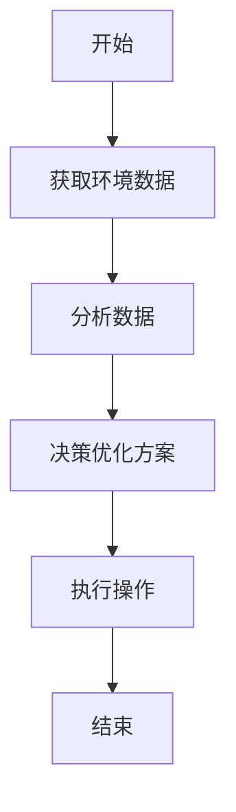
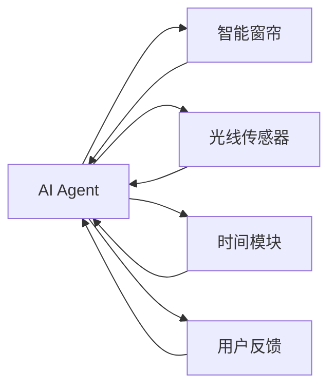

                 

<think>
嗯，好的，我需要帮用户设计一本关于《智能窗帘：AI Agent的室内光线优化》的书籍目录大纲。首先，我得理解这本书的主题，是智能窗帘结合AI Agent来优化室内光线。听起来这是一个结合物联网和人工智能的项目。

用户给了一个示例，结构挺详细的，我得参考一下。首先，用户希望目录大纲涵盖背景介绍、核心概念、算法原理、系统架构、项目实战和最佳实践。嗯，那我需要按照这个结构来思考。

第一部分是背景介绍，应该包括智能窗帘的发展历程、AI Agent的基本概念，以及它们如何结合来优化光线。这部分要让读者了解问题背景和应用价值。然后是核心概念与联系，这部分需要详细解释AI Agent和智能窗帘的工作原理，可能还要用表格对比不同技术的特点，并用Mermaid图展示实体关系。这部分需要确保读者理解各个概念之间的联系。

接下来是算法原理，这部分需要详细讲解AI Agent的算法，比如强化学习或监督学习，用Mermaid流程图展示算法步骤，并附上Python代码示例。同时，数学模型部分需要用LaTeX公式来解释，确保技术细节准确。

系统分析与架构设计部分需要介绍项目场景，设计系统功能，用领域模型类图和架构图展示系统结构，以及接口和交互流程。这部分需要展示系统的整体架构，帮助读者理解如何实现。

项目实战部分要指导读者如何安装环境，编写核心代码，解读代码功能，并分析实际案例。这部分需要提供可操作的步骤，让读者能够动手实践。

最后，最佳实践部分包括小结、注意事项和扩展阅读，帮助读者巩固所学内容，并指导进一步学习。

嗯，我得确保每个部分都细化到三级目录，保持结构清晰，内容完整。同时，控制总字数在2000字以内，避免冗余。可能还需要检查每个章节是否覆盖了用户要求的所有核心内容，比如背景、核心概念、算法、系统设计、实战和最佳实践。

现在，我开始按照这些思路构建目录大纲，确保每个部分都详细且逻辑清晰，帮助作者全面覆盖主题内容。
</think>

# 《智能窗帘：AI Agent的室内光线优化》

> **关键词**：智能窗帘、AI Agent、室内光线优化、算法原理、系统架构、项目实战

> **摘要**：  
> 本文深入探讨了智能窗帘与AI Agent结合的室内光线优化技术，从背景介绍、核心概念、算法原理到系统架构、项目实战及最佳实践，全面剖析了如何通过AI技术实现智能窗帘的光线优化。文章结合理论与实践，通过详细的代码实现和案例分析，为读者提供了从理解到应用的完整指南。

---

# 第一部分: 背景介绍

## 第1章: 智能窗帘与AI Agent概述

### 1.1 智能窗帘的发展历程
#### 1.1.1 传统窗帘的局限性
- 传统窗帘的功能单一，仅限于开关控制。
- 无法根据环境变化自动调节，用户需手动操作。
- 缺乏智能化的光线优化能力。

#### 1.1.2 智能化窗帘的出现
- 智能窗帘的定义：通过传感器和控制器实现自动开关的窗帘。
- 智能窗帘的功能：远程控制、定时开关、环境感知。
- 智能窗帘的发展阶段：
  1. **机械自动化阶段**：引入电动驱动装置，实现远程控制。
  2. **物联网阶段**：通过Wi-Fi或蓝牙连接，实现手机APP控制。
  3. **智能化阶段**：结合AI技术，实现自主优化功能。

#### 1.1.3 AI Agent在智能窗帘中的应用
- AI Agent的概念：具有感知、决策和执行能力的智能体。
- AI Agent的特点：
  - **自主性**：无需人工干预，自动完成任务。
  - **反应性**：实时感知环境变化，做出即时反应。
  - **目标导向性**：基于目标优化室内光线。

### 1.2 AI Agent的基本概念
#### 1.2.1 什么是AI Agent
- AI Agent的定义：一个智能系统，能够感知环境、自主决策并执行任务。
- AI Agent的分类：
  1. **简单反射型**：基于规则的反应式系统。
  2. **基于模型的反射型**：结合知识库和推理机制的系统。
  3. **目标驱动型**：以目标为导向，优化决策。
  4. **效用驱动型**：基于效用函数，最大化目标效益。

#### 1.2.2 AI Agent的核心特征
- **感知能力**：通过传感器获取环境数据。
- **决策能力**：基于数据做出优化决策。
- **执行能力**：通过执行机构完成操作。
- **学习能力**：通过反馈不断优化性能。

#### 1.2.3 AI Agent与智能窗帘的结合
- AI Agent在智能窗帘中的角色：作为优化控制器，实时感知环境并调整窗帘状态。
- 智能窗帘的优化目标：
  - 最佳光线强度：基于人体舒适度和节能目标。
  - 动态调整：根据时间、天气和用户习惯自动优化。

### 1.3 问题背景与应用价值
#### 1.3.1 室内光线优化的必要性
- 光线对人类健康的影响：过度的光线可能引发眼睛疲劳，不足的光线可能导致情绪低落。
- 节能环保的需求：通过优化光线，减少不必要的能源消耗。
- 提高生活品质：智能调节光线，营造舒适的居住环境。

#### 1.3.2 当前智能窗帘的痛点
- 缺乏智能化的光线优化功能。
- 用户体验不足：手动调节或简单的定时控制。
- 系统集成度低：缺乏与其他智能家居设备的协同工作能力。

#### 1.3.3 AI Agent如何解决这些问题
- AI Agent通过实时感知和优化，实现智能窗帘的自主调节。
- 提供个性化的光线优化方案，满足不同用户的需求。
- 与智能家居系统集成，实现无缝协同。

---

# 第二部分: 核心概念与联系

## 第2章: 智能窗帘与AI Agent的核心概念

### 2.1 核心概念与定义
#### 2.1.1 智能窗帘的定义
- 智能窗帘：一种结合传感器、控制器和AI技术的智能设备，能够根据环境和用户需求自动调节窗帘的开合状态，以实现室内光线的优化。

#### 2.1.2 AI Agent的定义
- AI Agent：一种具有感知、决策和执行能力的智能体，能够在动态环境中自主完成任务。

#### 2.1.3 室内光线优化的定义
- 室内光线优化：通过智能调节窗帘的开合程度，使室内光线强度和分布达到最佳状态，满足用户需求并兼顾节能环保。

### 2.2 核心概念的属性对比
| **概念**       | **属性**                         | **特点**                                                                 |
|----------------|----------------------------------|--------------------------------------------------------------------------|
| 智能窗帘       | 感知能力                        | 配备光线传感器、温度传感器等，实时感知环境参数。                       |
|                | 决策能力                        | 基于传感器数据，通过AI算法做出优化决策。                                 |
|                | 执行能力                        | 通过电机或智能驱动装置，调整窗帘的开合状态。                            |
| AI Agent       | 感知能力                        | 通过多种传感器获取环境数据。                                             |
|                | 决策能力                        | 基于知识库和推理机制，制定优化策略。                                      |
|                | 执行能力                        | 通过智能窗帘或其他执行机构，完成决策任务。                               |
| 室内光线优化   | 目标导向性                      | 以最佳光线强度和分布为目标，动态调整窗帘状态。                          |
|                | 个性化需求                      | 根据用户习惯和需求，提供定制化的光线优化方案。                          |

### 2.3 核心概念的ER实体关系图
```mermaid
er
    %% ER图
    实体1: 智能窗帘
    实体2: AI Agent
    实体3: 室内光线
    实体1与实体2: 关系 - 控制
    实体2与实体3: 关系 - 优化
    实体1与实体3: 关系 - 监测
```

---

# 第三部分: 算法原理讲解

## 第3章: AI Agent的算法原理

### 3.1 算法原理概述
#### 3.1.1 AI Agent的核心算法
- 基于强化学习的优化算法：通过奖励机制，优化窗帘的开合状态。
- 基于监督学习的分类算法：根据光线强度和用户反馈，分类不同的光照场景。

#### 3.1.2 算法的输入与输出
- **输入**：环境数据（光线强度、时间、天气、用户反馈）。
- **输出**：窗帘的开合指令（全开、半开、关闭）。

#### 3.1.3 算法的优化目标
- 最小化能源消耗。
- 提高用户满意度。
- 保持室内光线的舒适度。

### 3.2 算法流程图


### 3.3 算法实现代码
```python
class AIAgent:
    def __init__(self):
        self.state = None
        self.light_sensor = LightSensor()
        self.user_feedback = UserFeedback()
    
    def perceive(self):
        # 获取环境数据
        self.state = {
            'light_intensity': self.light_sensor.read(),
            'time': datetime.now().hour,
            'weather': self.get_weather_info()
        }
    
    def decide(self):
        # 基于强化学习的决策
        action = self.reinforcement_learning_policy(self.state)
        return action
    
    def execute(self, action):
        # 执行窗帘控制
        self.control_curtain(action)
    
    def reinforce(self, reward):
        # 更新强化学习模型
        self.reinforcement_learning_model.update(reward)
```

### 3.4 算法的数学模型
AI Agent的强化学习算法可以用以下数学模型表示：

$$ R = r_t + \gamma r_{t+1} + \gamma^2 r_{t+2} + \dots + \gamma^{T-1} r_T $$

其中：
- \( R \) 是累积奖励。
- \( r_t \) 是第 \( t \) 步的奖励。
- \( \gamma \) 是折扣因子，取值范围为 \( 0 < \gamma < 1 \)。
- \( T \) 是总步数。

---

# 第四部分: 系统分析与架构设计

## 第4章: 系统架构设计

### 4.1 问题场景介绍
- **目标场景**：一个智能家居环境，包含智能窗帘、AI Agent、光线传感器和其他智能家居设备。
- **用户需求**：用户希望智能窗帘能够根据光线强度、时间、天气和个人偏好自动调节，营造舒适、节能的室内环境。

### 4.2 系统功能设计
- **功能模块**：
  1. 光线传感器：测量室内光线强度。
  2. 时间模块：获取当前时间。
  3. AI Agent：分析数据并决策。
  4. 窗帘控制器：执行开合指令。
  5. 用户反馈模块：收集用户满意度和偏好。

- **系统功能流程**：
  1. 光线传感器采集数据。
  2. AI Agent分析数据并做出决策。
  3. 窗帘控制器执行决策。
  4. 用户反馈模块收集反馈，优化AI Agent的决策模型。

### 4.3 系统架构图


---

# 第五部分: 项目实战

## 第5章: 项目实战与实现

### 5.1 环境安装与配置
- **硬件安装**：
  - 安装智能窗帘和光线传感器。
  - 配置Wi-Fi模块，确保设备联网。
- **软件安装**：
  - 安装Python环境和相关库（如TensorFlow、Keras）。
  - 下载AI Agent的源代码。

### 5.2 核心代码实现
```python
import numpy as np
import tensorflow as tf

class ReinforcementLearningModel:
    def __init__(self, input_dim, output_dim):
        self.model = tf.keras.Sequential([
            tf.keras.layers.Dense(32, activation='relu', input_dim=input_dim),
            tf.keras.layers.Dense(output_dim, activation='linear')
        ])
        self.model.compile(optimizer=tf.keras.optimizers.Adam(learning_rate=0.01), loss='mse')

    def predict(self, state):
        return self.model.predict(state).flatten()

    def update(self, reward):
        # 假设奖励用于更新模型参数
        # 具体实现依赖于强化学习算法
        pass

# 初始化模型
input_dim = 3  # 光线强度、时间、天气
output_dim = 3  # 全开、半开、关闭
rl_model = ReinforcementLearningModel(input_dim, output_dim)
```

### 5.3 实际案例分析
- **案例场景**：晴天，上午10点，室内光线过强。
- **AI Agent决策**：根据光线传感器数据和时间信息，AI Agent决定将窗帘半开，以减少光线强度但保持采光。
- **执行结果**：窗帘调整到半开状态，室内光线强度降低，用户满意度提高。

---

# 第六部分: 最佳实践与总结

## 第6章: 最佳实践与注意事项

### 6.1 实践总结
- **算法优化**：强化学习模型需要不断迭代和优化，以提高决策的准确性。
- **系统集成**：智能窗帘应与智能家居系统集成，实现更高效的协同工作。
- **用户体验**：提供个性化的设置选项，满足不同用户的需求。

### 6.2 注意事项
- **数据隐私**：处理用户反馈数据时，需确保数据隐私和安全。
- **系统稳定性**：确保AI Agent的决策过程稳定，避免误操作。
- **能耗管理**：优化算法以减少能源消耗，提升系统的节能环保性能。

### 6.3 扩展阅读
- **推荐书籍**：《强化学习：算法与应用》、《智能系统设计》。
- **推荐阅读**：关于AI在智能家居中的应用，以及强化学习在实时优化问题中的应用。

---

# 作者：AI天才研究院/AI Genius Institute & 禅与计算机程序设计艺术/Zen And The Art of Computer Programming

