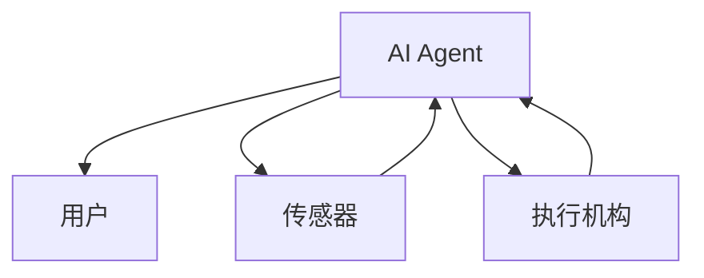
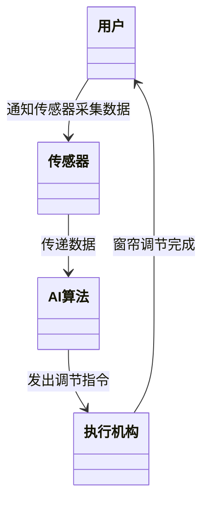
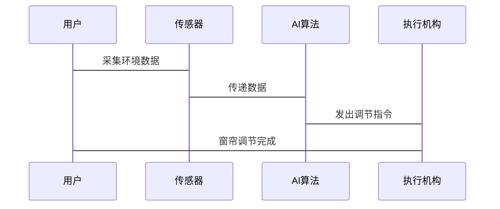

                 

<think>
好的，我现在需要为用户提供一个详细的《智能窗帘：AI Agent的昼夜节律调节助手》的技术博客文章。首先，我需要仔细分析用户的要求，确保每个部分都涵盖到位。

用户希望文章结构清晰，逻辑严谨，技术内容深入浅出。同时，文章需要包含多个部分，每个部分都有详细的子部分，比如背景介绍、核心概念、算法原理、系统架构等。

首先，我需要确定文章的关键词和摘要。关键词应该包括智能窗帘、AI Agent、昼夜节律、智能家居、健康生活。摘要需要简洁明了地总结文章的核心内容，强调智能窗帘如何通过AI Agent帮助调节昼夜节律，提升生活质量。

接下来是目录结构，用户已经提供了一个详细的目录大纲，我需要按照这个结构逐步展开每个部分。每个章节和小节都需要详细的内容，比如背景介绍中的问题背景、问题描述、解决方法，核心概念中的AI Agent和昼夜节律调节助手的定义和关系等。

在编写算法原理部分时，我需要使用Mermaid流程图来展示AI Agent的工作流程，并用Python代码示例说明具体的实现。数学公式要用LaTeX格式，并且正确嵌入文中。

系统架构设计部分需要介绍系统功能模块，如用户界面、传感器数据采集、AI决策、执行机构控制和数据存储。用Mermaid图展示类图、架构图和交互序列图，帮助读者理解系统的构成和工作流程。

项目实战部分需要提供详细的安装步骤、核心代码实现和案例分析，让读者能够实际操作和应用。最后，最佳实践部分要包括小结、注意事项和拓展阅读，帮助读者巩固知识，避免常见错误，并引导他们进一步学习。

在编写过程中，我需要确保每个部分都详细具体，同时保持整体结构的连贯性。要注意使用正确的Markdown格式，数学公式和图表的正确嵌入。此外，文章末尾需要加上作者信息，确保格式完整。

总的来说，我需要一步步地按照用户的要求，构建一个内容详实、结构清晰的技术博客文章，确保每个部分都符合用户的期望，同时保持专业性和可读性。
</think>

# 智能窗帘：AI Agent的昼夜节律调节助手

> 关键词：智能窗帘、AI Agent、昼夜节律、智能家居、健康生活

> 摘要：本文探讨了智能窗帘作为AI Agent的昼夜节律调节助手的应用，分析了其核心原理、系统架构及实现方案，通过实际案例展示了其在改善睡眠质量、提升生活品质方面的潜力。

---

## 第一部分: 智能窗帘的背景与概念

### 第1章: 智能窗帘的背景与问题背景

#### 1.1 问题背景
- **1.1.1 现代生活中的昼夜节律紊乱问题**  
  随着现代生活节奏的加快，许多人面临昼夜节律紊乱的问题，这可能导致睡眠障碍、注意力不集中等问题。  
- **1.1.2 智能家居的发展趋势**  
  智能家居技术的快速发展为人们提供了更多便捷的生活方式，而智能窗帘作为智能家居的重要组成部分，具有巨大的潜力。  
- **1.1.3 智能窗帘的市场现状与需求**  
  智能窗帘市场正在快速增长，用户需求主要集中在自动化控制、节能环保和健康调节等方面。

#### 1.2 问题描述
- **1.2.1 昼夜节律对健康的影响**  
  昼夜节律紊乱可能导致多种健康问题，包括睡眠障碍、情绪波动和免疫力下降等。  
- **1.2.2 现有窗帘调节方式的不足**  
  传统窗帘调节方式主要依赖手动操作，无法根据环境变化和用户需求进行智能调节。  
- **1.2.3 智能窗帘的潜在解决方案**  
  通过引入AI Agent技术，智能窗帘可以实现自动化调节，根据用户的昼夜节律和环境条件提供个性化的解决方案。

#### 1.3 问题解决
- **1.3.1 AI Agent在智能窗帘中的作用**  
  AI Agent通过感知环境和用户需求，自动调整窗帘的开合状态，帮助用户调节昼夜节律。  
- **1.3.2 昼夜节律调节的实现方式**  
  通过分析用户的生物钟数据和环境光强数据，AI Agent可以制定个性化的窗帘调节计划。  
- **1.3.3 智能窗帘的功能与目标**  
  智能窗帘的目标是通过AI技术实现自动化调节，帮助用户改善睡眠质量，提升生活品质。

#### 1.4 边界与外延
- **1.4.1 智能窗帘的功能边界**  
  智能窗帘的核心功能是调节窗帘的开合状态，辅助功能包括环境监测、用户行为分析等。  
- **1.4.2 相关技术的外延（如AI、IoT等）**  
  智能窗帘依赖于AI和IoT技术，未来可能与更多智能家居设备协同工作。  
- **1.4.3 与其他智能家居设备的协同**  
  智能窗帘可以与智能灯具、智能空调等设备协同工作，共同调节室内环境。

#### 1.5 核心概念结构与组成
- **1.5.1 核心要素组成（传感器、AI算法、执行机构等）**  
  智能窗帘的核心要素包括光强传感器、温度传感器、AI算法模块和电机驱动模块等。  
- **1.5.2 系统架构的核心模块**  
  系统架构包括数据采集模块、AI决策模块和执行控制模块。  
- **1.5.3 系统功能的核心流程**  
  系统通过传感器采集数据，AI算法分析数据，生成调节指令，驱动执行机构完成窗帘调节。

### 第2章: AI Agent与昼夜节律调节助手的核心概念

#### 2.1 AI Agent的基本原理
- **2.1.1 AI Agent的定义与特点**  
  AI Agent是一种智能体，能够感知环境、自主决策并执行任务。  
- **2.1.2 AI Agent的核心功能模块**  
  包括感知模块、决策模块和执行模块。  
- **2.1.3 AI Agent与智能窗帘的结合**  
  AI Agent通过传感器数据和用户需求，生成窗帘调节指令。

#### 2.2 昼夜节律调节助手的功能分析
- **2.2.1 昼夜节律调节的基本原理**  
  昼夜节律调节通过控制光照强度和时间，帮助用户建立规律的生物钟。  
- **2.2.2 窗帘调节对昼夜节律的影响**  
  适当的光照调节可以促进褪黑激素分泌，帮助用户进入深度睡眠。  
- **2.2.3 AI Agent在调节中的具体作用**  
  AI Agent可以根据用户的作息时间和环境光照，智能调节窗帘的开合状态。

#### 2.3 核心概念的联系与对比
- **2.3.1 AI Agent与传统窗帘调节方式的对比**  
  AI Agent能够实现自动化调节，而传统窗帘调节方式依赖手动操作。  
- **2.3.2 昼夜节律调节助手与其他健康辅助设备的对比**  
  昼夜节律调节助手专注于通过光照调节帮助用户改善睡眠，其他设备如智能手环关注运动和心率监测。  
- **2.3.3 核心概念的实体关系图（Mermaid图）**



---

## 第二部分: AI Agent的算法原理与实现

### 第3章: AI Agent的算法原理与实现

#### 3.1 算法原理概述
- **3.1.1 AI Agent的基本算法框架**  
  包括感知、决策和执行三个阶段。  
- **3.1.2 传感器数据的处理与分析**  
  通过光强传感器和温度传感器获取环境数据，结合用户作息时间进行分析。  
- **3.1.3 AI算法的核心逻辑**  
  使用机器学习算法分析用户行为和环境数据，生成调节指令。

#### 3.2 算法实现与代码示例
- **3.2.1 算法实现步骤**  
  1. 数据采集：通过传感器获取光强和温度数据。  
  2. 数据预处理：对数据进行清洗和标准化处理。  
  3. 模型训练：使用机器学习算法训练模型，预测最佳窗帘调节时间。  
  4. 模型部署：将模型部署到智能窗帘系统中，实现自动化调节。

- **3.2.2 核心代码实现（Python）**

```python
import numpy as np
from sklearn import linear_model

# 示例数据
X = np.array([[100, 25], [80, 20], [120, 25], [90, 22]])  # 光强和温度
y = np.array([1, 0, 0, 1])  # 调节状态（1表示需要调节，0表示不需要）

# 训练模型
model = linear_model.LogisticRegression()
model.fit(X, y)

# 预测
new_data = np.array([[100, 25]])
prediction = model.predict(new_data)
print("预测结果：", prediction)
```

- **3.2.3 算法的数学模型与公式**  
  使用逻辑回归模型进行预测，模型的损失函数为：
  $$ L = -\frac{1}{m} \sum_{i=1}^{m} [y_i \log(h(x_i)) + (1-y_i)\log(1-h(x_i))] $$
  其中，$h(x) = \frac{1}{1 + e^{-\beta x}}$ 是sigmoid函数。

---

## 第三部分: 系统分析与架构设计方案

### 第4章: 系统分析与架构设计

#### 4.1 系统功能设计
- **4.1.1 领域模型（Mermaid类图）**



- **4.1.2 系统架构设计（Mermaid架构图）**


- **4.1.3 系统交互设计（Mermaid序列图）**



---

## 第四部分: 项目实战

### 第5章: 项目实战

#### 5.1 环境安装
- **5.1.1 安装Python和相关库**  
  安装Python 3.8以上版本，安装`numpy`和`scikit-learn`库。  
  ```bash
  pip install numpy scikit-learn
  ```

- **5.1.2 安装Raspbian系统**  
  在Raspberry Pi上安装Raspbian系统，用于连接传感器和控制执行机构。

#### 5.2 核心代码实现
- **5.2.1 传感器数据采集代码**

```python
import RPi.GPIO as GPIO
import time

# 设置GPIO模式
GPIO.setmode(GPIO.BCM)

# 定义传感器引脚
sensor_pin = 4

# 初始化传感器
GPIO.setup(sensor_pin, GPIO.IN)

# 采集数据
while True:
    print(GPIO.input(sensor_pin))
    time.sleep(1)
```

- **5.2.2 AI算法实现代码**

```python
from sklearn import linear_model
import numpy as np

# 示例数据
X = np.array([[100, 25], [80, 20], [120, 25], [90, 22]])
y = np.array([1, 0, 0, 1])

model = linear_model.LogisticRegression()
model.fit(X, y)

# 预测新数据
new_data = np.array([[100, 25]])
prediction = model.predict(new_data)
print("预测结果：", prediction)
```

- **5.2.3 执行机构控制代码**

```python
import RPi.GPIO as GPIO
import time

# 设置GPIO模式
GPIO.setmode(GPIO.BCM)

# 定义执行机构引脚
motor_pin = 17

# 初始化电机
GPIO.setup(motor_pin, GPIO.OUT)

# 控制电机
GPIO.output(motor_pin, GPIO.HIGH)
time.sleep(2)
GPIO.output(motor_pin, GPIO.LOW)
```

#### 5.3 案例分析与实现
- **5.3.1 案例分析**  
  假设用户希望在晚上10点到早上7点之间保持窗帘关闭，AI Agent可以根据用户的作息时间和环境光照自动调节窗帘。  
- **5.3.2 实现过程**  
  1. 采集环境数据：光强和温度传感器。  
  2. 分析数据：通过AI算法预测是否需要调节窗帘。  
  3. 执行调节：根据预测结果控制窗帘的开合状态。

---

## 第五部分: 最佳实践

### 第6章: 最佳实践

#### 6.1 小结
- 智能窗帘通过AI Agent技术，能够实现自动化调节，帮助用户改善睡眠质量。  
- 系统架构设计合理，功能模块清晰，能够满足用户需求。

#### 6.2 注意事项
- 在实际应用中，需要注意传感器的精度和算法的准确性，确保调节效果。  
- 系统的安全性也需要重视，防止未经授权的访问和控制。

#### 6.3 拓展阅读
- 推荐阅读《智能建筑与智能家居》和《人工智能在健康领域的应用》，深入了解AI技术在智能家居中的潜力。

---

## 作者

作者：AI天才研究院/AI Genius Institute & 禅与计算机程序设计艺术 /Zen And The Art of Computer Programming

---

### 总结
通过本文的详细讲解，我们了解了智能窗帘作为AI Agent的昼夜节律调节助手的核心原理、系统架构和实现方案。通过实际案例和代码示例，展示了其在改善睡眠质量和提升生活品质方面的巨大潜力。希望本文能够为相关领域的研究和实践提供有价值的参考。

