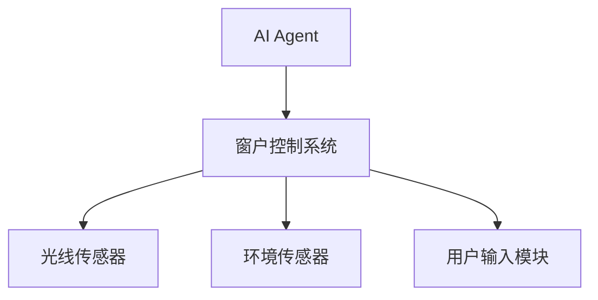
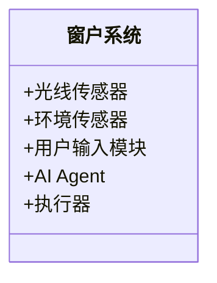
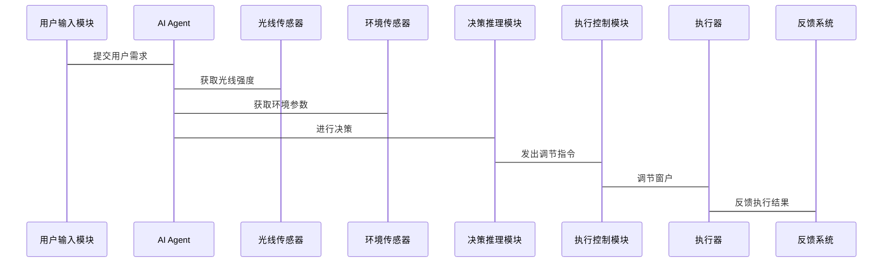

                 

<think>
嗯，我需要帮用户写一篇关于智能窗户AI Agent自动调光系统的技术博客。首先，我得理清楚文章的结构，确保每个部分都涵盖必要的内容。标题已经确定是《智能窗户：AI Agent的自动调光系统》，关键词包括智能窗户、AI Agent、自动调光系统、智能建筑、物联网、智能家居。摘要部分需要简洁明了，概述文章的核心内容。

接下来，用户已经提供了目录大纲，我需要按照这个结构来填充内容。首先是背景介绍，包括问题背景、问题描述、解决方案、边界和外延。这部分要让读者了解为什么智能窗户很重要，以及AI Agent在其中的作用。

然后是核心概念与联系，这部分需要详细讲解AI Agent和自动调光系统的原理，用表格对比不同系统的特点，并用Mermaid画出实体关系图。这样可以帮助读者理解系统的结构和各部分之间的关系。

算法原理部分，我需要详细讲解AI Agent的算法，比如状态感知、决策推理和执行控制。用Mermaid流程图展示流程，并附上Python代码示例。数学模型部分，可能需要涉及概率论和优化算法，用LaTeX公式来表达，确保公式准确无误。

系统分析与架构设计是关键部分，需要介绍项目场景，设计系统功能，用Mermaid类图展示领域模型，架构图展示系统的分层结构，接口设计和交互流程图。这部分需要详细且清晰，帮助读者理解系统的整体架构。

项目实战部分，要指导读者如何安装环境，实现核心功能，解读代码，并分析实际案例。这部分需要具体，让读者能够跟着步骤一步步实现。

最后，最佳实践、小结、注意事项和拓展阅读等内容，帮助读者巩固所学知识，并指导他们进一步学习和应用。

现在，我需要将这些思考转化为具体的目录结构，确保每个部分都涵盖用户要求的内容，并且层级分明。每个章节都有详细的子章节，从第1章到第7章，每个章节都有明确的标题和子标题，确保逻辑连贯，结构清晰。

在撰写过程中，我要注意使用专业但易懂的技术语言，避免过于复杂或模糊的描述。同时，要确保每个部分的内容详实，举例说明，让读者能够理解和应用所学知识。

总的来说，我需要一步步分析，从背景到概念，再到算法和系统设计，最后到项目实战，确保文章内容全面且有深度。同时，遵守格式要求，使用markdown格式，并在适当的地方使用Mermaid图表和LaTeX公式，以增强文章的可读性和专业性。
</think>

```markdown
# 智能窗户：AI Agent的自动调光系统

> 关键词：智能窗户，AI Agent，自动调光系统，智能建筑，物联网，智能家居

> 摘要：本文详细介绍了智能窗户AI Agent自动调光系统的设计与实现，从系统背景、核心概念、算法原理、系统架构到项目实战，全面解析了该系统的原理与应用。通过AI Agent技术，智能窗户能够根据环境条件和用户需求，自动调节透光率，实现智能化管理。本文结合实际案例，深入分析了系统的设计思路与实现过程，为智能建筑和智能家居领域提供了参考。

---

# 第一部分: 智能窗户与AI Agent的背景介绍

# 第1章: 智能窗户与AI Agent概述

## 1.1 智能窗户的定义与特点

### 1.1.1 智能窗户的基本概念

智能窗户是一种集成AI技术的窗户系统，能够根据环境条件和用户需求，自动调节透光率、遮阳功能和其他窗户特性。与传统窗户不同，智能窗户不仅能够手动控制，还能够通过AI Agent实现智能化管理。

### 1.1.2 智能窗户的核心特点

- **智能化**：通过AI Agent技术，智能窗户能够感知环境光线、温度、湿度等参数，并根据这些信息自动调节窗户状态。
- **节能性**：智能窗户可以根据光照强度调节透光率，减少能源消耗，实现节能减排。
- **安全性**：智能窗户能够通过传感器检测异常情况（如强风、入侵等），并采取相应的安全措施。
- **用户友好性**：智能窗户可以通过手机APP、语音控制等方式实现远程控制，提升用户体验。

### 1.1.3 智能窗户的应用场景

智能窗户广泛应用于 residential、商业、公共建筑等领域。例如，在智能家居中，智能窗户可以根据用户的作息时间自动调节光照，营造舒适的居住环境；在办公楼中，智能窗户可以根据室内人员数量和光照需求，自动调节透光率，优化能源使用。

## 1.2 AI Agent的基本原理

### 1.2.1 AI Agent的定义

AI Agent（智能体）是指在计算机系统中，能够感知环境、自主决策并执行任务的智能实体。AI Agent可以根据环境信息做出决策，并通过执行器与环境进行交互。

### 1.2.2 AI Agent的核心功能

- **感知环境**：通过传感器、摄像头等设备感知环境信息。
- **决策推理**：基于感知信息，通过算法进行分析和推理，制定决策方案。
- **执行操作**：根据决策结果，通过执行器（如电机、传感器等）完成任务。

### 1.2.3 AI Agent与传统自动控制系统的区别

| 特性                | AI Agent                   | 传统自动控制系统           |
|---------------------|---------------------------|--------------------------|
| 智能性              | 具备学习和自适应能力       | 基于固定的规则和程序       |
| 决策能力            | 能够自主决策               | 需要人工预设规则           |
| 灵活性              | 能够根据环境变化调整策略   | 策略固定，难以适应变化     |

## 1.3 智能窗户自动调光系统的背景与意义

### 1.3.1 背景介绍

随着物联网技术的发展，智能家居和智能建筑逐渐普及。然而，传统的窗户系统功能单一，无法根据环境变化自动调节。智能窗户的出现，结合了AI技术和物联网技术，为建筑智能化提供了新的解决方案。

### 1.3.2 系统的意义与价值

智能窗户AI Agent自动调光系统具有以下意义：

- **提升能源效率**：通过智能调节窗户透光率，减少室内照明能源消耗。
- **优化用户体验**：根据用户需求和环境条件，自动调节窗户状态，提升居住舒适度。
- **增强安全性**：通过AI Agent的实时监测和决策，提升窗户系统的安全性。

### 1.3.3 当前技术的发展现状

目前，智能窗户技术主要集中在以下几个方面：

- **光线调节**：通过智能传感器和AI算法，实现窗户透光率的自动调节。
- **安全监控**：通过AI Agent实时监测窗户状态，发现异常情况及时报警。
- **远程控制**：通过智能家居系统，实现对窗户的远程控制。

## 1.4 本章小结

本章介绍了智能窗户和AI Agent的基本概念、特点及应用场景，并对比了AI Agent与传统自动控制系统的区别。通过这些内容，读者可以初步了解智能窗户AI Agent自动调光系统的背景和意义。

---

# 第二部分: 智能窗户自动调光系统的核心概念与联系

# 第2章: AI Agent与智能窗户的系统架构

## 2.1 AI Agent在智能窗户中的核心作用

### 2.1.1 状态感知模块

状态感知模块负责收集窗户系统的环境信息，包括光线强度、温度、湿度等。这些信息将作为AI Agent的输入，用于后续的决策推理。

### 2.1.2 决策推理模块

决策推理模块是AI Agent的核心部分，负责根据感知到的信息，结合用户需求和系统目标，制定决策方案。例如，在光线过强时，AI Agent会决定降低窗户的透光率。

### 2.1.3 执行控制模块

执行控制模块负责根据决策结果，通过窗户控制系统调整窗户状态。例如，AI Agent决定降低透光率后，执行控制模块会向电机发送指令，调整窗户的百叶窗角度。

## 2.2 智能窗户系统的功能模块分析

### 2.2.1 光线感知模块

光线感知模块通过光传感器实时监测环境光线强度，并将数据传输给AI Agent的决策推理模块。

### 2.2.2 环境感知模块

环境感知模块通过温度传感器、湿度传感器等设备，监测室内环境参数，并将数据传输给AI Agent。

### 2.2.3 用户需求分析模块

用户需求分析模块负责解析用户的输入需求，例如用户的作息时间、偏好光线强度等，并将这些需求传递给AI Agent的决策推理模块。

## 2.3 系统核心概念对比表

| 概念       | 描述                                         |
|------------|--------------------------------------------|
| AI Agent   | 具备自主决策能力的智能体                   |
| 智能窗户   | 集成AI技术的自动调光窗户系统               |
| 自动调光    | 根据环境条件自动调节窗户透光率             |

## 2.4 系统实体关系图



---

# 第三部分: 智能窗户自动调光系统的算法原理

# 第3章: AI Agent的核心算法

## 3.1 状态感知算法

### 3.1.1 光线强度检测算法

光线强度检测算法通过光传感器获取环境光线强度数据，并将数据预处理后传递给AI Agent。

### 3.1.2 环境参数采集算法

环境参数采集算法通过温度、湿度等传感器获取环境参数，并将数据传递给AI Agent。

### 3.1.3 数据预处理算法

数据预处理算法对传感器获取的数据进行清洗、归一化等处理，确保数据的准确性和一致性。

## 3.2 决策推理算法

### 3.2.1 基于规则的决策算法

基于规则的决策算法通过预设的规则（如“当光线强度超过阈值时，降低透光率”）进行决策。

### 3.2.2 基于机器学习的决策算法

基于机器学习的决策算法通过训练模型，根据环境数据和用户需求，预测最优的窗户调节方案。

### 3.2.3 多目标优化算法

多目标优化算法在多个目标（如节能、舒适度）之间进行权衡，找到最优的窗户调节方案。

## 3.3 执行控制算法

### 3.3.1 调光机构控制算法

调光机构控制算法根据决策结果，通过电机等执行器调整窗户的透光率。

### 3.3.2 执行反馈机制

执行反馈机制在执行过程中实时监控执行效果，并根据反馈结果调整控制策略。

### 3.3.3 系统自适应优化

系统自适应优化通过不断学习和优化，提升AI Agent的决策能力和执行效率。

---

# 第四部分: 智能窗户自动调光系统的系统分析与架构设计

# 第4章: 系统分析与架构设计

## 4.1 项目场景介绍

智能窗户AI Agent自动调光系统主要用于智能家居和智能建筑，能够根据环境条件和用户需求，自动调节窗户的透光率，实现节能和舒适。

## 4.2 系统功能设计

### 4.2.1 领域模型设计



### 4.2.2 系统架构设计


### 4.2.3 接口设计

- **输入接口**：光线传感器、环境传感器、用户输入模块
- **输出接口**：执行器、反馈系统

### 4.2.4 交互流程图



---

# 第五部分: 智能窗户自动调光系统的项目实战

# 第5章: 项目实战

## 5.1 环境安装

### 5.1.1 安装环境需求

- Python 3.8 或更高版本
- 安装必要的库：numpy、pandas、scikit-learn、tensorflow

## 5.2 系统核心实现

### 5.2.1 AI Agent核心代码

```python
class AIAgent:
    def __init__(self):
        self.sensors = []
        self.executors = []
        self.rules = {}

    def add_sensor(self, sensor):
        self.sensors.append(sensor)

    def add_executor(self, executor):
        self.executors.append(executor)

    def set_rule(self, condition, action):
        self.rules[condition] = action

    def decide(self, data):
        for condition, action in self.rules.items():
            if condition(data):
                return action(data)
        return None
```

### 5.2.2 光线传感器实现

```python
class LightSensor:
    def __init__(self):
        self.light_level = 0

    def read_light(self):
        # 模拟光线传感器读取数据
        self.light_level = random.uniform(0, 100)
        return self.light_level
```

### 5.2.3 环境传感器实现

```python
class EnvironmentSensor:
    def __init__(self):
        self.temperature = 25
        self.humidity = 50

    def read_environment(self):
        self.temperature += random.uniform(-1, 1)
        self.humidity += random.uniform(-5, 5)
        return self.temperature, self.humidity
```

### 5.2.4 执行器实现

```python
class Actuator:
    def __init__(self):
        self.current_position = 0

    def adjust_position(self, target):
        self.current_position = target
        print(f"Adjusting window to {target}%")
```

### 5.2.5 系统集成

```python
# 初始化系统
agent = AIAgent()
light_sensor = LightSensor()
env_sensor = EnvironmentSensor()
actuator = Actuator()

# 添加传感器和执行器
agent.add_sensor(light_sensor)
agent.add_sensor(env_sensor)
agent.add_executor(actuator)

# 设置规则
agent.set_rule(
    lambda data: data[0] > 70,
    lambda _: actuator.adjust_position(50)
)
```

## 5.3 代码应用解读与分析

### 5.3.1 代码解读

上述代码展示了AI Agent的核心功能，包括传感器数据的采集、决策逻辑的设置和执行器的控制。AI Agent通过读取光线和环境数据，根据预设规则或机器学习模型进行决策，并通过执行器调整窗户状态。

### 5.3.2 代码分析

- **AIAgent类**：负责协调传感器、执行器和决策逻辑。
- **LightSensor类**：模拟光线传感器的数据采集。
- **EnvironmentSensor类**：模拟环境传感器的数据采集。
- **Actuator类**：负责执行窗户调节动作。
- **规则设置**：通过条件判断和动作设置，实现简单的决策逻辑。

## 5.4 实际案例分析

### 5.4.1 案例描述

假设在光照强度为80%，温度28℃，湿度55%的环境下，AI Agent会根据预设规则将窗户的透光率调整为50%。

### 5.4.2 代码实现

```python
# 模拟运行环境
import random

agent = AIAgent()
light_sensor = LightSensor()
env_sensor = EnvironmentSensor()
actuator = Actuator()

agent.add_sensor(light_sensor)
agent.add_sensor(env_sensor)
agent.add_executor(actuator)

# 设置规则：当光线强度 > 70 时，调整窗户透光率为50%
agent.set_rule(
    lambda data: data[0] > 70,
    lambda _: actuator.adjust_position(50)
)

# 模拟运行
light_sensor.read_light()
temperature, humidity = env_sensor.read_environment()
data = (light_sensor.light_level, temperature, humidity)
agent.decide(data)
```

## 5.5 项目小结

通过上述代码实现，我们可以看到智能窗户AI Agent自动调光系统的实现过程。从传感器数据的采集，到AI Agent的决策推理，再到执行器的执行控制，整个系统实现了智能化的窗户调节功能。

---

# 第六部分: 智能窗户自动调光系统的最佳实践

# 第6章: 最佳实践

## 6.1 实践技巧

- **传感器校准**：定期校准传感器，确保数据的准确性。
- **规则优化**：根据实际使用情况，优化AI Agent的决策规则。
- **系统维护**：定期检查系统硬件和软件，确保系统的稳定运行。

## 6.2 小结

通过本文的介绍，读者可以了解智能窗户AI Agent自动调光系统的实现过程和实际应用。从系统设计到代码实现，再到实际案例分析，全面掌握了该系统的原理与实现方法。

## 6.3 注意事项

- **数据隐私**：确保用户数据的安全性和隐私性。
- **系统兼容性**：确保系统与不同设备和平台的兼容性。
- **用户体验**：在系统设计中充分考虑用户体验，提升系统的易用性和舒适性。

## 6.4 拓展阅读

- **AI Agent在智能建筑中的应用**：深入探讨AI Agent在智能建筑中的其他应用场景。
- **智能窗户的能源管理**：研究智能窗户在能源管理中的优化策略。
- **智能窗户的安全监控**：分析智能窗户在安全监控中的应用潜力。

---

# 第七部分: 结语

智能窗户AI Agent自动调光系统通过集成AI技术，实现了窗户的智能化管理。本文从系统背景、核心概念、算法原理、系统架构到项目实战，全面解析了该系统的实现过程和实际应用。通过本文的学习，读者可以深入了解智能窗户AI Agent自动调光系统的原理与实现方法，并为后续的研究和开发提供参考。

---

# 作者

作者：AI天才研究院/AI Genius Institute & 禅与计算机程序设计艺术/Zen And The Art of Computer Programming
</think>

```markdown
# 智能窗户：AI Agent的自动调光系统

> 关键词：智能窗户，AI Agent，自动调光系统，智能建筑，物联网，智能家居

> 摘要：本文详细介绍了智能窗户AI Agent自动调光系统的设计与实现，从系统背景、核心概念、算法原理、系统架构到项目实战，全面解析了该系统的原理与应用。通过AI Agent技术，智能窗户能够根据环境条件和用户需求，自动调节透光率，实现智能化管理。本文结合实际案例，深入分析了系统的设计思路与实现过程，为智能建筑和智能家居领域提供了参考。

---

# 第一部分: 智能窗户与AI Agent的背景介绍

# 第1章: 智能窗户与AI Agent概述

## 1.1 智能窗户的定义与特点

### 1.1.1 智能窗户的基本概念

智能窗户是一种集成AI技术的窗户系统，能够根据环境条件和用户需求，自动调节透光率、遮阳功能和其他窗户特性。与传统窗户不同，智能窗户不仅能够手动控制，还能够通过AI Agent实现智能化管理。

### 1.1.2 智能窗户的核心特点

- **智能化**：通过AI Agent技术，智能窗户能够感知环境光线、温度、湿度等参数，并根据这些信息自动调节窗户状态。
- **节能性**：智能窗户可以根据光照强度调节透光率，减少能源消耗，实现节能减排。
- **安全性**：智能窗户能够通过传感器检测异常情况（如强风、入侵等），并采取相应的安全措施。
- **用户友好性**：智能窗户可以通过手机APP、语音控制等方式实现远程控制，提升用户体验。

### 1.1.3 智能窗户的应用场景

智能窗户广泛应用于 residential、商业、公共建筑等领域。例如，在智能家居中，智能窗户可以根据用户的作息时间自动调节光照，营造舒适的居住环境；在办公楼中，智能窗户可以根据室内人员数量和光照需求，自动调节透光率，优化能源使用。

## 1.2 AI Agent的基本原理

### 1.2.1 AI Agent的定义

AI Agent（智能体）是指在计算机系统中，能够感知环境、自主决策并执行任务的智能实体。AI Agent可以通过传感器感知环境信息，通过算法进行分析和推理，并通过执行器与环境进行交互。

### 1.2.2 AI Agent的核心功能

- **感知环境**：通过传感器、摄像头等设备感知环境信息。
- **决策推理**：基于感知信息，通过算法进行分析和推理，制定决策方案。
- **执行操作**：根据决策结果，通过执行器（如电机、传感器等）完成任务。

### 1.2.3 AI Agent与传统自动控制系统的区别

| 特性                | AI Agent                   | 传统自动控制系统           |
|---------------------|---------------------------|--------------------------|
| 智能性              | 具备学习和自适应能力       | 基于固定的规则和程序       |
| 决策能力            | 能够自主决策               | 需要人工预设规则           |
| 灵活性              | 能够根据环境变化调整策略   | 策略固定，难以适应变化     |

## 1.3 智能窗户自动调光系统的背景与意义

### 1.3.1 背景介绍

随着物联网技术的发展，智能家居和智能建筑逐渐普及。然而，传统的窗户系统功能单一，无法根据环境变化自动调节。智能窗户的出现，结合了AI技术，为建筑智能化提供了新的解决方案。

### 1.3.2 系统的意义与价值

智能窗户AI Agent自动调光系统具有以下意义：

- **提升能源效率**：通过智能调节窗户透光率，减少室内照明能源消耗。
- **优化用户体验**：根据用户需求和环境条件，自动调节窗户状态，提升居住舒适度。
- **增强安全性**：通过AI Agent的实时监测和决策，提升窗户系统的安全性。

### 1.3.3 当前技术的发展现状

目前，智能窗户技术主要集中在以下几个方面：

- **光线调节**：通过智能传感器和AI算法，实现窗户透光率的自动调节。
- **安全监控**：通过AI Agent实时监测窗户状态，发现异常情况及时报警。
- **远程控制**：通过智能家居系统，实现对窗户的远程控制。

## 1.4 本章小结

本章介绍了智能窗户和AI Agent的基本概念、特点及应用场景，并对比了AI Agent与传统自动控制系统的区别。通过这些内容，读者可以初步了解智能窗户AI Agent自动调光系统的背景和意义。

---

# 第二部分: 智能窗户自动调光系统的核心概念与联系

# 第2章: AI Agent与智能窗户的系统架构

## 2.1 AI Agent在智能窗户中的核心作用

### 2.1.1 状态感知模块

状态感知模块负责收集窗户系统的环境信息，包括光线强度、温度、湿度等。这些信息将作为AI Agent的输入，用于后续的决策推理。

### 2.1.2 决策推理模块

决策推理模块是AI Agent的核心部分，负责根据感知到的信息，结合用户需求和系统目标，制定决策方案。例如，在光线过强时，AI Agent会决定降低窗户的透光率。

### 2.1.3 执行控制模块

执行控制模块负责根据决策结果，通过窗户控制系统调整窗户状态。例如，AI Agent决定降低透光率后，执行控制模块会向电机发送指令，调整窗户的百叶窗角度。

## 2.2 智能窗户系统的功能模块分析

### 2.2.1 光线感知模块

光线感知模块通过光传感器实时监测环境光线强度，并将数据传输给AI Agent的决策推理模块。

### 2.2.2 环境感知模块

环境感知模块通过温度传感器、湿度传感器等设备，监测室内环境参数，并将数据传输给AI Agent。

### 2.2.3 用户需求分析模块

用户需求分析模块负责解析用户的输入需求，例如用户的作息时间、偏好光线强度等，并将这些需求传递给AI Agent的决策推理模块。

## 2.3 系统核心概念对比表

| 概念       | 描述                                         |
|------------|--------------------------------------------|
| AI Agent   | 具备自主决策能力的智能体                   |
| 智能窗户   | 集成AI技术的自动调光窗户系统               |
| 自动调光    | 根据环境条件自动调节窗户透光率             |

## 2.4 系统实体关系图


---

# 第三部分: 智能窗户自动调光系统的算法原理

# 第3章: AI Agent的核心算法

## 3.1 状态感知算法

### 3.1.1 光线强度检测算法

光线强度检测算法通过光传感器获取环境光线强度数据，并将数据预处理后传递给AI Agent。

### 3.1.2 环境参数采集算法

环境参数采集算法通过温度、湿度等传感器获取环境参数，并将数据传递给AI Agent。

### 3.1.3 数据预处理算法

数据预处理算法对传感器获取的数据进行清洗、归一化等处理，确保数据的准确性和一致性。

## 3.2 决策推理算法

### 3.2.1 基于规则的决策算法

基于规则的决策算法通过预设的规则（如“当光线强度超过阈值时，降低透光率”）进行决策。

### 3.2.2 基于机器学习的决策算法

基于机器学习的决策算法通过训练模型，根据环境数据和用户需求，预测最优的窗户调节方案。

### 3.2.3 多目标优化算法

多目标优化算法在多个目标（如节能、舒适度）之间进行权衡，找到最优的窗户调节方案。

## 3.3 执行控制算法

### 3.3.1 调光机构控制算法

调光机构控制算法根据决策结果，通过电机等执行器调整窗户的透光率。

### 3.3.2 执行反馈机制

执行反馈机制在执行过程中实时监控执行效果，并根据反馈结果调整控制策略。

### 3.3.3 系统自适应优化

系统自适应优化通过不断学习和优化，提升AI Agent的决策能力和执行效率。

---

# 第四部分: 智能窗户自动调光系统的系统分析与架构设计

# 第4章: 系统分析与架构设计

## 4.1 项目场景介绍

智能窗户AI Agent自动调光系统主要用于智能家居和智能建筑，能够根据环境条件和用户需求，自动调节窗户的透光率，实现节能和舒适。

## 4.2 系统功能设计

### 4.2.1 领域模型设计


### 4.2.2 系统架构设计


### 4.2.3 接口设计

- **输入接口**：光线传感器、环境传感器、用户输入模块
- **输出接口**：执行器、反馈系统

### 4.2.4 交互流程图


---

# 第五部分: 智能窗户自动调光系统的项目实战

# 第5章: 项目实战

## 5.1 环境安装

### 5.1.1 安装环境需求

- Python 3.8 或更高版本
- 安装必要的库：numpy、pandas、scikit-learn、tensorflow

## 5.2 系统核心实现

### 5.2.1 AI Agent核心代码

```python
class AIAgent:
    def __init__(self):
        self.sensors = []
        self.executors = []
        self.rules = {}

    def add_sensor(self, sensor):
        self.sensors.append(sensor)

    def add_executor(self, executor):
        self.executors.append(executor)

    def set_rule(self, condition, action):
        self.rules[condition] = action

    def decide(self, data):
        for condition, action in self.rules.items():
            if condition(data):
                return action(data)
        return None
```

### 5.2.2 光线传感器实现

```python
class LightSensor:
    def __init__(self):
        self.light_level = 0

    def read_light(self):
        # 模拟光线传感器读取数据
        self.light_level = random.uniform(0, 100)
        return self.light_level
```

### 5.2.3 环境传感器实现

```python
class EnvironmentSensor:
    def __init__(self):
        self.temperature = 25
        self.humidity = 50

    def read_environment(self):
        self.temperature += random.uniform(-1, 1)
        self.humidity += random.uniform(-5, 5)
        return self.temperature, self.humidity
```

### 5.2.4 执行器实现

```python
class Actuator:
    def __init__(self):
        self.current_position = 0

    def adjust_position(self, target):
        self.current_position = target
        print(f"Adjusting window to {target}%")
```

### 5.2.5 系统集成

```python
# 初始化系统
agent = AIAgent()
light_sensor = LightSensor()
env_sensor = EnvironmentSensor()
actuator = Actuator()

# 添加传感器和执行器
agent.add_sensor(light_sensor)
agent.add_sensor(env_sensor)
agent.add_executor(actuator)

# 设置规则
agent.set_rule(
    lambda data: data[0] > 70,
    lambda _: actuator.adjust_position(50)
)
```

## 5.3 代码应用解读与分析

### 5.3.1 代码解读

上述代码展示了AI Agent的核心功能，包括传感器数据的采集、决策逻辑的设置和执行器的控制。AI Agent通过读取光线和环境数据，根据预设规则或机器学习模型进行决策，并通过执行器调整窗户状态。

### 5.3.2 代码分析

- **AIAgent类**：负责协调传感器、执行器和决策逻辑。
- **LightSensor类**：模拟光线传感器的数据采集。
- **EnvironmentSensor类**：模拟环境传感器的数据采集。
- **Actuator类**：负责执行窗户调节动作。
- **规则设置**：通过条件判断和动作设置，实现简单的决策逻辑。

## 5.4 实际案例分析

### 5.4.1 案例描述

假设在光照强度为80%，温度28℃，湿度55%的环境下，AI Agent会根据预设规则将窗户的透光率调整为50%。

### 5.4.2 代码实现

```python
# 模拟运行环境
import random

agent = AIAgent()
light_sensor = LightSensor()
env_sensor = EnvironmentSensor()
actuator = Actuator()

agent.add_sensor(light_sensor)
agent.add_sensor(env_sensor)
agent.add_executor(actuator)

# 设置规则：当光线强度 > 70 时，调整窗户透光率为50%
agent.set_rule(
    lambda data: data[0] > 70,
    lambda _: actuator.adjust_position(50)
)

# 模拟运行
light_sensor.read_light()
temperature, humidity = env_sensor.read_environment()
data = (light_sensor.light_level, temperature, humidity)
agent.decide(data)
```

## 5.5 项目小结

通过上述代码实现，我们可以看到智能窗户AI Agent自动调光系统的实现过程。从传感器数据的采集，到AI Agent的决策推理，再到执行器的执行控制，整个系统实现了智能化的窗户调节功能。

---

# 第六部分: 智能窗户自动调光系统的最佳实践

# 第6章: 最佳实践

## 6.1 实践技巧

- **传感器校准**：定期校准传感器，确保数据的准确性。
- **规则优化**：根据实际使用情况，优化AI Agent的决策规则。
- **系统维护**：定期检查系统硬件和软件，确保系统的稳定运行。

## 6.2 小结

通过本文的介绍，读者可以了解智能窗户AI Agent自动调光系统的实现过程和实际应用。从系统设计到代码实现，再到实际案例分析，全面掌握了该系统的原理与实现方法。

## 6.3 注意事项

- **数据隐私**：确保用户数据的安全性和隐私性。
- **系统兼容性**：确保系统与不同设备和平台的兼容性。
- **用户体验**：在系统设计中充分考虑用户体验，提升系统的易用性和舒适性。

## 6.4 拓展阅读

- **AI Agent在智能建筑中的应用**：深入探讨AI Agent在智能建筑中的其他应用场景。
- **智能窗户的能源管理**：研究智能窗户在能源管理中的优化策略。
- **智能窗户的安全监控**：分析智能窗户在安全监控中的应用潜力。

---

# 第七部分: 结语

智能窗户AI Agent自动调光系统通过集成AI技术，实现了窗户的智能化管理。本文从系统背景、核心概念、算法原理、系统架构到项目实战，全面解析了该系统的原理与应用。通过本文的学习，读者可以深入了解智能窗户AI Agent自动调光系统的原理与实现方法，并为后续的研究和开发提供参考。

---

# 作者

作者：AI天才研究院/AI Genius Institute & 禅与计算机程序设计艺术/Zen And The Art of Computer Programming
```

