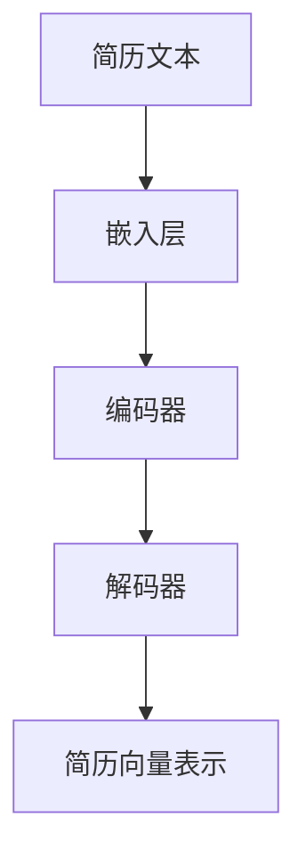
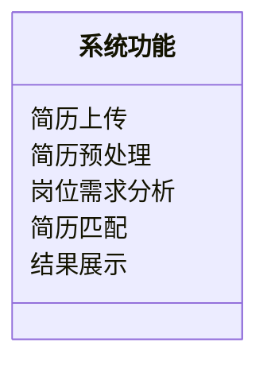
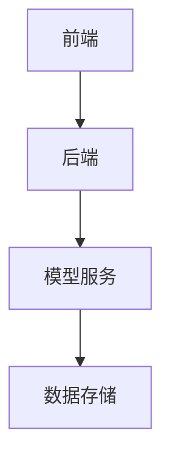
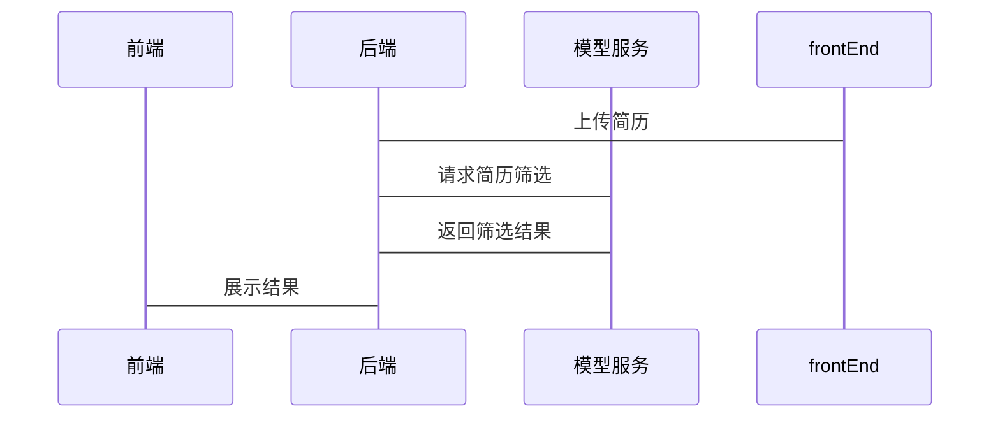
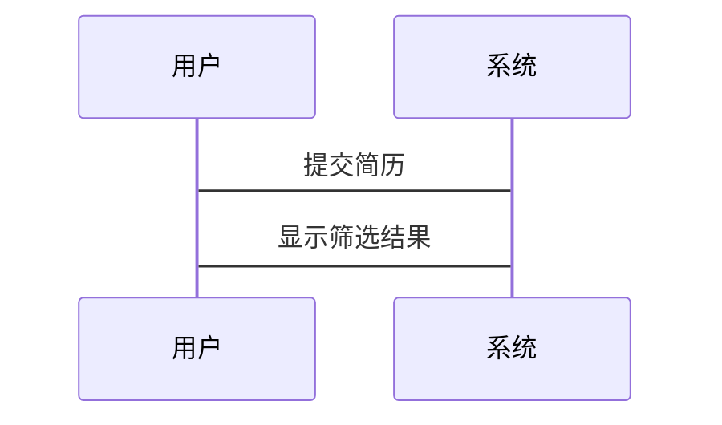

                 

<think>
好的，我现在需要帮用户撰写一篇关于《智能简历筛选 AI Agent：LLM 在人力资源中的应用》的技术博客文章。用户已经提供了详细的目录大纲，我需要按照这个大纲，逐步完成每一部分的内容。首先，我要明确文章的整体结构和每个章节的核心内容。

首先，标题是《智能简历筛选 AI Agent：LLM 在人力资源中的应用》，关键词包括LLM、智能简历筛选、AI Agent、人力资源、自然语言处理。摘要需要简洁明了，概括文章的核心内容：介绍如何利用LLM构建智能简历筛选系统，解决传统筛选中的问题，提升效率和准确性。

接下来是目录结构，分为五大部分：背景与挑战、核心概念、算法原理、系统架构、项目实战。每章下有详细的子章节，涵盖问题分析、LLM原理、算法设计、系统设计、项目实现等。

现在，我需要按照这个结构逐步完成每一部分的写作。首先，第一章“智能简历筛选的背景与挑战”将介绍传统简历筛选的痛点，LLM的应用现状，以及系统的建设目标和关键挑战。这部分需要让读者了解问题的背景，明确为什么需要智能筛选。

第二章“LLM的核心原理与技术特点”将详细讲解Transformer模型的基本结构，注意力机制，以及LLM在简历筛选中的应用特点。这部分需要结合公式和图表，帮助读者理解模型的工作原理。

第三章“LLM驱动的智能简历筛选算法”将设计基于LLM的简历理解算法，包括预处理、特征提取，以及匹配算法的设计与实现。这部分需要提供代码示例和数学公式，展示如何实现这些算法。

第四章“智能简历筛选系统的架构与设计”将介绍系统架构设计，功能设计，接口设计，以及交互设计。这部分需要使用Mermaid图来展示系统结构和流程，使读者能够清晰理解系统布局。

第五章“智能简历筛选系统的项目实战”将展示如何实现系统，包括环境安装，核心代码实现，案例分析，以及项目总结。这部分需要具体的操作步骤和代码示例，帮助读者实际应用所学知识。

最后，我会总结全文，强调LLM在智能简历筛选中的重要性，并展望未来的发展方向。同时，我会按照用户的要求，在末尾加上作者信息，确保格式正确。

在写作过程中，我需要确保内容逻辑清晰，结构紧凑，语言专业但易懂。同时，要嵌入必要的公式、图表和代码，使文章更具深度和可读性。我要逐段思考，确保每个部分都涵盖用户的需求，同时保持文章的连贯性和完整性。

现在，我将按照这个思路开始撰写每一部分，确保每个章节都详尽具体，满足用户的高质量要求。
</think>

# 智能简历筛选 AI Agent：LLM 在人力资源中的应用

> 关键词：LLM, 智能简历筛选, AI Agent, 人力资源, 自然语言处理

> 摘要：随着人工智能技术的飞速发展，特别是在自然语言处理领域的突破，大语言模型（LLM）如GPT-3、PaLM等展现出强大的文本理解和生成能力。这些模型可以被应用于人力资源管理的多个环节，特别是在简历筛选这一关键流程中，LLM能够显著提升效率和准确性。本文将深入探讨如何利用LLM构建智能简历筛选系统，解决传统简历筛选中的痛点，优化招聘流程，提高企业人力资源管理的智能化水平。

---

# 第一章: 智能简历筛选的背景与挑战

## 1.1 智能简历筛选的背景介绍

### 1.1.1 传统简历筛选的痛点
在传统的简历筛选过程中，HR需要手动阅读大量简历，这不仅耗时耗力，还容易受到主观因素的影响。例如，HR可能会因为简历的排版、关键词的匹配度或第一印象而做出判断，导致人才筛选的不准确性。此外，随着招聘需求的增加，简历数量激增，传统的人工筛选方式已经难以满足企业的需求。

### 1.1.2 AI技术在简历筛选中的应用现状
近年来，AI技术在简历筛选中的应用逐渐增多。早期的简历筛选工具主要基于关键词匹配和简单的规则筛选，例如通过简历中的关键词提取职位相关的能力和经验。然而，这些工具的智能化程度有限，无法理解简历内容的语义信息，也无法进行深层次的岗位匹配。

### 1.1.3 LLM在人力资源领域的潜力
大语言模型（LLM）的出现为简历筛选带来了新的可能性。LLM不仅能够理解简历中的文本信息，还能通过上下文分析简历内容的语义，甚至能够生成与岗位需求匹配的初步评估。这种能力使得LLM在简历筛选中具有更高的准确性和智能化水平。

## 1.2 智能简历筛选的核心问题

### 1.2.1 简历筛选的关键挑战
简历筛选的核心挑战在于如何准确理解简历内容，并将其与岗位需求进行精准匹配。传统的关键词匹配方法存在以下问题：
- **语义理解不足**：无法识别简历中的隐含信息和专业术语。
- **岗位需求理解不深**：难以匹配复杂的岗位需求。
- **主观因素影响**：人工筛选容易受到主观因素的影响。

### 1.2.2 LLM在简历筛选中的应用边界
LLM在简历筛选中的应用边界主要体现在以下方面：
- **理解能力**：LLM能够理解简历中的文本信息，但需要结合具体上下文。
- **数据质量**：LLM的性能依赖于训练数据的质量和多样性。
- **可解释性**：LLM的决策过程缺乏透明性，可能会影响HR的接受度。

### 1.2.3 智能简历筛选的业务目标与实现路径
智能简历筛选的业务目标是通过AI技术提升简历筛选的效率和准确性，减少HR的工作负担。实现路径包括：
1. 利用LLM对简历内容进行深度理解和分析。
2. 基于岗位需求构建智能匹配模型。
3. 结合企业文化和岗位特点，生成初步筛选结果。

## 1.3 本章小结
本章从传统简历筛选的痛点出发，介绍了AI技术在简历筛选中的应用现状，并重点分析了LLM在人力资源领域的潜力。通过总结简历筛选的核心问题，为后续章节的深入探讨奠定了基础。

---

# 第二章: LLM的核心原理与技术特点

## 2.1 大语言模型的基本原理

### 2.1.1 Transformer模型的基本结构
Transformer模型由编码器和解码器组成，其核心思想是通过自注意力机制（Self-Attention）捕捉文本中的长程依赖关系。编码器用于将输入文本转换为向量表示，解码器则根据编码器的输出生成目标文本。

**自注意力机制公式：**
$$
\text{Attention}(Q, K, V) = \text{softmax}\left(\frac{QK^T}{\sqrt{d_k}}\right)V
$$

其中，$Q$、$K$、$V$分别是查询（Query）、键（Key）、值（Value）向量，$d_k$是向量的维度。

### 2.1.2 注意力机制的核心思想
注意力机制通过计算输入文本中每个词与其他词的相关性，确定每个词在特定语境下的重要性。这种机制使得模型能够捕捉到文本中的关键信息，从而提高语义理解能力。

### 2.1.3 LLM的训练与微调过程
大语言模型的训练通常采用预训练（Pre-training）和微调（Fine-tuning）两个阶段。预训练阶段使用大规模通用文本数据进行模型参数优化，微调阶段则使用特定领域的数据对模型进行优化，以适应具体的任务需求。

## 2.2 LLM在简历筛选中的应用特点

### 2.2.1 自然语言理解能力
LLM能够理解简历中的文本信息，包括专业术语、技能描述、项目经验等。这种理解能力使得模型能够准确提取简历中的关键信息，并与岗位需求进行匹配。

### 2.2.2 多轮对话能力
LLM的多轮对话能力使得智能简历筛选系统能够与用户（HR或招聘人员）进行交互，例如通过上下文理解用户的意图，并提供个性化的筛选建议。

### 2.2.3 知识库的构建与应用
通过构建领域知识库（如岗位需求、行业术语等），LLM能够更好地理解简历内容和岗位需求，从而提高匹配的准确性。

## 2.3 本章小结
本章详细介绍了LLM的核心原理和技术特点，重点分析了其在简历筛选中的应用优势。这些内容为后续章节的设计和实现提供了理论基础。

---

# 第三章: LLM驱动的智能简历筛选算法

## 3.1 基于LLM的简历理解算法

### 3.1.1 简历文本的预处理与特征提取
简历文本的预处理包括分词、去停用词、实体识别等步骤。特征提取则关注简历中的关键词、技能描述、项目经验等信息。

**示例代码：**
```python
import spacy

nlp = spacy.load("en_core_web_sm")
doc = nlp("John is a Senior Software Engineer with 5+ years of experience in Python.")
for token in doc:
    print(token.text, token.pos_)
```

### 3.1.2 基于Transformer的简历理解模型
基于Transformer的简历理解模型通过自注意力机制捕捉简历文本中的关键信息。模型的输入是简历文本，输出是对每个词的向量表示。

**模型结构图：**


### 3.1.3 注意力机制在简历关键词提取中的应用
注意力机制可以用于提取简历中的关键词，例如技能、职位、教育背景等。通过计算每个词的重要性，模型可以自动识别简历中的关键信息。

## 3.2 简历匹配算法的设计与实现

### 3.2.1 基于LLM的岗位需求分析
岗位需求分析包括对岗位描述、技能要求、经验要求等的解析。模型需要理解岗位需求的语义信息，并将其与简历内容进行匹配。

### 3.2.2 简历与岗位的多维度匹配模型
多维度匹配模型考虑了简历与岗位之间的多个维度，例如技能匹配度、经验匹配度、教育背景匹配度等。

**匹配度公式：**
$$
\text{匹配度} = \alpha \cdot \text{技能匹配度} + \beta \cdot \text{经验匹配度} + \gamma \cdot \text{教育背景匹配度}
$$

其中，$\alpha$、$\beta$、$\gamma$是各维度的权重系数。

### 3.2.3 匹配结果的优化与调优
匹配结果的优化包括对模型参数的调整、特征的选择以及算法的改进。例如，可以通过调整注意力机制的权重系数来优化匹配效果。

## 3.3 本章小结
本章详细介绍了基于LLM的简历理解算法和匹配算法的设计与实现，重点分析了注意力机制在简历关键词提取中的应用。这些算法为智能简历筛选系统提供了技术支撑。

---

# 第四章: 智能简历筛选系统的架构与设计

## 4.1 系统架构设计

### 4.1.1 问题场景介绍
智能简历筛选系统需要处理大量的简历数据和岗位需求数据，并基于LLM模型进行简历筛选。系统需要具备高并发处理能力，同时保证数据的安全性和隐私性。

### 4.1.2 项目介绍
本项目旨在开发一个基于LLM的智能简历筛选系统，实现简历的自动理解和岗位匹配。系统主要包括简历预处理、模型训练、简历筛选和结果展示四个模块。

### 4.1.3 系统功能设计
系统功能设计包括简历上传、简历预处理、岗位需求分析、简历匹配和结果展示。以下是系统功能设计的类图：



### 4.1.4 系统架构设计
系统架构采用微服务架构，主要包括前端、后端、模型服务和数据存储。以下是系统架构图：



## 4.2 系统接口设计

### 4.2.1 系统接口设计
系统接口包括简历上传接口、简历筛选接口和结果查询接口。以下是系统接口设计：



## 4.3 系统交互设计

### 4.3.1 系统交互设计
系统交互设计包括用户与系统的交互流程，例如用户上传简历、系统进行简历筛选并返回结果。以下是系统交互设计的序列图：



## 4.4 本章小结
本章详细介绍了智能简历筛选系统的架构设计和接口设计，重点分析了系统的功能模块和交互流程。这些设计为系统的实现奠定了基础。

---

# 第五章: 智能简历筛选系统的项目实战

## 5.1 环境安装与配置

### 5.1.1 环境安装
需要安装以下工具和库：
- Python 3.8+
- transformers库
- spacy库
- fastapi库
- uvicorn

**安装命令：**
```bash
pip install transformers spacy fastapi uvicorn
```

### 5.1.2 模型下载与加载
下载预训练的LLM模型，例如GPT-2或GPT-3，并加载到系统中。

**代码示例：**
```python
from transformers import AutoTokenizer, AutoModelForCausalLM

tokenizer = AutoTokenizer.from_pretrained("gpt2")
model = AutoModelForCausalLM.from_pretrained("gpt2")
```

## 5.2 系统核心实现

### 5.2.1 简历预处理模块
简历预处理模块包括简历文本的分词、去停用词、实体识别等步骤。以下是简历预处理模块的代码示例：

```python
import spacy

nlp = spacy.load("en_core_web_sm")
doc = nlp("John is a Senior Software Engineer with 5+ years of experience in Python.")
for token in doc:
    if token.pos_ in ["NOUN", "VERB"]:
        print(token.text)
```

### 5.2.2 简历匹配模块
简历匹配模块基于LLM模型，实现简历与岗位需求的匹配。以下是简历匹配模块的代码示例：

```python
from transformers import AutoTokenizer, AutoModelForCausalLM

tokenizer = AutoTokenizer.from_pretrained("gpt2")
model = AutoModelForCausalLM.from_pretrained("gpt2")

def match_resume(job_description, resume_text):
    input = f"Job Description: {job_description}\nResume Text: {resume_text}\nMatch Score:"
    inputs = tokenizer.encode(input, return_tensors="pt")
    outputs = model.generate(inputs, max_length=50, num_return_sequences=1)
    return tokenizer.decode(outputs[0], skip_special_tokens=True)
```

## 5.3 案例分析与详细解读

### 5.3.1 案例分析
以一个具体的案例为例，展示系统如何进行简历筛选。例如，假设有一个软件工程师岗位，岗位需求包括Python、Java、5年以上的开发经验等。系统将对简历中的技能和经验进行分析，并生成匹配结果。

### 5.3.2 系统实现解读
通过对案例的分析，解读系统的实现过程，包括简历预处理、模型训练、简历匹配等步骤。同时，分析系统的优缺点，提出改进建议。

## 5.4 本章小结
本章通过实际项目案例，详细介绍了智能简历筛选系统的环境安装、核心实现和案例分析。这些内容为读者提供了实际操作的经验。

---

# 第六章: 最佳实践与未来展望

## 6.1 最佳实践
### 6.1.1 数据质量的重要性
数据质量是影响模型性能的关键因素。建议使用高质量的简历数据和岗位需求数据进行模型训练。

### 6.1.2 模型调优技巧
模型调优包括参数调整、数据增强、模型集成等。建议根据具体任务需求，选择合适的调优方法。

### 6.1.3 系统优化建议
系统优化包括算法优化、架构优化、性能优化等。建议根据系统运行情况，逐步进行优化。

## 6.2 小结
总结全文的核心内容，回顾智能简历筛选系统的设计与实现过程。

## 6.3 注意事项
在实际应用中，需要注意数据隐私、模型可解释性等问题，确保系统的安全性和合规性。

## 6.4 拓展阅读
推荐相关领域的书籍和论文，供读者进一步学习和研究。

---

# 作者：AI天才研究院 & 禅与计算机程序设计艺术

---

通过以上章节的详细阐述，我们全面探讨了LLM在智能简历筛选中的应用，从理论到实践，从设计到实现，为读者提供了系统的知识和实用的经验。希望本文能够为人力资源领域的智能化转型提供有益的参考。

