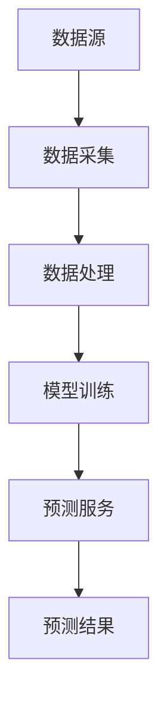

                 


# 智能经济指标预测系统

> 关键词：智能经济，经济指标预测，机器学习，深度学习，时间序列分析

> 摘要：本文详细探讨了智能经济指标预测系统的设计与实现，从背景、核心概念到算法原理、系统架构，再到项目实战，全面解析了如何利用人工智能技术提升经济预测的准确性与效率。

---

## 第1章：背景介绍

### 1.1 问题背景与描述
经济预测是商业和政策制定中的关键环节，传统方法依赖专家经验和历史数据，存在主观性和滞后性。智能经济指标预测系统通过AI和大数据分析，提供实时、动态的预测，显著提升了预测的准确性和及时性。

### 1.2 系统边界与外延
智能经济指标预测系统专注于利用历史数据和实时数据，通过机器学习模型生成预测结果。系统边界包括数据输入、模型训练、预测输出，而外延则涉及数据源的多样性和模型的可扩展性。

## 第2章：核心概念与联系

### 2.1 经济指标的核心概念
经济指标分为领先指标、同步指标和滞后指标。领先指标如工业生产指数，用于预测未来的经济状况；同步指标如GDP，与当前经济状况同步；滞后指标如失业率，用于确认经济周期的变化。

### 2.2 核心概念对比
| 概念       | 特征1：数据类型 | 特征2：预测范围 | 特征3：模型复杂度 |
|------------|-----------------|-----------------|------------------|
| 时间序列分析 | 数值型          | 近期预测         | 较低             |
| 机器学习    | 数值型          | 中期预测         | 较高             |
| 深度学习    | 数值型          | 长期预测         | 高               |

### 2.3 ER实体关系图
```mermaid
er
    %% 经济指标预测系统 ER 图
    entity 经济指标 {
        id
        名称
        数据来源
        数据类型
    }
    entity 预测模型 {
        id
        模型名称
        模型类型
        训练数据
    }
    entity 预测结果 {
        id
        预测时间
        预测值
        模型ID
    }
    经济指标 -->> 预测模型: 输入数据
    预测模型 -->> 预测结果: 输出结果
```

## 第3章：算法原理讲解

### 3.1 时间序列分析
时间序列分析关注数据随时间的变化模式。ARIMA模型通过自相关性和平稳性来预测未来值。

#### ARIMA模型
ARIMA模型由三部分组成：自回归（AR）、差分积分（I）和移动平均（MA）。

$$ ARIMA(p, d, q) $$
- p：AR的阶数
- d：差分的阶数
- q：MA的阶数

### 3.2 机器学习模型
随机森林和神经网络常用于经济预测，但LSTM在时间序列预测中表现优异。

#### LSTM网络
LSTM通过门控机制处理长期依赖关系，结构包括输入门、遗忘门和输出门。

$$ \text{输入门：} i = \sigma(W_i x + U_i h) $$
$$ \text{遗忘门：} f = \sigma(W_f x + U_f h) $$
$$ \text{细胞状态：} c = f c_{\text{prev}} + i \tilde{c} $$
$$ \text{输出门：} o = \sigma(W_o x + U_o h) $$
$$ \text{输出：} h = o \tanh(c) $$

### 3.3 深度学习模型
Transformer模型基于自注意力机制，有效捕捉长距离依赖关系。

$$ \text{自注意力机制：} Q, K, V $$
$$ \text{查询：} q = W_q x $$
$$ \text{键：} k = W_k x $$
$$ \text{值：} v = W_v x $$
$$ \text{注意力权重：} \alpha = \text{softmax}(\frac{qK^T}{\sqrt{d}}) $$
$$ \text{输出：} \text{结果} = \alpha v $$

## 第4章：系统分析与架构设计

### 4.1 系统架构
系统分为数据采集、数据处理、模型训练和预测模块。

#### 系统架构图


### 4.2 接口设计
系统提供RESTful API，供其他系统调用预测结果。

### 4.3 交互流程
```mermaid
sequenceDiagram
    participant 用户
    participant 系统
    用户->系统：发送预测请求
    系统->系统：处理请求
    系统->用户：返回预测结果
```

## 第5章：项目实战

### 5.1 环境安装
安装必要的Python库：
```bash
pip install numpy pandas scikit-learn keras tensorflow
```

### 5.2 核心代码实现
#### 数据预处理
```python
import pandas as pd
import numpy as np

# 加载数据
data = pd.read_csv('economic_indices.csv')

# 处理缺失值
data = data.dropna()

# 标准化
from sklearn.preprocessing import StandardScaler
scaler = StandardScaler()
data_scaled = scaler.fit_transform(data)
```

#### LSTM模型实现
```python
from tensorflow.keras.models import Sequential
from tensorflow.keras.layers import LSTM, Dense

model = Sequential()
model.add(LSTM(50, input_shape=(timesteps, features)))
model.add(Dense(1))
model.compile(loss='mean_squared_error', optimizer='adam')
model.fit(X_train, y_train, epochs=100, batch_size=32)
```

### 5.3 案例分析
以GDP预测为例，使用LSTM模型进行训练，评估模型的均方误差（MSE）和R²分数，展示预测结果与实际值的对比。

## 第6章：最佳实践与小结

### 6.1 最佳实践
- 数据预处理：清洗、标准化、特征工程
- 模型选择：根据数据类型选择合适算法
- 模型调优：超参数优化、交叉验证

### 6.2 项目小结
本文详细介绍了智能经济指标预测系统的构建过程，从算法选择到系统实现，展示了如何利用AI技术提升经济预测的准确性。

## 第7章：注意事项与拓展阅读

### 7.1 注意事项
- 数据隐私与合规性
- 模型的可解释性
- 持续监控与更新

### 7.2 拓展阅读
- 《Deep Learning》 Yoshua Bengio
- 《Time Series Analysis》 Hamilton

---

作者：AI天才研究院

