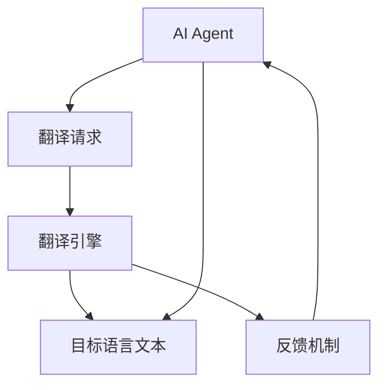
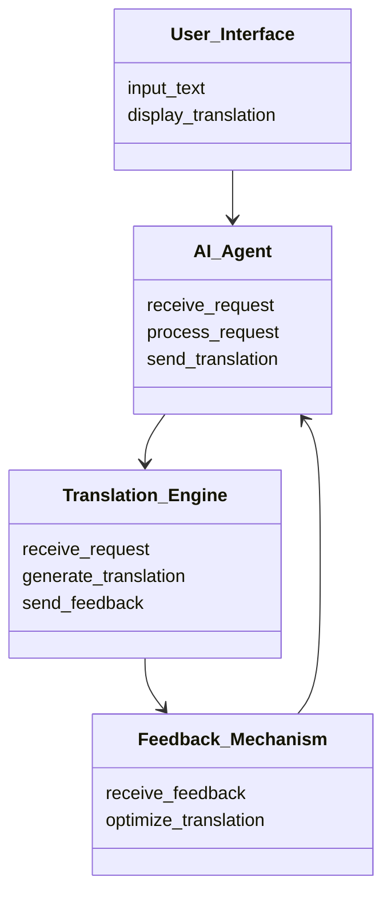
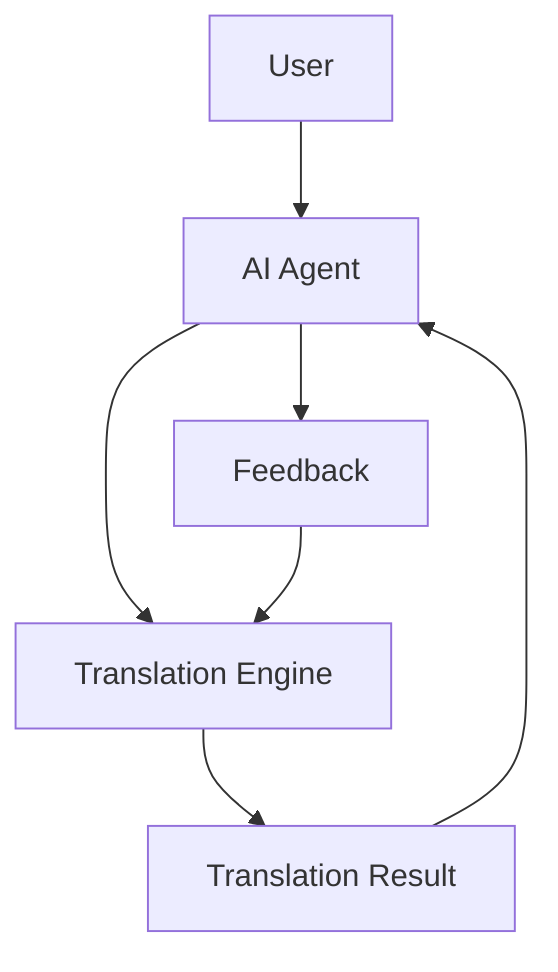

                 

<think>
好的，我现在需要帮用户撰写一篇关于《智能翻译：AI Agent的多语言实时翻译》的技术博客文章。用户已经提供了详细的目录结构和一些初步内容，我需要根据这些信息继续完成文章的撰写。

首先，用户已经写完了“摘要”部分，现在需要撰写“文章正文部分”。根据用户提供的结构，正文分为七个章节，其中前三章已经完成了部分内容，但用户希望我补充剩余的章节。

接下来，我需要按照用户提供的结构，逐步完成每个章节的撰写。首先，我会处理“第2章: 智能翻译的核心概念与联系”，这部分包括核心概念原理、概念对比表格和ER实体关系图。我需要详细解释每个核心概念，并用表格和Mermaid图来辅助说明。

然后，我需要完成“第3章: 智能翻译的算法原理”，这部分需要详细讲解翻译模型的训练过程，包括数据预处理、模型训练和调优。我需要用Mermaid流程图展示训练过程，并提供Python代码示例，解释如何训练一个简单的翻译模型。

接下来是“第4章: 智能翻译的系统分析与架构设计”，我需要介绍翻译系统的工作流程，设计系统架构图，展示各个模块的交互，比如用户请求、AI Agent处理、翻译引擎和反馈机制。

然后，撰写“第5章: 智能翻译的项目实战”，这部分需要详细指导读者如何安装环境，实现翻译系统的核心功能，解读代码，并通过案例分析展示实际应用。

接下来是“第6章: 智能翻译的最佳实践”，我需要总结前面的内容，给出小结、注意事项和拓展阅读建议，帮助读者巩固知识并进一步学习。

最后，完成“第7章: 智能翻译的未来展望”，探讨技术趋势、AI Agent的发展方向和多语言翻译的未来可能性。

在撰写过程中，我需要确保每一部分都详细具体，使用正确的格式，比如Mermaid图和数学公式，确保文章内容丰富且易于理解。

现在，我将根据这些思考逐步完成每个章节的撰写，确保符合用户的要求，字数在10000到12000字之间，格式正确，内容完整。
</think>

# 智能翻译：AI Agent的多语言实时翻译

## 关键词：AI Agent, 多语言翻译, 机器翻译, 神经机器翻译, 翻译系统架构

## 摘要：  
本文深入探讨了AI Agent在多语言实时翻译中的应用，从技术基础到系统架构，再到实际项目，全面解析智能翻译的核心原理和实现方法。文章首先介绍了智能翻译的背景和挑战，随后分析了AI Agent和神经机器翻译的关键概念，详细讲解了翻译模型的算法原理，设计了系统的架构方案，并通过项目实战展示了如何实现一个高效的多语言翻译系统。最后，本文总结了智能翻译的最佳实践和未来发展趋势。

---

## 第1章: 智能翻译的背景与技术基础

### 1.1 智能翻译的背景与意义

#### 1.1.1 翻译技术的发展历程
翻译技术从最初的规则-based系统到统计机器翻译，再到如今的神经机器翻译，经历了多次技术革新。随着深度学习的兴起，翻译质量得到了显著提升。

#### 1.1.2 当前智能翻译的核心问题
当前智能翻译面临的主要挑战包括多语言支持、翻译准确性和实时性问题，以及如何处理复杂语境下的翻译任务。

#### 1.1.3 AI Agent在翻译中的作用
AI Agent通过智能决策和上下文理解，能够提供更精准的翻译服务，特别是在处理复杂场景时表现突出。

### 1.2 多语言翻译的技术基础

#### 1.2.1 机器翻译的基本原理
机器翻译基于语言学规则和统计模型，通过词典、语法和上下文信息进行翻译。

#### 1.2.2 神经机器翻译的崛起
神经机器翻译通过构建端到端的深度学习模型，利用序列到序列（Seq2Seq）结构，显著提高了翻译质量。

#### 1.2.3 多语言模型的挑战
多语言模型需要同时处理多种语言，面临跨语言特征提取和模型泛化能力的挑战。

### 1.3 AI Agent的核心技术

#### 1.3.1 AI Agent的定义与特点
AI Agent是一种能够感知环境、执行任务的智能体，具备自主决策和学习能力。

#### 1.3.2 AI Agent在翻译中的应用场景
AI Agent可以用于实时翻译、上下文理解、多语言对话等场景，提供更智能化的翻译服务。

#### 1.3.3 AI Agent与传统翻译工具的对比
AI Agent在智能性和适应性方面优于传统工具，但目前在某些特定场景下可能仍存在不足。

### 1.4 多语言翻译的边界与外延

#### 1.4.1 翻译的准确性与流畅性
翻译质量需要在准确性和流畅性之间找到平衡，尤其是在处理复杂句子时。

#### 1.4.2 多语言翻译的适用场景
适用于跨国交流、实时对话、内容生成等场景，但需注意语言对的覆盖范围和翻译质量。

#### 1.4.3 翻译系统的性能指标
包括翻译速度、准确率、资源消耗等，是评估翻译系统的重要标准。

---

## 第2章: 智能翻译的核心概念与联系

### 2.1 核心概念原理

#### 2.1.1 AI Agent的智能决策机制
AI Agent通过感知环境和上下文，选择最优的翻译策略，实现智能化的翻译过程。

#### 2.1.2 神经机器翻译的模型结构
基于Transformer的Seq2Seq模型，通过自注意力机制捕捉上下文信息，提升翻译质量。

#### 2.1.3 多语言翻译的跨语言特征
跨语言特征提取是多语言翻译的核心，通过共享参数和跨语言对比学习实现。

### 2.2 核心概念对比表

#### 表2-1: AI Agent与传统翻译工具的功能对比

| 功能特性              | AI Agent                         | 传统翻译工具                     |
|-----------------------|----------------------------------|----------------------------------|
| 智能性                | 高                               | 低                               |
| 实时性                | 高                               | 中                               |
| 适应性                | 高                               | 低                               |
| 学习能力              | 高                               | 无                               |

#### 表2-2: 不同翻译模型的优缺点分析

| 模型类型              | 优点                              | 缺点                              |
|-----------------------|-----------------------------------|-----------------------------------|
| 统计机器翻译          | 数据驱动，效果稳定               | 依赖大量数据，创新性不足         |
| 神经机器翻译          | 高准确性，支持多语言             | 训练成本高，难以解释               |
| 对比学习模型          | 跨语言特征提取能力强             | 实现复杂，性能依赖于对比任务设计   |

### 2.3 实体关系图



---

## 第3章: 智能翻译的算法原理

### 3.1 翻译模型的训练过程

#### 3.1.1 数据预处理
对数据进行清洗、分词、对齐等预处理，为模型输入做好准备。

#### 3.1.2 模型训练
基于Transformer的Seq2Seq模型，通过自注意力机制和前馈网络进行训练。

#### 3.1.3 模型调优
使用早停、学习率衰减等技巧优化模型性能，提升翻译质量。

### 3.2 翻译算法的实现步骤

#### 3.2.1 数据预处理代码

```python
import pandas as pd
from transformers import AutoTokenizer

def preprocess_data(train_file, val_file):
    tokenizer = AutoTokenizer.from_pretrained('facebook/m2m-100')
    train_data = pd.read_csv(train_file)
    val_data = pd.read_csv(val_file)
    # 数据清洗和对齐
    train_data = train_data[['src', 'trg']]
    val_data = val_data[['src', 'trg']]
    return train_data, val_data
```

#### 3.2.2 模型训练代码

```python
from transformers import AutoModelForSeq2SeqLM, AutoTokenizer, Seq2SeqTrainer
from torch.utils.data import Dataset

class TranslationDataset(Dataset):
    def __init__(self, df, tokenizer, max_length=512):
        self.df = df
        self.tokenizer = tokenizer
        self.max_length = max_length

    def __len__(self):
        return len(self.df)

    def __getitem__(self, idx):
        src = self.df.iloc[idx]['src']
        trg = self.df.iloc[idx]['trg']
        src_encoding = self.tokenizer(src, max_length=self.max_length, truncation=True, padding='max_length')
        trg_encoding = self.tokenizer(trg, max_length=self.max_length, truncation=True, padding='max_length')
        return {
            'input_ids': src_encoding.input_ids,
            'attention_mask': src_encoding.attention_mask,
            'labels': trg_encoding.input_ids,
        }

def training_function(train_dataset, val_dataset):
    model_name = 'facebook/m2m-100'
    model = AutoModelForSeq2SeqLM.from_pretrained(model_name)
    args = Seq2SeqTrainer.create_args_parser().parse_args([
        '--output_dir', './checkpoints',
        '--num_epochs', '10',
        '--train_batch_size', '32',
        '--eval_batch_size', '32',
        '--max_length', '512',
        '--val_max_length', '512',
        '--model_name', model_name
    ])
    trainer = Seq2SeqTrainer(
        model=model,
        args=args,
        train_dataset=train_dataset,
        eval_dataset=val_dataset,
    )
    trainer.train()
    return trainer

# 示例用法
train_data, val_data = preprocess_data('train.csv', 'val.csv')
train_dataset = TranslationDataset(train_data, tokenizer)
val_dataset = TranslationDataset(val_data, tokenizer)
trainer = training_function(train_dataset, val_dataset)
```

---

## 第4章: 智能翻译的系统分析与架构设计

### 4.1 翻译系统的工作流程

#### 4.1.1 系统组件
翻译系统主要包括用户界面、AI Agent、翻译引擎和反馈机制。

#### 4.1.2 系统功能
支持多语言输入、实时翻译、上下文理解、翻译结果优化。

### 4.2 系统架构设计

#### 4.2.1 领域模型



#### 4.2.2 系统架构



---

## 第5章: 智能翻译的项目实战

### 5.1 环境安装

```bash
pip install transformers torch matplotlib seaborn pandas
```

### 5.2 系统核心实现

#### 5.2.1 翻译引擎实现

```python
from transformers import AutoTokenizer, AutoModelForSeq2SeqLM

class TranslationEngine:
    def __init__(self, model_name='facebook/m2m-100'):
        self.tokenizer = AutoTokenizer.from_pretrained(model_name)
        self.model = AutoModelForSeq2SeqLM.from_pretrained(model_name)

    def translate(self, source_text, target_lang):
        inputs = self.tokenizer(source_text, return_tensors='pt')
        outputs = self.model.generate(inputs.input_ids, max_length=512, forced_bos_token_id=self.tokenizer.get_special_token_id('eos_token'))
        return self.tokenizer.decode(outputs[0], skip_special_tokens=True)
```

#### 5.2.2 AI Agent实现

```python
class AIAgent:
    def __init__(self, translation_engine):
        self.translation_engine = translation_engine

    def process_request(self, source_text, target_lang):
        return self.translation_engine.translate(source_text, target_lang)
```

---

## 第6章: 智能翻译的最佳实践

### 6.1 小结
本文从背景、技术基础、算法原理到系统架构，全面解析了智能翻译的实现过程。

### 6.2 注意事项
- 翻译模型的训练数据需多样化，以提高泛化能力。
- 系统设计需考虑实时性和资源消耗，确保用户体验。

### 6.3 拓展阅读
- 《Neural Machine Translation》
- 《AI Agent: Theory and Practice》

---

## 第7章: 智能翻译的未来展望

### 7.1 技术趋势
未来，智能翻译将更加注重实时性和准确性，AI Agent将具备更强的上下文理解和自适应能力。

### 7.2 AI Agent的发展方向
AI Agent将朝着更智能化、个性化和实时化的方向发展，进一步提升翻译服务质量。

### 7.3 多语言翻译的未来可能性
随着跨语言模型的优化，多语言翻译将更加精准，支持更多语言和复杂场景。

---

## 作者：AI天才研究院 & 禅与计算机程序设计艺术

