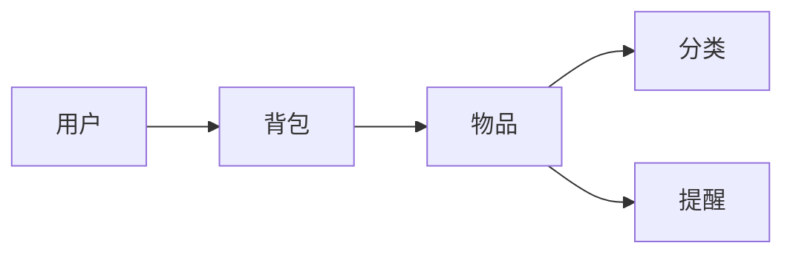
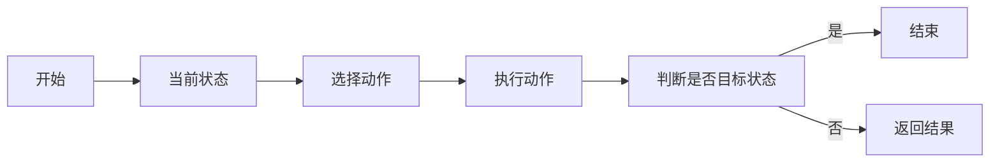
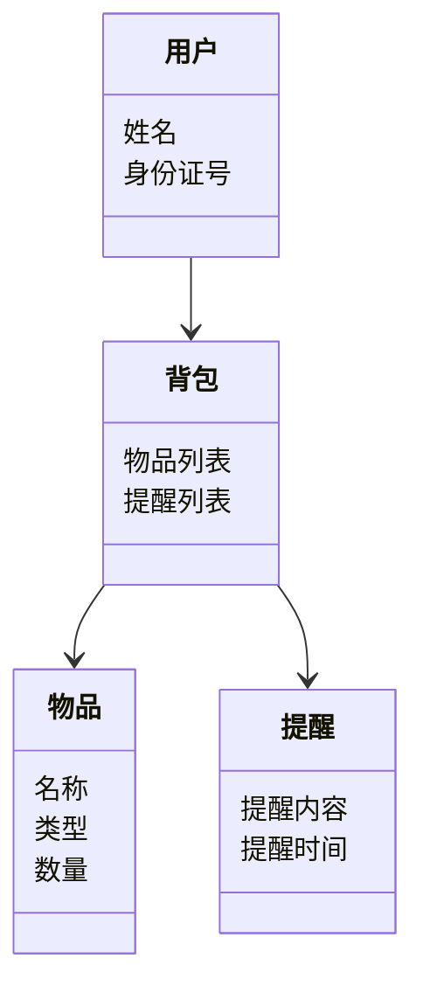
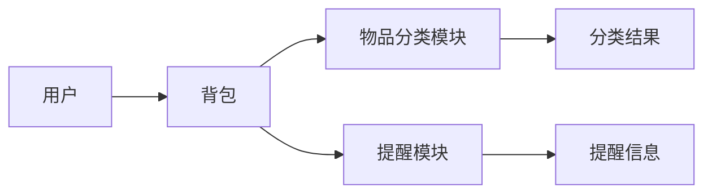
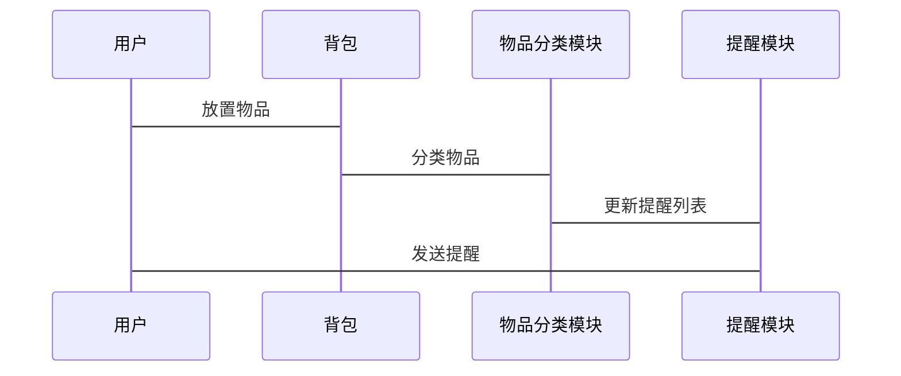

                 


# 智能背包：AI Agent的物品整理与提醒助手

---

## 关键词
- AI Agent
- 物品整理
- 提醒助手
- 智能背包
- 算法原理
- 系统设计
- 项目实战

---

## 摘要
随着人工智能技术的快速发展，AI Agent在物品管理和提醒服务中的应用日益广泛。本文深入探讨了AI Agent如何应用于智能背包，实现物品整理与提醒功能。通过分析AI Agent的核心原理、算法实现、系统架构以及项目实战，本文为读者提供了从理论到实践的全面指导。文章内容涵盖背景介绍、核心概念、算法原理、系统分析、项目实战、最佳实践等多个方面，帮助读者全面理解并掌握智能背包的设计与实现。

---

# 第一部分: 智能背包与AI Agent的背景介绍

## 第1章: AI Agent与智能背包的定义与背景

### 1.1 AI Agent的基本概念

#### 1.1.1 什么是AI Agent
AI Agent（人工智能代理）是指能够感知环境、自主决策并执行任务的智能实体。它能够通过传感器获取信息，利用算法进行分析，并通过执行器与环境交互。AI Agent的应用广泛，包括智能助手、自动驾驶、智能家居等领域。

#### 1.1.2 AI Agent的核心特征
1. **自主性**：AI Agent能够在没有外部干预的情况下独立运作。
2. **反应性**：能够实时感知环境变化并做出反应。
3. **目标导向**：具备明确的目标，能够优化决策以实现目标。
4. **学习能力**：通过数据和经验不断优化自身性能。

#### 1.1.3 智能背包的定义与特点
智能背包是一种结合AI技术的便携式设备，能够协助用户整理物品并提供智能化的提醒服务。其特点包括：
1. **智能化**：通过AI算法实现自动分类和管理。
2. **便捷性**：用户可以通过语音或手势进行操作。
3. **实时性**：能够实时监控物品状态并推送提醒。

---

### 1.2 物品整理与提醒的背景

#### 1.2.1 当代生活中的物品管理问题
现代社会中，人们面临着物品管理混乱的问题，尤其是在工作和生活中，物品的整理和提醒需求日益增加。传统的方法效率低下，容易遗忘或重复购买。

#### 1.2.2 提醒助手的现状与不足
现有的提醒工具多基于单一功能，缺乏智能化和个性化，无法与物品管理相结合，无法满足用户的多样化需求。

#### 1.2.3 AI Agent在物品整理与提醒中的作用
AI Agent能够通过智能化的分类、识别和提醒功能，帮助用户高效管理物品，提升生活和工作效率。

---

### 1.3 本章小结
本章介绍了AI Agent的基本概念和智能背包的定义，分析了物品整理与提醒的背景，强调了AI Agent在解决这些实际问题中的重要作用。

---

# 第二部分: AI Agent的核心概念与原理

## 第2章: AI Agent的核心概念与联系

### 2.1 AI Agent的核心原理

#### 2.1.1 感知与理解
AI Agent通过传感器或API接口获取环境数据，例如图像识别、语音识别等技术，将物理世界的信息转化为数字化数据。

#### 2.1.2 决策与规划
基于感知到的数据，AI Agent利用算法进行分析和决策，例如路径规划、任务分配等。

#### 2.1.3 执行与反馈
AI Agent通过执行器（如机械臂、显示器）执行决策，并通过反馈机制优化后续操作。

---

### 2.2 核心概念对比分析

#### 2.2.1 AI Agent与传统软件的区别
| 特性         | AI Agent                          | 传统软件                          |
|--------------|-----------------------------------|-----------------------------------|
| 自主性       | 高                                | 低                                |
| 学习能力     | 强                                | 无                                |
| 适应性       | 强                                | 低                                |

#### 2.2.2 物品整理与提醒功能的对比
| 功能模块     | 物品整理                        | 提醒功能                          |
|--------------|---------------------------------|----------------------------------|
| 核心任务     | 分类和管理物品                  | 提醒用户执行任务                  |
| 输入数据     | 物品信息                        | 时间或事件信息                    |
| 输出结果     | 分类结果                        | 提醒信息                          |

#### 2.2.3 智能背包的实体关系图



---

### 2.3 本章小结
本章详细讲解了AI Agent的核心原理，并通过对比分析和实体关系图，明确了智能背包的结构和功能。

---

# 第三部分: AI Agent的算法原理

## 第3章: AI Agent的核心算法

### 3.1 状态空间搜索算法

#### 3.1.1 状态空间的定义
状态空间是AI Agent所有可能状态的集合，每个状态代表一个可能的环境配置。

#### 3.1.2 搜索算法的实现
广度优先搜索（BFS）和深度优先搜索（DFS）是常用的搜索算法，用于探索状态空间并找到目标状态。

#### 3.1.3 算法流程图



---

### 3.2 机器学习模型

#### 3.2.1 分类任务的数学模型
分类任务通常使用支持向量机（SVM）或随机森林（Random Forest）等算法。以SVM为例，其目标函数可以表示为：

$$ \min_{w,b} \frac{1}{2}w^Tw + C\sum_{i=1}^n \xi_i $$
$$ \text{s.t.} \quad y_i(w \cdot x_i + b) \geq 1 - \xi_i $$
$$ \xi_i \geq 0 $$

其中，\( w \) 是权重向量，\( b \) 是偏置，\( C \) 是惩罚系数，\( \xi_i \) 是松弛变量。

#### 3.2.2 回归任务的数学模型
回归任务使用线性回归时，目标函数为：

$$ \min_{\theta} \frac{1}{2m} \sum_{i=1}^m (y_i - \theta^T x_i)^2 $$

其中，\( \theta \) 是参数向量，\( m \) 是样本数量。

#### 3.2.3 算法实现代码

```python
import numpy as np
from sklearn.svm import SVC

# 示例数据
X = np.array([[1, 0], [0, 1], [1, 1], [0, 0]])
y = np.array([0, 1, 1, 0])

# 训练模型
model = SVC()
model.fit(X, y)

# 预测
print(model.predict(X))
```

---

### 3.3 本章小结
本章通过数学公式和代码示例，详细讲解了AI Agent的核心算法，包括状态空间搜索和机器学习模型。

---

# 第四部分: 系统分析与架构设计

## 第4章: 系统分析与架构设计方案

### 4.1 问题场景介绍
智能背包需要实现物品分类和提醒功能，用户可以通过背包上的显示屏或手机APP查看分类结果和设置提醒。

### 4.2 系统功能设计

#### 4.2.1 领域模型类图



#### 4.2.2 系统架构设计



### 4.3 系统交互设计



---

### 4.4 本章小结
本章通过系统分析和架构设计，明确了智能背包的结构和功能模块，为后续的实现奠定了基础。

---

# 第五部分: 项目实战

## 第5章: 项目实战与实现

### 5.1 环境安装
需要安装Python和相关库：

```bash
pip install numpy scikit-learn mermaid4j
```

### 5.2 核心代码实现

#### 5.2.1 物品分类模块

```python
import numpy as np
from sklearn.neighbors import KNeighborsClassifier

# 示例数据
X_train = np.array([[1, 0], [0, 1], [1, 1], [0, 0]])
y_train = np.array([0, 1, 1, 0])

# 训练模型
model = KNeighborsClassifier()
model.fit(X_train, y_train)

# 预测
X_test = np.array([[1, 1]])
print(model.predict(X_test))
```

#### 5.2.2 提醒模块

```python
import time

def set_reminder(message, delay):
    time.sleep(delay)
    print(f"Reminder: {message}")

# 设置提醒
set_reminder("检查背包物品", 5)
```

### 5.3 实际案例分析

#### 5.3.1 案例分析
假设用户放置了一个笔记本电脑和一个充电器，系统会自动分类并提醒用户携带重要物品。

#### 5.3.2 代码解读
通过分类模块实现物品识别，并通过提醒模块定时推送提醒信息。

### 5.4 项目总结
本项目展示了如何通过AI Agent实现智能背包的核心功能，代码实现简单且具有实际应用价值。

---

# 第六部分: 最佳实践与总结

## 第6章: 最佳实践与总结

### 6.1 最佳实践
1. **数据预处理**：确保数据的准确性和完整性。
2. **模型优化**：通过调参和交叉验证提升模型性能。
3. **系统测试**：进行全面的功能测试和性能测试。

### 6.2 小结
本文从理论到实践，详细介绍了AI Agent在智能背包中的应用，帮助读者掌握从设计到实现的全过程。

### 6.3 注意事项
- 数据隐私问题需要注意，确保用户数据的安全。
- 系统的实时性和稳定性需要进一步优化。

### 6.4 拓展阅读
建议读者进一步学习强化学习和深度学习在AI Agent中的应用，探索更复杂的场景。

---

## 作者

作者：AI天才研究院/AI Genius Institute & 禅与计算机程序设计艺术 /Zen And The Art of Computer Programming

