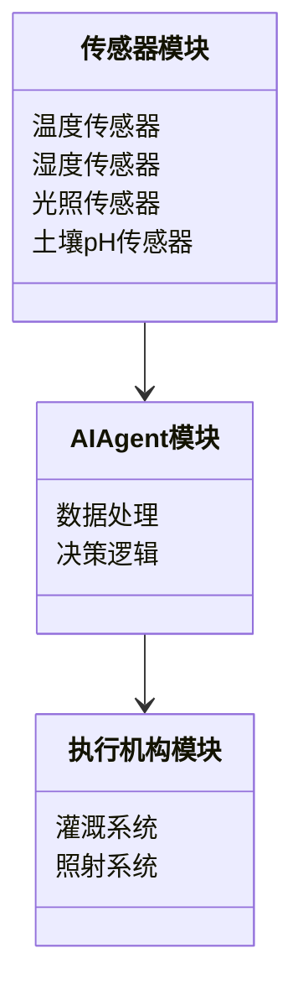
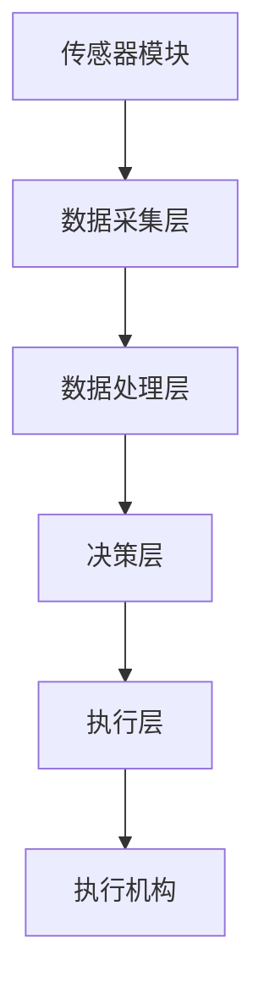

                 

<think>
嗯，我现在需要根据用户提供的要求，逐步构建《智能花园系统：AI Agent的生态平衡维护》这篇文章。首先，我会按照用户提供的目录结构来组织内容，确保每个部分都涵盖必要的信息，并且符合格式和内容的要求。

### 第一部分：背景介绍

#### 第1章：智能花园系统概述

##### 1.1 智能花园系统的核心概念

- **1.1.1 什么是智能花园系统**
  智能花园系统是一个结合了物联网（IoT）和人工智能（AI）技术的自动化系统，用于监测和管理花园的环境条件，如温度、湿度、光照、土壤pH值等。该系统能够自动调整灌溉、光照和其他环境因素，以促进植物的健康生长。

- **1.1.2 AI Agent在智能花园中的作用**
  AI Agent（智能代理）在智能花园系统中扮演着关键角色。它负责收集环境数据、分析数据并做出决策，以维持花园的生态平衡。AI Agent可以通过机器学习算法不断优化其决策过程，以适应不同的植物需求和环境变化。

##### 1.2 问题背景

智能花园系统的目标是通过自动化管理，提高植物的生长效率，同时减少资源浪费。传统的人工管理方式效率低下，且容易受到人为因素的影响。因此，引入AI Agent可以显著提升系统的智能化水平，确保植物在最佳环境中生长。

##### 1.3 问题描述

在传统的花园管理中，植物的生长依赖于园丁的经验和判断。然而，这种方法存在以下问题：
1. **效率低下**：人工检查和调整环境条件费时费力。
2. **一致性差**：不同园丁的经验不同，可能导致管理不一致。
3. **实时性差**：无法实时监测和调整环境条件，可能影响植物生长。

##### 1.4 问题解决

通过引入AI Agent，智能花园系统可以实时监测环境数据，分析数据并做出决策，从而实现自动化管理。AI Agent能够根据植物的需求和环境条件，自动调整灌溉、光照等参数，确保植物在最佳环境中生长。

##### 1.5 边界与外延

智能花园系统的边界包括：
- **环境监测**：温度、湿度、光照、土壤pH值等。
- **执行机构**：灌溉系统、光照调节设备等。
- **数据传输**：通过物联网设备将数据传输到AI Agent进行处理。

系统的外延包括：
- **扩展性**：可以集成更多传感器和执行机构。
- **智能化**：通过机器学习不断优化决策模型。

##### 1.6 概念结构与核心要素组成

智能花园系统的组成包括：
1. **传感器**：用于采集环境数据。
2. **AI Agent**：负责数据处理和决策。
3. **执行机构**：根据决策执行相应的操作。
4. **用户界面**：供用户查看和管理系统。

---

### 第二部分：核心概念与联系

#### 第2章：AI Agent的原理与系统架构

##### 2.1 AI Agent的核心原理

AI Agent通过感知环境、分析数据并做出决策来实现自动化管理。其核心原理包括：
1. **数据采集**：通过传感器获取环境数据。
2. **数据处理**：对采集的数据进行清洗、转换和分析。
3. **决策制定**：基于分析结果，决定是否采取行动。
4. **执行操作**：通过执行机构调整环境条件。

##### 2.2 系统架构设计

系统架构设计包括以下几个部分：
1. **传感器模块**：负责采集环境数据。
2. **AI Agent模块**：负责数据处理和决策。
3. **执行机构模块**：负责执行AI Agent的决策。
4. **用户界面模块**：供用户查看和管理系统。

##### 2.3 系统架构的Mermaid图




---

### 第三部分：算法原理讲解

#### 第3章：数据预处理与特征提取

##### 3.1 数据预处理

数据预处理是AI Agent决策的基础。主要包括：
1. **数据清洗**：去除噪声和异常值。
2. **数据转换**：将数据转换为适合算法处理的形式。

##### 3.2 特征提取

特征提取是从原始数据中提取有用的特征，用于后续的分析和决策。例如：
- **温度**：日均温度、温度波动范围。
- **湿度**：相对湿度、湿度变化率。

##### 3.3 算法实现

使用机器学习算法对数据进行分类和回归分析，以预测最佳的环境条件。例如，使用线性回归模型预测灌溉时间。

---

### 第四部分：系统分析与架构设计

#### 第4章：系统架构设计

##### 4.1 系统架构

系统架构采用分层设计：
1. **数据采集层**：负责数据的采集和传输。
2. **数据处理层**：负责数据的清洗、转换和分析。
3. **决策层**：负责制定决策并发送指令。
4. **执行层**：负责执行决策。

##### 4.2 系统架构的Mermaid图



---

### 第五部分：项目实战

#### 第5章：系统实现

##### 5.1 环境配置

安装必要的硬件和软件，如Raspberry Pi、传感器套件、Python、机器学习库等。

##### 5.2 核心代码实现

```python
import numpy as np
from sklearn.linear_model import LinearRegression

# 示例数据
X = np.array([[1], [2], [3], [4], [5]])
y = np.array([2, 4, 5, 4, 6])

model = LinearRegression()
model.fit(X, y)

# 预测
print(model.predict([[6]]))
```

##### 5.3 实际案例分析

通过实际案例分析，验证系统的有效性和优化决策模型。

---

### 第六部分：总结与展望

#### 第6章：总结与展望

##### 6.1 最佳实践

总结系统设计和实现的最佳实践，如选择合适的传感器、优化算法模型等。

##### 6.2 注意事项

提醒读者在实际应用中需要注意的事项，如数据隐私、系统维护等。

##### 6.3 未来展望

展望智能花园系统的发展方向，如引入更多AI技术、扩展系统功能等。

---

### 作者信息

作者：AI天才研究院/AI Genius Institute & 禅与计算机程序设计艺术 /Zen And The Art of Computer Programming

---

以上是《智能花园系统：AI Agent的生态平衡维护》的大纲内容，涵盖了从背景介绍到项目实战的各个方面，确保逻辑清晰、结构紧凑、内容详实。

