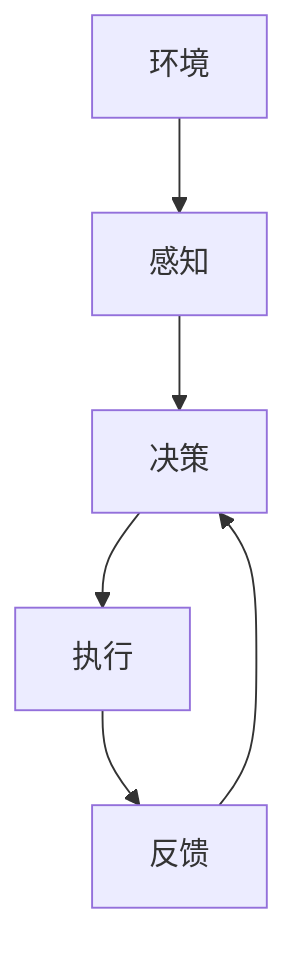
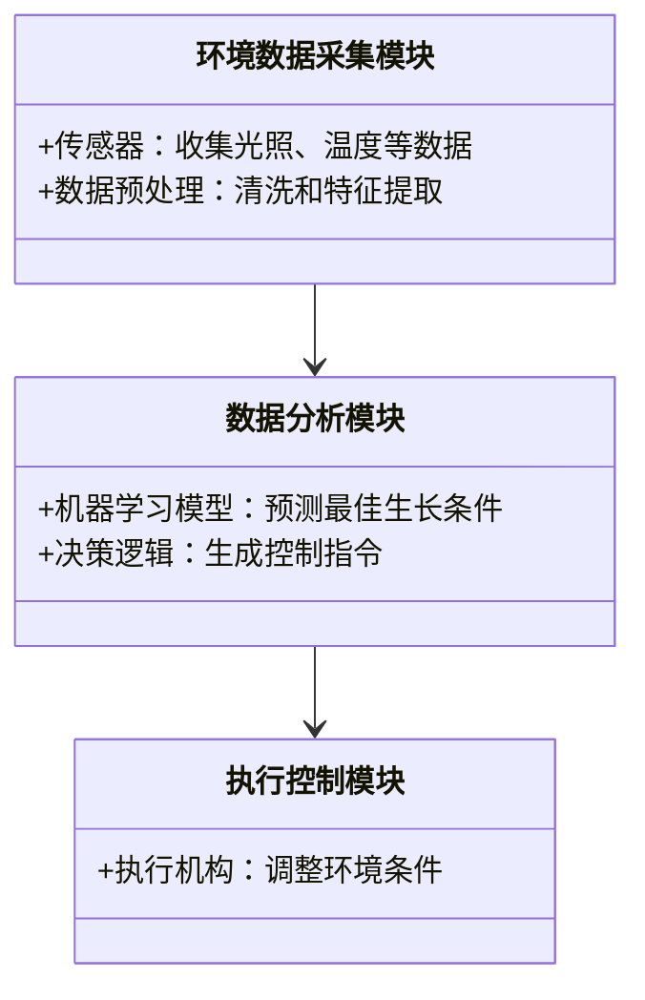

                 


# 智能花园：AI Agent的植物生长优化系统

> **关键词**：智能花园，AI Agent，植物生长优化，人工智能，农业技术，系统架构

> **摘要**：本文探讨了AI Agent在植物生长优化中的应用，通过详细分析系统的背景、核心概念、算法原理、系统架构及项目实战，展示了如何利用人工智能技术提升植物生长效率。文章结合理论与实践，为读者提供了从概念到实现的全面指导。

---

## 第1章：智能花园的背景与问题背景

### 1.1 智能花园的背景

#### 1.1.1 智能农业的发展趋势
智能农业是现代农业的重要组成部分，AI技术的应用使其成为可能。通过AI Agent优化植物生长，可以实现精准农业，提高产量和质量。

#### 1.1.2 智能花园的定义与特点
智能花园是一个集成AI Agent的系统，能够实时监测植物生长环境，并自动调整光照、温度等条件，实现高效种植。

#### 1.1.3 AI Agent在植物生长优化中的作用
AI Agent通过数据采集、分析和决策，优化植物生长条件，减少资源浪费，提高产量。

### 1.2 植物生长优化的挑战

#### 1.2.1 植物生长的复杂性
植物生长受多种环境因素影响，传统种植方法难以精确控制。

#### 1.2.2 传统种植方法的局限性
资源浪费、效率低下、难以应对环境变化等问题限制了传统种植的发展。

#### 1.2.3 AI技术如何解决这些问题
AI Agent通过实时监测和智能决策，解决了传统种植的局限性，提高了种植效率。

### 1.3 智能花园的目标与应用场景

#### 1.3.1 智能花园的目标
优化植物生长条件，提高产量和质量，降低资源消耗。

#### 1.3.2 智能花园的应用场景
家庭种植、农业大棚、垂直 farming 等场景均可应用智能花园系统。

#### 1.3.3 智能花园的边界与外延
系统的边界包括硬件设备和AI算法，外延则扩展到农业生态系统的其他部分。

---

## 第2章：AI Agent的基本原理

### 2.1 AI Agent的定义与核心要素

#### 2.1.1 AI Agent的定义
AI Agent是一个智能实体，能够感知环境并采取行动以实现目标。

#### 2.1.2 AI Agent的核心要素
- **感知**：通过传感器收集环境数据。
- **决策**：基于数据进行分析和决策。
- **执行**：通过执行机构调整环境条件。

#### 2.1.3 AI Agent与传统自动化的区别
AI Agent具备学习和自适应能力，能够根据环境变化优化决策。

### 2.2 智能花园中的AI Agent系统架构

#### 2.2.1 系统的整体架构
智能花园系统包括传感器模块、AI处理模块和执行模块。

#### 2.2.2 各模块的功能与交互
传感器模块收集数据，AI处理模块分析数据并生成决策，执行模块根据决策调整环境条件。

#### 2.2.3 系统的可扩展性与灵活性
系统架构设计使得各模块可独立升级，支持未来的扩展需求。

---

## 第3章：AI Agent的算法原理

### 3.1 强化学习在AI Agent中的应用

#### 3.1.1 强化学习的基本概念
强化学习是一种通过试错学习的方法，通过奖励机制优化决策策略。

#### 3.1.2 强化学习在植物生长优化中的应用
AI Agent通过强化学习优化光照和温度等条件，提高植物生长效率。

#### 3.1.3 强化学习算法流程图（Mermaid）


### 3.2 机器学习模型的构建与训练

#### 3.2.1 数据预处理与特征提取
对收集的数据进行清洗和特征提取，为模型训练做好准备。

#### 3.2.2 模型的选择与训练
选择适合的机器学习模型，并进行训练，确保模型具有较高的预测精度。

#### 3.2.3 模型的评估与优化
通过交叉验证评估模型性能，并进行参数调整以优化模型。

### 3.3 算法实现的数学模型

#### 3.3.1 损失函数的定义与计算
损失函数用于衡量模型预测值与真实值的差异，常用均方误差（MSE）：
$$MSE = \frac{1}{n}\sum_{i=1}^{n}(y_i - \hat{y}_i)^2$$

#### 3.3.2 优化算法的选择与实现
选择Adam优化算法，结合学习率调整，优化模型参数。

#### 3.3.3 算法的数学推导与举例
以线性回归为例，损失函数为：
$$L = (y - wx)^2$$
通过求导找到最优权重w：
$$\frac{dL}{dw} = 2(wx - y)x = 0$$
解得：
$$w = \frac{y}{x}$$

---

## 第4章：系统分析与架构设计

### 4.1 系统的功能设计

#### 4.1.1 系统的功能模块划分
- 数据采集模块：收集环境数据。
- 数据分析模块：分析数据并生成决策。
- 执行控制模块：根据决策调整环境条件。

#### 4.1.2 系统的领域模型（Mermaid类图）


### 4.2 系统的架构设计

#### 4.2.1 系统的分层架构
- **数据层**：存储和管理环境数据。
- **业务逻辑层**：处理数据并生成决策。
- **表现层**：用户界面展示数据和控制状态。

#### 4.2.2 系统的架构图（Mermaid）


---

## 第5章：项目实战

### 5.1 环境安装与配置

#### 5.1.1 安装Python环境
安装Python 3.8及以上版本，建议使用Anaconda。

#### 5.1.2 安装依赖库
安装numpy、pandas、scikit-learn、tensorflow等库：
```bash
pip install numpy pandas scikit-learn tensorflow
```

### 5.2 核心代码实现

#### 5.2.1 数据采集模块
```python
import numpy as np
import pandas as pd

# 示例数据
data = {
    'temperature': [25, 26, 24, 25.5, 26.2],
    'humidity': [60, 65, 58, 62, 67],
    'light': [700, 720, 680, 710, 730]
}
df = pd.DataFrame(data)
```

#### 5.2.2 数据分析模块
```python
from sklearn.model import LinearRegression

model = LinearRegression()
model.fit(df[['temperature', 'humidity']], df['light'])
```

#### 5.2.3 执行控制模块
```python
def adjust_light(intensity):
    if intensity > 700:
        return 'increase fan speed'
    elif intensity < 600:
        return 'decrease fan speed'
    else:
        return 'no change'
```

### 5.3 实际案例分析

#### 5.3.1 数据分析与模型训练
使用实际环境数据训练模型，确保模型具有较高的预测精度。

#### 5.3.2 系统测试与优化
通过实际测试调整模型参数，优化系统性能。

### 5.4 项目小结

---

## 第6章：总结与展望

### 6.1 最佳实践 tips
- 定期校准传感器，确保数据准确性。
- 及时更新模型，适应环境变化。

### 6.2 小结
AI Agent在智能花园中的应用显著提高了植物生长效率，为现代农业提供了新的可能性。

### 6.3 注意事项
- 确保系统数据安全，防止数据泄露。
- 定期维护硬件设备，确保系统稳定运行。

### 6.4 拓展阅读
建议读者深入学习强化学习和机器学习的相关知识，进一步探索AI在农业中的应用。

---

**作者：AI天才研究院 & 禅与计算机程序设计艺术**

