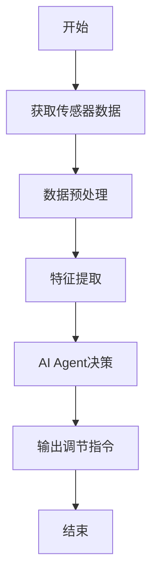
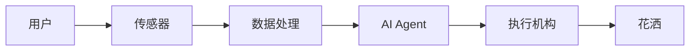
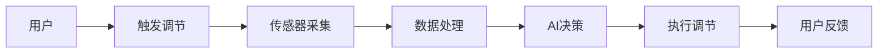

                 


# 智能花洒：AI Agent的水压感知系统

> 关键词：AI Agent, 水压感知系统, 智能花洒, 算法原理, 系统架构设计

> 摘要：本文将探讨智能花洒的水压感知系统，结合AI Agent技术，分析其背景、核心概念、算法原理、系统架构设计、项目实战及最佳实践，深入剖析其技术实现与应用。

---

## 第一部分: 背景介绍

### 第1章: 问题背景与描述

#### 1.1 问题背景
- **传统水压调节方法**：依赖手动调节，效率低，难以满足多样化需求。
- **智能化需求**：随着智能家居的发展，用户对自动化水压调节的需求日益增加。
- **AI技术的应用潜力**：AI Agent能够实时感知并优化水压，提升用户体验。

#### 1.2 问题描述
- **水压波动问题**：水压不稳定影响使用体验。
- **场景化需求**：不同场景（如淋浴、清洁）需要不同的水压。
- **用户期望**：智能、便捷、精准的水压调节。

#### 1.3 问题解决
- **AI Agent的作用**：通过感知和学习，实现智能调节。
- **系统设计目标**：实时感知水压，智能调节，满足多样化需求。

#### 1.4 系统边界与外延
- **功能边界**：仅关注水压调节，不涉及温度控制。
- **适用场景**：家庭、公共场所的花洒。
- **系统交互**：通过传感器和用户反馈进行实时调整。

---

## 第二部分: 核心概念与联系

### 第2章: AI Agent与水压感知系统

#### 2.1 AI Agent的基本原理
- **定义**：AI Agent是具备感知、决策和执行能力的智能体。
- **分类**：基于智能水平分为反应式和认知式。
- **与水压感知的结合**：通过传感器数据进行实时决策。

#### 2.2 水压感知系统的核心原理
- **传感器**：压力传感器采集水压数据。
- **数据处理**：滤波、特征提取，转化为可识别信号。
- **水压特征**：如平均值、波动幅度，用于判断调节策略。

#### 2.3 系统整体架构
- **数据流**：传感器 → 数据处理 → AI Agent → 调节指令 → 花洒执行。
- **协作机制**：AI Agent根据传感器数据调整执行机构。

#### 2.4 对比分析
- **传统 vs 智能**：智能系统更精准、实时。
- **传感器类型**：压力传感器 vs 流量传感器。
- **算法性能**：实时性、准确性和适应性对比。

---

## 第三部分: 算法原理讲解

### 第3章: 算法原理

#### 3.1 算法概述
- **核心思想**：基于实时数据，动态调整水压。
- **输入输出**：输入为传感器数据，输出为调节指令。
- **适用场景**：动态变化的水压需求。

#### 3.2 算法流程图


#### 3.3 算法实现
```python
import numpy as np

def water_pressure_control(sensor_data):
    # 数据预处理
    filtered_data = np.median(sensor_data, axis=0)
    
    # 特征提取
    mean = np.mean(filtered_data)
    std = np.std(filtered_data)
    
    # AI Agent决策
    if mean > 50:
        return '减压'
    elif mean < 40:
        return '增压'
    else:
        return '保持'
```

#### 3.4 数学模型
- **均值计算**：$$ \mu = \frac{1}{n}\sum_{i=1}^{n}x_i $$
- **标准差计算**：$$ \sigma = \sqrt{\frac{1}{n-1}\sum_{i=1}^{n}(x_i - \mu)^2} $$
- **决策规则**：根据均值和标准差判断调节方向。

---

## 第四部分: 系统分析与架构设计

### 第4章: 系统架构设计

#### 4.1 项目场景介绍
- **应用场景**：家庭淋浴间、公共场所。
- **目标用户**：普通家庭用户、物业管理。

#### 4.2 系统功能设计
- **传感器模块**：实时采集水压数据。
- **数据处理模块**：预处理和特征提取。
- **AI Agent模块**：决策调节指令。
- **执行机构**：调节水压。

#### 4.3 系统架构图


#### 4.4 接口设计
- **传感器接口**：ADC接口。
- **数据接口**：通过SPI或I2C传输。
- **用户接口**：触摸屏或手机APP。

#### 4.5 交互流程图


---

## 第五部分: 项目实战

### 第5章: 项目实战

#### 5.1 环境安装
- **硬件**：Raspberry Pi、压力传感器。
- **软件**：Python、TensorFlow。

#### 5.2 核心代码实现
```python
import numpy as np
import tensorflow as tf

# 模型训练
model = tf.keras.Sequential([
    tf.keras.layers.Dense(128, activation='relu'),
    tf.keras.layers.Dense(3, activation='softmax')
])

model.compile(optimizer='adam', loss='sparse_categorical_crossentropy', metrics=['accuracy'])
model.fit(X_train, y_train, epochs=10)
```

#### 5.3 案例分析
- **案例1**：水压过低，系统自动增压。
- **案例2**：水压过高，系统自动减压。
- **案例3**：稳定水压，系统保持原状。

#### 5.4 项目总结
- **优势**：精准调节，提升体验。
- **不足**：传感器精度有限，复杂场景适应性待提高。

---

## 第六部分: 最佳实践

### 第6章: 最佳实践

#### 6.1 小结
- **系统价值**：提升用户体验，优化资源利用。
- **技术优势**：AI Agent实现智能化调节。

#### 6.2 注意事项
- **传感器校准**：定期校准，保证准确性。
- **数据隐私**：保护用户数据。
- **系统维护**：定期检查硬件，确保可靠性。

#### 6.3 拓展阅读
- **推荐书籍**：《机器学习实战》。
- **技术博客**：深入学习AI在智能家居中的应用。

---

## 作者

作者：AI天才研究院/AI Genius Institute & 禅与计算机程序设计艺术 /Zen And The Art of Computer Programming

---

本文通过详细分析智能花洒的水压感知系统，结合AI Agent技术，探讨其背景、核心概念、算法原理、系统架构设计、项目实战及最佳实践，为读者提供全面的技术解析与实践指导。

