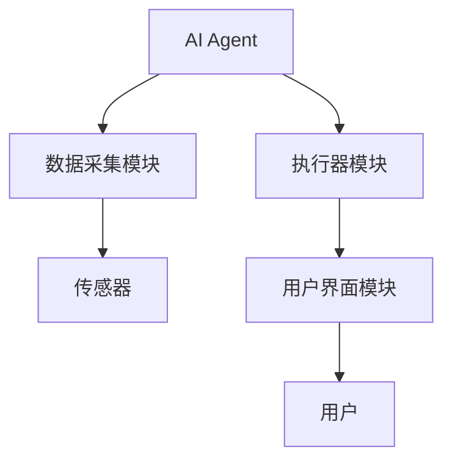
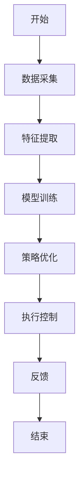
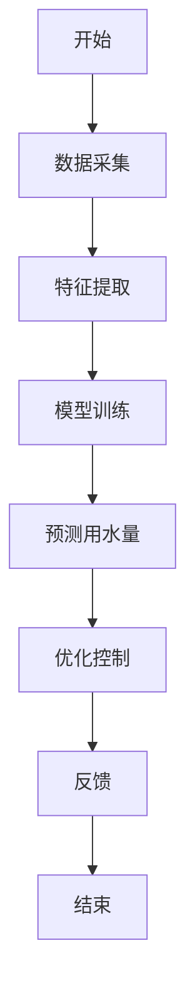
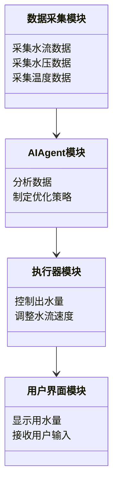
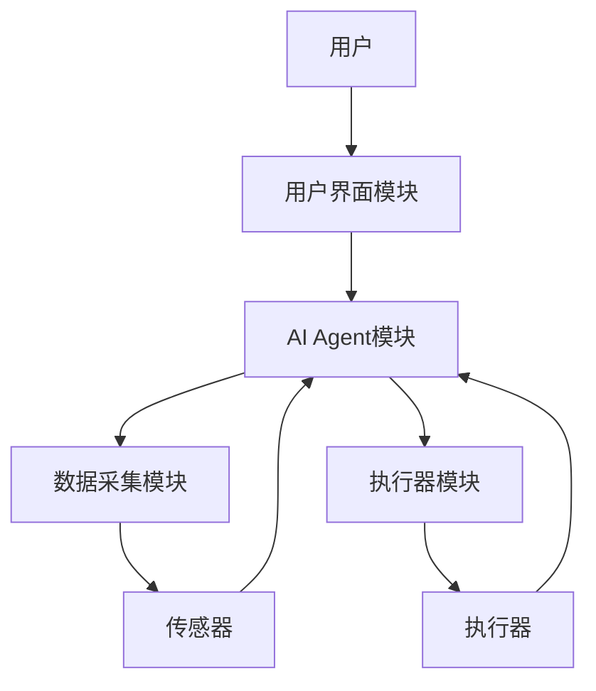
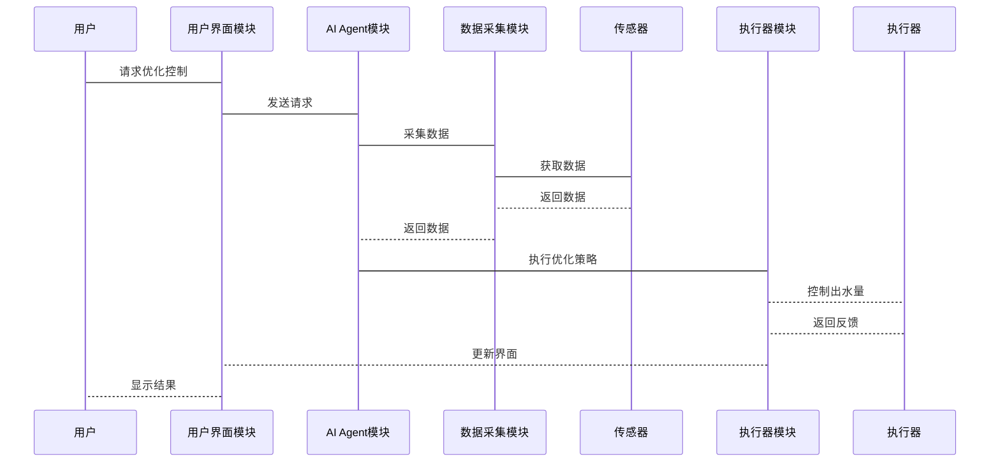

                 

<think>
嗯，用户希望我写一篇关于《智能花洒：AI Agent的用水量优化控制》的技术博客文章。看起来这是一个结合物联网和人工智能的项目，目标是优化用水量。首先，我需要理解这个主题的核心是什么。智能花洒如何利用AI Agent来优化用水量呢？

首先，我应该从背景介绍开始。水资源浪费是一个全球性的问题，尤其是在家庭用水中，花洒的使用占据了相当大的比例。传统的花洒无法根据实际需求调整出水量，导致浪费。AI Agent可以通过实时数据采集和分析，优化出水控制，从而节省水资源。

接下来，我需要定义AI Agent在智能花洒中的具体作用。AI Agent应该能够实时采集花洒的使用数据，比如用水量、水流速度、使用时间等，然后结合环境数据（如天气、用户行为模式）进行分析，制定最优的用水策略。

然后，我需要考虑AI Agent的工作流程。它可能需要与多种传感器和执行器进行交互，比如水流传感器、温度传感器、湿度传感器等。数据采集后，AI Agent会通过机器学习算法进行分析，优化出水控制策略，并通过反馈机制不断调整以达到最佳效果。

在数学模型方面，我需要建立优化目标和约束条件。比如，优化目标可能是最小化用水量，同时满足用户的实际需求。约束条件可能包括水流速度限制、用水时间限制等。我可以使用强化学习算法来训练AI Agent，使其能够在不同场景下做出最优决策。

系统架构设计也是一个关键部分。智能花洒系统可能包括感知层、传输层和应用层。感知层负责采集数据，传输层负责数据的传输和处理，应用层则负责优化算法的执行和控制。我需要绘制一个系统的架构图，展示各层之间的关系和功能。

项目实战部分，我需要详细说明如何安装环境、编写代码实现优化控制。代码部分需要包含数据采集、模型训练、控制策略实现等模块。我还需要解读代码，说明每个部分的功能，并通过实际案例分析优化效果。

最后，我需要总结整个项目，提出一些最佳实践和注意事项，比如数据隐私保护、传感器精度选择等。同时，建议读者进一步阅读相关文献，深入理解AI在智能设备中的应用。

总的来说，我需要确保文章结构清晰，逻辑严密，从理论到实践逐步展开，帮助读者全面理解智能花洒中AI Agent的优化控制机制。同时，使用图表和代码示例来增强文章的可读性和实用性。
</think>

# 智能花洒：AI Agent的用水量优化控制

**关键词**：智能花洒，AI Agent，用水优化，强化学习，物联网，数学模型

**摘要**：本文详细探讨了智能花洒中AI Agent的应用，从背景介绍到系统架构设计，从算法原理到项目实战，全面分析了AI Agent如何实现用水量的优化控制。文章通过理论与实践结合的方式，展示了如何利用AI技术提升智能花洒的效率和用户体验，同时为类似项目提供了可参考的架构和实现思路。

---

# 第1章: 智能花洒与AI Agent概述

## 1.1 问题背景与描述

### 1.1.1 水资源浪费的现状
水资源是地球上最宝贵的资源之一，但全球范围内水资源的浪费问题日益严重。家庭用水中，花洒的使用占据了相当大的比例。传统花洒无法根据实际需求调整出水量，导致水资源浪费。

### 1.1.2 花洒在用水优化中的关键作用
花洒是家庭用水的重要组成部分，优化花洒的用水量可以有效减少水资源浪费。通过智能控制花洒的出水量和使用时间，可以在不影响用户体验的前提下，显著降低用水量。

### 1.1.3 AI技术在智能花洒中的应用潜力
AI技术可以实时采集和分析花洒的使用数据，结合环境数据（如天气、用户行为模式）进行预测和优化，从而实现智能控制。

## 1.2 问题解决思路

### 1.2.1 用水优化的核心目标
优化的核心目标是在满足用户需求的前提下，最大限度地减少用水量。这需要AI Agent能够实时调整花洒的出水量和使用时间。

### 1.2.2 AI Agent在智能花洒中的角色
AI Agent作为智能花洒的核心控制模块，负责数据采集、分析、决策和执行。它能够根据实时数据和历史数据，优化出水控制策略。

### 1.2.3 多场景下的优化策略
AI Agent需要在多种场景下进行优化，例如根据天气调整出水量（如雨天减少出水量），根据用户行为模式调整出水时间（如高峰时段减少用水）。

## 1.3 问题的边界与外延

### 1.3.1 智能花洒的使用场景分析
智能花洒主要应用于家庭浴室，但也可能扩展到公共场所和工业用水场景。

### 1.3.2 边界条件与限制因素
智能花洒的优化控制需要考虑的因素包括水流速度、水压、温度、用户需求等。这些因素可能会影响AI Agent的决策。

### 1.3.3 与其他智能设备的协同优化
智能花洒可以与其他智能家居设备协同工作，例如与智能水表联动，实时监测用水量并进行优化控制。

## 1.4 概念结构与核心要素

### 1.4.1 核心概念的组成要素
智能花洒系统由AI Agent、传感器、执行器和用户界面组成。AI Agent负责数据处理和决策，传感器负责采集数据，执行器负责执行决策，用户界面负责与用户交互。

### 1.4.2 系统架构的核心要素对比
与传统花洒相比，智能花洒的核心要素包括AI Agent、传感器和执行器。传统花洒只有机械结构，无法进行智能优化。

### 1.4.3 优化目标与实现路径
优化目标是实现用水量最小化，同时满足用户需求。实现路径包括数据采集、模型训练、决策优化和实时反馈。

## 1.5 本章小结
本章介绍了智能花洒与AI Agent的基本概念和作用，分析了优化的目标和实现路径，为后续章节的详细分析奠定了基础。

---

# 第2章: AI Agent与智能花洒的核心概念

## 2.1 AI Agent的基本原理

### 2.1.1 AI Agent的定义与特征
AI Agent是一种能够感知环境、自主决策并执行任务的智能实体。它具有自主性、反应性、目标导向和社交能力等特征。

### 2.1.2 AI Agent的分类与应用场景
AI Agent可以分为简单反射型、基于模型的反应型、目标驱动型和效用驱动型。在智能花洒中，AI Agent主要用于实时数据处理和优化控制。

### 2.1.3 AI Agent在智能花洒中的具体实现
在智能花洒中，AI Agent通过传感器采集数据，结合历史数据和环境数据，优化出水控制策略。

## 2.2 智能花洒的系统架构

### 2.2.1 系统的核心功能模块
智能花洒系统包括数据采集模块、AI Agent模块、执行器模块和用户界面模块。

### 2.2.2 各模块之间的关系与协作
数据采集模块负责采集水流、水压、温度等数据，AI Agent模块负责分析数据并制定优化策略，执行器模块负责执行决策，用户界面模块负责与用户交互。

### 2.2.3 系统的输入输出接口设计
输入接口包括传感器数据和用户输入，输出接口包括执行器控制信号和用户反馈。

## 2.3 核心概念的对比分析

### 2.3.1 AI Agent与传统自动控制系统的区别
AI Agent具有学习和优化能力，能够根据实时数据动态调整控制策略，而传统控制系统只能根据预设规则进行控制。

### 2.3.2 智能花洒与普通花洒的功能对比
智能花洒具有AI优化功能，能够实时调整出水量和使用时间，而普通花洒只能根据固定设置进行控制。

### 2.3.3 用水优化与能源优化的关联性分析
用水优化和能源优化密切相关，优化用水量可以减少能源消耗，例如减少水加热的能量消耗。

## 2.4 ER实体关系图与系统架构图

### 2.4.1 ER实体关系图
```mermaid
er
actor(AI Agent, 智能花洒, 用户)
rectangle(系统, 智能花洒, 用水优化算法)
```

### 2.4.2 系统架构图


## 2.5 本章小结
本章详细介绍了AI Agent的基本原理和智能花洒的系统架构，通过对比分析和实体关系图，展示了智能花洒的核心概念和实现路径。

---

# 第3章: AI Agent的优化算法

## 3.1 算法概述

### 3.1.1 基于强化学习的优化算法
强化学习是一种通过试错方式优化决策的算法。在智能花洒中，AI Agent可以通过强化学习优化出水控制策略。

### 3.1.2 基于监督学习的优化算法
监督学习是一种通过标签数据训练模型的算法。在智能花洒中，AI Agent可以通过监督学习预测用水量并优化控制策略。

### 3.1.3 混合优化算法的实现思路
混合优化算法结合了强化学习和监督学习的优点，可以在复杂场景下实现更优的优化效果。

## 3.2 算法流程图

### 3.2.1 强化学习算法流程图


### 3.2.2 监督学习算法流程图


## 3.3 数学模型

### 3.3.1 优化目标
$$ \text{最小化} \quad \sum_{t=1}^{T} w_t $$
$$ \text{约束条件} \quad 0 \leq w_t \leq W_t $$
其中，$w_t$ 表示第 $t$ 时刻的出水量，$W_t$ 表示第 $t$ 时刻的最大允许出水量。

### 3.3.2 强化学习的奖励函数
$$ R = r_1 + r_2 + \cdots + r_T $$
其中，$r_t$ 表示第 $t$ 时刻的奖励，$r_t = \text{节约水量} - \text{用水成本} $。

### 3.3.3 监督学习的损失函数
$$ L = \frac{1}{N} \sum_{i=1}^{N} (y_i - \hat{y}_i)^2 $$
其中，$y_i$ 表示实际用水量，$\hat{y}_i$ 表示预测用水量，$N$ 表示样本数量。

## 3.4 本章小结
本章详细介绍了AI Agent的优化算法，包括强化学习和监督学习的实现思路，并通过流程图和数学模型展示了算法的具体实现。

---

# 第4章: 系统分析与架构设计方案

## 4.1 问题场景介绍
智能花洒的优化控制需要考虑多种场景，例如不同用户的行为模式、天气变化、用水高峰期等。

## 4.2 项目介绍

### 4.2.1 系统功能设计
系统功能包括数据采集、优化控制、用户交互和反馈机制。

### 4.2.2 领域模型类图


### 4.2.3 系统架构设计


### 4.2.4 系统接口设计
系统接口包括传感器接口、执行器接口和用户界面接口。传感器接口负责数据采集，执行器接口负责控制出水量，用户界面接口负责与用户交互。

### 4.2.5 系统交互序列图


## 4.3 本章小结
本章详细介绍了智能花洒系统的架构设计和接口设计，并通过类图和序列图展示了系统的实现思路。

---

# 第5章: 项目实战

## 5.1 环境安装

### 5.1.1 硬件环境
需要安装智能花洒、传感器、执行器和用户界面模块。传感器可以使用水流传感器、水压传感器和温度传感器。

### 5.1.2 软件环境
需要安装AI Agent模块，可以选择Python作为开发语言，使用深度学习框架如TensorFlow或PyTorch进行模型训练。

### 5.1.3 开发工具
推荐使用Jupyter Notebook进行算法开发和调试，使用Git进行版本控制。

## 5.2 系统核心实现

### 5.2.1 数据采集模块
代码实现：
```python
def采集数据():
    # 采集水流数据
    水流数据 = 传感器.获取水流数据()
    # 采集水压数据
    水压数据 = 传感器.获取水压数据()
    # 采集温度数据
    温度数据 = 传感器.获取温度数据()
    return 水流数据, 水压数据, 温度数据
```

### 5.2.2 AI Agent模块
代码实现：
```python
class AI Agent:
    def __init__(self):
        self.模型 = 加载训练好的模型()
    
    def 优化控制(self, 数据):
        # 数据包括水流数据、水压数据、温度数据
        预测结果 = self.模型.预测(数据)
        return 预测结果
```

### 5.2.3 执行器模块
代码实现：
```python
class 执行器:
    def __init__(self):
        self.出水量 = 0
    
    def 控制出水量(self, 目标出水量):
        self.出水量 = 目标出水量
        return self.出水量
```

### 5.2.4 用户界面模块
代码实现：
```python
class 用户界面:
    def __init__(self):
        self.显示界面()
    
    def 更新界面(self, 数据):
        # 更新用水量显示
        self.显示用水量(数据)
```

## 5.3 代码应用解读与分析

### 5.3.1 数据采集模块
数据采集模块负责采集水流、水压和温度数据，并将其传递给AI Agent模块进行分析。

### 5.3.2 AI Agent模块
AI Agent模块使用训练好的模型对数据进行分析，制定优化策略，并将结果传递给执行器模块。

### 5.3.3 执行器模块
执行器模块根据AI Agent的决策控制出水量和水流速度。

### 5.3.4 用户界面模块
用户界面模块负责与用户交互，显示优化结果和用户反馈。

## 5.4 实际案例分析

### 5.4.1 案例描述
假设在某一天，用户在早晨使用花洒淋浴。AI Agent通过传感器采集到水流数据、水压数据和温度数据，结合历史数据和天气预报，优化出水控制策略。

### 5.4.2 模型训练与优化
通过强化学习算法，AI Agent不断优化出水控制策略，使得用水量最小化，同时满足用户的淋浴需求。

## 5.5 本章小结
本章通过实际案例分析，展示了智能花洒系统的实现过程，从数据采集到模型训练，再到优化控制，详细解读了系统的实现细节。

---

# 第6章: 最佳实践与总结

## 6.1 最佳实践

### 6.1.1 数据采集的准确性
传感器的选择和校准对数据采集的准确性至关重要。建议选择高精度的传感器，并定期校准。

### 6.1.2 模型训练的稳定性
模型训练需要大量的数据和计算资源，建议使用云平台进行训练，并采用数据增强技术提高模型的泛化能力。

### 6.1.3 系统的可扩展性
系统设计时应考虑扩展性，例如增加新的传感器或优化算法时，能够方便地进行模块化扩展。

## 6.2 小结
智能花洒通过AI Agent的优化控制，可以在不影响用户体验的前提下，显著减少用水量。本文通过理论与实践结合的方式，详细介绍了智能花洒的实现过程，展示了AI技术在智能设备中的广泛应用。

## 6.3 注意事项

### 6.3.1 数据隐私保护
智能花洒系统可能需要采集用户的使用数据，需要注意数据隐私保护，遵守相关法律法规。

### 6.3.2 系统的安全性
系统设计时应考虑安全性，防止恶意攻击和数据泄露。

### 6.3.3 系统的可维护性
系统设计时应考虑可维护性，方便后续的升级和维护。

## 6.4 拓展阅读

### 6.4.1 强化学习在智能设备中的应用
建议读者阅读《强化学习：理论与应用》等相关书籍，深入了解强化学习在智能设备中的应用。

### 6.4.2 智能家居系统的设计与实现
建议读者阅读《智能家居系统设计与实现》等相关书籍，了解智能家居系统的设计与实现。

---

# 作者：AI天才研究院/AI Genius Institute & 禅与计算机程序设计艺术 /Zen And The Art of Computer Programming

---

以上是《智能花洒：AI Agent的用水量优化控制》的技术博客文章的完整内容，涵盖了从背景介绍到系统设计，再到项目实战的各个方面，帮助读者全面理解智能花洒中AI Agent的优化控制机制。

