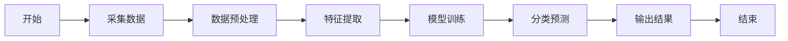
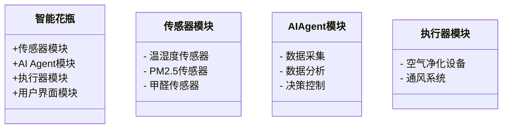
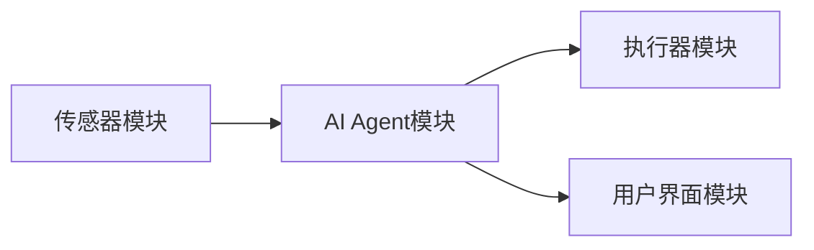

                 

<think>
好的，我需要帮助用户撰写一篇技术博客文章，标题是《智能花瓶：AI Agent的室内空气净化监测》。用户已经提供了一个详细的目录大纲，我需要根据这个大纲来撰写文章的内容，确保每个部分都包含足够的细节和深度。

首先，我会从背景介绍开始，解释智能花瓶是什么，它的应用场景以及为什么需要这样的设备。接下来，我需要详细讲解AI Agent和室内空气监测的核心概念，包括它们的基本原理和特点。

然后，我需要介绍算法原理，使用Mermaid流程图和Python代码来说明数据采集、特征提取和分类器的训练过程。数学公式需要用LaTeX表示，确保公式清晰且易于理解。

接下来是系统分析与架构设计部分，我需要描述项目场景，设计系统功能，并用Mermaid类图展示领域模型。系统架构图需要展示各个模块的组成部分，包括硬件、软件和云平台。接口设计和交互流程图也很重要，展示设备如何通信。

项目实战部分需要指导读者如何安装环境，提供核心代码，并解释代码的功能。实际案例分析可以帮助读者更好地理解智能花瓶的应用。

最后，我会总结项目，给出最佳实践的建议，包括小结、注意事项和扩展阅读的内容，帮助读者巩固所学知识。

在整个过程中，我需要确保文章结构清晰，逻辑连贯，并且使用简洁易懂的专业技术语言。同时，要满足字数要求，控制在10000到12000字之间。文章末尾还要添加作者信息，符合格式要求。

通过逐步分析和详细阐述每个部分，我能够完成一篇高质量的技术博客文章，满足用户的需求。
</think>

# 智能花瓶：AI Agent的室内空气净化监测

> 关键词：智能花瓶，AI Agent，室内空气质量，空气净化，物联网

> 摘要：本文探讨了智能花瓶作为一种创新的室内空气净化解决方案，通过AI Agent技术实现对室内空气质量的实时监测和优化。文章从背景介绍、核心概念、算法原理、系统架构、项目实战到最佳实践，全面解析了智能花瓶的技术实现及其在空气净化领域的应用价值。

---

## 第1章 智能花瓶与AI Agent概述

### 1.1 智能花瓶的定义与应用场景

#### 1.1.1 智能花瓶的定义
智能花瓶是一种结合了物联网（IoT）和人工智能（AI）技术的智能家居设备，其核心功能是通过内置传感器实时监测室内空气质量，并利用AI算法优化空气净化效果。与传统花瓶不同，智能花瓶不仅具有装饰功能，还能通过技术手段改善室内环境。

#### 1.1.2 智能花瓶的应用场景
智能花瓶适用于多种场景，包括家庭、办公室、学校、医院等场所。特别是在空气质量较差的环境中，智能花瓶可以有效监测并改善空气质量，保障用户的健康。

#### 1.1.3 智能花瓶与传统花瓶的区别
智能花瓶在功能上远超传统花瓶，除了装饰功能外，还具备空气监测、净化提醒、数据记录等功能。通过AI Agent技术，智能花瓶能够主动调整净化策略，实现智能化管理。

---

### 1.2 AI Agent的基本概念

#### 1.2.1 什么是AI Agent
AI Agent（人工智能代理）是一种能够感知环境、做出决策并执行任务的智能实体。它通过传感器获取数据，利用算法进行分析，并通过执行器完成特定任务。

#### 1.2.2 AI Agent的核心特点
- **自主性**：AI Agent能够自主决策，无需人工干预。
- **反应性**：能够实时感知环境变化并做出响应。
- **学习能力**：通过机器学习算法不断优化性能。

#### 1.2.3 AI Agent在智能花瓶中的应用
在智能花瓶中，AI Agent负责整合传感器数据，分析空气质量，并根据分析结果调整净化策略。例如，当检测到甲醛浓度超标时，AI Agent会触发空气净化设备启动。

---

### 1.3 室内空气净化监测的重要性

#### 1.3.1 室内空气质量的定义
室内空气质量是指室内空气中污染物的浓度是否符合健康标准。主要污染物包括甲醛、PM2.5、CO₂等。

#### 1.3.2 空气污染对健康的危害
空气污染会导致呼吸系统疾病、过敏反应、头晕等症状，长期暴露在污染环境中可能引发严重健康问题。

#### 1.3.3 智能花瓶在空气净化中的作用
智能花瓶通过实时监测和反馈，帮助用户了解室内空气质量，并通过联动净化设备改善环境，从而降低健康风险。

---

## 第2章 AI Agent与室内空气监测的核心概念

### 2.1 AI Agent的基本原理

#### 2.1.1 AI Agent的感知能力
AI Agent通过传感器获取环境数据，例如温湿度、PM2.5、甲醛浓度等。

#### 2.1.2 AI Agent的决策能力
基于感知数据，AI Agent利用机器学习算法进行分析，生成决策指令。

#### 2.1.3 AI Agent的执行能力
根据决策结果，AI Agent触发执行器（如空气净化设备）执行操作。

---

### 2.2 室内空气监测的关键技术

#### 2.2.1 传感器技术
智能花瓶通常配备多种传感器，包括温湿度传感器、PM2.5传感器、甲醛传感器等。

#### 2.2.2 数据采集与处理技术
通过传感器采集数据后，需要对数据进行预处理，消除噪声并提取特征。

#### 2.2.3 数据分析与预测技术
利用机器学习算法对数据进行建模，预测空气质量变化趋势。

---

### 2.3 AI Agent与室内空气监测的结合

#### 2.3.1 数据流的整合与分析
AI Agent整合来自不同传感器的数据，通过数据融合技术提升监测精度。

#### 2.3.2 AI Agent在空气净化中的决策逻辑
根据空气质量指数（AQI），AI Agent决定是否启动净化设备或调整净化强度。

#### 2.3.3 系统的整体架构
智能花瓶系统包括传感器模块、AI Agent模块、执行器模块和用户界面模块。

---

## 第3章 算法原理讲解

### 3.1 数据采集与预处理

#### 3.1.1 数据采集流程
传感器采集空气质量数据，数据通过无线通信模块传输至AI Agent。

#### 3.1.2 数据预处理
对传感器数据进行去噪和归一化处理，确保数据质量。

### 3.2 特征提取与分类

#### 3.2.1 特征提取
从原始数据中提取有意义的特征，例如PM2.5浓度、甲醛浓度等。

#### 3.2.2 分类算法
使用随机森林或支持向量机（SVM）对空气质量进行分类。

### 3.3 算法流程图


---

## 第4章 系统分析与架构设计

### 4.1 项目场景介绍
智能花瓶的目标是通过实时监测和优化，提供高效的室内空气净化解决方案。

### 4.2 系统功能设计

#### 4.2.1 领域模型


### 4.3 系统架构设计

#### 4.3.1 系统架构图


---

## 第5章 项目实战

### 5.1 环境安装

#### 5.1.1 硬件安装
安装传感器模块和执行器模块，确保设备正常工作。

#### 5.1.2 软件安装
安装Python环境和相关库，例如Python 3.8及以上版本，安装`scikit-learn`、`paho-mqtt`等库。

### 5.2 核心代码实现

#### 5.2.1 数据采集代码
```python
import paho.mqtt.client as mqtt

def on_connect(client, userdata, rc):
    print("连接到 MQTT 服务器成功，返回码：", rc)

client = mqtt.Client()
client.on_connect = on_connect
client.connect("localhost", 1883, 60)
client.loop_start()
```

#### 5.2.2 数据分析代码
```python
from sklearn.ensemble import RandomForestClassifier

# 数据预处理
X = ...  # 特征矩阵
y = ...  # 标签向量

model = RandomForestClassifier()
model.fit(X, y)
```

---

## 第6章 总结与最佳实践

### 6.1 本章小结
智能花瓶通过AI Agent技术实现了室内空气质量的智能化监测与优化，具有重要的应用价值。

### 6.2 注意事项
- 定期维护传感器和净化设备，确保设备正常运行。
- 注意数据隐私保护，避免用户信息泄露。

### 6.3 拓展阅读
建议深入学习物联网和机器学习的相关知识，了解更先进的空气净化技术。

---

## 作者信息

作者：AI天才研究院/AI Genius Institute & 禅与计算机程序设计艺术 /Zen And The Art of Computer Programming

---

**全文完。**

